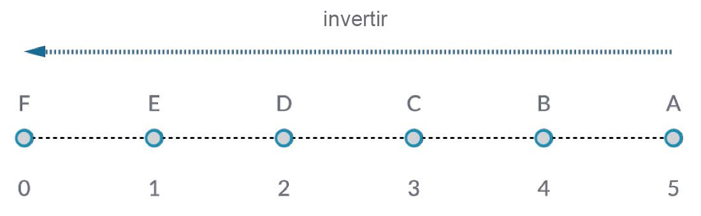
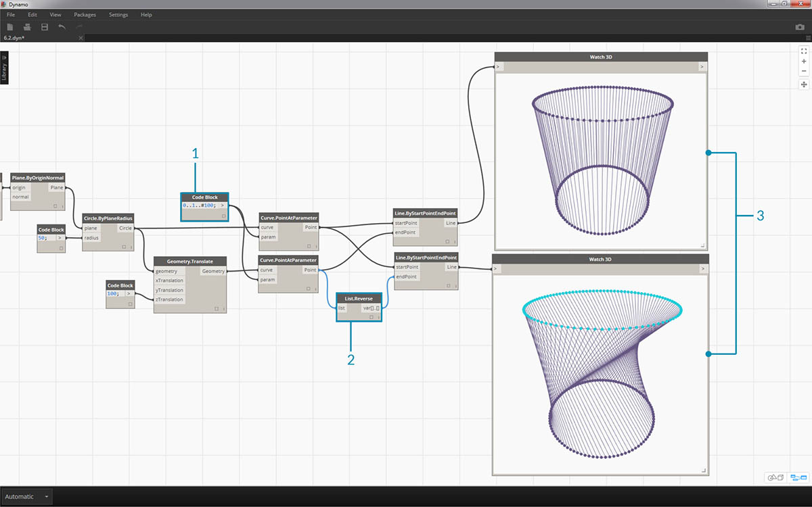
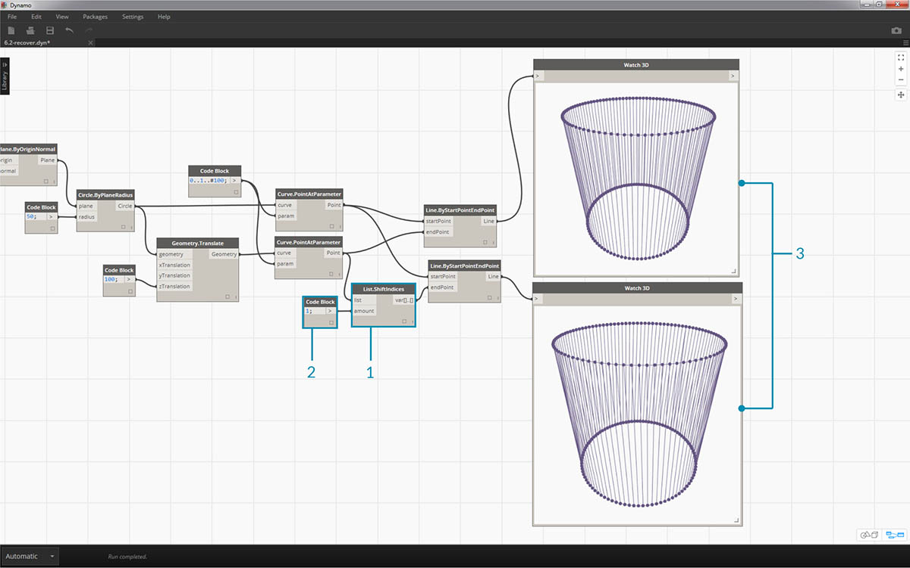

## Trabajo con listas

Ahora que hemos establecido lo que es una lista, hablemos de las operaciones que podemos realizar en ella. Imagine una lista como un mazo de cartas. El mazo es la lista y cada carta representa un elemento.


> Foto de [Christian Gidlöf](https://commons.wikimedia.org/wiki/File:Playing_cards_modified.jpg)

¿Qué **consultas** se pueden realizar a partir de la lista? Esto permite acceder a las propiedades existentes.

* ¿Número de cartas del mazo? 52.
* ¿Número de palos? 4.
* ¿Material? Papel.
* ¿Longitud? 3,5" u 89 mm.
* ¿Anchura? 2,5" o 64 mm.

¿Qué **acciones** se pueden realizar en la lista? Estas acciones cambian la lista en función de una operación especificada.

* Podemos barajar el mazo de cartas.
* Podemos ordenar el mazo por valor.
* Podemos ordenar el mazo por palo.
* Podemos dividir el mazo.
* Podemos dividir el mazo repartiendo manos individuales.
* Podemos seleccionar una carta específica del mazo.

Todas las operaciones mencionadas anteriormente tienen nodos análogos de Dynamo para trabajar con listas de datos genéricos. Las lecciones siguientes muestran algunas de las operaciones fundamentales que podemos realizar en las listas.

## Operaciones de lista

La imagen siguiente es el gráfico base que utilizaremos para ilustrar las operaciones básicas de lista. Exploraremos cómo gestionar los datos de una lista y mostraremos los resultados visuales.

#### Ejercicio: lista de operaciones

> Descargue el archivo de ejemplo que acompaña a este ejercicio (haga clic con el botón derecho y seleccione "Guardar enlace como..."): [List-Operations.dyn](datasets/6-2/List-Operations.dyn). En el Apéndice se incluye una lista completa de los archivos de ejemplo.


> 1. Comience con un *bloque de código* con un valor de ```500;```
2. Conéctelo a la entrada *x* de un nodo *Point.ByCoordinates*.
3. Conecte el nodo del paso anterior a la entrada origin de un nodo *Plane.ByOriginNormal*.
4. Con un nodo *Circle.ByPlaneRadius*, conecte el nodo del paso anterior en la entrada plane.
5. Mediante el *bloque de código*, designe un valor de ```50;``` para la entrada *radius*. Este es el primer círculo que crearemos.
6. Con un nodo *Geometry.Translate*, desplace el círculo hacia arriba 100 unidades en la dirección Z.
7. Con un nodo *Code Block*, defina un rango de diez números entre 0 y 1 con esta línea de código: ```0..1..#10;```
8. Conecte el bloque de código del paso anterior a la entrada *param* de dos nodos *Curve.PointAtParameter*. Conecte *Circle.ByPlaneRadius* a la entrada curve del nodo superior y *Geometry.Translate* a la entrada curve del nodo situado debajo del mismo.
9. Con un nodo *Line.ByStartPointEndPoint*, conecte los dos nodos *Curve.PointAtParameter*.


> 1. Un nodo *Watch3D* muestra los resultados de *Line.ByStartPointEndPoint*. Estamos dibujando líneas entre dos círculos para representar operaciones de lista básicas y utilizaremos este gráfico base de Dynamo para pasar por las acciones de lista que se indican a continuación.

### List.Count


> El nodo *List.Count* es sencillo: cuenta el número de valores de una lista y devuelve ese número. Este nodo presenta más detalles cuando se trabaja con listas de listas, pero eso lo veremos en las secciones siguientes.

#### Ejercicio: List.Count

> Descargue el archivo de ejemplo que acompaña a este ejercicio (haga clic con el botón derecho y seleccione "Guardar enlace como..."): [List-Count.dyn](datasets/6-2/List-Count.dyn). En el Apéndice se incluye una lista completa de los archivos de ejemplo.


> 1. El nodo *List.Count* devuelve el número de líneas del nodo *Line.ByStartPointEndPoint*. En este caso, el valor es 10, lo cual coincide con el número de puntos creados a partir del nodo *Code Block* original.

### List.GetItemAtIndex


> *List.GetItemAtIndex* es una forma fundamental de consultar un elemento de la lista. En la imagen anterior, se utiliza un índice de *"2"* para consultar el punto etiquetado como *"C"*.

#### Ejercicio: List.GetItemAtIndex

> Descargue el archivo de ejemplo que acompaña a este ejercicio (haga clic con el botón derecho y seleccione "Guardar enlace como..."): [List-GetItemAtIndex.dyn](datasets/6-2/List-GetItemAtIndex.dyn). En el Apéndice se incluye una lista completa de los archivos de ejemplo.


> 1. Con el nodo *List.GetItemAtIndex*, seleccionamos el índice *"0"* o el primer elemento de la lista de líneas.
2. El nodo *Watch3D* indica que se ha seleccionado una línea. Nota: para obtener la imagen anterior, asegúrese de desactivar la vista preliminar de *Line.ByStartPointEndPoint*.

### List.Reverse



> *List.Reverse* invierte el orden de todos los elementos de una lista.

#### Ejercicio: List.Reverse

> Descargue el archivo de ejemplo que acompaña a este ejercicio (haga clic con el botón derecho y seleccione "Guardar enlace como..."): [List-Reverse.dyn](datasets/6-2/List-Reverse.dyn). En el Apéndice se incluye una lista completa de los archivos de ejemplo.



> 1. Para visualizar correctamente la lista de líneas invertida, cree más líneas cambiando el bloque de código a ```0..1..#100;```
2. Inserte un nodo *List.Reverse* entre los nodos*Curve.PointAtParameter* y *Line.ByStartPointEndPoint* de una de las listas de puntos.
3. Los nodos *Watch3D* muestran dos resultados diferentes. El primero muestra el resultado sin una lista invertida. Las líneas se conectan verticalmente con los puntos adyacentes. Sin embargo, la lista invertida conectará todos los puntos con la otra lista en el orden opuesto.

### List.ShiftIndices


> *List.ShiftIndices* es una buena herramienta para crear torsiones o patrones helicoidales, así como cualquier otra manipulación de datos similar. Este nodo desplaza los elementos de una lista un determinado número de índices.

#### Ejercicio: List.ShiftIndices

> Descargue el archivo de ejemplo que acompaña a este ejercicio (haga clic con el botón derecho y seleccione "Guardar enlace como..."): [List-ShiftIndices.dyn](datasets/6-2/List-ShiftIndices.dyn). En el Apéndice se incluye una lista completa de los archivos de ejemplo.



> 1. En el mismo proceso que la lista inversa, inserte un nodo *List.ShiftIndices* en *Curve.PointAtParameter* y *Line.ByStartPointEndPointPoint*.
2. Mediante un *bloque de código*, designe un valor de *"1"* para desplazar la lista un índice.
3. Observe que el cambio es sutil, pero todas las líneas del nodo *Watch3D* inferior se han desplazado un índice al conectarlas al otro conjunto de puntos.


> 1. Al cambiar el *bloque de código* a un valor más grande, por ejemplo *"30"*, observamos una diferencia significativa en las líneas diagonales. El desplazamiento funciona como el iris de una cámara en este caso, creando una torsión en la forma cilíndrica original.

### List.FilterByBooleanMask


> *List.FilterByBooleanMask* eliminará determinados elementos en función de una lista de operaciones booleanos o valores de "verdadero" o "falso".

#### Ejercicio: List.FilterByBooleanMask

> Descargue el archivo de ejemplo que acompaña a este ejercicio (haga clic con el botón derecho y seleccione "Guardar enlace como..."): [List-FilterByBooleanMask.dyn](datasets/6-2/List-FilterByBooleanMask.dyn). En el Apéndice se incluye una lista completa de los archivos de ejemplo.


> Para crear una lista de valores de "verdadero" o "falso", necesitamos realizar un poco más de trabajo...

> 1. Mediante un *bloque de código*, defina una expresión con la sintaxis: ```0..List.Count(list);```. Conecte el nodo *Curve.PointAtParameter* a la entrada *list*. Veremos más detalles sobre esta configuración en el capítulo del bloque de código, pero la línea de código en este caso nos proporciona una lista que representa cada índice del nodo *Curve.PointAtParameter*.
2. Mediante un nodo *"%"* (módulo), conecte la salida del *bloque de código* a la entrada *x* y un valor de *4* a la entrada *y*. Esto nos dará el resto al dividir la lista de índices entre 4. El módulo es un nodo muy útil para la creación de patrones. Todos los valores serán los restos posibles de 4: 0, 1, 2, 3.
3. En el nodo *módulo*, sabemos que un valor de 0 significa que el índice es divisible por 4 (0, 4, 8, etc.). Mediante un nodo *"=="*, podemos probar la divisibilidad frente a un valor de *"0"*.
4. El nodo *Watch* muestra solo esto: disponemos de un patrón verdadero/falso que dice: *verdadero,falso,falso,falso,falso...*
5. Mediante este patrón verdadero/falso, conéctelo a la entrada mask de dos nodos *List.FilterByBooleanMask*.
6. Conecte el nodo *Curve.PointAtParameter* en cada una de las entradas list de los nodos *List.FilterByBooleanMask*.
7. Las salidas de *Filter.ByBooleanMask* son *"in"* y *"out"*. *"In"* representa los valores que tenían un valor de máscara de *"Verdadero (True)"* mientras que *"out"* representa los valores que tenían un valor de *"Falso (False)"*. Al conectar las salidas *"in"* a las entradas *startPoint* y *endPoint* de un nodo *Line.ByStartPointEndPoint*, hemos creado una lista filtrada de líneas.
8. El nodo *Watch3D* indica que hay menos líneas que puntos. Hemos seleccionado solo el 25% de los nodos filtrando solo los valores verdaderos.

