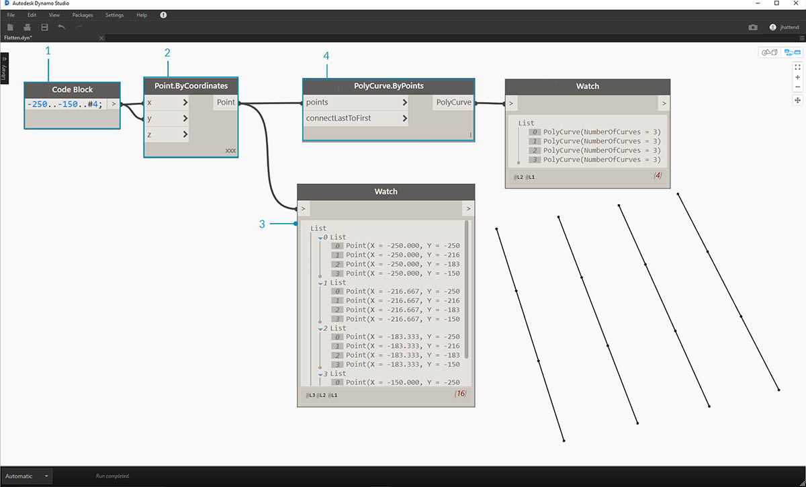
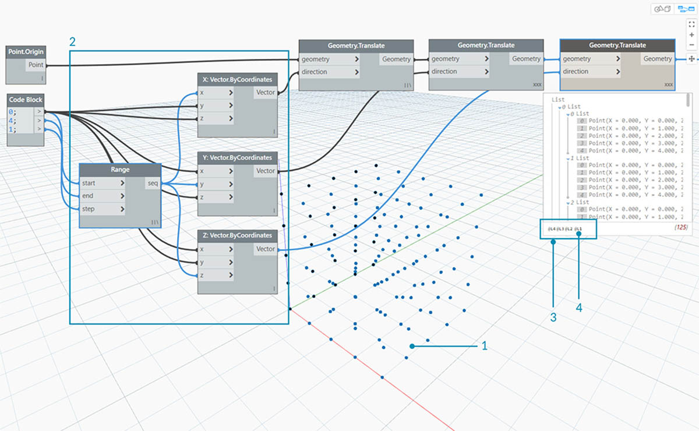
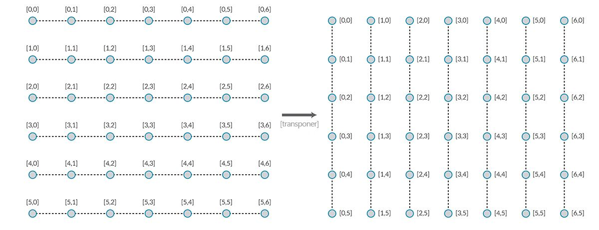
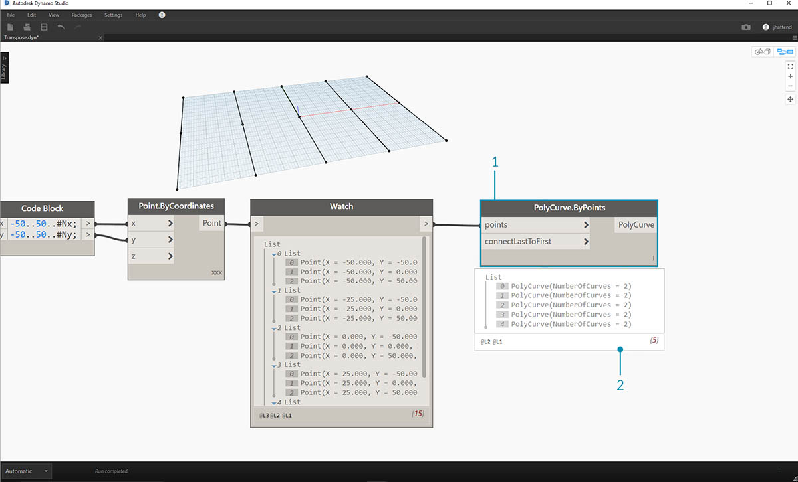

## Listas de listas

Añadamos un nivel más a la jerarquía. Si utilizamos la baraja de cartas del ejemplo original y creamos un cuadro que contiene varias barajas, este representa ahora una lista de barajas y cada baraja representa una lista de cartas. Esta es una lista de listas. En esta sección, usaremos esta analogía: el cuadro rojo mostrado a continuación contiene un rollo de monedas y cada rollo contiene una lista de peniques.


> Foto de [Dori](https://commons.wikimedia.org/wiki/File:Stack_of_coins_0214.jpg).

¿Qué **consultas** se pueden realizar a partir de la lista de listas? Esto permite acceder a las propiedades existentes.

* ¿Número de tipos de moneda? 2.
* ¿Valores de tipo moneda? 0,01 y 0,25 USD.
* ¿Material de los cuartos de dólar? 75 % de cobre y 25 % de níquel.
* ¿Material de los peniques? 97,5 % de zinc y 2,5% de cobre.

¿Qué **acciones** se pueden realizar en la lista de listas? Esta acción cambia la lista de listas en función de la operación especificada.

* Seleccione un montón específico de cuartos de dólar o peniques.
* Seleccione un cuarto de dólar o un penique específicos.
* Reorganice los montones de cuartos de dólar y peniques.
* Junte los montones.

De nuevo, Dynamo tiene un nodo análogo para cada una de las operaciones anteriores. Como trabajamos con datos abstractos y no con objetos físicos, necesitamos un conjunto de reglas para controlar el desplazamiento hacia arriba y hacia abajo por la jerarquía de datos.

Al trabajar con listas de listas, los datos son complejos y se dividen en capas, pero esto ofrece la oportunidad de realizar operaciones paramétricas impresionantes. Vamos a desglosar los conceptos básicos y abordar algunas operaciones más en las lecciones mostradas a continuación.

## Jerarquía descendente

El concepto fundamental que se debe aprender en esta sección: **Dynamo trata las listas como objetos en sí mismos**. Esta jerarquía descendente se desarrolla teniendo en cuenta la programación orientada a objetos. En lugar de seleccionar subelementos con un comando como List.GetItemAtIndex, Dynamo seleccionará ese índice de la lista principal en la estructura de datos. Y ese elemento puede ser otra lista. Vamos a desglosar esto con una imagen de ejemplo:

#### Ejercicio: jerarquía descendente

> Descargue el archivo de ejemplo que acompaña a este ejercicio (haga clic con el botón derecho y seleccione "Guardar vínculo como..."): [Top-Down-Hierarchy.dyn](datasets/6-3/Top-Down-Hierarchy.dyn). En el Apéndice, se incluye una lista completa de los archivos de ejemplo.


> 1. Con el *bloque de código*, hemos definido dos intervalos: ``` 0..2; 0..3; ```
2. Estos intervalos están conectados a un nodo *Point.ByCoordinates* con el encaje establecido en *"Producto vectorial"*. De este modo, se crea una rejilla de puntos y también se devuelve una lista de listas como salida.
3. Observe que el nodo *Watch* proporciona tres listas con cuatro elementos en cada lista.
4. Cuando se utiliza *List.GetItemAtIndex* con un índice 0, Dynamo selecciona la primera lista y todo su contenido. Es posible que otros programas seleccionen el primer elemento de cada lista de la estructura de datos, pero Dynamo utiliza una jerarquía descendente al trabajar con los datos.

### Flatten y List.Flatten

Flatten elimina todos los niveles de datos de una estructura de datos. Esto resulta útil cuando las jerarquías de datos no son necesarias para la operación, pero puede resultar peligroso porque elimina información. En el siguiente ejemplo, se muestra el resultado de aplanar una lista de datos.

#### Ejercicio: Flatten

> Descargue el archivo de ejemplo que acompaña a este ejercicio (haga clic con el botón derecho y seleccione "Guardar vínculo como..."): [Flatten.dyn](datasets/6-3/Flatten.dyn). En el Apéndice, se incluye una lista completa de los archivos de ejemplo.



> 1. Inserte una línea de código para definir un intervalo en el *bloque de código*: ``` -250..-150..#4; ```
2. Al conectar el *bloque de código* a la entrada *x* e *y* de un nodo *Point.ByCoordinates*, se establece el encaje como *"Producto vectorial"* para obtener una rejilla de puntos.
3. En el nodo *Watch*, se muestra que tenemos una lista de listas.
4. Un nodo *PolyCurve.ByPoints* hará referencia a cada lista y creará la PolyCurve respectiva. En la vista preliminar de Dynamo, observe que tenemos cuatro PolyCurves que representan cada fila de la rejilla.


> 1. Al insertar un elemento *Flatten* antes del nodo de PolyCurve, hemos creado una única lista para todos los puntos. El nodo de PolyCurve hace referencia a una lista para crear una curva y, como todos los puntos están en una lista, se obtiene una PolyCurve en zigzag que se ejecuta en toda la lista de puntos.

También existen opciones para aplanar niveles aislados de datos. Mediante el nodo List.Flatten, puede definir un número establecido de niveles de datos que aplanar desde la parte superior de la jerarquía. Esta es una herramienta muy útil si tiene problemas con estructuras de datos complejas que no son necesariamente pertinentes para el flujo de trabajo. Otra opción consiste en utilizar el nodo de aplanado como una función en List.Map. A continuación, analizaremos [List.Map](#listmap-and-listcombine).

### Chop

En el modelado paramétrico, también hay ocasiones en las que se desean añadir más estructuras de datos a una lista existente. Hay muchos nodos disponibles para ello y el elemento "Chop" es la versión más básica. Con "Chop", se puede dividir una lista en sublistas con un número establecido de elementos.

#### Ejercicio: List.Chop

> Descargue el archivo de ejemplo que acompaña a este ejercicio (haga clic con el botón derecho y seleccione "Guardar vínculo como..."): [Chop.dyn](datasets/6-3/Chop.dyn). En el Apéndice, se incluye una lista completa de los archivos de ejemplo.


> El valor 2 de *List.Chop _with a _subLength* crea cuatro listas con dos elementos cada una.

El comando "Chop" divide listas en función de una longitud de lista determinada. De alguna manera, el efecto de "Chop" es contrario al efecto de "Flatten": en lugar de eliminar una estructura de datos, se añaden nuevos niveles a ella. Es una herramienta útil para operaciones geométricas, como el ejemplo siguiente.


### List.Map y List.Combine

List.Map y List.Combine aplican una función establecida a una lista de entradas, pero un nivel hacia abajo en la jerarquía. Las combinaciones son iguales a las asignaciones, excepto que las combinaciones pueden tener varias entradas correspondientes a la entrada de una determinada función.

#### Ejercicio: List.Map

*Nota: este ejercicio se ha creado con una versión anterior de Dynamo. Gran parte de la funcionalidad de List.Map se ha resuelto con la adición de la función List@Level. Para obtener más información, consulte [List@Level](#listlevel) a continuación.*

> Descargue el archivo de ejemplo que acompaña a este ejercicio (haga clic con el botón derecho y seleccione "Guardar vínculo como..."): [Map.dyn](datasets/6-3/Map.dyn). En el Apéndice, se incluye una lista completa de los archivos de ejemplo.

Como introducción rápida, revisemos el nodo List.Count de una sección anterior.


> El nodo *List.Count* realiza un recuento de todos los elementos de una lista. Utilizaremos esta opción para mostrar cómo funciona *List.Map*.


> 1. Inserte dos líneas de código en el *bloque de código*:

```
-50..50..#Nx;
-50..50..#Ny;
```

Después de escribir este código, el bloque de código creará dos entradas para Nx y Ny.

2. Con dos *controles deslizantes de enteros*, defina los valores de *Nx* y *Ny* conectándolos al *bloque de código*.
3. Conecte cada línea del bloque de código a las entradas *X* e *Y* respectivas de un nodo *Point.ByCoordinates*. Haga clic con el botón derecho en el nodo, seleccione "Encaje" y, a continuación, elija *"Producto vectorial"*. Esta acción crea una rejilla de puntos. Como hemos definido el intervalo de -50 a 50, se extiende la rejilla de Dynamo por defecto.
4. En el nodo *Watch*, se muestran los puntos creados. Observe la estructura de datos. Hemos creado una lista de listas. Cada lista representa una fila de puntos de la rejilla.


> 1. Enlace un nodo *List.Count* a la salida del nodo de visualización del paso anterior.
2. Conecte un nodo *Watch* a la salida de List.Count.

Observe que el nodo List.Count ofrece el valor 5. Este es igual a la variable "Nx", tal y como se ha definido en el bloque de código. ¿Por qué ocurre eso?

* En primer lugar, el nodo Point.ByCoordinates utiliza la entrada "x" como entrada principal para crear listas. Si Nx es 5 y Ny es 3, se obtiene una lista de cinco listas, cada una con tres elementos.
* Como Dynamo trata las listas como objetos en sí mismos, se aplica un nodo List.Count a la lista principal de la jerarquía. El resultado es el valor 5 o el número de listas de la lista principal.


> 1. Mediante un nodo *List.Map*, nos desplazaremos un nivel hacia abajo en la jerarquía y ejecutaremos una *"función"* en este nivel.
2. Observe que el nodo *List.Count* no tiene ninguna entrada. Se utiliza como una función, por lo que el nodo *List.Count* se aplicará a cada lista individual un nivel hacia abajo en la jerarquía. La entrada en blanco de *List.Count* corresponde a la entrada de lista de *List.Map*.
3. Los resultados de *List.Count* ahora proporcionan una lista de cinco elementos, cada uno con el valor 3. Esto representa la longitud de cada sublista.

#### Ejercicio: List.Combine

_Nota: este ejercicio se ha creado con una versión anterior de Dynamo. Gran parte de la funcionalidad de List.Combine se ha resuelto con la adición de la función List@Level. Para obtener más información, consulte *[*List@Level*](#listlevel)* a continuación._

> Descargue el archivo de ejemplo que acompaña a este ejercicio (haga clic con el botón derecho y seleccione "Guardar vínculo como..."): [Combine.dyn](datasets/6-3/Combine.dyn). En el Apéndice, se incluye una lista completa de los archivos de ejemplo.

En este ejercicio, utilizaremos una lógica similar a List.Map, pero con varios elementos. En este caso, deseamos dividir una lista de curvas por un número único de puntos.


> 1. Mediante el *bloque de código*, defina un intervalo con la sintaxis: ```..20..#4; ```y un valor de```20; ``` debajo de esa línea.
2. Conecte el *bloque de código* a dos nodos *Point.ByCoordinates*.
3. Cree *Line.ByStartPointEndPoint* a partir de los nodos *Point.ByCoordinates*.
4. En el nodo *Watch*, se muestran cuatro líneas.


> 1. Debajo del gráfico de creación de líneas, deseamos utilizar el bloque de código para crear cuatro intervalos distintos a fin de dividir las líneas de forma exclusiva. Esto se realiza con las siguientes líneas de código:
```
0..1..#3;
0..1..#4;
0..1..#5;
0..1..#6;
```

2. Con un nodo *List.Create*, combinamos las cuatro líneas del *bloque de código* en una lista.
3. En el nodo *Watch*, se muestra una lista de listas.


> 1. *Curve.PointAtParameter* no funcionará mediante la conexión de las líneas directamente con los valores de *parámetro*. Necesitamos bajar un nivel en la jerarquía. Para ello, utilizaremos *List.Combine*.


> Mediante *List.Combine*, podemos dividir correctamente cada línea por los intervalos especificados. Esto se pone un poco complicado, así que lo desglosaremos en profundidad.

> 1. Añada primero un nodo *Curve.PointAtParameter* al lienzo. Será la *"función" o el *"combinador"* que aplicamos al nodo List.Combine*. Abordaremos esto de nuevo en un segundo.
2. Añada un nodo *List.Combine* al lienzo. Pulse *"+"* o *"-"* para añadir o quitar entradas. En este caso, usaremos las dos entradas por defecto del nodo.
3. Deseamos conectar el nodo *Curve.PointAtParameter* en la entrada *"comb"* de *List.Combine*. Y otro nodo más importante: asegúrese de hacer clic con el botón derecho en la entrada _*"param" de _Curve.PointAtParameter* y desactive *"Utilizar valor por defecto"*. Los valores por defecto de las entradas de Dynamo deben eliminarse al ejecutar un nodo como una función. En otras palabras, debemos considerar que los valores por defecto tienen nodos adicionales conectados a ellos. Por este motivo, en este caso, es necesario eliminar los valores por defecto.
4. Sabemos que tenemos dos entradas, las líneas y los parámetros para crear puntos. Pero, ¿cómo los conectamos a las entradas de *List.Combine* y en qué orden?
5. Las entradas vacías de *Curve.PointAtParameter*, de arriba a abajo, deben rellenarse en el combinador en el mismo orden. Por lo tanto, las líneas se conectan a *list1* de *List.Combine*.
6. Del mismo modo, los valores de los parámetros se conectan a la entrada *list2* de *List.Combine*.
7. El nodo *Watch* y la vista preliminar de Dynamo nos muestran cuatro líneas, cada una dividida en función de los intervalos de los *bloques de código*.

### List@Level

Como alternativa preferida a List.Map, la función List@Level permite seleccionar directamente el nivel de lista con el que se desea trabajar directamente en el puerto de entrada del nodo. Esta función se puede aplicar a cualquier entrada de un nodo y le permitirá acceder a los niveles de las listas de forma más rápida y sencilla que con otros métodos. Solo tiene que indicar al nodo el nivel de la lista que desea utilizar como entrada y permitir que el nodo realice el resto.

#### Ejercicio de List@Level

En este ejercicio, utilizaremos la función List@Level para aislar un nivel de datos específico.

> Descargue el archivo de ejemplo que acompaña a este ejercicio (haga clic con el botón derecho y seleccione "Guardar vínculo como..."): [List@Level](datasets/6-3/Listatlevel.dyn). En el Apéndice, se incluye una lista completa de los archivos de ejemplo.



> 1. Comenzaremos con una rejilla 3D de puntos sencilla.
2. Como la rejilla se ha creado con un intervalo para X, Y y Z, sabemos que los datos están estructurados con tres capas: una lista X, una lista Y y una lista Z.
3. Estas capas existen en **niveles** diferentes. Los niveles se indican en la parte inferior de la burbuja de vista preliminar. Las columnas de niveles de la lista corresponden a los datos de la lista anterior para ayudar a identificar el nivel en el que se va a trabajar.
4. Los niveles de la lista se organizan en orden inverso, por lo que los datos de nivel inferior siempre se encuentran en "L1". Esto ayudará a garantizar que los gráficos funcionen según lo planeado, incluso aunque se realicen cambios en niveles superiores.


> 1. Para utilizar la función List@Level, haga clic en ">". En este menú, verá dos casillas de verificación.
2. **Utilizar niveles**: permite utilizar la función List@Level. Después de hacer clic en esta opción, podrá hacer clic por los niveles de lista de entrada que desee que utilice el nodo, además de seleccionarlos. Con este menú, puede probar rápidamente diferentes opciones de nivel haciendo clic arriba o abajo.
3. **Mantener la estructura de listas**: si se ha activado, dispondrá de la opción para mantener la estructura de niveles de esa entrada. En ocasiones, es posible que haya organizado deliberadamente los datos en sublistas. Al seleccionar esta opción, puede mantener la organización de listas intacta sin perder información.

Con nuestra sencilla rejilla 3D, podemos acceder a la estructura de listas y visualizarla mediante la activación o la desactivación de los niveles de la lista. Cada combinación de nivel de lista e índice devolverá un conjunto de puntos diferente de nuestro conjunto 3D original.


> 1. "@L2" en DesignScript nos permite seleccionar únicamente la lista en el nivel 2.
2. La lista del nivel 2 con el índice 0 incluye solo el primer conjunto de puntos Y y devuelve solo la rejilla XZ.
3. Si cambiamos el filtro Nivel a "L1", podremos ver todos los elementos del primer nivel de lista. La lista del nivel 1 con el índice 0 incluye todos los puntos 3D en una lista plana.
4. Si intentamos realizar lo mismo para "L3", solo veremos los puntos del tercer nivel de lista. La lista del nivel 3 con el índice 0 incluye solo el primer conjunto de puntos Z y devuelve solo la rejilla XY.
5. Si intentamos realizar lo mismo para "L4", solo veremos los puntos del tercer nivel de lista. La lista del nivel 4 con el índice 0 incluye solo el primer conjunto de puntos X y devuelve solo la rejilla YZ.

Aunque este ejemplo específico también se puede crear con List.Map, List@Level simplifica considerablemente la interacción, lo que facilita el acceso a los datos del nodo. Consulte la siguiente comparación entre los métodos List.Map y List@Level:


> 1. Aunque ambos métodos nos brindarán acceso a los mismos puntos, el método List@Level nos permite alternar fácilmente entre capas de datos dentro de un único nodo.
2. Para acceder a una rejilla de puntos con List.Map, necesitaremos un nodo List.GetItemAtIndex, junto con List.Map. Para cada nivel de lista que descendamos, necesitaremos utilizar un nodo List.Map adicional. Según la complejidad de las listas, esto podría requerir la adición de una gran cantidad de nodos List.Map al gráfico para acceder al nivel de información adecuado.
3. En este ejemplo, un nodo List.GetItemAtIndex con un nodo List.Map devuelve el mismo conjunto de puntos con la misma estructura de listas que List.GetItemAtIndex con "@L3" seleccionado.

### Transpose

Transpose es una función fundamental al utilizar listas de listas. Al igual que en los programas de hojas de cálculo, una transposición intercambia las columnas y las filas de una estructura de datos. Mostraremos esto con una matriz básica a continuación y, en la siguiente sección, demostraremos cómo se puede utilizar una transposición para crear relaciones geométricas.



#### Ejercicio: List.Transpose

> Descargue el archivo de ejemplo que acompaña a este ejercicio (haga clic con el botón derecho y seleccione "Guardar vínculo como..."): [Transpose.dyn](datasets/6-3/Transpose.dyn). En el Apéndice, se incluye una lista completa de los archivos de ejemplo.



> Suprimiremos los nodos *List.Count* del ejercicio anterior y pasaremos a alguna geometría para ver cómo se estructuraron los datos.

> 1. Conecte *PolyCurve.ByPoints* a la salida del nodo de inspección desde *Point.ByCoordinates*.
2. En la salida, se muestran cinco PolyCurves. Podemos ver las curvas en la vista preliminar de Dynamo. El nodo de Dynamo busca una lista de puntos (o, en este caso, una lista de listas de puntos) y crea una única PolyCurve a partir de ellas. Básicamente, cada lista se ha convertido en una curva en la estructura de datos.


> 1. Si deseamos aislar una fila de curvas, debemos utilizar el nodo *List.GetItemAtIndex*.
2. Mediante el valor de *bloque de código* 2, consulte el tercer elemento de la lista principal.
3. *PolyCurve.ByPoints* nos proporciona una curva, ya que solo una lista está conectada al nodo.


> 1. Un nodo *List.Transpose* intercambiará todos los elementos con todas las listas de una lista de listas. Esto suena complicado, pero es la misma lógica que la transposición en Microsoft Excel: intercambiar las columnas y las filas en una estructura de datos.
2. Observe el resultado abstracto: la transposición ha cambiado la estructura de listas de cinco listas con tres elementos cada una a tres listas con cinco elementos cada una.
3. Observe el resultado geométrico: al utilizar *PolyCurve.ByPoints*, se obtienen tres PolyCurves en la dirección perpendicular a las curvas originales.

### Creación del bloque de código

El modo de bloque de código abreviado utiliza "[]" para definir una lista. Esta es una forma mucho más rápida y fluida de crear una lista que con el nodo List.Create. El bloque de código se describe forma más detallada en el capítulo 7. Consulte la imagen mostrada a continuación para observar cómo se puede definir una lista con varias expresiones mediante el bloque de código.


### Consulta del bloque de código

Los límites del bloque de código utilizan "[]" como método rápido y sencillo para seleccionar elementos específicos deseados en una estructura de datos compleja. Los bloques de código se describen forma más detallada en el capítulo 7. Consulte la imagen mostrada a continuación para observar cómo se puede consultar una lista con varios tipos de datos con un bloque de código.


### Ejercicio: consulta e inserción de datos

> Descargue el archivo de ejemplo que acompaña a este ejercicio (haga clic con el botón derecho y seleccione "Guardar vínculo como..."): [ReplaceItems.dyn](datasets/6-3/ReplaceItems.dyn). En el Apéndice, se incluye una lista completa de los archivos de ejemplo.

En este ejercicio, se utiliza parte de la lógica establecida en el ejercicio anterior para editar una superficie. Nuestro objetivo es intuitivo, pero la navegación por la estructura de datos es más participativa. Deseamos articular una superficie mediante el desplazamiento de un punto de control.


> 1. Comience con la cadena de nodos anterior. Vamos a crear una superficie básica que abarque la rejilla de Dynamo por defecto.
2. Mediante el *bloque de código*, inserte estas dos líneas de código y conéctelas a las entradas *u* y *v* de *Surface.PointAtParameter* respectivamente:
```
-50..50..#3;
-50..50..#5;
```

3. Asegúrese de establecer el encaje de *Surface.PointAtParameter* en *"Producto vectorial"*.
4. En el nodo *Watch*, se muestra que tenemos una lista de tres listas con cinco elementos cada una.


> En este paso, deseamos consultar el punto central de la rejilla que hemos creado. Para ello, seleccionaremos el punto medio de la lista central. Tiene sentido, ¿verdad?

> 1. Para confirmar que este es el punto adecuado, también podemos hacer clic por los elementos del nodo de visualización para confirmar que se trata del objetivo correcto.
2. Mediante el *bloque de código*, escribiremos una línea de código básica para consultar una lista de listas:<br xmlns="http://www.w3.org/1999/xhtml"/>```points[1][2];```
3. Con *Geometry.Translate*, desplazaremos el punto seleccionado hacia arriba en la dirección *Z* en *20* unidades.


> 1. Vamos a seleccionar la fila central de puntos con un nodo *List.GetItemAtIndex*. Nota: al igual que en un paso anterior, también podemos consultar la lista con *bloque de código* mediante una línea de ```points[1];```


> Hasta ahora, hemos consultado correctamente el punto central y lo hemos desplazado hacia arriba. Ahora deseamos insertar de nuevo este punto desplazado en la estructura de datos original.

> 1. Deseamos reemplazar primero el elemento de la lista que hemos aislado en un paso anterior.
2. Con *List.ReplaceItemAtIndex*, sustituiremos el elemento central mediante el uso de un índice *"2"* con el elemento de reemplazo conectado al punto desplazado (*Geometry.Translate*).
3. En la salida, se muestra que hemos introducido el punto desplazado en el elemento central de la lista.


> Ahora que hemos modificado la lista, debemos volver a insertarla en la estructura de datos original: la lista de listas.

> 1. Siguiendo la misma lógica, utilice *List.ReplaceItemAtIndex* para reemplazar la lista central por la lista modificada.
2. Observe que los *bloques de código* que definen el índice de estos dos nodos son 1 y 2, que coinciden con la consulta original del *bloque de código* (*points[1][2]*).
3. Al seleccionar la lista en el *índice 1*, veremos la estructura de datos resaltada en la vista preliminar de Dynamo. Hemos fusionado correctamente el punto desplazado con la estructura de datos original.


> Hay muchas formas de crear una superficie a partir de este conjunto de puntos. En este caso, vamos a crear una superficie mediante la solevación conjunta de curvas.

> 1. Cree un nodo *NurbsCurve.ByPoints* y conecte la nueva estructura de datos para crear tres curvas NURBS.


> 1. Conecte *Surface.ByLoft* a la salida desde *NurbsCurve.ByPoints*. Ahora tenemos una superficie modificada. Podemos cambiar el valor *Z* original de la geometría. Realice el traslado y vea cómo se actualiza la geometría.

