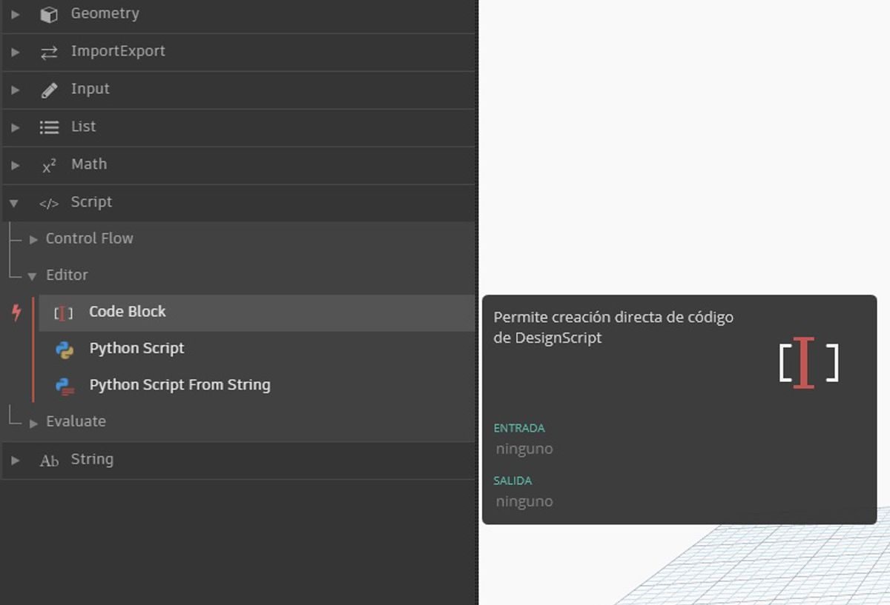

## ¿Qué es un bloque de código?

Los bloques de código son una ventana a DesignScript, el lenguaje de programación que es la base de Dynamo. Creado desde cero para admitir flujos de trabajo de diseño exploratorios, DesignScript es un lenguaje legible y conciso que ofrece información inmediata a pequeños fragmentos de código y también se adapta a interacciones grandes y complejas. DesignScript también forma la columna vertebral del motor que impulsa la mayoría de los aspectos subyacentes de Dynamo. Como casi todas las funciones de los nodos y las interacciones de Dynamo tienen una relación de uno a uno con el lenguaje de creación de secuencias de comandos, se ofrecen oportunidades únicas de desplazarse entre secuencias de comandos e interacciones basadas en nodos de forma fluida.  Para los principiantes, los nodos se pueden convertir automáticamente en sintaxis de texto para facilitar el aprendizaje de DesignScript o simplemente
para reducir el tamaño de secciones de gráficos de mayor tamaño. Esto se realiza mediante un proceso denominado "de nodo a código", que se describe con más detalle en la [sección Sintaxis de DesignScript](7-2_Design-Script-syntax.md). Los usuarios con más experiencia pueden utilizar bloques de código para crear combinaciones personalizadas de funciones existentes y relaciones creadas por el usuario mediante una gran cantidad de paradigmas de codificación estándar. En un nivel intermedio entre los principiantes y los usuarios avanzados, hay disponibles un gran número de accesos directos y fragmentos de código que agilizarán los diseños. Si bien el término "bloque de código" puede intimidar un poco a los que no son programadores, es una herramienta eficaz y fácil de usar. Un principiante puede utilizar de forma eficaz el bloque de código con una mínima creación de código y un usuario avanzado puede establecer definiciones de secuencias de
comandos que se pueden recuperar en cualquier parte de una definición de Dynamo.

### Una breve descripción de los bloques de código

En resumen, los bloques de código son una interfaz de creación de secuencias de comandos de texto dentro de un entorno de creación de secuencias de comandos visuales. Se pueden utilizar como números, cadenas, fórmulas y otros tipos de datos. El bloque de código se ha diseñado para Dynamo, por lo que se pueden definir variables arbitrarias en el bloque de código y esas variables se añaden automáticamente a las entradas del nodo:

Con los bloques de código, un usuario dispone de flexibilidad para decidir cómo especificar entradas. A continuación, se indican varias formas diferentes de crear un punto básico con coordenadas *(10, 5, 0)*: 

A medida que aprende más sobre las funciones disponibles en la biblioteca, es posible que le sea más rápido escribir "Point.ByCoordinates" que buscar en la biblioteca y encontrar el nodo adecuado. Por ejemplo, al escribir *"Point."*, Dynamo mostrará una lista de posibles funciones que aplicar a un punto. Esto hace que la creación de secuencias de comandos sea más intuitiva y le ayudará a aprender a aplicar funciones en Dynamo.

### Creación de nodos de bloque de código

El bloque de código se encuentra en *Core > Entrada > Acciones > Bloque de código*. O, simplemente, de forma más rápida, haga doble clic en el lienzo para que aparezca el bloque de código. Este nodo se utiliza con tanta frecuencia que se le han proporcionado privilegios completos de doble clic.

### Números, cadenas y fórmulas

Los bloques de código también son flexibles en relación con los tipos de datos. El usuario puede definir rápidamente números, cadenas y fórmulas, y el bloque de código generará la salida deseada.

En la imagen siguiente, puede comprobar que la forma tradicional de trabajo es algo prolija: el usuario busca el nodo previsto en la interfaz, lo añade al lienzo y, a continuación, introduce los datos. Con el bloque de código, el usuario puede hacer doble clic en el lienzo para desplegar el nodo y escribir el tipo de datos correcto con la sintaxis básica. 

> Los nodos *number*, *string* y *formula* son tres ejemplos de nodos de Dynamo que posiblemente estén obsoletos en comparación con el *bloque de código*.

