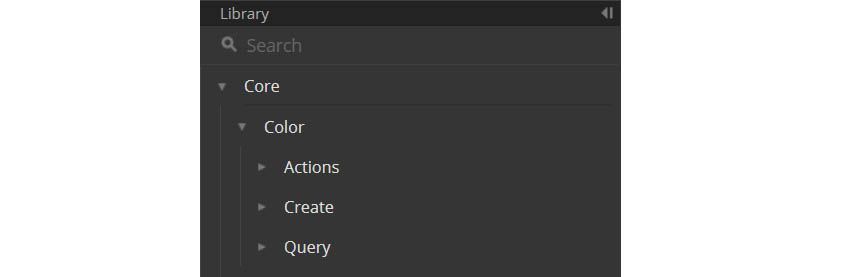
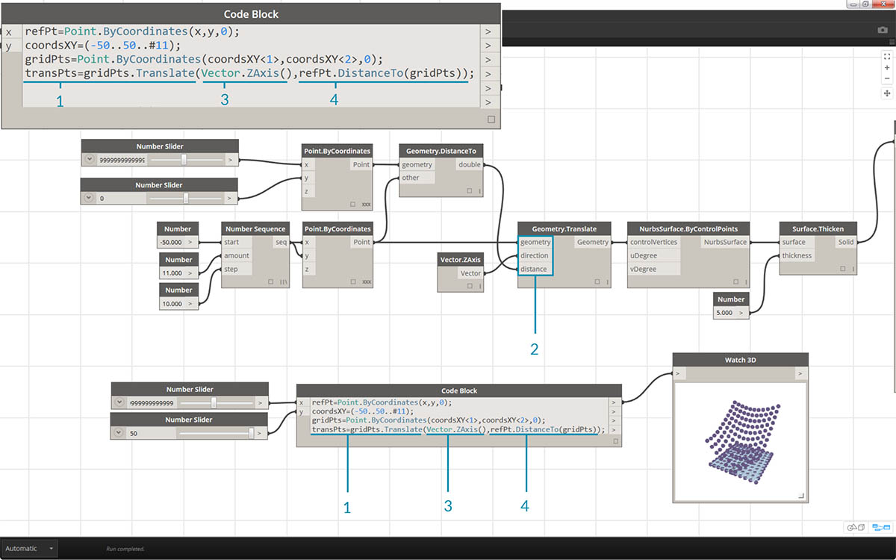
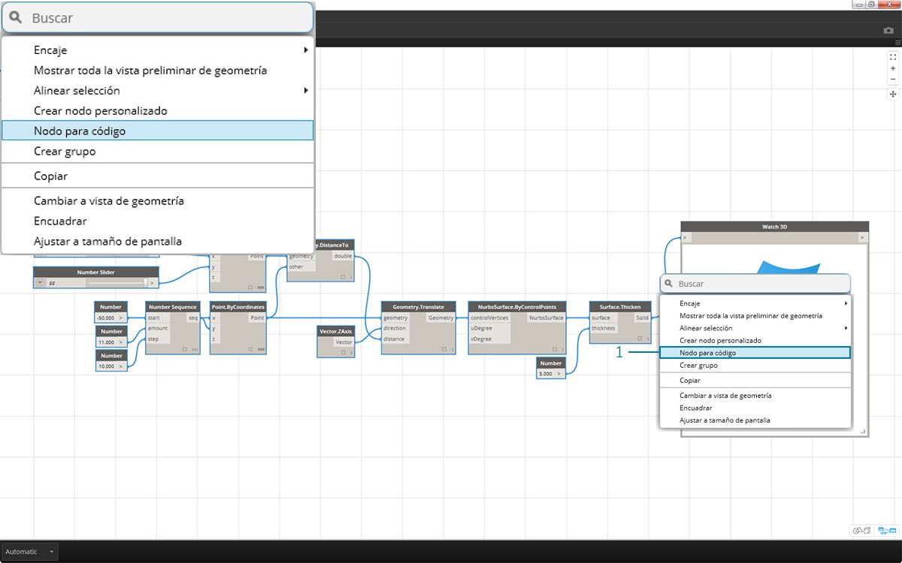
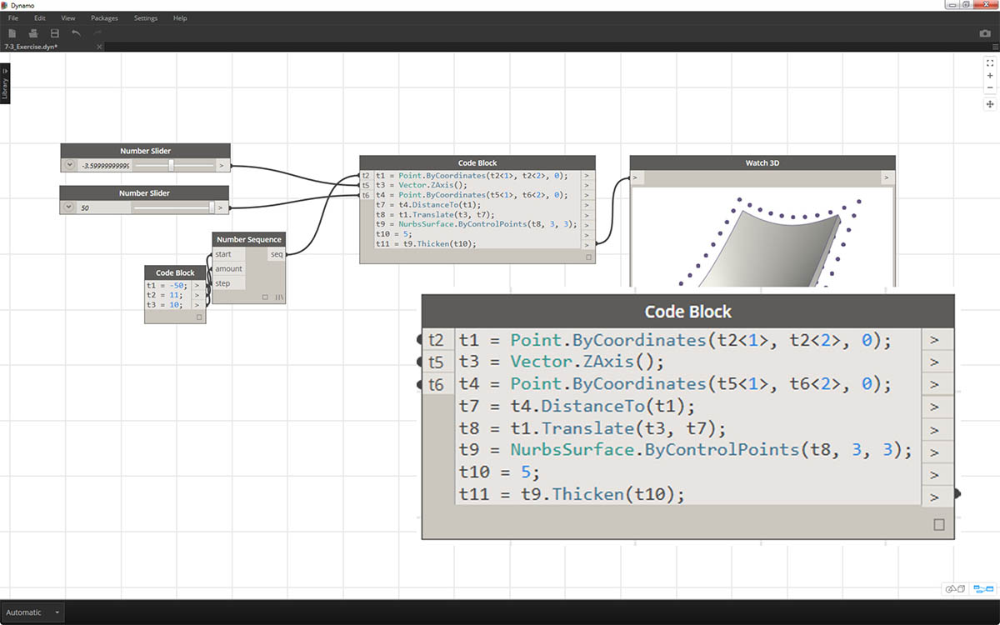

## Sintaxis de DesignScript

Es posible que haya observado que en los nombres de los nodos de Dynamo se da un elemento común: cada nodo utiliza una sintaxis *"."* sin espacios. Esto se debe a que el texto de la parte inicial de cada nodo representa la sintaxis real para las secuencias de comandos y el *"."* (o *notación de puntos*) separa un elemento de los métodos a los que es posible invocar. Esto permite traducir fácilmente las secuencias de comandos visuales a secuencias de comandos basadas en texto.


Como analogía general para la notación de puntos, ¿cómo podemos tratar una manzana paramétrica en Dynamo? A continuación se indican algunos métodos que ejecutaremos en la manzana antes de decidir consumirla. (Nota: estos no son métodos reales de Dynamo):

|Legible para el ser humano|Notación de puntos|Salida|
| -- | -- | -- |
|¿De qué color es la manzana?|Manazana.color|rojo|
|¿Está madura la manzana?|Manzana.madura|verdadero|
|¿Cuánto pesa la manzana?|Manzana.peso|170 g|
|¿De dónde viene la manzana?|Manzana.padre|árbol|
|¿Qué crea la manzana?|Manzana.hijo|semillas|
|¿Esta manzana se producido de forma local?|Manzana.distanciaDeHuerta|96 km|

A juzgar por las salidas de la tabla de arriba, esta parece una manzana sabrosa. Creo que voy a *Manzana.comer*.

### Notación de puntos en el bloque de código

Con la analogía de manzana en mente, fijémonos en *Point.ByCoordinates* y veamos cómo podemos crear un punto mediante el bloque de código:


> La sintaxis del *bloque de código* ```Point.ByCoordinates(0,10);``` proporciona el mismo resultado que el nodo *Point.ByCoordinates* de Dynamo, excepto que permite crear un punto mediante un nodo. Esto es más eficaz que conectar un nodo independiente a *"X"* e *"Y"*.

> 1. Al utilizar *Point.ByCoordinates* en el bloque de código, se especifican las entradas en el mismo orden que en el nodo *(X,Y)* predefinido.

### Invocación de nodos

Puede invocar cualquier nodo normal de la biblioteca a través de un bloque de código siempre que el nodo no sea un nodo de *"IU"*: los que tienen una función de interfaz de usuario especial. Por ejemplo, puede invocar a *Circle.ByCenterPointRadius*, pero no tendría mucho sentido invocar a un nodo *Watch 3D*.

Los nodos normales (la mayoría de los incluidos en la biblioteca) suelen ser de tres tipos:

* **Crear**: crea (o construye) algo.
* **Acción**: realiza una acción sobre algún elemento.
* **Consulta**: obtiene una propiedad de algún elemento que ya existe.

Descubrirá que la biblioteca se organiza teniendo en cuenta estas categorías. Los métodos o nodos de estos tres tipos se tratan de forma diferente cuando se invocan desde un bloque de código.



#### Crear

La categoría "Crear" genera geometría desde cero. En el bloque de código, los valores se introducen de izquierda a derecha. Estas entradas están en el mismo orden que las entradas del nodo de arriba abajo: 

> Si comparamos el nodo *Line.ByStartPointEndPoint* y la sintaxis correspondiente en el bloque de código, vemos que se obtienen los mismos resultados.

#### Acción

Una acción es algo que se hace a un objeto de un tipo concreto. Dynamo utiliza la *notación de puntos*, común a muchos idiomas de codificación, para aplicar una acción a un elemento. Una vez que tenga el elemento, escriba un punto y, a continuación, el nombre de la acción. La entrada del método de acción se coloca entre paréntesis, del mismo modo que con los métodos de creación, solo que no es necesario especificar la primera entrada que se ve en el nodo correspondiente. En su lugar, especificamos el elemento en el que realizamos la acción:


> 1. El nodo *Point.Add* es un nodo de acción, por lo que la sintaxis funciona de forma algo distinta.
2. Las entradas son (1) el *punto* y (2) el *vector* que añadir. En un *bloque de código*, hemos designado al punto (el elemento) *"pt"*. Para añadir un vector denominado *"vec" * a *"pt"*, escribimos *pt.Add(vec)* o: elemento, punto, acción. La acción Add (añadir) solo tiene una entrada o todas las entradas del nodo *Point.Add* menos la primera. La primera entrada del nodo *Point.Add* es el punto en sí.

#### Consulta

Los métodos de consulta obtienen una propiedad de un objeto. Dado que el objeto en sí es la entrada, no es necesario especificar ninguna entrada. No se requieren paréntesis.


### Acerca del encaje

El encaje con nodos es algo diferente al encaje con el bloque de código. Con los nodos, el usuario hace clic con el botón derecho en el nodo y selecciona la opción de encaje que se va a utilizar. Con el bloque de código, el usuario tiene mucho más control sobre la estructura de los datos. El método de abreviatura del bloque de código utiliza *guías de replicación* para definir cómo se deben emparejar varias listas unidimensionales. Los números entre corchetes angulares "<>" definen la jerarquía de la lista anidada resultante: <1>,<2>,<3>, etc. 


> 1. En este ejemplo, se utiliza un método abreviado para definir dos rangos (la siguiente sección de este capítulo contiene más información sobre el método abreviado). En síntesis, ```0..1;``` es equivalente a ```{0,1}``` y ```-3..-7```es equivalente a ```{-3,-4,-5,-6,-7}```. El resultado nos proporciona listas de 2 valores X y 5 valores Y. Si no utilizamos guías de replicación con estas listas no coincidentes, obtenemos una lista de dos puntos, que es la longitud de la lista más corta. Con las guías de replicación, podemos encontrar todas las combinaciones posibles de 2 y 5 coordenadas (o un **producto vectorial**).
2. Utilizando la sintaxis ```Point.ByCoordinates(x_vals<1>,y_vals<2>);``` se obtienen **dos** listas con **cinco** elementos en cada lista.
3. Utilizando la sintaxis ```Point.ByCoordinates(x_vals<2>,y_vals<1>);``` se obtienen **cinco** listas con **dos** elementos en cada lista.

Con esta notación, también podemos especificar cuál será la lista dominante: 2 listas de 5 elementos o 5 listas de 2 elementos. En el ejemplo, al cambiar el orden de las guías de replicación, el resultado es una lista de filas de puntos o una lista de columnas de puntos en una rejilla.

### Nodo para código

Aunque los métodos de bloque de código anteriores pueden requerir cierto tiempo para acostumbrarse, en Dynamo existe una función denominada "nodo para código" que facilita el proceso. Para utilizar esta función, seleccione una matriz de nodos en el gráfico de Dynamo, haga clic con el botón derecho en el lienzo y seleccione "Nodo para código". Dynamo comprime estos nodos en un bloque de código con todas las entradas y salidas. No solo es una excelente herramienta para aprender a utilizar bloques de código, sino que también permite trabajar con un gráfico Dynamo más eficaz y paramétrico. Concluiremos el siguiente ejercicio utilizando "Nodo para código", así que no se lo pierda.


### Ejercicio:

> Descargue el archivo de ejemplo que acompaña a este ejercicio (haga clic con el botón derecho y seleccione "Guardar vínculo como..."). En el Apéndice se incluye una lista completa de los archivos de ejemplo. [Dynamo-Syntax_Attractor-Surface.dyn](datasets/7-2/Dynamo-Syntax_Attractor-Surface.dyn)

Para mostrar la eficacia del bloque de código, vamos a convertir una definición de campo atractor existente al lenguaje del bloque de código. Al trabajar con una definición existente, se muestra cómo se relaciona el bloque de código con las secuencias de comandos visuales y es útil para aprender a utilizar la sintaxis de DesignScript. 

> Comience volviendo a crear la definición de la imagen anterior (o abriendo el archivo de muestra).

> 1. Observe que el encaje en *Point.ByCoordinates* se ha establecido en *Producto vectorial*.
2. Cada punto de una rejilla se desplaza hacia arriba en la dirección Z en función de su distancia con respecto al punto de referencia.
3. Se vuelve a crear una superficie y se engrosa, lo cual genera una curvatura en la geometría relativa a la distancia con respecto al punto de referencia.


> 1. Para comenzar por el principio, definimos primero el punto de referencia: ```Point.ByCoordinates(x,y,0);```. Utilizamos la misma sintaxis *Point.ByCoordinates* que se especifica en la parte inicial del nodo de punto de referencia.
2. Las variables *x* e *y* se insertan en el bloque de código para que podamos actualizarlas dinámicamente con los controles deslizantes.
3. Añada algunos *controles deslizantes* a las entradas del *bloque de código* que vayan del *-50* al *50*. De este modo, podemos abarcar la rejilla por defecto de Dynamo.


> 1. En la segunda línea del *bloque de código*, definimos un método abreviado para reemplazar el nodo de secuencia de números: ```coordsXY = (-50..50..#11);```. Trataremos este tema en mayor profundidad en la siguiente sección. Por ahora, observe que este método abreviado es equivalente al nodo *Number Sequence* de la secuencia de comandos visual.


> 1. Ahora vamos a crear una rejilla de puntos a partir de la secuencia *coordsXY*. Para ello, vamos a utilizar la sintaxis *Point.ByCoordinates*, pero también debemos iniciar un *producto vectorial* de la lista de la misma forma que lo hicimos en la secuencia de comandos visual. Para hacerlo, se escribe la línea: ```gridPts = Point.ByCoordinates(coordsXY<1>,coordsXY<2>,0);```. Los corchetes angulares indican la referencia del producto vectorial.
2. Observe en el nodo *Watch3D* que tenemos una rejilla de puntos en la rejilla de Dynamo.



> 1. Ahora llega la parte compleja: mover la rejilla de puntos hacia arriba según su distancia con respecto al punto de referencia. Primero, llamaremos a este nuevo conjunto de puntos *transPts*. Como la traslación es una acción que se lleva a cabo en un elemento existente, en lugar de utilizar ```Geometry.Translate...```, utilizamos ```gridPts.Translate```.
2. Al leer el nodo real en el lienzo, vemos que hay tres entradas. La geometría que se va a trasladar ya se ha definido porque llevamos a cabo la acción en ese elemento (con *gridPts.Translate*). Las dos entradas restantes se insertarán en los paréntesis de las funciones *direction* y *distance*.
3. Definir la dirección es sencillo; utilizamos ```Vector.ZAxis()``` para realizar un movimiento vertical.
4. La distancia entre el punto de referencia y cada punto de rejilla aún debe calcularse. Por lo tanto, lo hacemos como una acción al punto de referencia del mismo modo: ```refPt.DistanceTo(gridPts)```.
5. La línea final del código nos proporciona los puntos trasladados: ```transPts = gridPts.Translate(Vector.ZAxis(),refPt.DistanceTo(gridPts));```.


> 1. Ahora tenemos una rejilla de puntos con la estructura de datos adecuada para crear una superficie NURBS. Construimos la superficie mediante ```srf = NurbsSurface.ByControlPoints(transPts);```.


> 1. Por último, para añadir cierta profundidad a la superficie, construimos un sólido mediante ```solid = srf.Thicken(5);```. En este caso, hemos engrosado la superficie 5 unidades en el código, pero siempre podríamos definirla como una variable —denominándola *thickness* (grosor), por ejemplo— y después controlar ese valor con un control deslizante.

### Simplificar el gráfico con "Nodo para código"

La función "nodo para código" automatiza todo el ejercicio que acabamos de completar con un solo clic. No solo es una herramienta eficaz para crear definiciones personalizadas y bloques de código reutilizables, sino que también es una herramienta muy útil para aprender a usar las secuencias de comandos de Dynamo:



> 1. Empiece con la secuencia de comandos visual existente del paso 1 del ejercicio. Seleccione todos los nodos, haga clic con el botón derecho en el lienzo y seleccione *"Nodo para código"*. Tan simple como eso.



> Dynamo crea de forma automática una versión basada en texto del gráfico visual, con el encaje incluido. Pruebe esta función con las secuencias de comandos visuales y aproveche las posibilidades del bloque de código.

