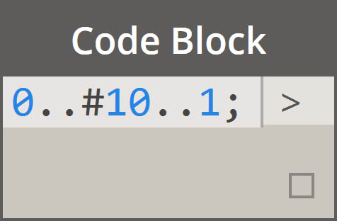
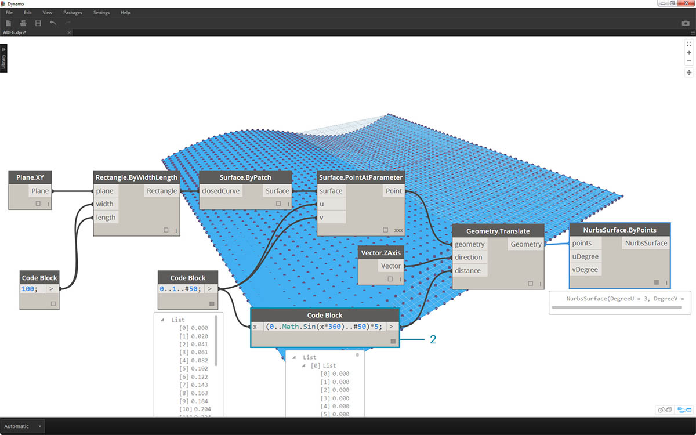
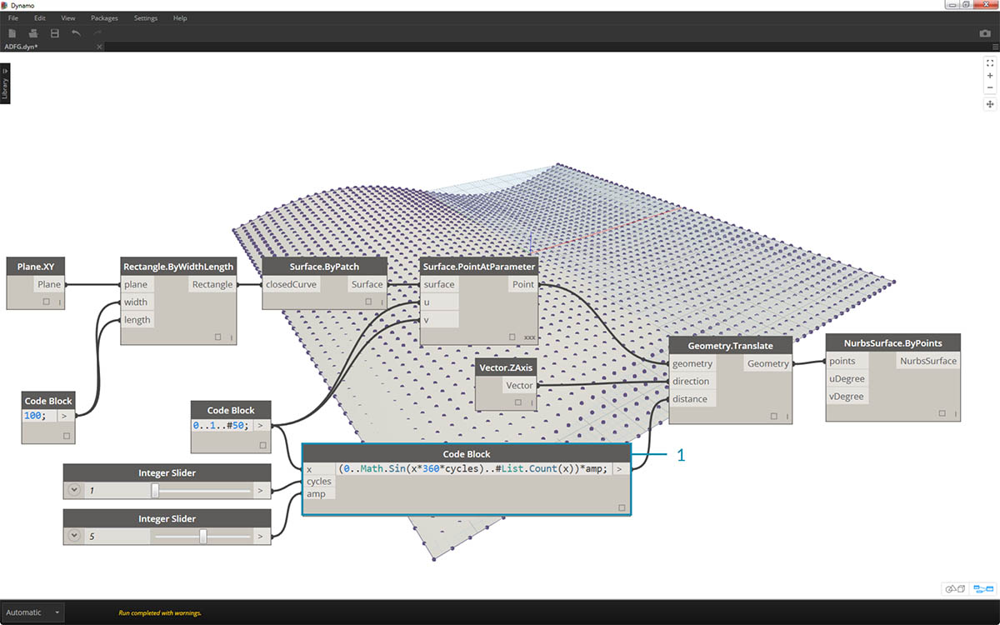
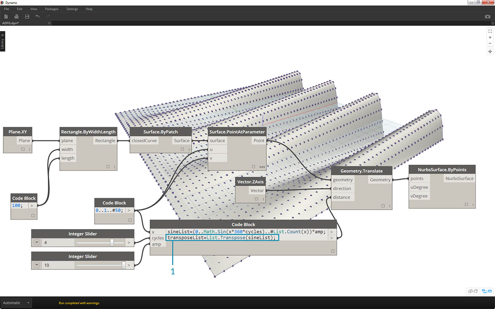
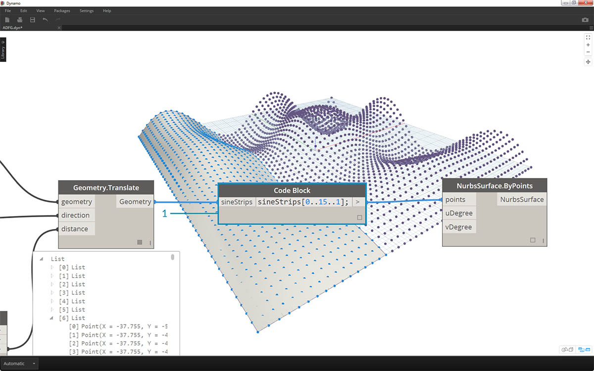

<style>
table{box-shadow: 2px 2px 2px #BBBBBB;max-width:75%;display:block;margin-left: auto;   margin-right: auto }
img{display:block;margin-left: auto;   margin-right: auto }
</style>

## Abreviatura

Existen varios métodos básicos de abreviatura en el bloque de código que, sencillamente, facilitan *mucho* la administración de datos. A continuación, vamos a desglosar los conceptos básicos y analizar cómo se puede utilizar la abreviatura para crear y consultar datos.

<table>
    <tr>
    <td width="50%"><b>Tipo de datos</b></td>
    <td width="25%"><b>Dynamo estándar</b> </td>
    <td width="25%"><b>Bloque de código equivalente</b></td>
  </tr>
  <tr>
    <td> Números</td>
    <td></img> </td>
    <td></img></td>
  </tr>
  <tr>
    <td>Cadenas</td>
    <td></img> </td>
    <td></img></td>
  </tr>
  <tr>
    <td>Secuencias</td>
    <td></img> </td>
    <td></img></td>
  </tr>
  <tr>
    <td>Rangos</td>
    <td></img> </td>
    <td></img></td>
  </tr>
  <tr>
    <td>Obtener elemento en índice</td>
    <td></img> </td>
    <td></img></td>
  </tr>
  <tr>
    <td>Crear lista</td>
    <td></img> </td>
    <td></img></td>
  </tr>
  <tr>
    <td>Concatenar cadenas</td>
    <td></img> </td>
    <td></img></td>
  </tr>
  <tr>
    <td>Instrucciones condicionales</td>
    <td></img> </td>
    <td></img></td>
  </tr>
</table>

### Sintaxis adicional

|Nodo(s)|Bloque de código equivalente|Nota|
| -- | -- | -- |
|Cualquier operador (+, &&, >=, Not, etc.)|+, &&, >=, !, etc.|Tenga en cuenta que "Not" se convierte en "!" pero el nodo se denomina "Not" para distinguirlo de "Factorial".|
|Boolean True|true;|Se deben respetar las minúsculas.|
|Boolean False|false;|Se deben respetar las minúsculas.|

### Rangos

El método para definir rangos y secuencias se puede reducir a un método básico de abreviatura. Utilice la imagen siguiente como guía de la sintaxis "..." para definir una lista de datos numéricos con un bloque de código. Una vez que aprendemos a utilizar esta notación, crear datos numéricos es un proceso realmente eficaz: 

> 1. En este ejemplo, un rango de números se sustituye por una sintaxis de bloque de código básica que define ```inicio..fin..tamaño-de-paso;```. Representados numéricamente, obtenemos: ```0..10..1;```.
2. Observe que la sintaxis ```0..10..1;``` es equivalente a ```0..10;```. Un tamaño de paso de 1 es el valor por defecto para la notación de abreviatura. Por lo tanto, ```0..10;``` proporciona una secuencia de 0 a 10 con un tamaño de paso de 1.
3. El ejemplo de *secuencia numérica* es similar, excepto que se utiliza un símbolo *"#"* para indicar que queremos que haya 15 valores en la lista, en lugar de una lista que llega hasta 15. En este caso, definimos: ```inicio..#dePasos..tamaño-de-paso:```. La sintaxis real de la secuencia es ```0..#15..2```.
4. Ahora vamos a introducir el símbolo *"#"* del paso anterior en la sección *"tamaño-de-paso"* de la sintaxis. Ahora, tenemos un *rango de números* que abarca de *"inicio"* a *"fin"* y la notación de *"tamaño de paso"* distribuye uniformemente un número de valores entre los dos elementos: ```inicio..fin..#dePasos```.

### Rangos avanzados

La creación de rangos avanzados nos permite trabajar con listas de listas de una forma sencilla. En los ejemplos siguientes, se aísla una variable de la notación de rango principal y se crea otro rango de dicha lista. 

> 1. Mediante la creación de rangos anidados, compare la notación con el símbolo *"#"* frente a la notación sin este símbolo. Se aplica la misma lógica que en los rangos básicos, pero se vuelve un poco más compleja.
2. Podemos definir un subrango en cualquier lugar dentro del rango principal, y observe que también podemos tener dos subrangos.
3. Al controlar el valor *"fin"* de un rango, se crean más rangos de longitudes diferentes.


> Como ejercicio lógico, compare las dos abreviaturas anteriores e intente analizar el modo en que los *subrangos* y la notación *"#"* controlan la salida.

### Crear listas y obtener elementos de una lista

Además de crear listas con la función de abreviatura, también podemos crear listas sobre la marcha. Estas listas pueden contener una amplia gama de tipos de elementos y también se pueden consultar (recuerde que las listas son objetos en sí mismas). En resumen, con el bloque de código se crean listas con llaves y se consultan los elementos de una lista con corchetes:


> 1. Cree listas rápidamente con cadenas y consulte las listas mediante el índice de elementos.
2. Cree listas con variables y realice consultas utilizando la notación de abreviatura de rango.

Además, el proceso de gestión con listas anidadas es similar. Tenga en cuenta el orden de la lista y recuerde utilizar varios conjuntos de corchetes:


> 1. Defina una lista de listas.
2. Consulte una lista con notación de un solo corchete.
3. Consulte un elemento con notación de doble corchete.

### Ejercicio

> Descargue el archivo de ejemplo que acompaña a este ejercicio (haga clic con el botón derecho y seleccione "Guardar vínculo como..."). En el Apéndice se incluye una lista completa de los archivos de ejemplo. [Obsolete-Nodes_Sine-Surface.dyn](datasets/7-3/Obsolete-Nodes_Sine-Surface.dyn)

En este ejercicio, vamos a poner en práctica nuestras nuevas habilidades de abreviación para crear una superficie de cáscaras de huevo con mucho estilo y definida por rangos y fórmulas. A lo largo de este ejercicio, observe cómo utilizamos el bloque de código y los nodos existentes en Dynamo en tándem: se utiliza el bloque de código para la elevación de datos pesados mientras que los nodos de Dynamo se disponen visualmente para determinar la legibilidad de la definición.


> Comience por crear una superficie conectando los nodos anteriores. En lugar de utilizar un nodo numérico para definir la anchura y la longitud, haga doble clic en el lienzo y escriba ```100;``` en un bloque de código.


> 1. Defina un rango entre 0 y 1 con 50 divisiones escribiendo ```0..1..#50``` en un bloque de código.
2. Conecte el rango en *Surface.PointAtParameter*, que toma los valores *u* y *v* entre 0 y 1 a lo largo de la superficie. No olvide cambiar el *encaje* a *Producto vectorial* haciendo clic con el botón derecho en el nodo *Surface.PointAtParameter*.



> En este paso, utilizamos nuestra primera función para mover la rejilla de puntos hacia arriba en el eje Z. Esta rejilla controlará una superficie generada a partir de la función subyacente.

> 1. Añada los nodos visuales al lienzo como se muestra en la imagen anterior.
2. En lugar de utilizar un nodo de fórmula, utilizamos un bloque de código con la línea: ```(0..Math.Sin(x*360)..#50)*5;```. Para descomponerlo rápidamente, vamos a definir un rango con una fórmula dentro de él. Esta fórmula es la función de seno. La función de seno recibe entradas de grado en Dynamo, por lo que, para obtener una onda sinusoidal completa, multiplicamos los valores *x* (es decir, la entrada de rango de 0 a 1) por *360*. A continuación, queremos que haya el mismo número de divisiones que de puntos de rejilla de control para cada fila, por lo que definimos cincuenta subdivisiones con *#50*. Por último, el multiplicador de 5 simplemente aumenta la amplitud de la traslación para que podamos ver el efecto en la vista preliminar de Dynamo.



> 1. Aunque el bloque de código anterior funcionaba bien, no era totalmente paramétrico. Queremos controlar sus parámetros de forma dinámica, por lo que vamos a sustituir la línea del paso anterior por ```(0..Math.Sin(x*360*cycles)..#List.Count(x))*amp;```. Esto nos permite definir estos valores en función de las entradas.


> 1. Al cambiar los controles deslizantes (de 0 a 10), obtenemos resultados interesantes.



> 1. Al realizar una transposición en el rango de números, se invierte la dirección de la onda cortina: ```transposeList = List.Transpose(sineList);```


> 1. Se obtiene una superficie de cáscara de huevo distorsionada al añadir los elementos sineList y tranposeList: ```eggShellList = sineList+transposeList;```.


> 1. Cambiando los controles deslizantes de nuevo, calmamos las aguas de este algoritmo.



> 1. Por último, vamos a consultar las partes aisladas de los datos con el bloque de código. Para regenerar la superficie con un rango específico de puntos, añada el bloque de código anterior entre los nodos *Geometry.Translate* y *NurbsSurface.ByPoints*. Tiene la línea de texto: ```sineStrips[0..15..1];```. De este modo, se seleccionarán las primeras 16 filas de puntos (de 50). Al volver a crear la superficie, podemos ver que hemos generado una parte aislada de la rejilla de puntos.


> 1. En el paso final, para que este bloque de código sea más paramétrico, la consulta se controla mediante un control deslizante que va de 0 a 1. Lo hacemos con esta línea de código: ```sineStrips[0..((List.Count(sineStrips)-1)*u)];```. Esto puede resultar confuso, pero la línea de código nos proporciona una forma rápida de modificar la longitud de la lista con un multiplicador entre 0 y 1.


> 1. Un valor de *0,53* en el control deslizante crea una superficie justo después del punto medio de la rejilla.


> 1. Como se puede esperar, un control deslizante de *1* crea una superficie a partir de la rejilla completa de puntos.


> En el gráfico visual resultante, podemos resaltar los bloques de código y ver cada una de sus funciones.

> 1. El primer bloque de código sustituye al nodo *Number*.
2. El segundo bloque de código sustituye al nodo *Number Range*.
3. El tercer bloque de código sustituye al nodo *Formula* (así como *List.Transpose*, *List.Count* y *Number Range*).
4. El cuarto bloque de código consulta una lista de listas y reemplaza al nodo *List.GetItemAtIndex*.

