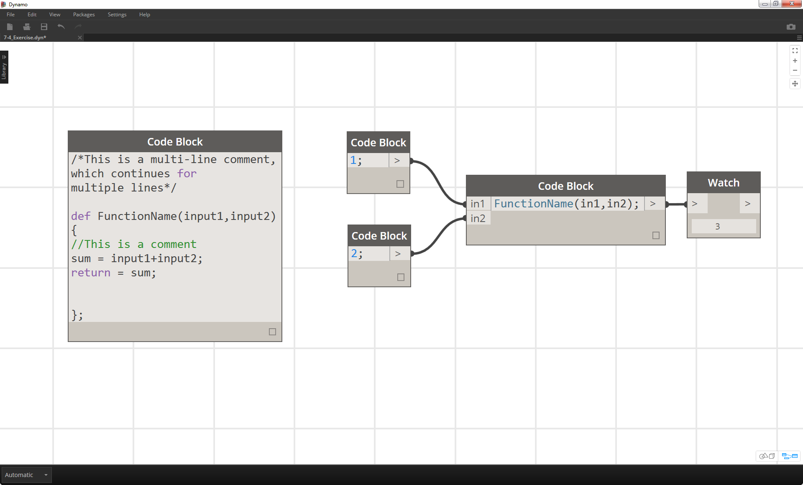
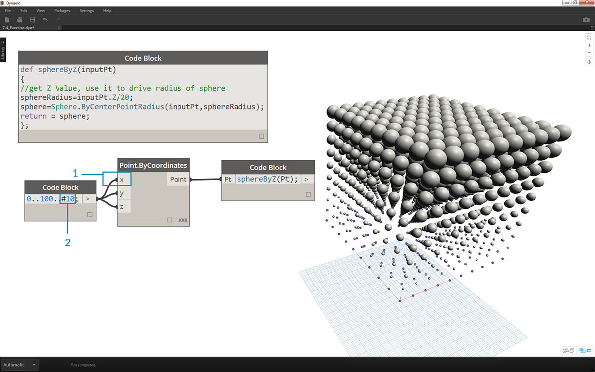
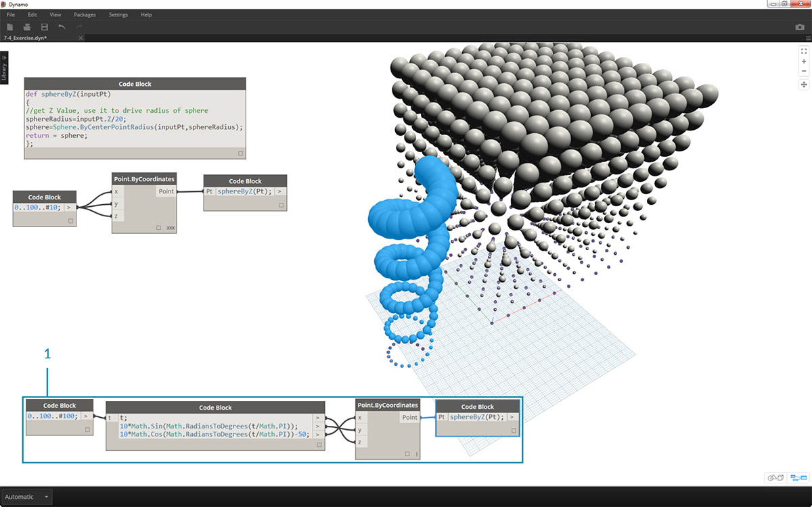

## Funciones de bloque de código

Las funciones se pueden crear en un bloque de código y recuperar en cualquier parte de una definición de Dynamo. Esto crea otra capa de control en un archivo paramétrico y se puede ver como una versión de texto de un nodo personalizado. En este caso, se puede acceder fácilmente al bloque de código "principal", que se encuentra en cualquier parte del gráfico. No se necesitan cables.

### Elemento principal

En la primera línea, aparece la palabra clave "def", después el nombre de la función y, a continuación, los nombres de las entradas entre paréntesis. Las llaves definen el cuerpo de la función. Se devuelve un valor con "return =". Los bloques de código que definen una función no tienen puertos de entrada o salida porque se invocan desde otros bloques de código. 

```
/*This is a multi-line comment,
which continues for
multiple lines*/
def FunctionName(in1,in2)
{
//This is a comment
sum = in1+in2;
return sum;
};
```

### Elementos secundarios

Invoque la función con otro bloque de código en el mismo archivo asignando el nombre y la misma cantidad de argumentos. Funciona igual que los nodos predefinidos de la biblioteca.



```
FunctionName(in1,in2);
```

### Ejercicio

> Descargue el archivo de ejemplo que acompaña a este ejercicio (haga clic con el botón derecho y seleccione "Guardar vínculo como..."). En el Apéndice, se incluye una lista completa de los archivos de ejemplo. [Functions_SphereByZ.dyn](datasets/7-4/Functions_SphereByZ.dyn)

En este ejercicio, crearemos una definición genérica que creará esferas a partir de una lista de entrada de puntos. El radio de estas esferas depende de la propiedad Z de cada punto.


> Comencemos con un intervalo de diez valores que abarca de 0 a 100. Conecte estos nodos a un nodo *Point.ByCoordinates* para crear una línea diagonal.


> 1. Cree un *bloque de código* e introduzca la definición mediante la línea de código:
```
def sphereByZ(inputPt){
};
```

El parámetro *inputPt* es el nombre que se le ha asignado para representar los puntos que controlarán la función. En este momento, la función no realiza ninguna acción, pero la ampliaremos en los pasos siguientes.


> 1. Al añadir la función de *bloque de código*, se coloca un comentario y una variable *sphereRadius* que consulta la posición *Z* de cada punto. Recuerde que *inputPt.Z* no necesita paréntesis como método. Se trata de una *consulta* de las propiedades de un elemento existente, por lo que no se necesita ninguna entrada:
```
def sphereByZ(inputPt,radiusRatio)
{
//get Z Value, use it to drive radius of sphere
sphereRadius=inputPt.Z;
};
```


> 1. Ahora, vamos a recuperar la función que hemos creado en otro *bloque de código*. Si hacemos doble clic en el lienzo para crear un nuevo *bloque de código* y escribimos *sphereB*, observaremos que Dynamo sugiere la función *sphereByZ* que hemos definido. La función se ha añadido a la biblioteca de IntelliSense. ¡Genial!


> 1. Ahora llamamos a la función y creamos una variable denominada *Pt* para conectar los puntos creados en los pasos anteriores:
```
sphereByZ(Pt)
```

2. En la salida, podemos observar que todos los valores son nulos. ¿Por qué ocurre eso? Al definir la función, calculamos la variable *sphereRadius*, pero no hemos definido qué debe *devolver* la función como una *salida*. Podemos solucionar esto en el siguiente paso.


> 1. Un paso importante es definir la salida de la función mediante la adición de la línea ```return = sphereRadius;``` a la función *sphereByZ*.
2. Ahora vemos que la salida del *bloque de código* nos proporciona las coordenadas Z de cada punto.


> Ahora vamos a crear esferas reales mediante la edición de la función *principal*.

> 1. Definimos primero una esfera con la línea de código: ```sphere=Sphere.ByCenterPointRadius(inputPt,sphereRadius);```.
2. A continuación, cambiaremos el valor de retorno para que sea *sphere* en lugar de *sphereRadius*: ```return = sphere;```. Esto nos proporciona unas esferas gigantes en la vista preliminar de Dynamo.


> 1. Para reducir el tamaño de estas esferas, vamos a actualizar el valor de *sphereRadius* mediante la adición de un divisor: ```sphereRadius = inputPt.Z/20;```. Ahora podemos ver las diferentes esferas y comenzar a desentrañar la relación entre el radio y el valor Z.


> 1. En el nodo *Point.ByCoordinates*, al cambiar el encaje de *Más corto* a *Producto cartesiano*, creamos una rejilla de puntos. La función *sphereByZ* sigue estando totalmente activa, por lo que todos los puntos crean esferas con radios basados en valores Z.



> 1. Y, solo para tantear el terreno, conectamos la lista original de números a la entrada X de *Point.ByCoordinates*. Ahora tenemos un cubo de esferas.
2. Nota: si el cálculo tarda mucho en completarse en el equipo, pruebe a cambiar el valor *#10* por un valor como *#5*.



> 1. Recuerde que la función *sphereByZ* que hemos creado es una función genérica, por lo que podemos recuperar la hélice de una lección anterior y aplicarle la función.


> Como paso final, vamos a controlar la relación de radio con un parámetro definido por el usuario. Para ello, debemos crear una entrada nueva para la función y reemplazar el divisor *20* por un parámetro.

> 1. Actualice la definición de *sphereByZ* a:
```
def sphereByZ(inputPt,radiusRatio)
{
//get Z Value, use it to drive radius of sphere
sphereRadius=inputPt.Z/radiusRatio;
//Define Sphere Geometry
sphere=Sphere.ByCenterPointRadius(inputPt,sphereRadius);
//Define output for function
return sphere;
};
```

2. Actualice los bloques de código secundarios mediante la adición de una variable *ratio* a la entrada: ```sphereByZ(Pt,ratio);```. Conecte un control deslizante a la entrada de bloque de código recién creada y varíe el tamaño de los radios en función de la relación de radio.

