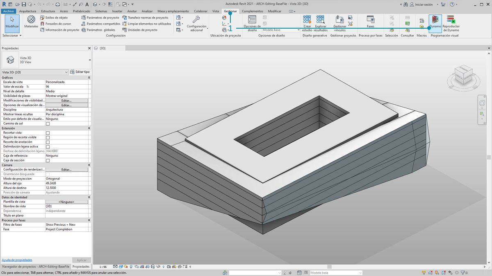
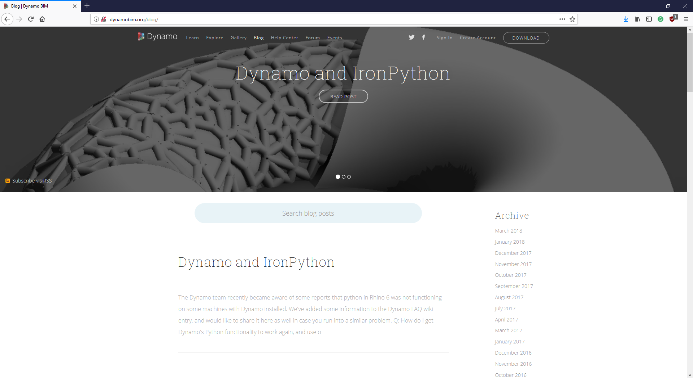

## La conexión de Revit

Dynamo para Revit amplía el modelado de información de construcción mediante el entorno de datos y lógica de un editor gráfico de algoritmos. Su flexibilidad, junto con una base de datos de Revit robusta, ofrece una nueva perspectiva para BIM.

Este capítulo se centra en los flujos de trabajo de Dynamo para BIM. Las secciones se basan principalmente en ejercicios, ya que la mejor forma de familiarizarse con un editor gráfico de algoritmos para BIM es pasar directamente a un proyecto. No obstante, veamos primero los inicios del programa.

### #

#### Compatibilidad con versiones de Revit

A medida que Revit y Dynamo continúan evolucionando, es posible que observe que la versión de Revit con la que está trabajando no es compatible con la versión de Dynamo para Revit que ha instalado en su equipo. A continuación, se describen las versiones de Dynamo para Revit que son compatibles con Revit.

|Versión de Revit|Primera versión de Dynamo estable|Última versión de Dynamo para Revit compatible|
| -- | -- | -- |
|2013|[0.6.1](http://dyn-builds-data.s3-us-west-2.amazonaws.com/DynamoInstall0.6.1.exe)|[0.6.3](http://dyn-builds-data.s3-us-west-2.amazonaws.com/DynamoInstall0.6.3.exe)|
|2014|[0.6.1](http://dyn-builds-data.s3-us-west-2.amazonaws.com/DynamoInstall0.6.1.exe)|[0.8.2](http://dyn-builds-data.s3-us-west-2.amazonaws.com/DynamoInstall0.8.2.exe)|
|2015|[0.7.1](http://dyn-builds-data.s3-us-west-2.amazonaws.com/DynamoInstall0.7.1.exe)|[1.2.1](http://dyn-builds-data.s3-us-west-2.amazonaws.com/DynamoInstall1.2.1.exe)|
|2016|[0.7.2](http://dyn-builds-data.s3-us-west-2.amazonaws.com/DynamoInstall0.7.2.exe)|[1.3.2](http://dyn-builds-data.s3-us-west-2.amazonaws.com/DynamoInstall1.3.2.exe)|
|2017|[0.9.0](http://dyn-builds-data.s3-us-west-2.amazonaws.com/DynamoInstall0.9.0.exe)|[1.3.4](http://dyn-builds-data.s3-us-west-2.amazonaws.com/DynamoInstall1.3.4.exe) / [2.0.3](https://dyn-builds-data.s3-us-west-2.amazonaws.com/DynamoInstall2.0.3.exe)|
|2018|[1.3.0](http://dyn-builds-data.s3-us-west-2.amazonaws.com/DynamoInstall1.3.0.exe)|[1.3.4](http://dyn-builds-data.s3-us-west-2.amazonaws.com/DynamoInstall1.3.4.exe) / [2.0.3](https://dyn-builds-data.s3-us-west-2.amazonaws.com/DynamoInstall2.0.3.exe)|
|2019|[1.3.3](http://dyn-builds-data.s3-us-west-2.amazonaws.com/DynamoInstall1.3.3.exe)|[1.3.4](http://dyn-builds-data.s3-us-west-2.amazonaws.com/DynamoInstall1.3.4.exe) / [2.0.3](https://dyn-builds-data.s3-us-west-2.amazonaws.com/DynamoInstall2.0.3.exe)|
|2020|2.1.0: Revit 2020 ahora incluye Dynamo y recibe actualizaciones al igual que Revit.|N/A|

### #

#### Historia de Dynamo

> Con un equipo dedicado de desarrolladores y una ferviente comunidad, el proyecto ha avanzado mucho desde sus humildes inicios.

Dynamo se creó originalmente para agilizar los flujos de trabajo de AEC en Revit. Aunque Revit crea una robusta base de datos para cada proyecto, puede resultar difícil para un usuario medio acceder a esta información fuera de las restricciones de la interfaz. Revit incluye una API (interfaz de programación de aplicaciones) completa que permite a desarrolladores de terceros crear herramientas personalizadas. Y los programadores han estado utilizado esta API durante años, pero la creación de secuencias de comandos basadas en texto no está accesible para todos. Dynamo busca democratizar los datos de Revit a través de un editor gráfico de algoritmos de fácil manejo.

Mediante el uso de los nodos principales de Dynamo, junto con los nodos personalizados de Revit, un usuario puede ampliar sustancialmente los flujos de trabajo paramétricos en cuanto a interoperabilidad, documentación, análisis y generación. Con Dynamo, los flujos de trabajo tediosos pueden automatizarse, mientras que pueden impulsarse las exploraciones de diseño.

### Ejecución de Dynamo en Revit

> 1. En un editor de proyectos o familias de Revit, vaya a Complementos y haga clic en *Dynamo*. Tenga en cuenta que Dynamo solo se ejecutará en el archivo en el que se abrió.

> 1. Al abrir Dynamo en Revit, hay una nueva categoría denominada *Revit*. Se trata de una adición completa a la interfaz de usuario que ofrece nodos que se adaptan específicamente a los flujos de trabajo de Revit.*

** Nota: el gráfico de Dynamo solo funcionará al abrirse en Dynamo para Revit mediante la familia de nodos específica de Revit. Si se abre un gráfico de Dynamo para Revit en Dynamo Sandbox, por ejemplo, no aparecerán los nodos de Revit.*

### Bloqueo de nodos

Como Revit es una plataforma que proporciona una sólida gestión de proyectos, las operaciones paramétricas de Dynamo pueden ser complejas y lentas de calcular. Si Dynamo tarda mucho tiempo en calcular los nodos, puede usar la función "Bloquear" para poner en pausa la ejecución de operaciones de Revit mientras desarrolla el gráfico. Para obtener más información sobre el bloqueo de nodos, consulte la sección "Bloqueo" del [capítulo sobre sólidos](../05_Geometry-for-Computational-Design/5-6_solids.md#freezing).

### Comunidad

Como Dynamo se creó originalmente para AEC, su comunidad grande y creciente es un recurso excelente para aprender del sector y ponerse en contacto con expertos de la industria. La comunidad de Dynamo la integran arquitectos, ingenieros, programadores y diseñadores a los que les apasiona compartir y crear.

Dynamo es un proyecto de código abierto que evoluciona constantemente y gran parte del desarrollo está relacionado con Revit. Si es un nuevo usuario, diríjase al foro de debate y comience a [publicar preguntas](http://dynamobim.org/forums/forum/dyn/). Si es un programador y desea participar en el desarrollo de Dynamo, consulte la [página de GitHub](https://github.com/DynamoDS/Dynamo). Además, un recurso excelente para las bibliotecas de terceros es [Dynamo Package Manager](http://dynamopackages.com/). Muchos de estos paquetes se crean teniendo en mente AEC y echaremos un vistazo a los paquetes de terceros para la panelización en este capítulo.

> Dynamo también mantiene un [blog](http://dynamobim.com/blog/) activo. Lea las últimas publicaciones para obtener información sobre los avances más recientes.

