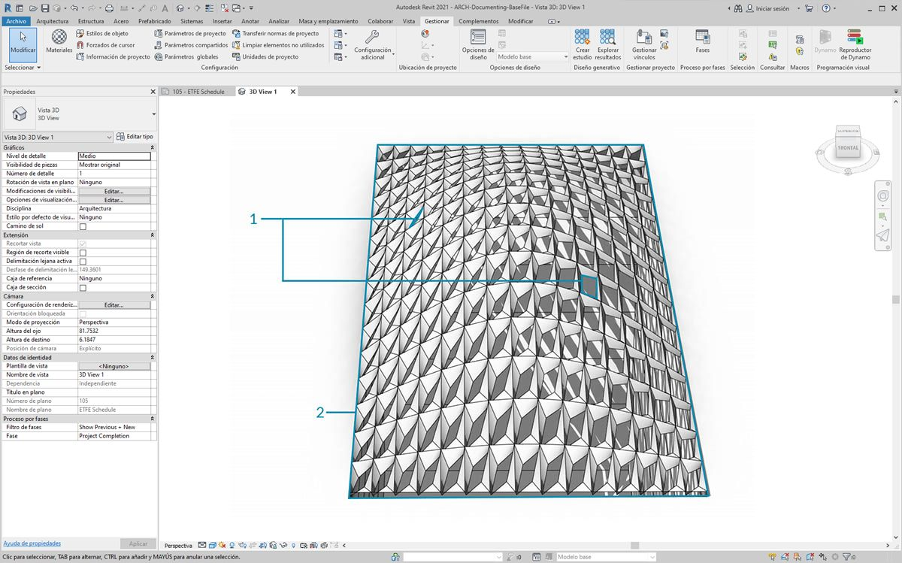
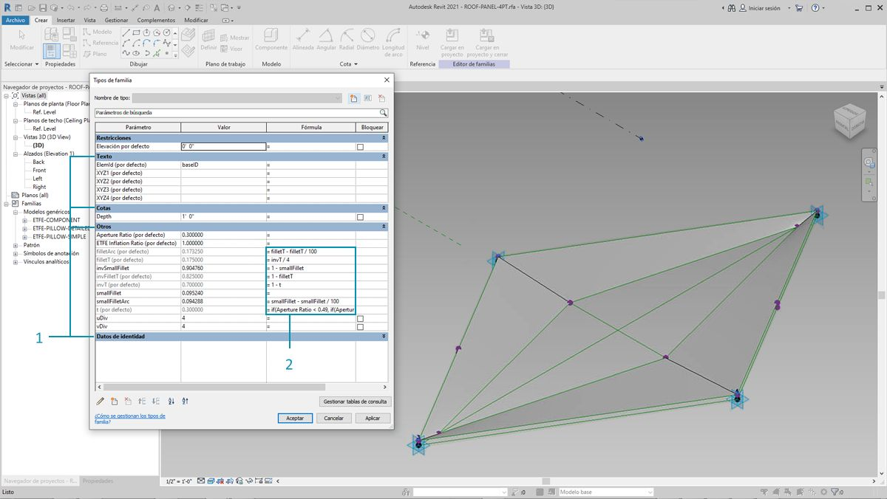
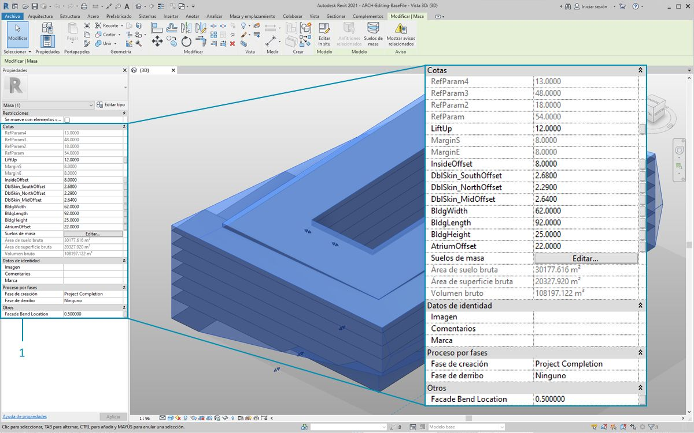
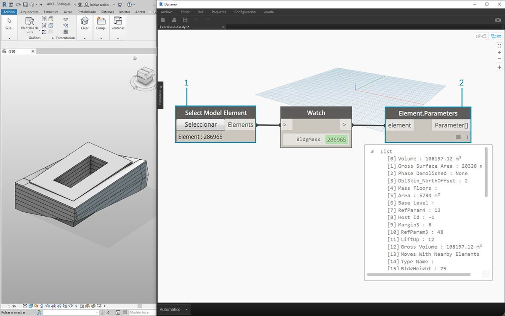
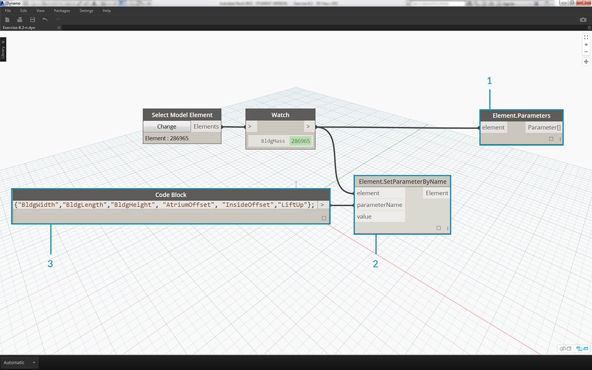
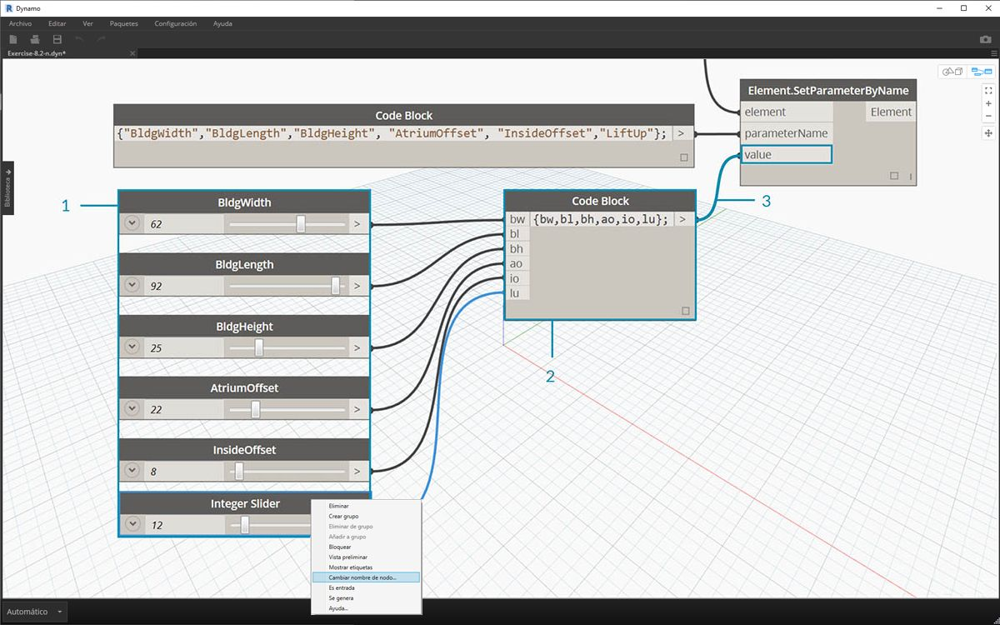
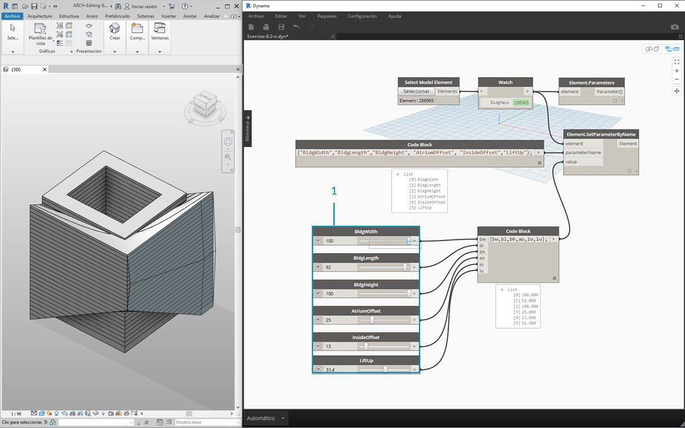
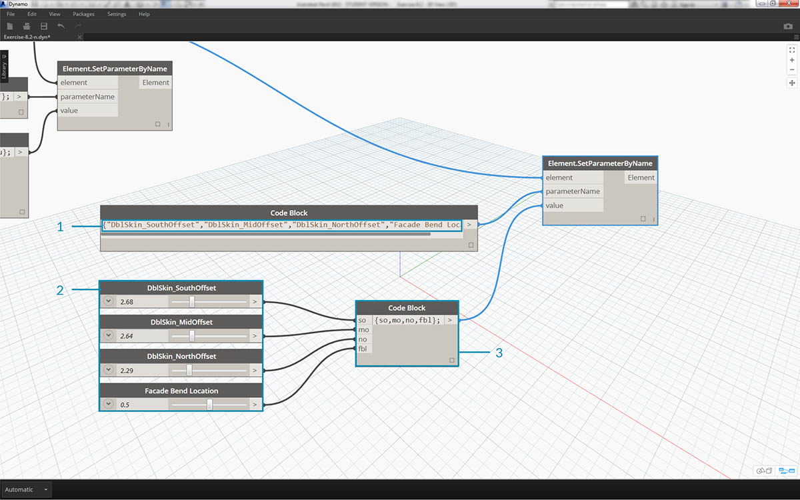
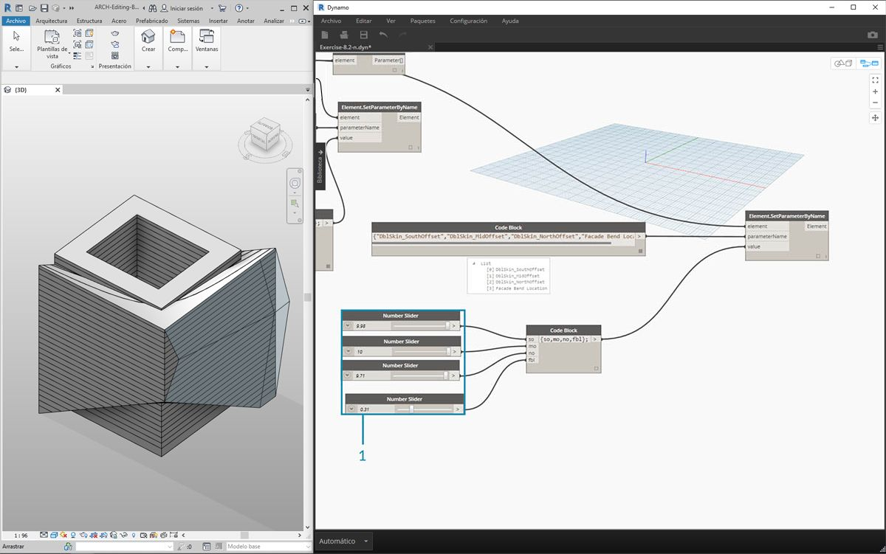

## Edición

Una característica útil de Dynamo es la posibilidad de editar parámetros en un nivel paramétrico. Por ejemplo, se puede utilizar un algoritmo generativo o los resultados de una simulación para controlar los parámetros de una matriz de elementos. De este modo, un conjunto de ejemplares de la misma familia puede tener propiedades personalizadas en el proyecto de Revit.

### Parámetros de tipo y ejemplar



> 1. Los parámetros de ejemplar definen la apertura de los paneles en la superficie de la cubierta, desde una proporción de apertura de 0,1 a 0,4.
2. Los parámetros basados en tipo se aplican a todos los elementos de la superficie porque son del mismo tipo de familia. El material de cada panel, por ejemplo, puede controlarse mediante un parámetro basado en tipo.



> 1. Si ha configurado una familia de Revit con anterioridad, recuerde que debe asignar un tipo de parámetro (cadena, número, cota, etc.). Asegúrese de utilizar el tipo de datos correcto al asignar parámetros de Dynamo.
2. También puede utilizar Dynamo en combinación con restricciones paramétricas definidas en las propiedades de una familia de Revit.

Como revisión rápida de los parámetros en Revit, recordemos que existen parámetros de tipo y parámetros de ejemplar. Ambos se pueden editar en Dynamo, pero trabajaremos con parámetros de ejemplar en el ejercicio siguiente.

Nota: a medida que descubra la amplia aplicación de la edición de parámetros, puede que desee editar una gran cantidad de elementos en Revit con Dynamo. Esta puede ser una operación *computacionalmente exigente*, lo que significa que puede ser lenta. Si va a editar un gran número de elementos, puede usar la función de nodo "Bloquear" para poner en pausa la ejecución de operaciones de Revit mientras desarrolla el gráfico. Para obtener más información sobre el bloqueo de nodos, consulte la sección "Bloqueo" del [capítulo de sólidos](../05_Geometry-for-Computational-Design/5-6_solids.md#freezing).

#### Unidades

A partir de la versión 0.8, Dynamo prácticamente no trabaja con unidades. Esto permite que Dynamo siga siendo un entorno de programación visual abstracto. Los nodos de Dynamo que interactúan con las cotas de Revit harán referencia a las unidades del proyecto de Revit. Por ejemplo, si configura un parámetro de longitud en Revit desde Dynamo, el número del valor en Dynamo se corresponderá con las unidades por defecto del proyecto de Revit. El siguiente ejercicio utiliza metros.


> Para obtener una conversión rápida de unidades, utilice el nodo *"Convert Between Units"*. Esta es una herramienta práctica para convertir unidades de longitud, área y volumen sobre la marcha.

### Ejercicio

> Descargue los archivos de ejemplo que acompañan a este ejercicio (haga clic con el botón derecho y seleccione "Guardar enlace como..."). En el Apéndice se incluye una lista completa de los archivos de ejemplo.

> 1. [Editing.dyn](datasets/8-3/Editing.dyn)
2. [ARCH-Editing-BaseFile.rvt](datasets/8-3/ARCH-Editing-BaseFile.rvt)

Este ejercicio se centra en la edición de elementos de Revit sin realizar operaciones geométricas en Dynamo. No vamos a importar la geometría de Dynamo aquí, solo vamos a editar los parámetros de un proyecto de Revit. Este ejercicio es básico; para los usuarios más avanzados de Revit, observe que se trata de parámetros de ejemplar de una masa, pero la misma lógica se puede aplicar a una matriz de elementos para personalizarlos a gran escala. Esto se realiza con el nodo "Element.SetParameterByName".



> Empiece con el archivo de ejemplo de Revit para esta sección. Hemos eliminado los elementos estructurales y las vigas de celosía adaptativas de la sección anterior. En este ejercicio, nos centraremos en una manipulación paramétrica en Revit y en la manipulación en Dynamo.

> 1. Al seleccionar el edificio dentro de Masa en Revit, vemos una matriz de parámetros de ejemplar en el panel Propiedades.



> 1. Seleccione la masa de construcción con el nodo *Select Model Element"*.
2. Se pueden consultar todos los parámetros de esta masa mediante el nodo *"Element.Parameters"*. Esto incluye los parámetros de tipo y ejemplar.



> 1. Haga referencia al nodo *Element.Parameters* para buscar los parámetros objetivo. También podemos ver el panel Propiedades del paso anterior para elegir los nombres de parámetro que deseamos editar. En este caso, buscamos los parámetros que afectan a los grandes movimientos geométricos en la masa de construcción.
2. Realizaremos cambios en el elemento de Revit mediante el nodo *Element.SetParameterByName*.
3. Con el *bloque de código*, definimos una lista de estos parámetros utilizando comillas a ambos lados de cada elemento para formar una cadena. También se puede utilizar el nodo List.Create con una serie de nodos *"String"* conectados a varias entradas. El bloque de código es simplemente más rápido y sencillo. Asegúrese de que la cadena coincida con el nombre exacto de Revit, incluidas las mayúsculas y minúsculas: ```{"BldgWidth","BldgLength","BldgHeight", "AtriumOffset", "InsideOffset","LiftUp"};```.



> 1. También vamos a designar valores para cada parámetro. Añada seis *"controles deslizantes de enteros"* al lienzo y cambie el nombre de estos al parámetro correspondiente de la lista. Asimismo, defina los valores de cada control deslizante a los que se pueden ver en la imagen anterior. Por orden de arriba a abajo: ```62,92,25,22,8,12```.
2. Defina otro *bloque de código* con una lista de la misma longitud que los nombres de parámetro. En este caso, se asignan nombres a las variables (sin comillas) que crean entradas para el *bloque de código.* Conecte los *controles deslizantes* a cada entrada respectiva: ```{bw,bl,bh,ao,io,lu};```.
3. Conecte el *bloque de código *al nodo *"Element.SetParameterByName*"*. Con opción Ejecutar automáticamente seleccionada, veremos los resultados automáticamente.

**Nota: esta demostración funciona con parámetros de ejemplar, pero no con parámetros de tipo.*

 Al igual que en Revit, muchos de estos parámetros dependen unos de otros. Por supuesto, existen combinaciones en las que la geometría se puede partir. Podemos solucionar este problema con las fórmulas definidas en las propiedades de los parámetros, o bien podemos configurar una lógica similar con operaciones matemáticas en Dynamo (este es un reto adicional si desea ampliar el ejercicio).

> 1. Esta combinación proporciona un nuevo diseño con estilo a la masa de construcción: ```100,92,100,25,13,51.4```.



> 1. Vamos a copiar el gráfico y centrarnos en la cristalera de la fachada que alojará el sistema de vigas de celosía. Aislamos cuatro parámetros en este caso: ```{"DblSkin_SouthOffset","DblSkin_MidOffset","DblSkin_NorthOffset","Facade Bend Location"};```.
2. Además, creamos *controles deslizantes de número* y les cambiamos el nombre por los parámetros adecuados. Los tres primeros controles deslizantes empezando por arriba deben reasignarse a un dominio de [0,10], mientras que el control deslizante final, *"Facade Bend Location"*, se debe reasignar a un dominio de [0,1]. Estos elementos, de arriba a abajo, deben empezar con estos valores (aunque son arbitrarios): ```2,68;2,64;2,29;0,5```.
3. Defina un nuevo *bloque de código* y conecte los controles deslizantes: ```{so,mo,no,fbl};```.



> 1. Al cambiar los *controles deslizantes* en esta parte del gráfico, podemos hacer que la cristalera de la fachada sea mucho más sustancial: ```9,98;10,0;9,71;0,31```.

