## Creación

Puede crear una matriz de elementos de Revit en Dynamo con control paramétrico completo. Los nodos de Revit en Dynamo permiten importar elementos de geometrías genéricas a tipos de categorías específicos (como muros y suelos). En esta sección, nos centraremos en la importación paramétrica de elementos flexibles con componentes adaptativos.


### Componentes adaptativos

Un componente adaptativo es una categoría de familia flexible que se presta bien a las aplicaciones generativas. Una vez creada la instancia, puede crear un elemento geométrico complejo controlado por la ubicación fundamental de los puntos adaptativos.

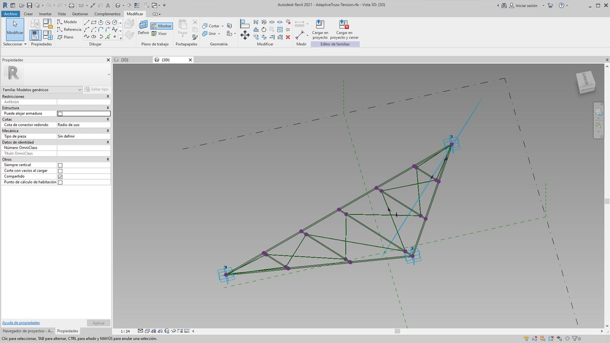

> Un ejemplo de un componente adaptativo de tres puntos en el Editor de familias. Esto genera una viga de celosía definida por la posición de cada punto adaptativo. En el ejercicio siguiente, utilizaremos este componente para generar una serie de vigas de celosía en una fachada.

#### Principios de interoperabilidad

El componente adaptativo es un buen ejemplo de los procedimientos recomendados de interoperabilidad. Podemos crear una matriz de componentes adaptativos mediante la definición de los puntos adaptativos fundamentales. Y, al transferir estos datos a otros programas, tenemos la posibilidad de reducir la geometría a datos simples. La importación y la exportación con un programa como Excel siguen una lógica similar.

Supongamos que un consultor de fachada desea conocer la ubicación de los elementos de la viga de celosía sin necesidad de realizar un análisis mediante geometría totalmente articulada. Para preparar la fabricación, el consultor puede examinar la ubicación de los puntos adaptativos a fin de regenerar la geometría en un programa como Inventor.

El flujo de trabajo que configuraremos en el siguiente ejercicio nos permite acceder a todos estos datos mientras creamos la definición para la creación de elementos de Revit. Mediante este proceso, podemos combinar la conceptualización, la documentación y la fabricación en un flujo de trabajo perfecto. Esto permite generar un proceso más inteligente y eficaz para la interoperabilidad.

#### Varios elementos y listas

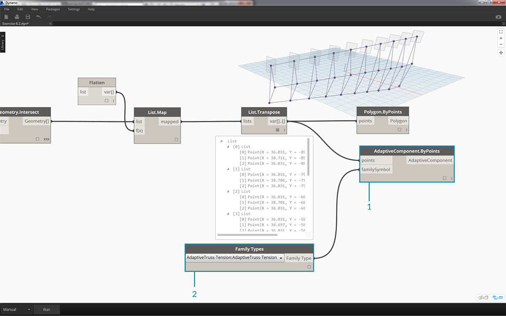

En el siguiente ejercicio, se describe cómo Dynamo consulta los datos para la creación de elementos de Revit. Para generar varios componentes adaptativos, definimos una lista de listas en la que cada lista tiene tres puntos que representan cada punto del componente adaptativo. Tendremos esto en cuenta a medida que gestionamos las estructuras de datos en Dynamo.

### Ejercicio

> Descargue los archivos de ejemplo que acompañan a este ejercicio (haga clic con el botón derecho y seleccione "Guardar enlace como..."). En el Apéndice, se incluye una lista completa de los archivos de ejemplo.

> 1. [Creating.dyn](datasets/8-4/Creating.dyn)
2. [ARCH-Creating-BaseFile.rvt](datasets/8-4/ARCH-Creating-BaseFile.rvt)


> Comenzando con el archivo de ejemplo de esta sección (o continuando con el archivo de Revit de la sesión anterior), veremos la misma masa de Revit.

> 1. Este es el archivo, tal y como se ha abierto.
2. Este es el sistema de vigas de celosía que hemos creado con Dynamo, vinculado de forma inteligente a la masa de Revit.

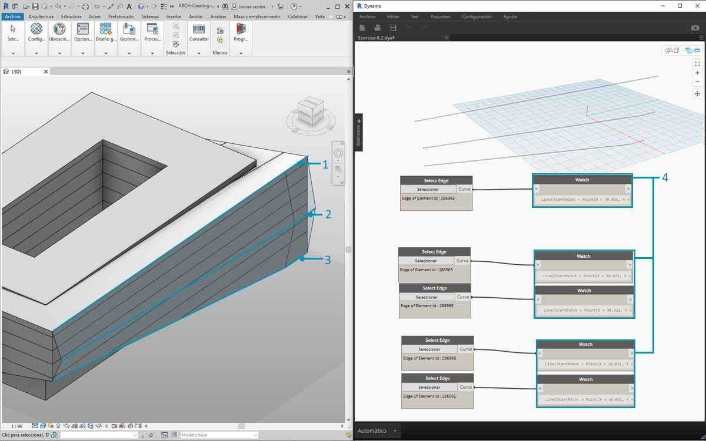

> Hemos utilizado los nodos *"Select Model Element"* y *"Select Face"*, bajamos un nivel más en la jerarquía y utilizamos *"Select Edge"*. Con el solucionador de Dynamo establecido en *"Automático"*, el gráfico se actualizará continuamente con los cambios realizados en el archivo de Revit. El borde que seleccionamos se asocia dinámicamente a la topología del elemento de Revit. Mientras la topología* no cambie, la conexión permanecerá vinculada entre Revit y Dynamo.

> 1. Seleccione la curva superior de la fachada de la cristalera. Esto abarca toda la longitud del edificio. Si tiene problemas para seleccionar el borde, recuerde realizar la selección en Revit. Para ello, coloque el cursor sobre el borde y pulse *"Tab"* hasta que se resalte el borde seleccionado.
2. Mediante dos nodos *"Select Edge"*, seleccione cada borde que represente la inclinación en el centro de la fachada.
3. Haga lo mismo para los bordes inferiores de la fachada en Revit.
4. En los nodos *Watch*, se muestra que ahora tenemos líneas en Dynamo. Esto se convierte automáticamente en geometría de Dynamo, ya que los bordes en sí no son elementos de Revit. Estas curvas son las referencias que utilizaremos para crear instancias de vigas de celosía adaptativas a lo largo de la fachada.

**Nota: para mantener la coherencia de la topología, consultaremos un modelo sin caras o bordes adicionales añadidos. Aunque los parámetros pueden cambiar su forma, el modo en que se crea sigue siendo coherente.*


> Debemos unir primero las curvas y fusionarlas en una lista. De esta forma, podemos *"agrupar"* las curvas para realizar operaciones geométricas.

> 1. Cree una lista para las dos curvas del centro de la fachada.
2. Una las dos curvas en una PolyCurve. Para ello, conecte el componente *List.Create* a un nodo *Polycurve.ByJoinedCurves*.
3. Cree una lista para las dos curvas de la parte inferior de la fachada.
4. Una las dos curvas en una PolyCurve. Para ello, conecte el componente *List.Create* a un nodo *Polycurve.ByJoinedCurves*.
5. Por último, una las tres curvas principales (una línea y dos PolyCurves) en una lista.


> Deseamos aprovechar la curva superior, que es una línea, y representa toda la extensión de la fachada. Crearemos planos a lo largo de esta línea para que se intersequen con el conjunto de curvas que hemos agrupado en una lista.

> 1. Con un *bloque de código*, defina un intervalo mediante la sintaxis: ```0..1..#numberOfTrusses;```.
2. Conecte un *control deslizante de entero *a la entrada del bloque de código. Como podrá haber adivinado, esto representará el número de vigas de celosía. Observe que el control deslizante determina el número de elementos del intervalo definido de *0 *a *1*.
3. Conecte el *bloque de código* a la entrada *param* de un nodo *"Curve.PlaneAtParameter"* y conecte el borde superior a la entrada *curve*. Esto nos dará diez planos, distribuidos de forma uniforme a lo largo de la extensión de la fachada.


> Un plano es una unidad abstracta de geometría que representa un espacio bidimensional infinito. Los planos son ideales para la creación de contornos y la intersección, tal y como los vamos a configurar en este paso.

> 1. Con el nodo *Geometry.Intersect* (observe el encaje de producto cartesiano), conecte *Curve.PlaneAtParameter* a la entrada *entity* del nodo *Geometry.Intersect*. Conecte el nodo *List.Create* principal a la entrada *geometry*. Ahora aparecen puntos en la ventana gráfica de Dynamo que representan la intersección de cada curva con los planos definidos.

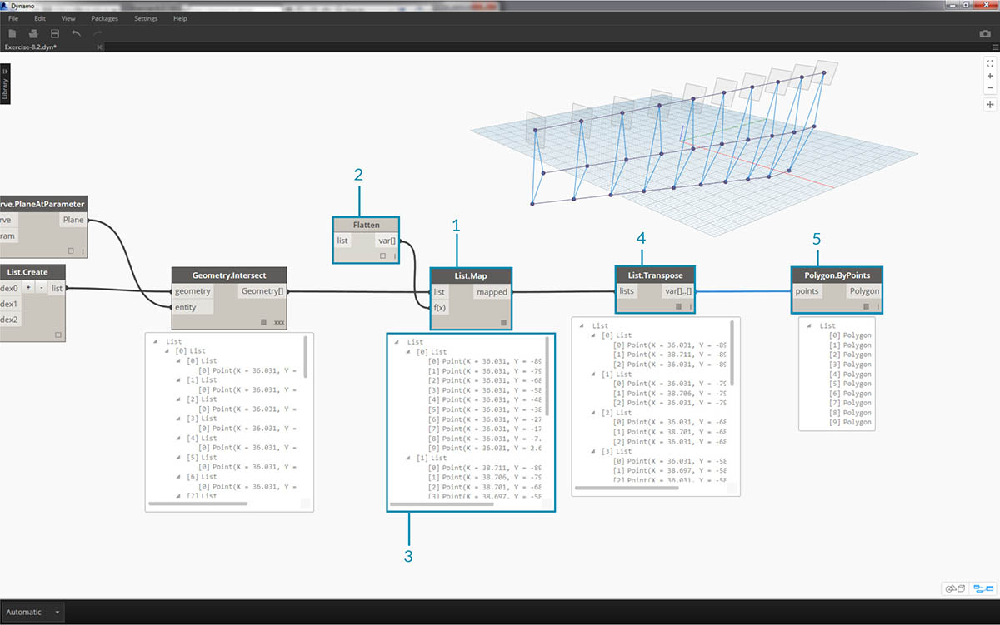

> Observe que la salida es una lista de listas de listas. Hay demasiadas listas para nuestros fines. Vamos a realizar un aplanamiento parcial aquí. Debemos bajar un nivel en la lista y aplanar el resultado. Para ello, utilizaremos la operación *List.Map*, tal y como se explica en el capítulo sobre las listas del manual de introducción.

> 1. Conecte el nodo *Geometry.Intersect* a la entrada de lista de *List.Map*.
2. Conecte un nodo *Flatten* a la entrada f(x) de *List.Map*. Los resultados proporcionan tres listas, cada uno con un número igual a la cantidad de vigas de celosía.
3. Debemos cambiar estos datos. Si desea crear una instancia de la viga de celosía, debemos utilizar el mismo número de puntos adaptativos que se ha definido en la familia. Se trata de un componente adaptativo de tres puntos, por lo que, en lugar de tres listas con 10 elementos cada una (numberOfTrusses), deseamos obtener 10 listas con tres elementos cada una. De este modo, podemos crear 10 componentes adaptativos.
4. Conecte *List.Map* a un nodo *List.Transpose*. Ahora tenemos la salida de datos deseada.
5. Para confirmar que los datos sean correctos, añada un nodo *Polygon.ByPoints* al lienzo y realice una comprobación con la vista preliminar de Dynamo.


> Del mismo modo que hemos creado los polígonos, disponemos en una matriz los componentes adaptativos.

> 1. Añada un nodo *AdaptiveComponent.ByPoints* al lienzo y conecte el nodo *List.Transpose* a la entrada *points*.
2. Mediante un nodo *Family Types*, seleccione la familia *"AdaptiveTruss"* y conecte esta a la entrada *familySymbol* del nodo *AdaptiveComponent.ByPoints*.

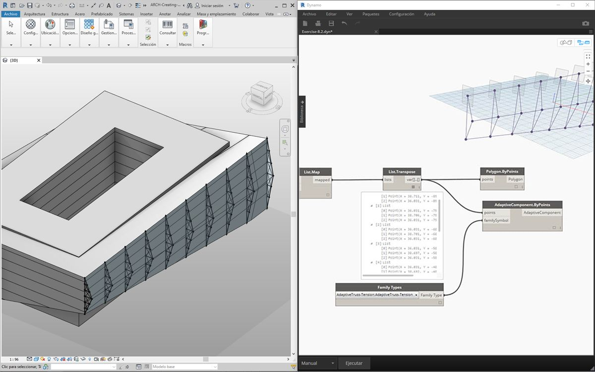

> Al realizar la comprobación en Revit, ahora las diez vigas de celosía se han espaciado uniformemente a lo largo de la fachada.

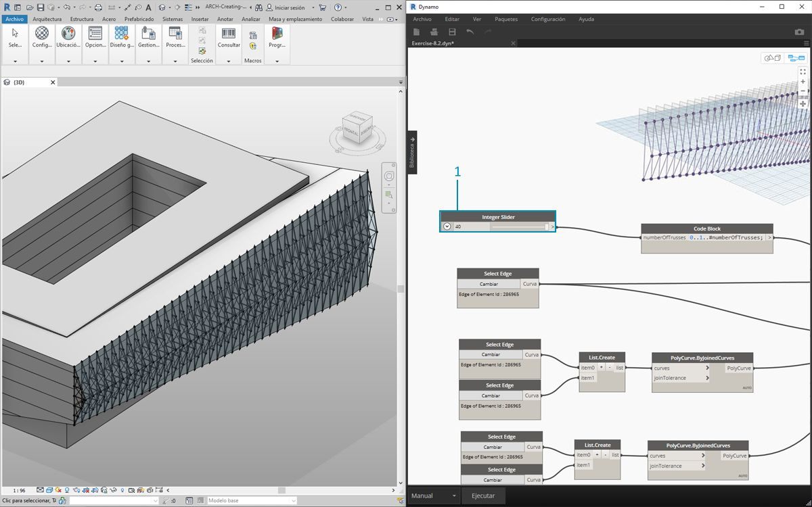

> 1. Al ajustar el gráfico, hemos aumentado el valor de *numberOfTrusses* a *40* cambiando el *control deslizante*. Muchas vigas de celosía no son muy realistas, pero el vínculo paramétrico funciona.

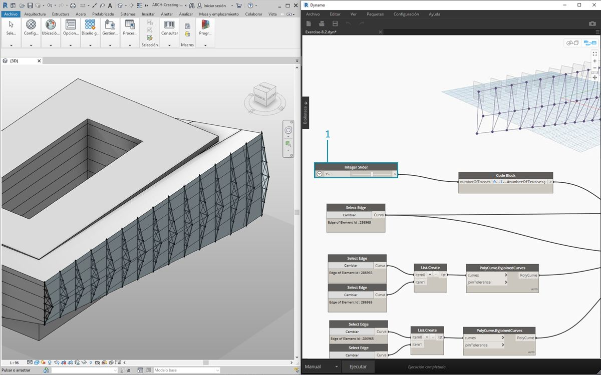

> 1. Para ajustar el sistema de vigas de celosía, asignemos el valor *15* a *numberOfTrusses*.

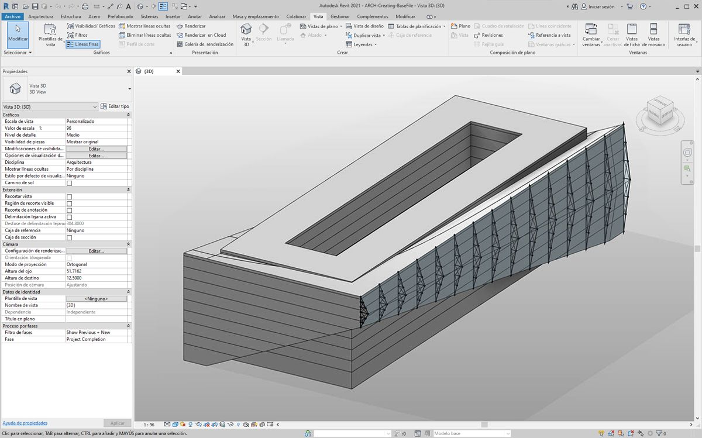

> Y, como prueba final, al seleccionar la masa en Revit y editar los parámetros de ejemplar, podemos cambiar la forma del edificio y comprobar cómo cambia también la viga de celosía. Recuerde que este gráfico de Dynamo debe estar abierto para ver esta actualización y que el vínculo se romperá en cuanto se cierre.

### Elementos DirectShape

Otro método para importar geometría paramétrica de Dynamo a Revit es DirectShape. En resumen, el elemento DirectShape y las clases relacionadas permiten almacenar formas geométricas creadas externamente en un documento de Revit. La geometría puede incluir mallas o sólidos cerrados. DirectShape se ha diseñado principalmente para la importación de formas de otros formatos de datos, como IFC o STEP, donde no hay suficiente información disponible para crear un elemento de Revit "real". Al igual que en el flujo de trabajo de IFC y STEP, la función DirectShape permite importar sin problemas geometrías creadas en Dynamo a proyectos de Revit como elementos reales.

Repasemos cómo importar geometría de Dynamo como DirectShape en el proyecto de Revit y realicemos ejercicios sobre este tema. Mediante este método, podemos asignar la categoría, el material y el nombre de una geometría importada, mientras se mantiene un vínculo paramétrico con nuestro gráfico de Dynamo.

### Ejercicio

> Descargue los archivos de ejemplo que acompañan a este ejercicio (haga clic con el botón derecho y seleccione "Guardar enlace como..."). En el Apéndice, se incluye una lista completa de los archivos de ejemplo.

> 1. [DirectShape.dyn](datasets/8-4/DirectShape.dyn)
2. [ARCH-DirectShape-BaseFile.rvt](datasets/8-4/ARCH-DirectShape-BaseFile.rvt)


> Abra primero el archivo de ejemplo para esta lección: ARCH-DirectShape-BaseFile.rvt.

> 1. En la vista 3D, vemos la masa de construcción de la lección anterior.
2. A lo largo del borde del atrio se encuentra una curva de referencia, la utilizaremos como una curva a la que haremos referencia en Dynamo.
3. A lo largo del borde opuesto del atrio se encuentra otra curva de referencia a la que también haremos referencia en Dynamo.


> 1. Para hacer referencia a la geometría en Dynamo, utilizaremos *Select Model Element* para cada miembro en Revit. Seleccione la masa en Revit e importe la geometría en Dynamo mediante *Element.Faces*: la masa debería estar visible en la vista preliminar de Dynamo.
2. Importe una curva de referencia en Dynamo mediante *Select Model Element* y *CurveElement.Curve*.
3. Importe la otra curva de referencia en Dynamo mediante *Select Model Element* y *CurveElement.Curve*.

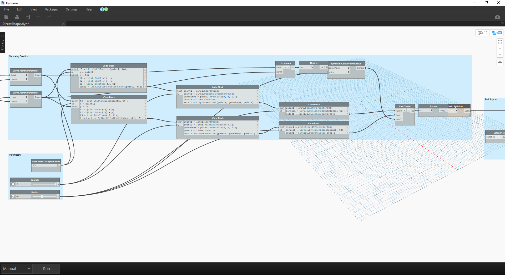

> 1. Al alejar la vista y encuadrar a la derecha en el gráfico de ejemplo, vemos un gran grupo de nodos, que son operaciones geométricas que generan la estructura de cubierta de enrejado visible en la vista preliminar de Dynamo. Estos nodos se generan mediante la función *de nodo a código*, tal como se describe en la [sección de bloque de código](../07_Code-Block/7-2_Design-Script-syntax.md#Node) del manual de introducción.
2. La estructura se rige por tres parámetros principales: Desplazamiento diagonal, Contraflecha y Radio.


> Al aplicar zoom, se obtiene una vista en primer plano de los parámetros de este gráfico. Podemos ajustarlos para obtener diferentes salidas de geometría.

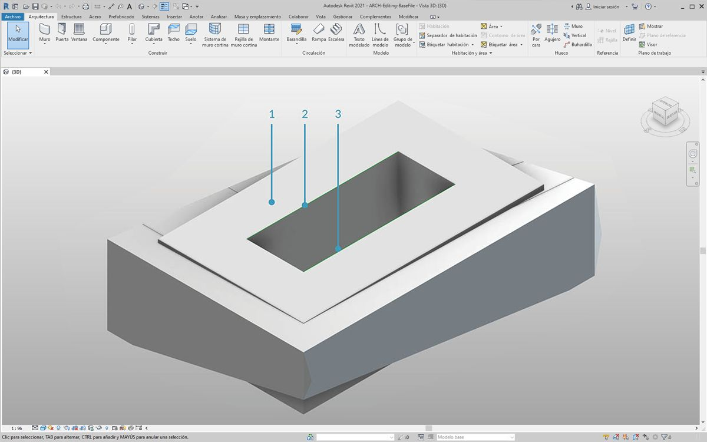

> 1. Al soltar el nodo *DirectShape.ByGeometry* en el lienzo, vemos que tiene cuatro entradas: **geometría, categoría, material** y **nombre**.
2. La geometría será el sólido creado a partir de la parte de creación de geometría del gráfico
3. La entrada de categoría se elige mediante el nodo *Categorías* del menú desplegable. En este caso, utilizaremos "Armazón estructural".
4. La entrada de material se selecciona a través de la matriz de nodos anterior, aunque puede definirse más simplemente como "Por defecto" en este caso.

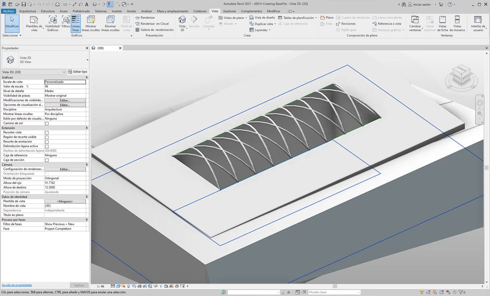

> Después de ejecutar Dynamo, al volver a Revit, tenemos la geometría importada en la cubierta del proyecto. Se trata de un elemento de armazón estructural en lugar de un modelo genérico. El vínculo paramétrico a Dynamo permanece intacto.


