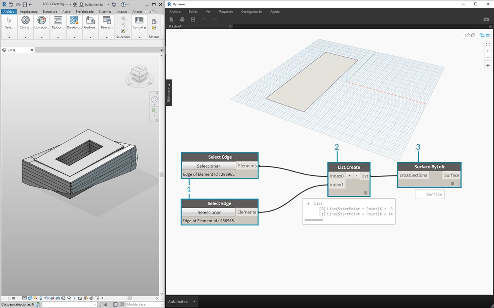
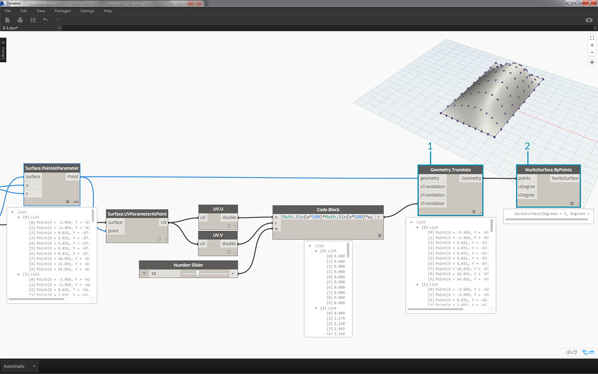
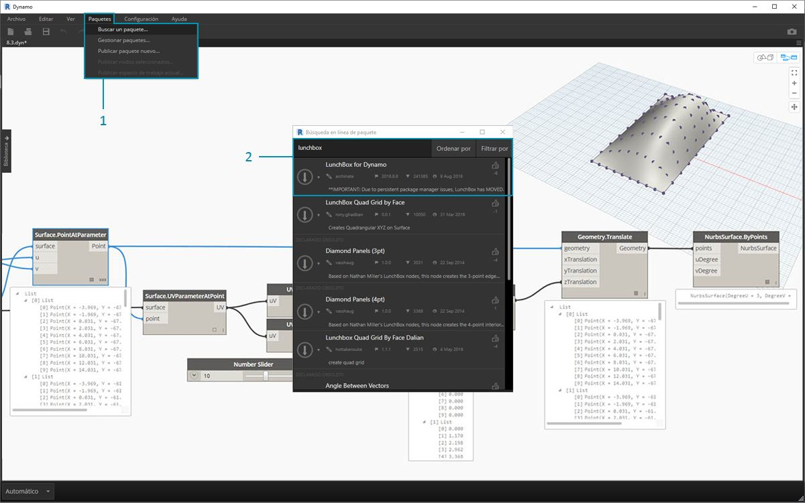
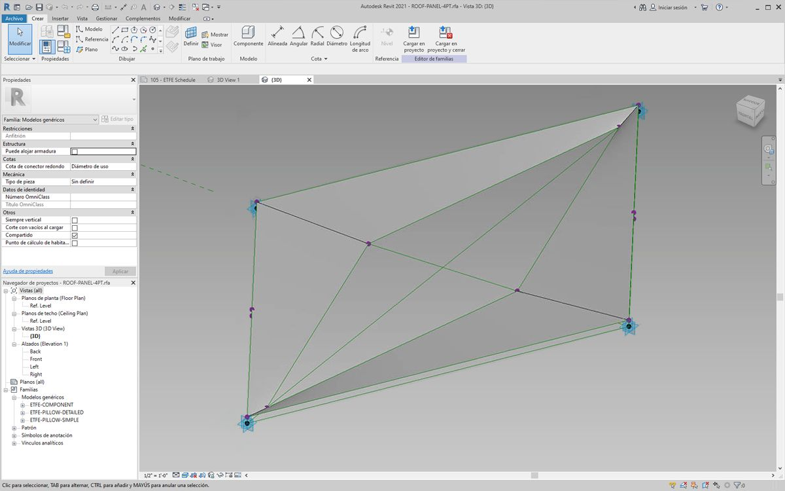
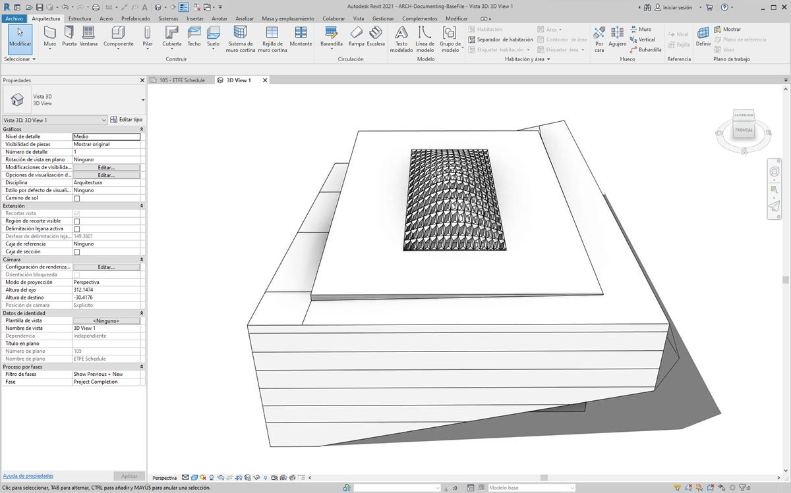
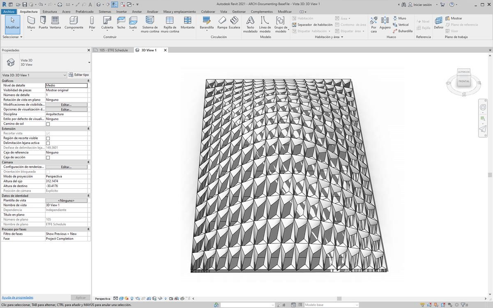
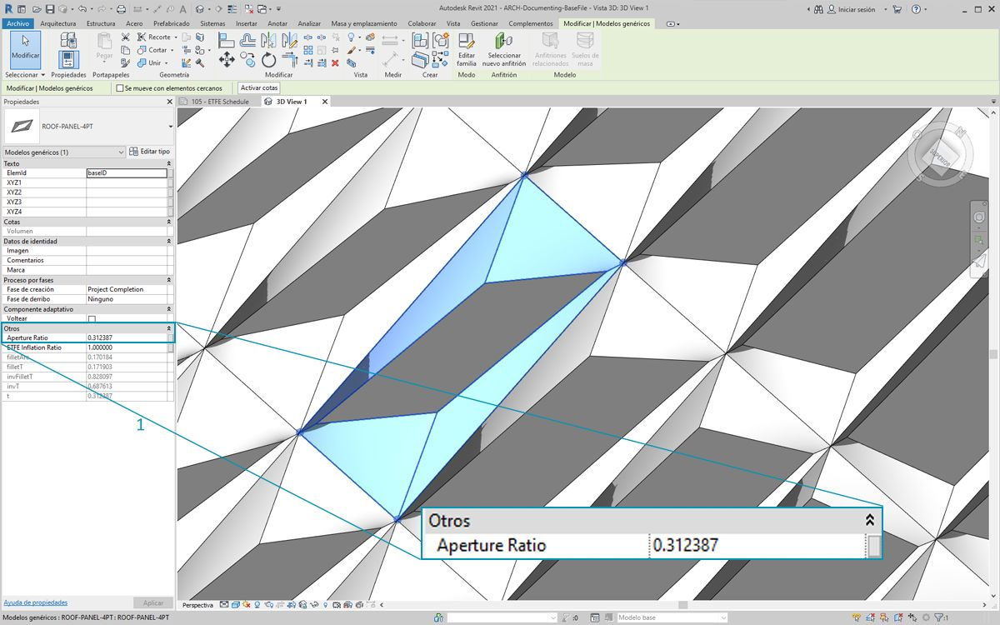
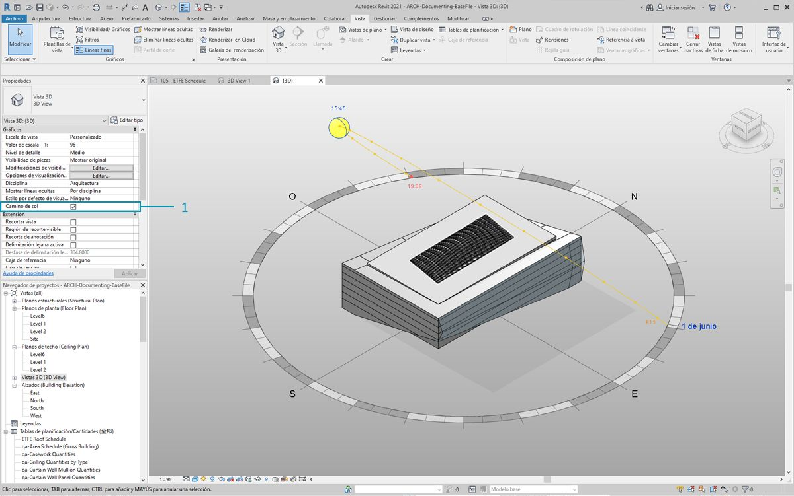
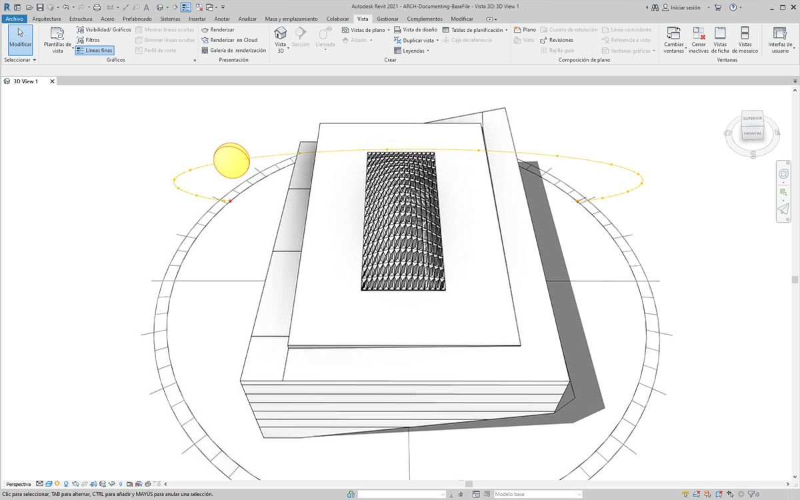

## Personalización

Aunque ya hemos visto cómo editar una masa de construcción básica, queremos profundizar en el vínculo entre Dynamo y Revit mediante la edición de un gran número de elementos de una sola vez. La personalización a gran escala se vuelve más compleja ya que las estructuras de datos requieren operaciones de lista más avanzadas. Sin embargo, los principios subyacentes de su ejecución son esencialmente los mismos. Vamos a estudiar algunas oportunidades de análisis a partir de un conjunto de componentes adaptativos.

#### Ubicación de puntos

Supongamos que hemos creado un rango de componentes adaptativos y queremos editar parámetros en función de sus ubicaciones de puntos. Los puntos podrían, por ejemplo, controlar un parámetro de grosor relacionado con el área del elemento. O bien, podrían controlar un parámetro de opacidad relacionado con la exposición solar a lo largo del año. Dynamo permite la conexión de análisis a parámetros en unos sencillos pasos; exploraremos una versión básica en el ejercicio siguiente.


> Consulte los puntos adaptativos de un componente adaptativo seleccionado mediante el nodo *AdaptiveComponent.Locations*. Esto nos permite trabajar con una versión abstraída de un elemento de Revit para el análisis.

Al extraer la ubicación de los puntos de los componentes adaptativos, se pueden ejecutar distintos análisis para ese elemento. Un componente adaptativo de cuatro puntos le permitirá estudiar la desviación desde el plano en un panel determinado, por ejemplo.

#### Análisis de orientación solar


> Utilice la reasignación para asignar un conjunto de datos a un rango de parámetros. Esta es una herramienta fundamental que se utiliza en un modelo paramétrico. Haremos una demostración en el siguiente ejercicio.

Dynamo permite usar las ubicaciones de los puntos de los componentes adaptativos para crear un plano de ajuste óptimo para cada elemento. También podemos consultar la posición del sol en el archivo de Revit y estudiar la orientación relativa del plano con respecto al sol en comparación con otros componentes adaptativos. Configuremos esta acción en el siguiente ejercicio mediante la creación de una cubierta algorítmica.

### Ejercicio:

> Descargue los archivos de ejemplo que acompañan a este ejercicio (haga clic con el botón derecho y seleccione "Guardar enlace como..."). En el Apéndice se incluye una lista completa de los archivos de ejemplo.

> 1. [Customizing.dyn](datasets/8-5/Customizing.dyn)
2. [ARCH-Customizing-BaseFile.rvt](datasets/8-5/ARCH-Customizing-BaseFile.rvt)

En este ejercicio se amplían las técnicas mostradas en la sección anterior. En este caso, vamos a definir una superficie paramétrica a partir de elementos de Revit; para ello, crearemos ejemplares de los componentes adaptativos de cuatro puntos y, a continuación, los editaremos según la orientación del sol.



> 1. Comience por seleccionar dos bordes con el nodo *"Select Edge"*. Los dos bordes son los tramos largos del atrio.
2. Combine los dos bordes en una lista con el nodo *List.Create*.
3. Cree una superficie entre los dos bordes con un nodo *Surface.ByLoft*.


> 1. Mediante el *bloque de código*, defina un rango de 0 a 1 con 10 valores espaciados uniformemente: ```0..1..#10;```
2. Conecte el *bloque de código* a las entradas *u* y *v* de un nodo *Surface.PointAtParameter* y conecte el nodo *Surface.ByLoft* a la entrada *surface*. Haga clic con el botón derecho en el nodo y cambie el *encaje* a *Producto vectorial*. Esto proporcionará una rejilla de puntos en la superficie.

Esta rejilla de puntos sirve como puntos de control para una superficie definida paramétricamente. Queremos extraer las posiciones u y v de cada uno de estos puntos para poder conectarlos a una fórmula paramétrica y mantener la misma estructura de datos. Para ello, podemos consultar las ubicaciones de parámetros de los puntos que acabamos de crear.


> 1. Añada un nodo *Surface.ParameterAtPoint* al lienzo y conecte las entradas como se muestra más arriba.
2. Consulte los valores *u* de estos parámetros con el nodo *UV.U*.
3. Consulte los valores *v* de estos parámetros con el nodo *UV.V*.
4. Las salidas muestran los valores *u* y *v* correspondientes a cada punto de la superficie. Ahora tenemos un rango de *0* a *1* para cada valor en la estructura de datos adecuada, por lo que estamos listos para aplicar un algoritmo paramétrico.


> 1. Añada un *bloque de código* al lienzo e introduzca el código: ```Math.Sin(u*180)*Math.Sin(v*180)*w;```. Esta es una función paramétrica que crea un relieve de seno a partir de una superficie plana.
2. La entrada *u* se conecta a *UV.U*.
3. La entrada *v* se conecta a *UV.V*.
4. La entrada *w* representa la *amplitud* de la forma, por lo que le conectamos un *control deslizante de número*.



> 1. Ahora tenemos una lista de valores tal y como los define el algoritmo. Usaremos esta lista de valores para mover los puntos hacia arriba en la dirección *+Z*. Con *Geometry.Translate*, conecte el *bloque de código *en *zTranslation* y el nodo *Surface.PointAtParameter* en la entrada *geometry*. Deben aparecer los nuevos puntos en la vista preliminar de Dynamo.
2. Por último, creamos una superficie con el nodo *NurbsSurface.ByPoints* y conectamos el nodo del paso anterior a la entrada points. Ya tenemos una superficie paramétrica. Puede arrastrar el control deslizante para reducir o aumentar el relieve.

Con la superficie paramétrica, vamos a definir un método para dividirla en paneles y crear la matriz de componentes adaptativos de cuatro puntos. Dynamo no dispone de funciones predefinidas para la división en paneles de las superficies, por lo que podemos buscar en la comunidad paquetes de Dynamo útiles.



> 1. Vaya a *Paquetes > Buscar un paquete...*
2. Busque *"LunchBox"* y descargue *"LunchBox for Dynamo"*. Se trata de un conjunto de herramientas muy útil para operaciones de geometría como esta.


> 1. Tras la descarga, tendrá acceso completo a la suite de LunchBox. Busque *"Quad Grid"* y seleccione *"LunchBox Quad Grid By Face"*. Conecte la superficie paramétrica a la entrada *surface* y establezca las divisiones *U* y *V* en *15*. Debe aparecer una superficie con cuatro paneles en la vista preliminar de Dynamo.


> Si tiene curiosidad sobre su configuración, puede hacer doble clic en el nodo *Lunch Box* y ver cómo se ha realizado.



> Volvamos a Revit para comprobar rápidamente el componente adaptativo que estamos utilizando aquí. No hace falta seguirlo, pero este es el panel de cubierta del que vamos a crear un ejemplar. Se trata de un componente adaptativo de cuatro puntos que es una representación en bruto de un sistema ETFE. La apertura del vacío central se encuentra en un parámetro denominado *"ApertureRatio"*.


> 1. Vamos a crear una gran cantidad de ejemplares de geometría en Revit, por lo que debe asegurarse de que el solucionador de Dynamo se encuentre en el modo *"Manual"*.
2. Añada un nodo *Family Types* al lienzo y seleccione *"ROOF-PANEL-4PT"*.
3. Añada un nodo *AdaptiveComponent.ByPoints* al lienzo, conecte *Panel Pts* de la salida de *"LunchBox Quad Grid by Face"* a la entrada *points*. Conecte el nodo *Family Types* a la entrada *familySymbol*.
4. Pulse *Ejecutar*. Revit tendrá que *pensar* un poco mientras se crea la geometría. Si tarda demasiado, reduzca el valor de *15 del bloque de código* a un número inferior. De este modo, se reduce el número de paneles de la cubierta.

*Nota: si Dynamo tarda mucho tiempo en calcular los nodos, puede usar la función "Bloquear" para poner en pausa la ejecución de operaciones de Revit mientras desarrolla el gráfico. Para obtener más información sobre el bloqueo de nodos, consulte la sección "Bloqueo" del [capítulo de sólidos](../05_Geometry-for-Computational-Design/5-6_solids.md#freezing).*



> Al volver a Revit, disponemos de la matriz de paneles en la cubierta.



> Al ampliar, podemos observar mejor las cualidades de la superficie.

### Análisis



> 1. Continuando con el ejemplo anterior, vamos a ir un paso más allá y vamos a definir la apertura de cada panel en función de su exposición al sol. Al ampliar en Revit y seleccionar un panel, vemos que hay un parámetro denominado *"Coeficiente de apertura"* en la barra de propiedades. La familia se configura para que los rangos de apertura estén comprendidos aproximadamente entre *0,05* y *0,45*.



> 1. Si se activa el camino solar, se puede ver la ubicación actual del sol en Revit.


> 1. Podemos hacer referencia a esta ubicación del sol mediante el nodo *SunSettings.Current*.
2. Conecte la configuración del sol a *Sunsetting.SunDirection* para obtener el vector solar.
3. En el elemento *Panel Pts* utilizado para crear los componentes adaptativos, utilice *Plane.ByBestFitThroughPoints* para aproximar un plano para el componente.
4. Consulte la *normal* de este plano.
5. Use el *producto escalar* para calcular la orientación solar. El producto escalar es una fórmula que determina el grado de paralelismo o antiparalelismo de dos vectores. Por tanto, tomamos la normal del plano de cada componente adaptativo y lo comparamos con el vector solar para simular aproximadamente la orientación solar.
6. Tome el *valor absoluto* del resultado. De esta forma, se garantiza que el producto escalar sea preciso si la normal del plano está orientada hacia la dirección inversa.
7. Pulse *Ejecutar*.


> 1. En el *producto escalar*, tenemos una amplia gama de números. Queremos usar su distribución relativa, pero debemos condensar los números en el rango apropiado del parámetro *"Coeficiente de apertura"* que tenemos previsto editar.
2. *Math.RemapRange* es una herramienta ideal para ello. Toma una lista de entrada y reasigna sus límites a dos valores objetivo.
3. Defina los valores objetivo en *0,15* y *0,45* en un *bloque de código*.
4. Pulse *Ejecutar*.


> 1. Conecte los valores reasignados a un nodo *Element.SetParameterByName*.
2. Conecte la cadena *"Coeficiente de apertura"* a la entrada *parameterName*.
3. Conecte los *componentes adaptativos* a la entrada de *element*.
4. Pulse *Ejecutar*.



> De vuelta en Revit, visualizamos a una distancia que nos permita determinar el efecto de la orientación solar en la apertura de los paneles ETFE.


> Al ampliar, vemos que los paneles ETFE están más cerrados cuando miran hacia el sol. Nuestro objetivo es reducir el sobrecalentamiento por la exposición solar. Si quisiéramos dejar pasar más luz en función de la exposición solar, solo tendríamos que cambiar el dominio en *Math.RemapRange*.

