## Documentación

La edición de parámetros para la documentación sigue la misma dinámica que las lecciones aprendidas en las secciones anteriores. En esta sección, vamos a ver cómo editar parámetros que no afectan a las propiedades geométricas de un elemento, sino que preparan un archivo de Revit para la documentación.

#### Desviación

En el siguiente ejercicio, utilizaremos una desviación básica del nodo del plano para crear una hoja de Revit para la documentación. Cada panel de nuestra estructura de cubierta definida paramétricamente tiene un valor diferente para la desviación, y queremos invocar el rango de valores mediante el color y la planificación de los puntos adaptativos para entregarlos a un consultor, ingeniero o contratista de fachadas.


> La desviación desde el nodo del plano calcula la distancia en que el conjunto de cuatro puntos varía con respecto al plano de ajuste óptimo entre ellos. Esta es una forma rápida y sencilla de estudiar la viabilidad de la construcción.

### Ejercicio

> Descargue los archivos de ejemplo que acompañan a este ejercicio (haga clic con el botón derecho y seleccione "Guardar enlace como..."). En el Apéndice se incluye una lista completa de los archivos de ejemplo.

> 1. [Documenting.dyn](datasets/8-6/Documenting.dyn)
2. [ARCH-Documenting-BaseFile.rvt](datasets/8-6/ARCH-Documenting-BaseFile.rvt)

Empiece con el archivo de Revit para esta sección (o continúe desde la sección anterior). Este archivo tiene una matriz de paneles ETFE en la cubierta. Haremos referencia a estos paneles en este ejercicio.


> 1. Añada un nodo *Family Types* al lienzo y seleccione *"ROOF-PANEL-4PT"*.
2. Conecte este nodo a un nodo Select *All Elements of Family Type* para obtener todos los elementos de Revit en Dynamo.


> 1. Consulte la ubicación de los puntos adaptativos de cada elemento con el nodo *AdaptiveComponent.Locations*.
2. Cree un polígono a partir de estos cuatro puntos con el nodo *Polygon.ByPoints*. Observe que ahora tenemos una versión abstracta del sistema de paneles en Dynamo sin tener que importar la geometría completa del elemento de Revit.
3. Calcule la desviación plana con el nodo *Polygon.PlaneDeviation*.


> Solo por probar, como en el ejercicio anterior, vamos a configurar el *coeficiente de apertura* de cada panel en función de su desviación plana.

> 1. Añada un nodo *Element.SetParameterByName* al lienzo y conecte los componentes adaptativos a la entrada *element*. Conecte un *bloque de código* con el texto *"Aperture Ratio"* a la entrada *parameterName*.
2. No se pueden conectar directamente los resultados de la desviación a la entrada value porque es necesario volver a asignar los valores al rango de parámetros.


> 1. Con *Math.RemapRange*, reasigne los valores de desviación a un dominio entre *0,15 *y *0,45*.
2. Conecte estos resultados a la entrada value de *Element.SetParameterByName*.

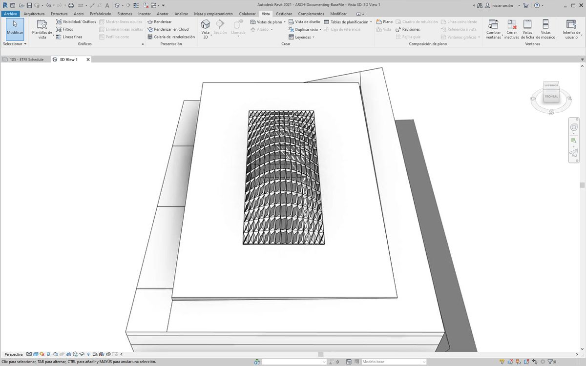

> De vuelta en Revit podemos ver *aproximadamente* el cambio en la apertura a través de la superficie.

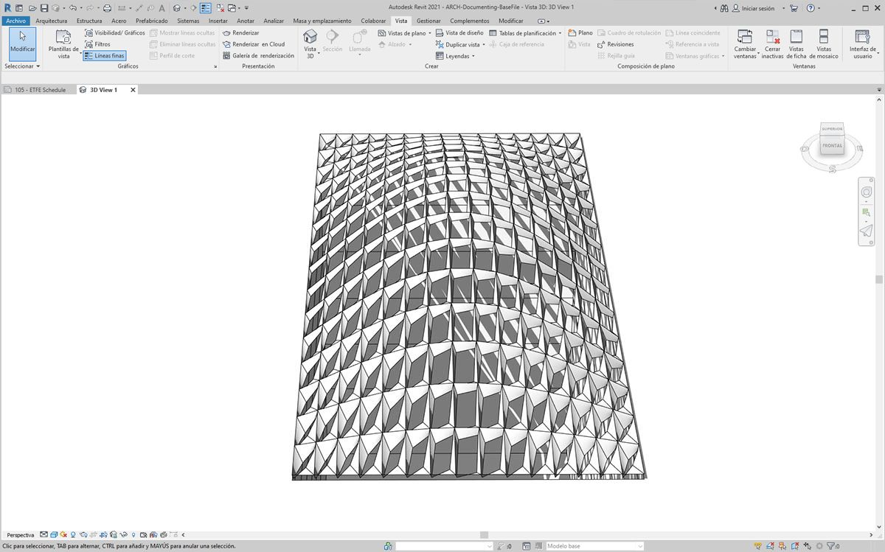

> Al ampliar, resulta más evidente que los paneles cerrados están ponderados hacia las esquinas de la superficie. Las esquinas abiertas se orientan hacia la parte superior. Las esquinas representan áreas de mayor desviación, mientras que la curvatura es mínima, lo cual tiene sentido.

### Color y documentación

La configuración de la relación de apertura no demuestra claramente la desviación de los paneles de la cubierta y, además, también se cambia la geometría del elemento real. Supongamos que solo queremos estudiar la desviación desde el punto de vista de la viabilidad de fabricación. Sería útil colorear los paneles según el rango de desviación para la documentación. Esto se puede realizar con la serie de pasos que se indican a continuación y en un proceso muy similar a los pasos anteriores.

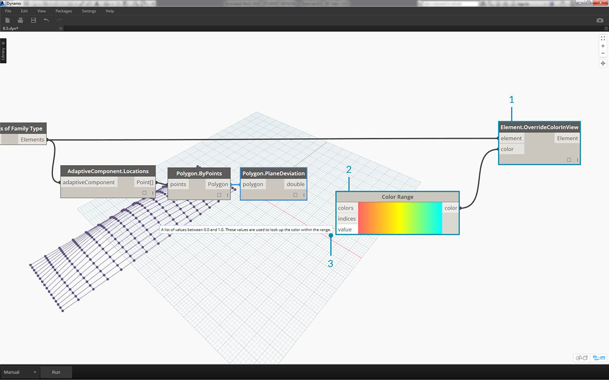

> 1. Elimine los nodos *Element.SetParameterByName* y añada *Element.OverrideColorInView*.
2. Añada un nodo *Color Range* al lienzo y conéctelo a la entrada color de *Element.OverrideColorInView*. Todavía tenemos que conectar los valores de desviación con el rango de color para crear el degradado.
3. Al pasar el ratón sobre la entrada *value*, podemos ver que los valores de la entrada deben estar entre *0* y *1* para asignar un color a cada valor. Es necesario reasignar los valores de desviación a este rango.


> 1. Mediante *Math.RemapRange*, reasigne los valores de desviación plana a un rango entre* 0* y *1* (nota: también puede utilizar el nodo *"MapTo"* para definir un dominio de origen).
2. Conecte los resultados en un nodo *Color Range*.
3. Observe que nuestra salida es un rango de colores en lugar de un rango de números.
4. Si se ha establecido la opción Manual, pulse *Ejecutar*. A partir de este momento, todo debería funcionar según lo esperado estableciendo la opción Automático.

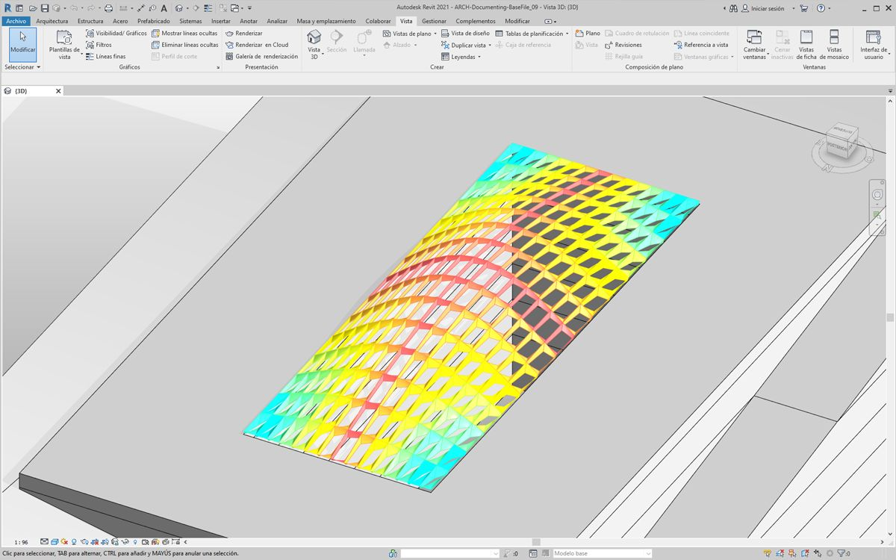

> Al regresar a Revit, vemos un degradado mucho más legible que es representativo de la desviación plana basada en nuestro rango de colores. Pero, ¿qué pasa si queremos personalizar los colores? Observe que los valores de desviación mínima se representan en rojo, que parece ser lo opuesto a lo que se esperaría. Queremos que la desviación máxima sea roja y que la desviación mínima esté representada por un color más suave. Volvamos a Dynamo y arreglemos esto.

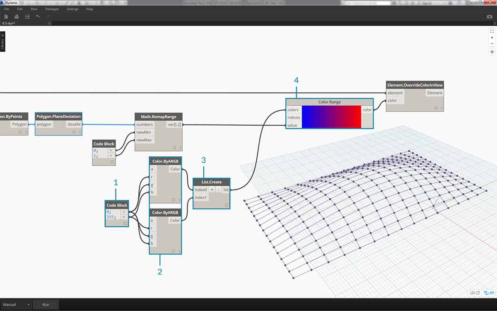

> 1. Mediante un *bloque de código*, añada dos números en dos líneas diferentes: ```0;``` y ```255;```.
2. Cree los colores rojo y azul mediante la conexión de los valores adecuados a dos nodos *Color.ByARGB*.
3. Cree una lista a partir de estos dos colores.
4. Conecte esta lista a la entrada *colors* del nodo *Color Range* y observe cómo se actualiza el rango de colores personalizado.

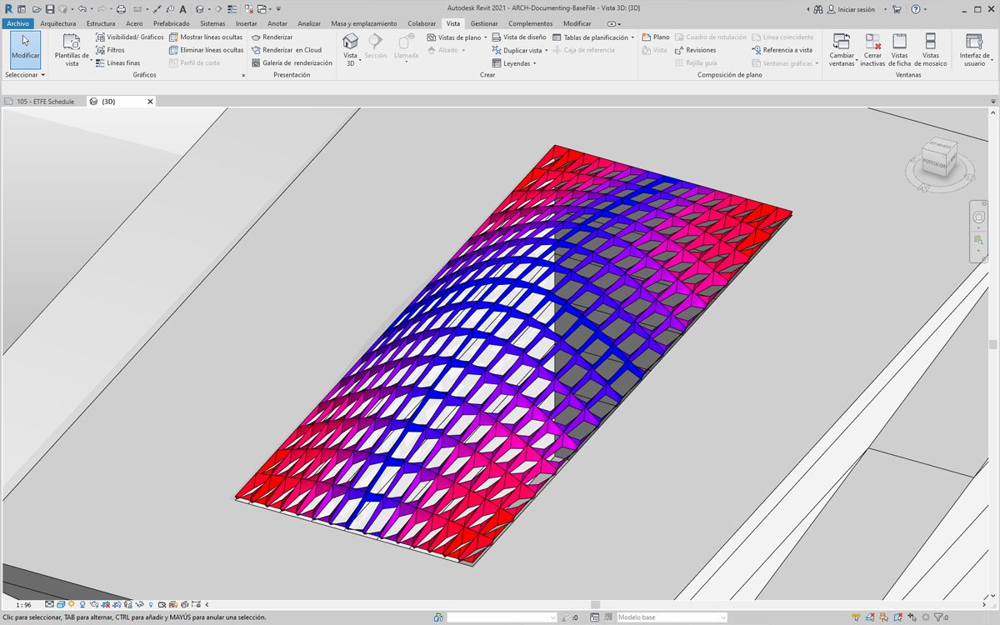

> De vuelta en Revit, ahora podemos entender mejor las áreas de máxima desviación en las esquinas. Recuerde que este nodo es para modificar un color en una vista, por lo que puede resultar muy útil si tenemos una hoja concreta en el conjunto de dibujos que se centra en un tipo de análisis concreto.

### Planificación

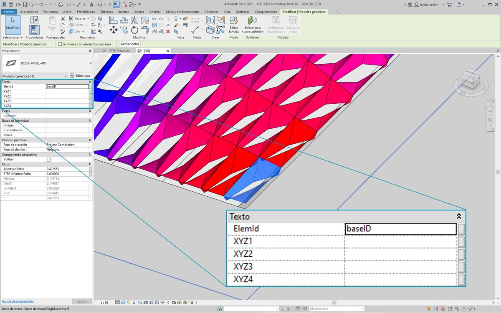

> 1. Al seleccionar un panel ETFE en Revit, vemos que hay cuatro parámetros de ejemplar: *XYZ1, XYZ2, XYZ3* y *XYZ4*. Todos están en blanco después de crearlos. Se trata de parámetros basados en texto y necesitan valores. Utilizaremos Dynamo para escribir las ubicaciones de puntos adaptativos en cada parámetro. Esto aumenta la interoperabilidad si es necesario enviar la geometría a un ingeniero o consultor de fachadas.

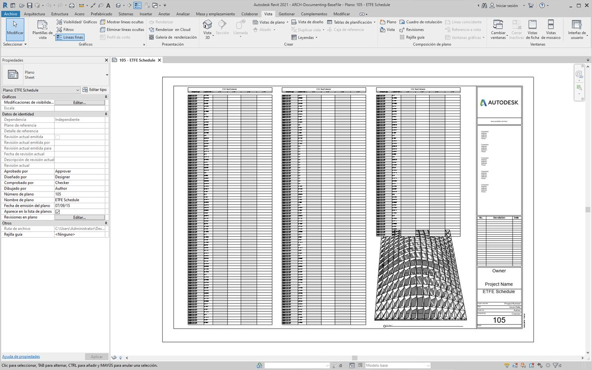

> En un plano de ejemplo, tenemos una tabla de planificación grande y vacía. Los parámetros XYZ son parámetros compartidos en el archivo de Revit, lo que nos permite añadirlos a la tabla de planificación.

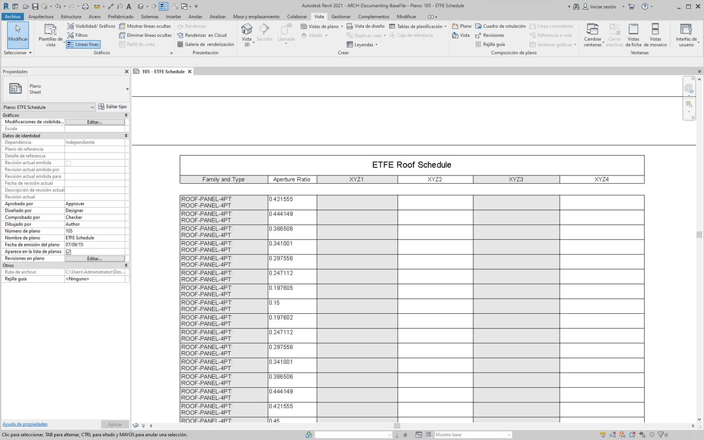

> Al ampliar, vemos que los parámetros XYZ aún no se han rellenado. Revit se ocupa de los dos primeros parámetros.


> Para escribir estos valores, realizaremos una operación de lista compleja. El gráfico en sí es sencillo, pero los conceptos se hacen más complejos a partir de la asignación de lista, como se explica en el capítulo sobre las listas.

> 1. Seleccione todos los componentes adaptativos con dos nodos.
2. Extraiga la ubicación de cada punto con *AdaptiveComponent.Locations*.
3. Convierta estos puntos en cadenas. Recuerde que el parámetro se basa en texto, por lo que es necesario introducir el tipo de datos correcto.
4. Cree una lista de las cuatro cadenas que definen los parámetros que se van a cambiar: *XYZ1, XYZ2, XYZ3* y *XYZ4*.
5. Conecte esta lista a la entrada *parameterName* de *Element.SetParameterByName*.
6. Conecte *Element.SetParameterByName* en la entrada *combinator* de *List.Combine*.
7. Conecte los *componentes adaptativos* a *list1*.
8. Conecte *String* from Object a *list2*.
9. Estamos asignando listas porque vamos a escribir cuatro valores para cada elemento, lo que crea una estructura de datos compleja. El nodo *List.Combine* define una operación un escalón más abajo en la jerarquía de datos. Por este motivo, las entradas element y value se dejan en blanco. *List.Combine* conecta las sublistas de sus entradas a las entradas vacías de *List.SetParameterByName* en función del orden en el que están conectadas.

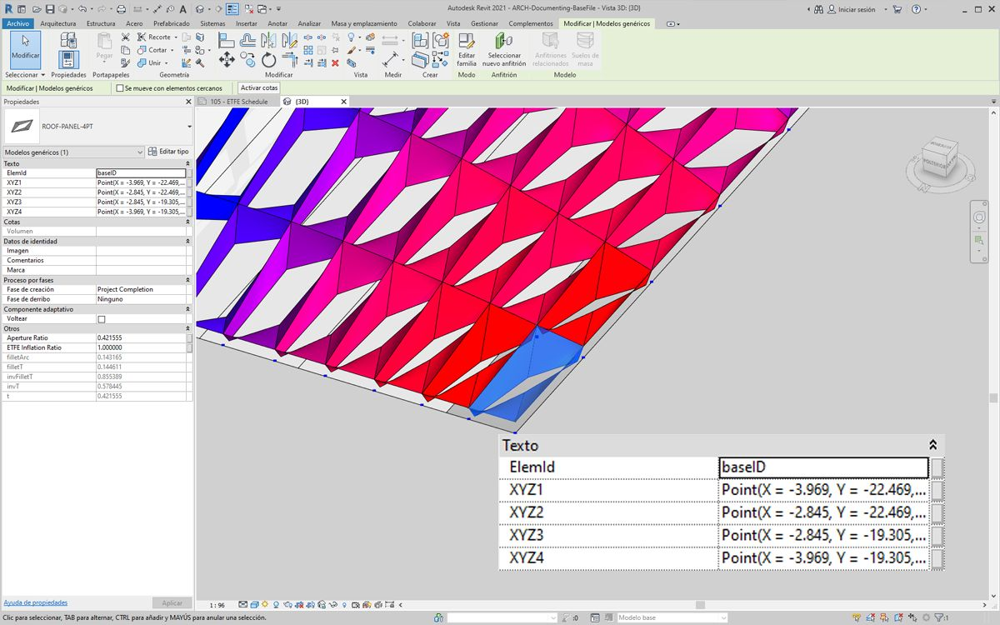

> Al seleccionar un panel en Revit, ahora vemos que hay valores de cadena para cada parámetro. En términos realistas, crearíamos un formato más sencillo para escribir un punto (X,Y,Z). Esto se puede realizar con operaciones de cadena en Dynamo, pero vamos a omitir este paso para mantenernos dentro del ámbito de este capítulo.

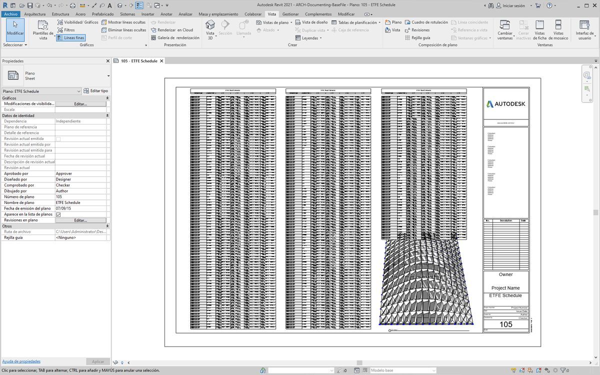

> Vista de la tabla de planificación de muestra con los parámetros completados.

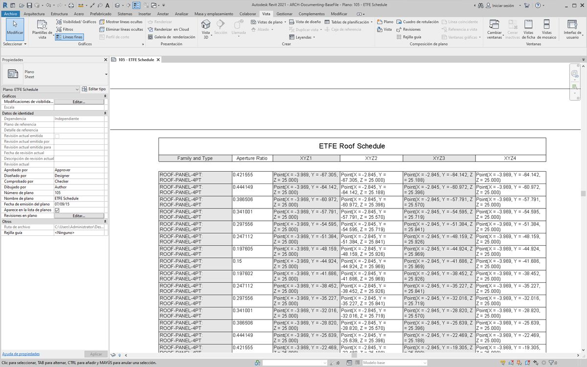

> Cada panel ETFE tiene ahora las coordenadas XYZ escritas para cada punto adaptativo, con lo que se representan las esquinas de cada panel para la fabricación.

