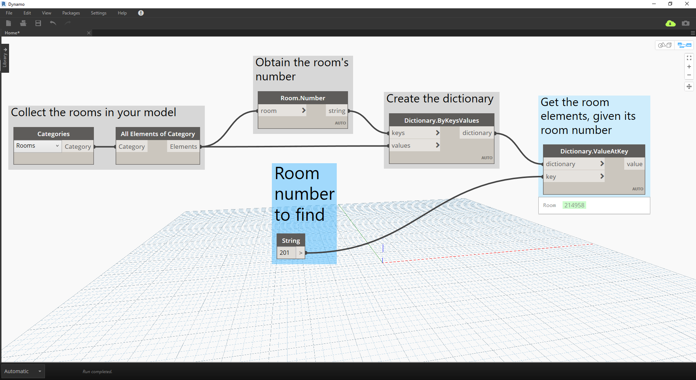

# Diccionarios: casos de uso de Revit

¿Alguna vez ha deseado buscar algo en Revit mediante un segmento de datos incluido en la solución?

#### Es probable que, si lo ha hecho, haya realizado algo así:


> En la imagen anterior, recopilamos todas las habitaciones del modelo de Revit, obtenemos el índice de la habitación que deseamos (por número de habitación) y, por último, obtenemos la habitación en el índice.

### Ahora vamos a recrear esta idea mediante diccionarios.

> Descargue el archivo de ejemplo que acompaña a este ejercicio (haga clic con el botón derecho y seleccione "Guardar enlace como..."): [RoomDictionary.dyn](datasets/9-4_roomDictionary.dyn). En el Apéndice, se incluye una lista completa de los archivos de ejemplo.

 Debemos recopilar primero todas las habitaciones de nuestro modelo de Revit.

> * Seleccionamos la categoría de Revit con la que deseamos trabajar (en este caso, trabajaremos con habitaciones).
* Le indicamos a Dynamo que recopile todos esos elementos.

 A continuación, debemos decidir las claves que vamos a utilizar para buscar estos datos. (La información sobre las claves se encuentra en la sección [9-1 ¿Qué es un diccionario?](9-1_What-is-a-dictionary,md)).

> * Los datos que usaremos son el número de habitación.

 Ahora crearemos el diccionario con las claves y los elementos especificados.

> * El nodo ```Dictionary.ByKeysValues``` creará un diccionario con las entradas correspondientes especificadas.
* Las ```claves``` deben ser una cadena, mientras que los ```valores``` pueden ser diferentes tipos de objeto.

 Por último, ahora podemos recuperar una habitación del diccionario con su número de habitación.

> * ```String``` será la clave que utilizaremos para buscar un objeto en el diccionario.
* ```Dictionary.ValueAtKey``` obtendrá ahora el objeto del diccionario.

---

### Con esta misma lógica de diccionario, también podemos crear diccionarios con objetos agrupados. Si deseamos buscar todas las habitaciones en un nivel determinado, podemos modificar el gráfico anterior de la siguiente manera.


> * En lugar de utilizar el número de habitación como clave, ahora podemos utilizar un valor de parámetro (en este caso, utilizaremos nivel).


> * Ahora podemos agrupar las habitaciones por el nivel en el que residen.


> * Con los elementos agrupados por el nivel, ahora podemos utilizar las claves compartidas (claves exclusivas) como nuestra clave para el diccionario y las listas de habitaciones como elementos.


> * Por último, mediante los niveles del modelo de Revit, podemos buscar en el diccionario las habitaciones que se encuentran en ese nivel. ```Dictionary.ValueAtKey``` utilizará el nombre de nivel y devolverá los objetos de habitación presentes en ese nivel.

Las oportunidades de uso del diccionario son realmente infinitas. La capacidad de relacionar los datos de BIM de Revit con el propio elemento plantea diversos casos de uso.

