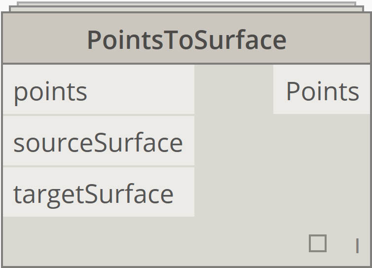
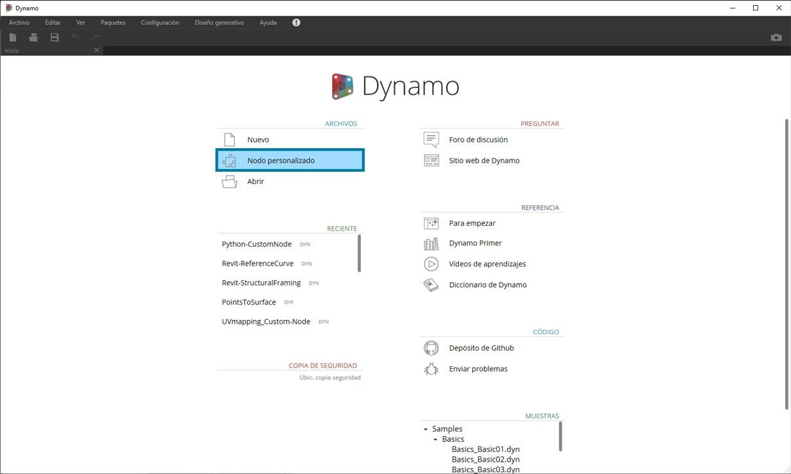
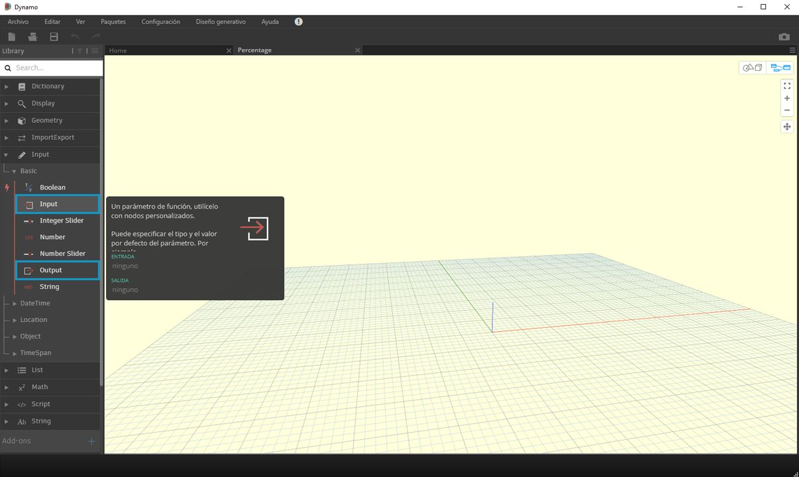
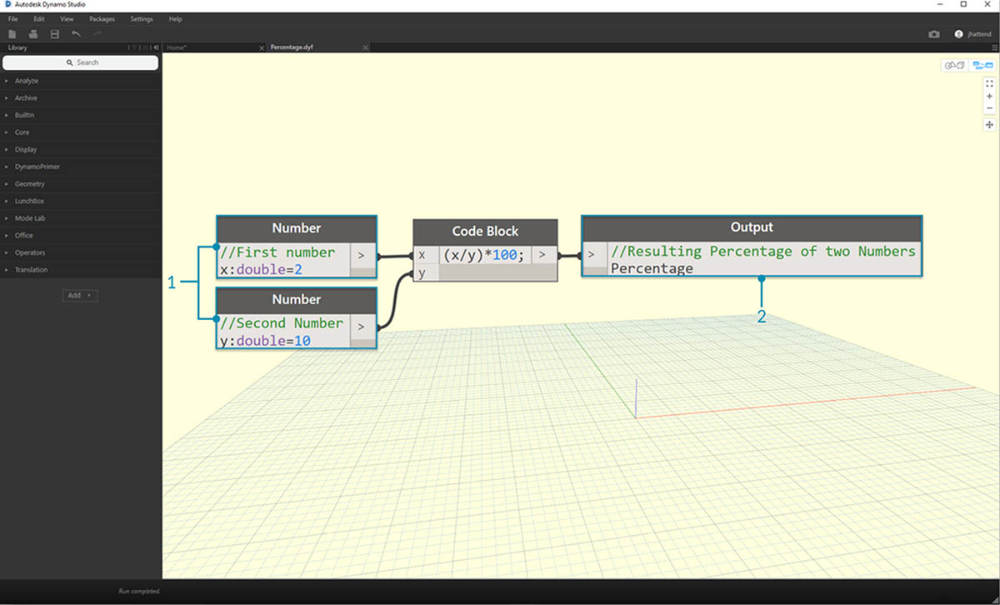

## Nodos personalizados

Dynamo ofrece muchos nodos principales para una amplia gama de tareas de programación visual. En ocasiones, una solución más rápida, elegante o fácil de compartir consiste en crear sus propios nodos. Estos se pueden reutilizar en distintos proyectos, lo que hace que el gráfico sea más claro y limpio, y se pueden transferir a Package Manager y compartir con la comunidad global de Dynamo.

### Limpieza del gráfico

Los nodos personalizados se crean mediante la anidación de otros nodos y nodos personalizados dentro de un "nodo personalizado de Dynamo", que podemos considerar conceptualmente como un contenedor. Cuando se ejecuta este nodo contenedor en el gráfico, se ejecutará todo lo que contiene para permitirle reutilizar y compartir una combinación útil de nodos.

### Adaptación a los cambios

Cuando existen varias copias de un nodo personalizado en el gráfico, puede actualizarlas todas mediante la edición del nodo personalizado base. Esto permite actualizar el gráfico sin problemas adaptándolo a los cambios que puedan producirse en el flujo de trabajo o el diseño.

### Uso compartido

Podría decirse que la mejor función de los nodos personalizados es su capacidad para compartir el trabajo. Si un "usuario avanzado" crea un gráfico complejo de Dynamo y se lo entrega a un diseñador que no esté familiarizado con esta herramienta, este puede condensar el gráfico a sus aspectos básicos para interactuar con el diseño. El nodo personalizado se puede abrir para editar el gráfico interno, pero manteniendo la simplicidad del "contenedor". Con este proceso, los nodos personalizados permiten a los usuarios de Dynamo diseñar un gráfico limpio e intuitivo.

### Muchos métodos para crear un nodo

Hay una gran variedad de métodos para crear nodos personalizados en Dynamo. En los ejemplos de este capítulo, crearemos nodos personalizados directamente desde la interfaz de usuario de Dynamo. Si es un programador y está interesado en el formato C# o Zero-Touch, puede consultar [esta página ](https://github.com/DynamoDS/Dynamo/wiki/How-To-Create-Your-Own-Nodes)en la página wiki de Dynamo para obtener una revisión más detallada.

### Entorno de nodos personalizados

Pasemos al entorno de nodos personalizados y creemos un nodo sencillo para calcular un porcentaje. El entorno de nodos personalizados es diferente al entorno de gráficos de Dynamo, pero la interacción es básicamente la misma. Una vez señalado esto, crearemos nuestro primer nodo personalizado.

> Para crear un nodo personalizado desde cero, inicie Dynamo y seleccione Nodo personalizado o pulse Ctrl + Mayús + N en el lienzo.

> Asigne un nombre, una descripción y una categoría en el cuadro de diálogo Propiedades de nodo personalizado.

> 1. **Nombre:** porcentaje.
2. **Descripción**: calcule el porcentaje de un valor en relación con otro.
3. **Categoría: **Core.Math.

> Se abre un lienzo con un fondo de color amarillo, lo que indica que está trabajando en un nodo personalizado. En este lienzo, tiene acceso a todos los nodos principales de Dynamo, así como a los nodos **Input** y **Output**, que etiquetan los datos que entran en el nodo personalizado y salen de él. Se encuentran en *Core > Entrada*.

> 1. **Entradas:** los nodos de entrada crean puertos de entrada en el nodo personalizado. La sintaxis de un nodo de entrada es *nombre_entrada: tipo_de_datos = valor_por_defecto (opcional).*

2. **Salidas:** son similares a las entradas; estas crearán puertos en el nodo personalizado y les asignarán un nombre. Considere la posibilidad de añadir un **comentario personalizado** a los puertos de entrada y salida para que se muestren como sugerencia en los tipos de entrada y salida. Esto se explica con más detalle en la sección [Creación de nodos personalizados](10-2_Creating.md).

Puede guardar este nodo personalizado como un archivo .dyf (en lugar de como un archivo .dyn estándar); este se añadirá automáticamente a la sesión actual y futuras. Encontrará el nodo personalizado en la biblioteca, en la categoría especificada en las propiedades del nodo personalizado.

> Izquierda: la categoría Core > Math de la biblioteca por defecto Derecha: 
Core > Math con el nuevo nodo personalizado

### Avancemos

Ahora que hemos creado nuestro primer nodo personalizado, las secciones siguientes profundizarán en las funciones de los nodos personalizados y en la publicación de flujos de trabajo genéricos. En la siguiente sección, estudiaremos el desarrollo de un nodo personalizado que transfiere geometría de una superficie a otra.

