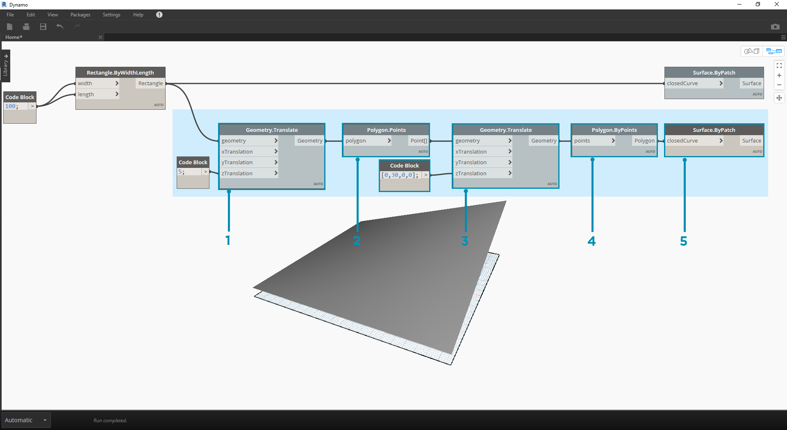
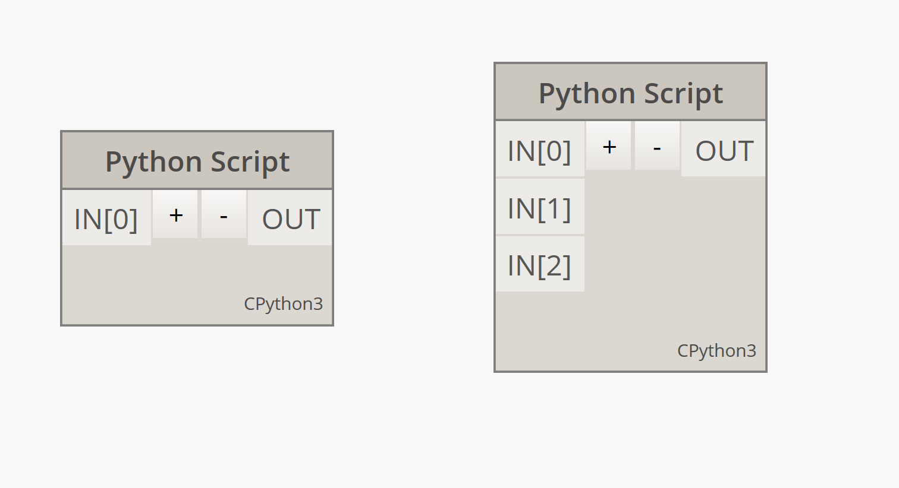
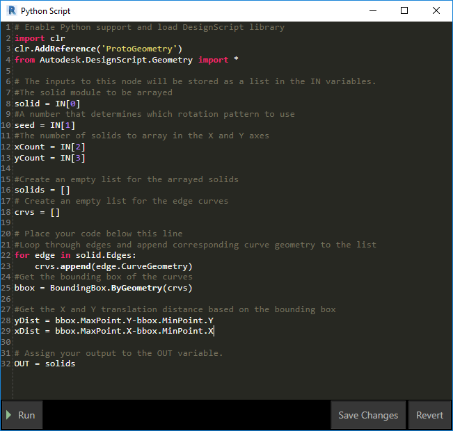
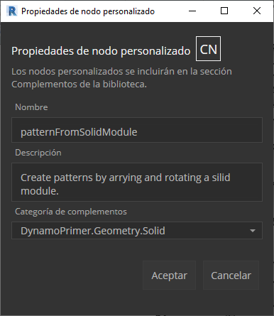

## Python

 Python es un lenguaje de programación muy utilizado cuya popularidad tiene mucho que ver con su estilo de sintaxis. Es altamente legible, lo que hace que su aprendizaje sea más sencillo que el de muchos otros idiomas. Python admite módulos y paquetes, y se puede incrustar en aplicaciones existentes. Los ejemplos de esta sección presuponen una familiaridad básica con Python. Para obtener información sobre cómo empezar a trabajar con Python, un buen recurso es la página ["Getting Started"](https://www.python.org/about/gettingstarted/) (Guía de introducción) de [Python.org](https://www.python.org/).

### Programación visual frente a textual

¿Por qué habría que utilizar la programación textual en el entorno de programación visual de Dynamo? Como hemos explicado en el capítulo 1.1, la programación visual tiene muchas ventajas. Permite crear programas sin necesidad de aprender sintaxis especial en una interfaz visual intuitiva. Sin embargo, un programa visual se puede sobrecargar y, a veces, su funcionalidad puede ser reducida. Por ejemplo, Python ofrece métodos mucho más eficaces para escribir instrucciones condicionales (si/entonces) y bucles. Python es una potente herramienta que permite ampliar las funciones de Dynamo y reemplazar muchos nodos por unas pocas líneas de código concisas.

**Programa visual:** 

**Programa textual:**

```
import clr
clr.AddReference('ProtoGeometry')
from Autodesk.DesignScript.Geometry import *

solid = IN[0]
seed = IN[1]
xCount = IN[2]
yCount = IN[3]

solids = []

yDist = solid.BoundingBox.MaxPoint.Y-solid.BoundingBox.MinPoint.Y
xDist = solid.BoundingBox.MaxPoint.X-solid.BoundingBox.MinPoint.X

for i in xRange:
for j in yRange:
fromCoord = solid.ContextCoordinateSystem
toCoord = fromCoord.Rotate(solid.ContextCoordinateSystem.Origin,Vector.ByCoordinates(0,0,1),(90*(i+j%val)))
vec = Vector.ByCoordinates((xDist*i),(yDist*j),0)
toCoord = toCoord.Translate(vec)
solids.append(solid.Transform(fromCoord,toCoord))

OUT = solids
```

### El nodo de Python

Al igual que los bloques de código, los nodos de Python son una interfaz de secuencias de comandos dentro de un entorno de programación visual. El nodo de Python se encuentra en *Core > Scripting* en la biblioteca. Al hacer doble clic en el nodo, se abre el editor de secuencias de comandos de Python (también puede hacer clic con el botón derecho en el nodo y seleccionar *Editar...*).


> Observará que aparece texto modelo en la parte superior como ayuda para hacer referencia a las bibliotecas necesarias. Las entradas se almacenan en la matriz IN. Los valores se devuelven a Dynamo asignándolos a la variable OUT.

La biblioteca Autodesk.DesignScript.Geometry permite utilizar la notación de puntos como ocurre con los bloques de código. Para obtener más información sobre la sintaxis de Dynamo, consulte el capítulo 7.2 y el [manual de DesignScript](http://dynamobim.org/wp-content/links/DesignScriptGuide.pdf). Al escribir un tipo de geometría como, por ejemplo, "Point.", se muestra una lista de métodos para crear y consultar puntos.


> Los métodos incluyen constructores como *ByCoordinates*, acciones como *Add* y consultas como las coordenadas *X*, *Y* y *Z*.

### Ejercicio

> Descargue el archivo de ejemplo que acompaña a este ejercicio (haga clic con el botón derecho y seleccione "Guardar vínculo como..."). En el Apéndice se incluye una lista completa de los archivos de ejemplo. [Python_Custom-Node.dyn](datasets/10-4/Python-CustomNode.dyn)

En este ejemplo, vamos a escribir una secuencia de comandos de Python que crea patrones a partir de un módulo sólido y lo vamos a convertir en un nodo personalizado. Primero, vamos a crear nuestro módulo sólido mediante nodos de Dynamo.


> 1. **Rectangle.ByWidthLength:** cree un rectángulo que será la base del sólido.
2. **Surface.ByPatch:** conecte el rectángulo con la entrada "*closedCurve*" para crear la superficie inferior.



> 1. **Geometry.Translate:** conecte el rectángulo a la entrada "*geometry*" para desplazarlo hacia arriba y utilice un bloque de código para especificar el grosor de base del sólido.
2. **Polygon.Points:** consulte el rectángulo trasladado para extraer los puntos de esquina.
3. **Geometry.Translate:** utilice un bloque de código para crear una lista de cuatro valores correspondientes a los cuatro puntos y traslade una esquina del sólido hacia arriba.
4. **Polygon.ByPoints:** utilice los puntos trasladados para reconstruir el polígono superior.
5. **Surface.ByPatch:** conecte el polígono para crear la superficie superior.

Ahora que tenemos las superficies superior e inferior, solevaremos los dos perfiles para crear los lados del sólido.


> 1. **List.Create:** conecte el rectángulo inferior y el polígono superior a las entradas de índice.
2. **Surface.ByLoft:** soleve los dos perfiles para crear los lados del sólido.
3. **List.Create:** conecte las superficies superior, lateral e inferior a las entradas de índice para crear una lista de superficies.
4. **Solid.ByJoinedSurfaces:** una las superficies para crear el módulo sólido.

Ahora que ya tenemos el sólido, soltaremos un nodo de secuencia de comandos de Python en el espacio de trabajo.



> Para añadir entradas adicionales al nodo, cierre el editor y haga clic en el icono + del nodo. Las entradas se denominan IN[0], IN[1], etc., para indicar que representan elementos de una lista.

Empezaremos definiendo las entradas y la salida. Haga doble clic en el nodo para abrir el editor de Python.


```
# Enable Python support and load DesignScript library
import clr
clr.AddReference('ProtoGeometry')
from Autodesk.DesignScript.Geometry import *

# The inputs to this node will be stored as a list in the IN variables.
#The solid module to be arrayed
solid = IN[0]
#A number that determines which rotation pattern to use
seed = IN[1]
#The number of solids to array in the X and Y axes
xCount = IN[2]
yCount = IN[3]

#Create an empty list for the arrayed solids
solids = []

# Place your code below this line

# Assign your output to the OUT variable.
OUT = solids
```

Este código cobrará más sentido a medida que avancemos en el ejercicio. A continuación, debemos pensar en qué información se requiere para disponer la matriz de nuestro módulo sólido. En primer lugar, es necesario conocer las dimensiones del sólido para determinar la distancia de traslación. Debido a un error del cuadro delimitador, tendremos que utilizar la geometría de curva de borde para crear un cuadro delimitador.



> Echemos un vistazo al nodo de Python en Dynamo. Observe que estamos utilizando la misma sintaxis que vemos en los títulos de los nodos de Dynamo. El código comentado se encuentra a continuación.

```
# Enable Python support and load DesignScript library
import clr
clr.AddReference('ProtoGeometry')
from Autodesk.DesignScript.Geometry import *

# The inputs to this node will be stored as a list in the IN variables.
#The solid module to be arrayed
solid = IN[0]
#A number that determines which rotation pattern to use
seed = IN[1]
#The number of solids to array in the X and Y axes
xCount = IN[2]
yCount = IN[3]

#Create an empty list for the arrayed solids
solids = []
# Create an empty list for the edge curves
crvs = []

# Place your code below this line
#Loop through edges and append corresponding curve geometry to the list
for edge in solid.Edges:
crvs.append(edge.CurveGeometry)
#Get the bounding box of the curves
bbox = BoundingBox.ByGeometry(crvs)

#Get the X and Y translation distance based on the bounding box
yDist = bbox.MaxPoint.Y-bbox.MinPoint.Y
xDist = bbox.MaxPoint.X-bbox.MinPoint.X

# Assign your output to the OUT variable.
OUT = solids
```

Ya que vamos a trasladar y girar los módulos sólidos, vamos a utilizar la operación Geometry.Transform. Al observar el nodo Geometry.Transform, vemos que vamos a necesitar un sistema de coordenadas de origen y un sistema de coordenadas de destino para transformar el sólido. El origen es el sistema de coordenadas de contexto del sólido, mientras que el destino será un sistema de coordenadas diferente para cada módulo de matriz. Esto significa que tendremos que crear un bucle a través de los valores de X e Y para transformar el sistema de coordenadas de forma diferente en cada caso.


> Echemos un vistazo al nodo de Python en Dynamo. El código comentado se encuentra a continuación.

```
# Enable Python support and load DesignScript library
import clr
clr.AddReference('ProtoGeometry')
from Autodesk.DesignScript.Geometry import *

# The inputs to this node will be stored as a list in the IN variables.
#The solid module to be arrayed
solid = IN[0]
#A number that determines which rotation pattern to use
seed = IN[1]
#The number of solids to array in the X and Y axes
xCount = IN[2]
yCount = IN[3]

#Create an empty list for the arrayed solids
solids = []
# Create an empty list for the edge curves
crvs = []

# Place your code below this line
#Loop through edges and append corresponding curve geometry to the list
for edge in solid.Edges:
crvs.append(edge.CurveGeometry)
#Get the bounding box of the curves
bbox = BoundingBox.ByGeometry(crvs)

#Get the X and Y translation distance based on the bounding box
yDist = bbox.MaxPoint.Y-bbox.MinPoint.Y
xDist = bbox.MaxPoint.X-bbox.MinPoint.X
#get the source coordinate system
fromCoord = solid.ContextCoordinateSystem

#Loop through X and Y
for i in range(xCount):
for j in range(yCount):
#Rotate and translate the coordinate system
toCoord = fromCoord.Rotate(solid.ContextCoordinateSystem.Origin,Vector.ByCoordinates(0,0,1),(90*(i+j%seed)))
vec = Vector.ByCoordinates((xDist*i),(yDist*j),0)
toCoord = toCoord.Translate(vec)
#Transform the solid from the source coord system to the target coord system and append to the list
solids.append(solid.Transform(fromCoord,toCoord))

# Assign your output to the OUT variable.
OUT = solids
```


> Si hace clic en Ejecutar en el nodo de Python, se ejecutará el código.


> Pruebe a cambiar el valor de semilla para crear patrones diferentes. También puede cambiar los parámetros del módulo sólido para obtener distintos efectos. En Dynamo 2.0, puede simplemente cambiar la semilla y hacer clic en Ejecutar sin cerrar la ventana de Python.

Ahora que hemos creado una secuencia de comandos de Python útil, vamos a guardarla como un nodo personalizado. Seleccione el nodo de secuencia de comandos de Python, haga clic con el botón derecho sobre el mismo y seleccione "Nuevo nodo a partir de selección".



> Asigne un nombre, una descripción y una categoría.

Se abrirá un nuevo espacio de trabajo en el que se puede editar el nodo personalizado.


> 1. **Inputs:** cambie los nombres de las entradas para que sean más descriptivos y añada tipos de datos y valores por defecto.
2. **Output:** cambie el nombre de la salida y guarde el nodo como un archivo .dyf.


> El nodo personalizado refleja los cambios que acabamos de realizar.

