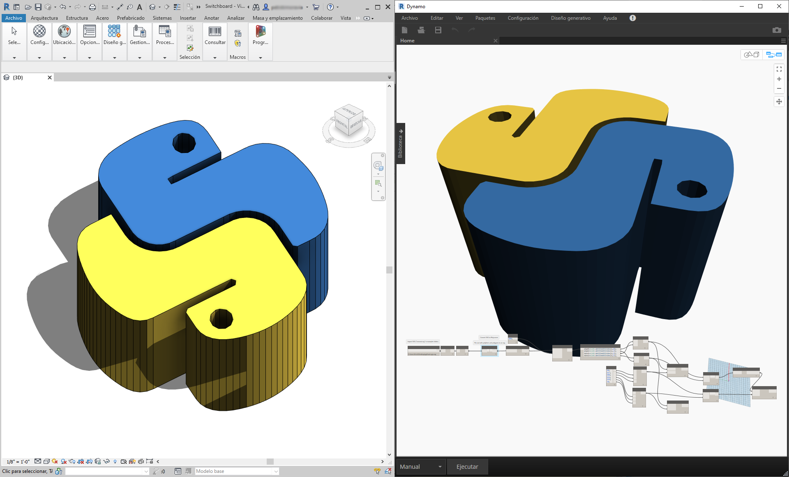
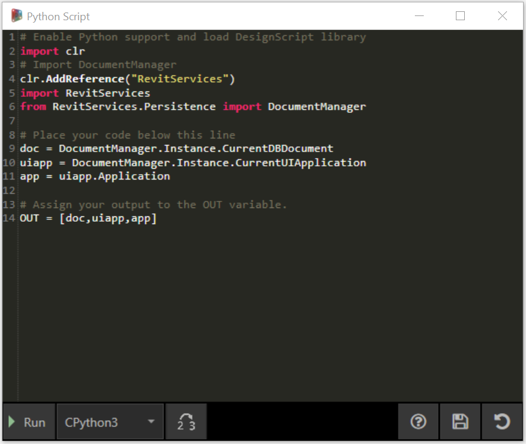
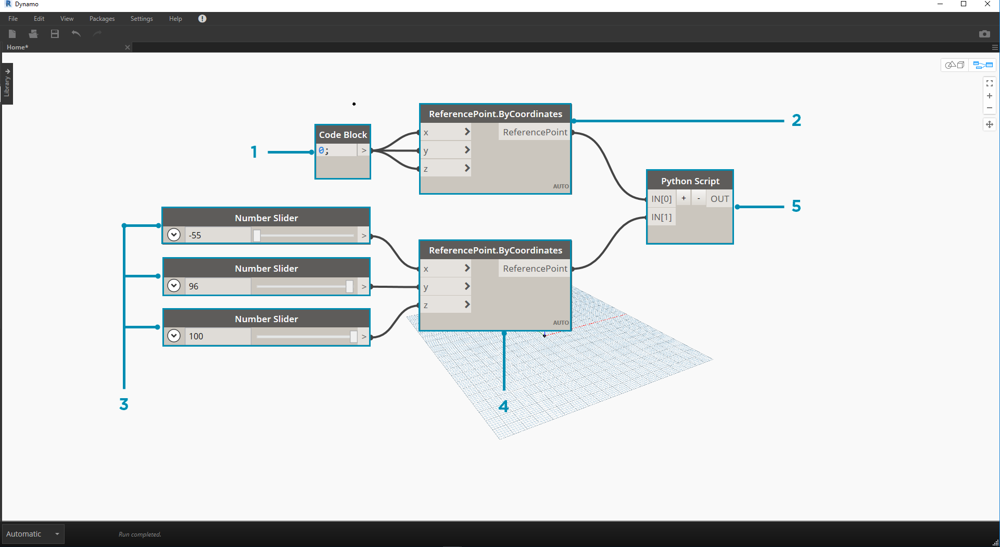
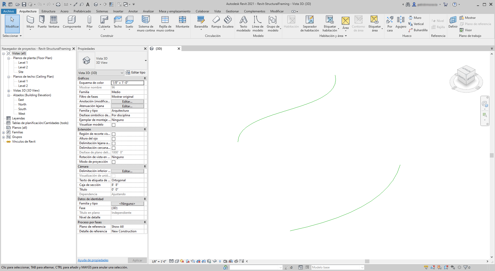
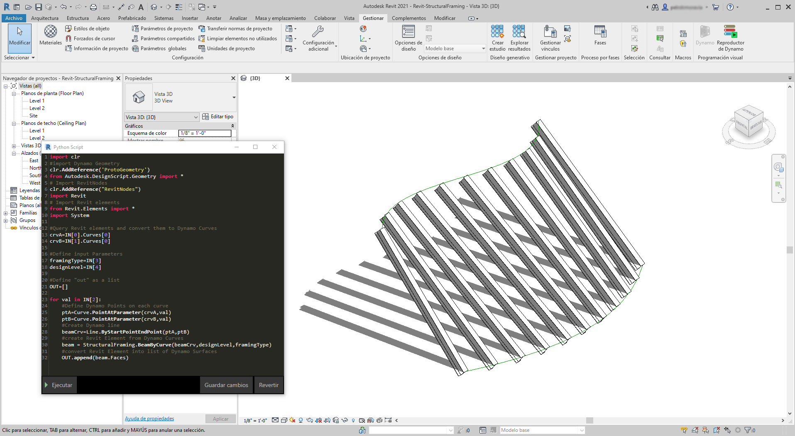

## Python y Revit

Ahora que hemos mostrado cómo utilizar las secuencias de comandos de Python en Dynamo, vamos a echar un vistazo a la conexión de bibliotecas de Revit en el entorno de secuencias de comandos. Recuerde que hemos importado nuestros nodos centrales de Dynamo con las tres primeras líneas del bloque de código que aparece más abajo. Para importar los nodos de Revit, los elementos de Revit y el administrador de documentos de Revit, solo hemos de añadir algunas líneas adicionales:

```
import clr
clr.AddReference('ProtoGeometry')
from Autodesk.DesignScript.Geometry import *

# Import RevitNodes
clr.AddReference("RevitNodes")
import Revit

# Import Revit elements
from Revit.Elements import *

# Import DocumentManager
clr.AddReference("RevitServices")
import RevitServices
from RevitServices.Persistence import DocumentManager

import System
```

Esto nos permite acceder a la API de Revit y disponer de secuencias de comandos personalizadas para cualquier tarea de Revit. La combinación del proceso de programación visual con las secuencias de comandos de la API de Revit, mejora significativamente la colaboración y el desarrollo de herramientas. Por ejemplo, un administrador de BIM y un diseñador de esquemas pueden trabajar juntos en el mismo gráfico. En esta colaboración, pueden mejorar el diseño y la ejecución del modelo.



### API específicas de plataforma

El plan tras el proyecto de Dynamo es ampliar el alcance de la implementación de plataformas. A medida que Dynamo añada más programas a la lista, los usuarios obtendrán acceso a las API específicas de plataforma desde el entorno de secuencias de comandos de Python. Aunque Revit representa el caso real de esta sección, podemos prever más capítulos en el futuro que ofrecerán módulos de aprendizaje completos sobre secuencias de comandos en otras plataformas. Además, hay muchas bibliotecas de [IronPython](http://ironpython.net/) a las que se puede acceder ahora y que se pueden importar a Dynamo.

Los ejemplos siguientes muestran métodos para implementar operaciones específicas de Revit desde Dynamo mediante el uso de Python. Para obtener una descripción más detallada de la relación de Python con Dynamo y Revit, consulte la [página wiki de Dynamo](https://github.com/DynamoDS/Dynamo/wiki/Python-0.6.3-to-0.7.x-Migration). Otro recurso útil para Python y Revit es el proyecto [Revit Python Shell](https://github.com/architecture-building-systems/revitpythonshell).

### Ejercicio 01

> Cree un nuevo proyecto de Revit. Descargue el archivo de ejemplo que acompaña a este ejercicio (haga clic con el botón derecho y seleccione "Guardar enlace como..."). En el Apéndice se incluye una lista completa de los archivos de ejemplo. [Revit-Doc.dyn](datasets/10-5/Revit-Doc.dyn)

En estos ejercicios, vamos a explorar secuencias de comandos básicas de Python en Dynamo for Revit. El ejercicio se centrará en el uso de los archivos y elementos de Revit, así como en la comunicación entre Revit y Dynamo.


> Este es un método sencillo para recuperar los elementos *doc*, *uiapp* y *app* del archivo de Revit vinculado a la sesión de Dynamo. Es posible que los programadores que hayan trabajado antes en la API de Revit reconozcan los elementos de la lista de inspección. Si estos elementos no le resultan familiares, no hay problema; vamos a usar otros ejemplos en los ejercicios siguientes.

A continuación se indica cómo vamos a importar los servicios de Revit y recuperar los datos del documento en Dynamo: 

> Echemos un vistazo al nodo de Python en Dynamo. El código comentado se encuentra a continuación.

```
# Enable Python support and load DesignScript library
import clr
# Import DocumentManager
clr.AddReference("RevitServices")
import RevitServices
from RevitServices.Persistence import DocumentManager

# Place your code below this line
doc = DocumentManager.Instance.CurrentDBDocument
uiapp = DocumentManager.Instance.CurrentUIApplication
app = uiapp.Application

# Assign your output to the OUT variable.
OUT = [doc,uiapp,app]
```

### Ejercicio 02

> Descargue los archivos de ejemplo que acompañan a este ejercicio (haga clic con el botón derecho y seleccione "Guardar enlace como..."). En el Apéndice se incluye una lista completa de los archivos de ejemplo. [Revit-ReferenceCurve.dyn](datasets/10-5/Revit-ReferenceCurve.dyn)

En este ejercicio, crearemos una curva de modelo simple en Revit mediante el nodo de Dynamo Python.



> Comience con el conjunto de nodos de la imagen anterior. Primero crearemos dos puntos de referencia en Revit a partir de los nodos de Dynamo.

> Empiece creando una nueva familia de masas conceptuales en Revit. Inicie Dynamo y cree el conjunto de nodos de la imagen anterior. Primero crearemos dos puntos de referencia en Revit a partir de los nodos de Dynamo.

> 1. Cree un bloque de código y asígnele un valor de "0;".
2. Conecte este valor a un nodo ReferencePoint.ByCoordinates para las entradas X, Y y Z.
3. Cree tres controles deslizantes que vayan de -100 a 100 con un tamaño de paso de 1.
4. Conecte cada control deslizante a un nodo ReferencePoint.ByCoordinates.
5. Añada un nodo de Python al espacio de trabajo, haga clic en el botón "+" del nodo para añadir otra entrada y conecte los dos puntos de referencia en cada entrada. Abra el nodo de Python.


> Echemos un vistazo al nodo de Python en Dynamo. El código comentado se encuentra a continuación.

> 1. **System.Array:** Revit necesita una matriz del sistema como entrada (en lugar de una lista de Python). Esta es solo una línea de código más, pero prestar atención a los tipos de argumentos facilitará la programación de Python en Revit.

```
import clr

# Import RevitNodes
clr.AddReference("RevitNodes")
import Revit
# Import Revit elements
from Revit.Elements import *
import System

#define inputs
startRefPt = IN[0]
endRefPt = IN[1]

#define system array to match with required inputs
refPtArray = System.Array[ReferencePoint]([startRefPt, endRefPt])
#create curve by reference points in Revit
OUT = CurveByPoints.ByReferencePoints(refPtArray)
```


> Desde Dynamo, hemos creado dos puntos de referencia con una línea que los conecta mediante Python. Vamos a ir un poco más lejos en el siguiente ejercicio.

### Ejercicio 03

> Descargue y descomprima los archivos de ejemplo que acompañan a este ejercicio (haga clic con el botón derecho y seleccione "Guardar enlace como..."). En el Apéndice se incluye una lista completa de los archivos de ejemplo. [Revit-StructuralFraming.zip](datasets/10-5/Revit-StructuralFraming.zip)

> Este es un ejercicio sencillo, pero hace hincapié en la conexión de los datos y la geometría de Revit con Dynamo y viceversa. Comencemos abriendo Revit-StructuralFraming.rvt. Una vez abierto, cargue Dynamo y abra el archivo Revit-StructuralFraming.dyn.



> Este archivo de Revit es totalmente básico. Dos curvas de referencia: una dibujada en el nivel 1 y la otra dibujada en el nivel 2. Queremos llevar estas curvas a Dynamo y mantener una conexión activa.


> En este archivo, tenemos un conjunto de nodos conectados a cinco entradas de un nodo de Python.

> 1. **Nodos Select Model Element:** pulse el botón de selección para cada uno de ellos y seleccione la curva correspondiente en Revit.
2. **Code Block:** mediante la sintaxis *"0..1..#x;"*, conecte un control deslizante de enteros que abarque de 0 a 20 en la entrada *x*. De este modo, se designa el número de vigas que se dibujarán entre las dos curvas.
3. **Structural Framing Types:** en el menú desplegable, elija la viga por defecto W12x26.
4. **Levels:** seleccione "Level 1".


> Este código de Python es un poco más denso, pero los comentarios del código describen lo que sucede en el proceso:

```
import clr
#import Dynamo Geometry
clr.AddReference('ProtoGeometry')
from Autodesk.DesignScript.Geometry import *
# Import RevitNodes
clr.AddReference("RevitNodes")
import Revit
# Import Revit elements
from Revit.Elements import *
import System

#Query Revit elements and convert them to Dynamo Curves
crvA=IN[0].Curves[0]
crvB=IN[1].Curves[0]

#Define input Parameters
framingType=IN[3]
designLevel=IN[4]

#Define "out" as a list
OUT=[]

for val in IN[2]:
#Define Dynamo Points on each curve
ptA=Curve.PointAtParameter(crvA,val)
ptB=Curve.PointAtParameter(crvB,val)
#Create Dynamo line
beamCrv=Line.ByStartPointEndPoint(ptA,ptB)
#create Revit Element from Dynamo Curves
beam = StructuralFraming.BeamByCurve(beamCrv,designLevel,framingType)
#convert Revit Element into list of Dynamo Surfaces
OUT.append(beam.Faces)
```



> En Revit, tenemos una matriz de vigas que abarca las dos curvas como elementos estructurales. Nota: este no es un ejemplo realista; los elementos estructurales se utilizan como ejemplo de ejemplares nativos de Revit creados a partir de Dynamo.  En Dynamo, también podemos ver los resultados. Las vigas del nodo Watch3D hacen referencia a la geometría consultada desde los elementos de Revit.

Observe que existe un proceso continuo de traslación de datos del entorno de Revit al entorno de Dynamo. En resumen, así es como se desarrolla el proceso:

1. Se selecciona el elemento de Revit.
2. Se convierte el elemento de Revit en curva de Dynamo.
3. Se divide la curva de Dynamo en una serie de puntos de Dynamo.
4. Se utilizan los puntos de Dynamo entre dos curvas para crear líneas de Dynamo.
5. Se crean vigas de Revit mediante referencias a líneas de Dynamo.
6. Se generan superficies de Dynamo mediante una consulta sobre la geometría de las vigas de Revit.

Esto puede parecer un poco pesado, pero la secuencia de comandos hace que sea tan sencillo como editar la curva en Revit y volver a ejecutar el solucionador (aunque es posible que deba suprimir las vigas anteriores al hacerlo). *Esto se debe al hecho de que hemos colocado vigas en Python, lo que rompe la asociación que tienen los nodos OOTB.*


> Con una actualización de las curvas de referencia de Revit, obtenemos una nueva matriz de vigas.

