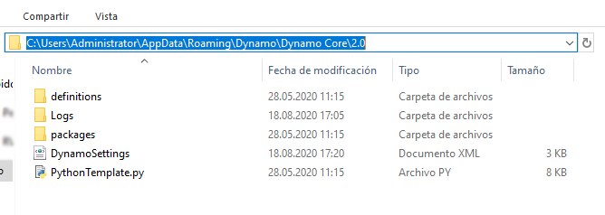

## Plantillas de Python

Con Dynamo 2.0, podemos especificar una plantilla por defecto ```(extensión .py)``` para utilizarla al abrir la ventana de Python por primera vez. Esta ha sido una petición deseada durante mucho tiempo, ya que agiliza el uso de Python en Dynamo. La capacidad de utilizar una plantilla nos permite disponer de importaciones por defecto listas para usar cuando deseamos desarrollar una secuencia de comandos de Python personalizada.

Esta plantilla se encuentra en la ubicación ```APPDATA``` de la instalación de Dynamo.

Por lo general, es la siguiente: ```( %appdata%\Dynamo\Dynamo Core\{versión}\ )```.



### Configuración de la plantilla

Para utilizar esta función, debemos añadir la siguiente línea en el archivo ```DynamoSettings.xml```. *(Edítelo en el Bloc de notas)*.


Cuando aparece ```<PythonTemplateFilePath />```, solo tenemos que sustituir esto por lo siguiente:

```
<PythonTemplateFilePath>
<string>C:\Users\CURRENTUSER\AppData\Roaming\Dynamo\Dynamo Core\2.0\PythonTemplate.py</string>
</PythonTemplateFilePath>
```

*Nota: sustituya CURRENTUSER por su nombre de usuario*.

A continuación, debemos crear una plantilla con la funcionalidad integrada que deseamos utilizar. En este caso, insertaremos las importaciones relacionadas con Revit y algunos de los demás elementos habituales al trabajar con Revit.

Puede iniciar un documento del Bloc de notas en blanco y pegar el siguiente código:

```
import clr

clr.AddReference('RevitAPI')
from Autodesk.Revit.DB import *
from Autodesk.Revit.DB.Structure import *

clr.AddReference('RevitAPIUI')
from Autodesk.Revit.UI import *

clr.AddReference('System')
from System.Collections.Generic import List

clr.AddReference('RevitNodes')
import Revit
clr.ImportExtensions(Revit.GeometryConversion)
clr.ImportExtensions(Revit.Elements)

clr.AddReference('RevitServices')
import RevitServices
from RevitServices.Persistence import DocumentManager
from RevitServices.Transactions import TransactionManager

doc = DocumentManager.Instance.CurrentDBDocument
uidoc=DocumentManager.Instance.CurrentUIApplication.ActiveUIDocument

#Preparing input from dynamo to revit
element = UnwrapElement(IN[0])

#Do some action in a Transaction
TransactionManager.Instance.EnsureInTransaction(doc)

TransactionManager.Instance.TransactionTaskDone()

OUT = element
```

Una vez hecho esto, guarde este archivo como ```PythonTemplate.py``` en la ubicación ```APPDATA```.

### Comportamiento posterior de la secuencia de comandos de Python

Una vez que se haya definido la plantilla de Python, Dynamo la buscará cada vez que se coloque un nodo de Python. Si no se encuentra, se mostrará la ventana de Python por defecto.


Si se encuentra la plantilla de Python (como, por ejemplo, nuestra plantilla de Revit), aparecerán todos los elementos por defecto integrados.


Aquí encontrará información adicional (de Radu Gidei) sobre esta excelente incorporación. [https://github.com/DynamoDS/Dynamo/pull/8122](https://github.com/DynamoDS/Dynamo/pull/8122)

