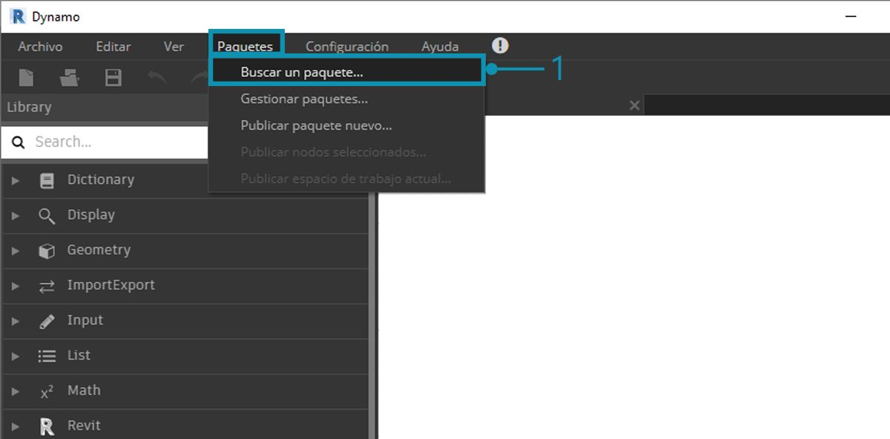
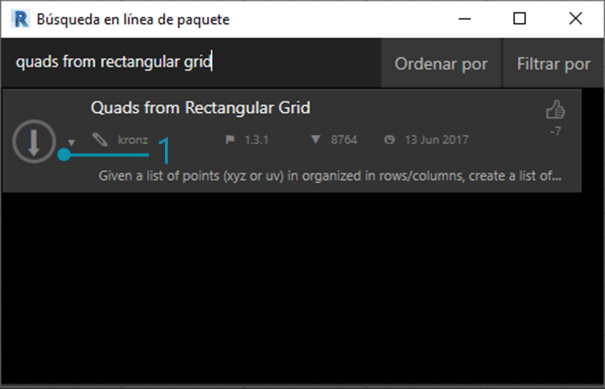
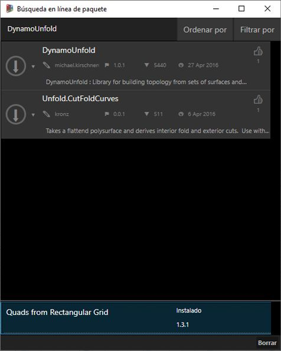
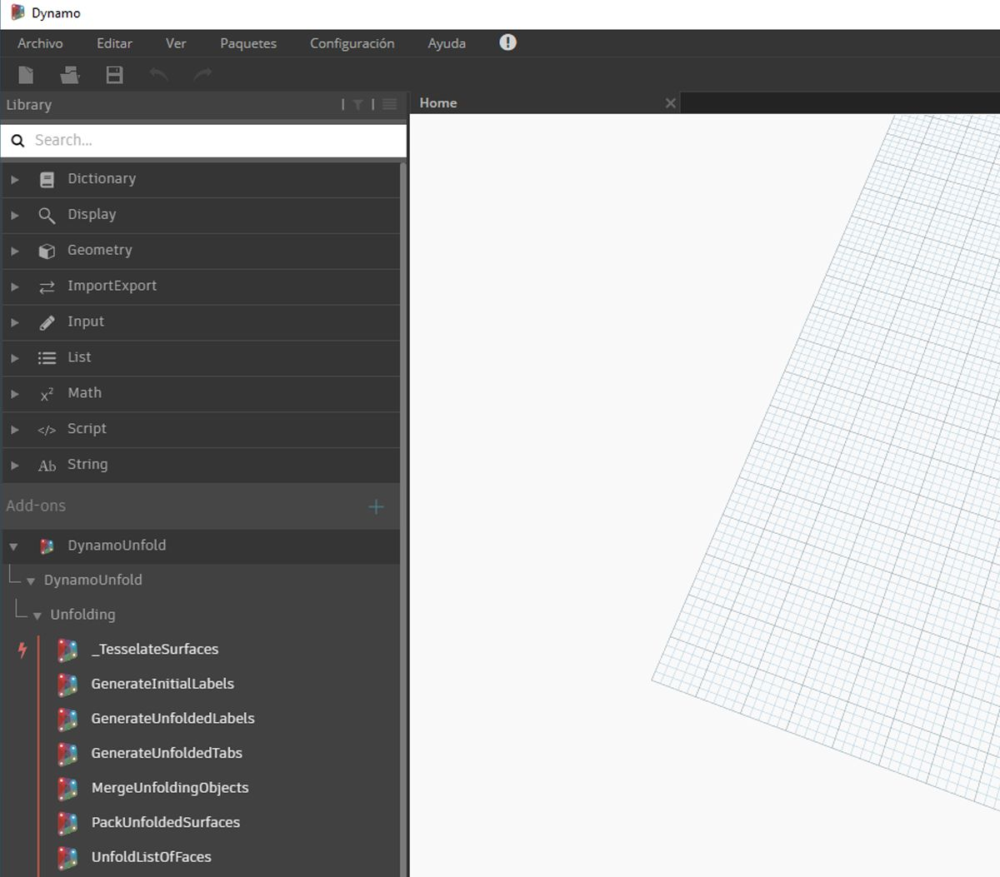
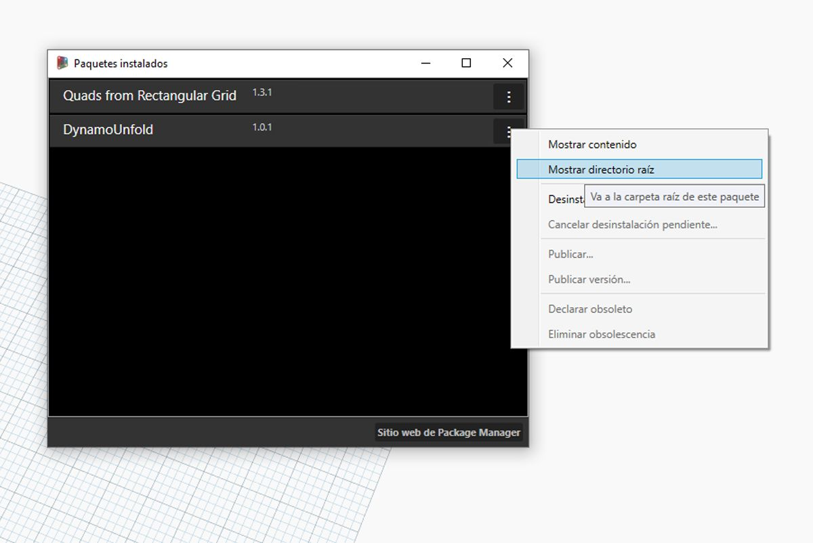
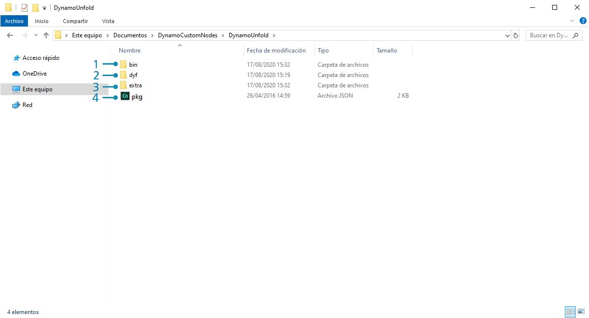
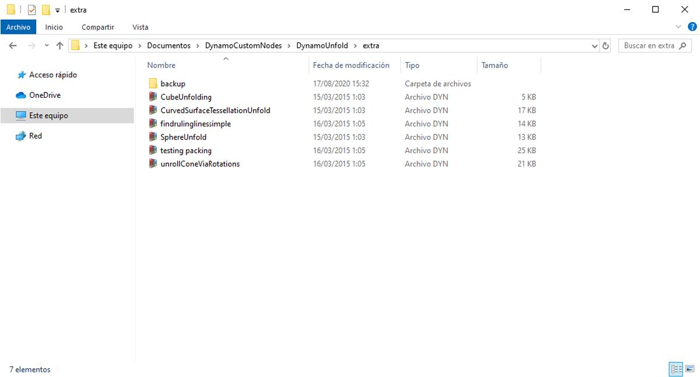
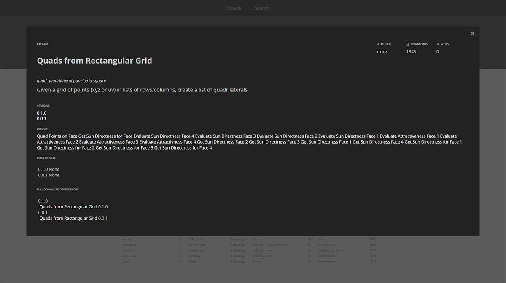

## Paquetes

En pocas palabras, un paquete es un conjunto de nodos personalizados. El administrador de paquetes de Dynamo es un portal para que la comunidad descargue cualquier paquete que se haya publicado en línea. Estos conjuntos de herramientas los desarrollan terceros para ampliar la funcionalidad principal de Dynamo. Están disponibles para todos los usuarios y listos para descargar con solo hacer clic.

Un proyecto de código abierto como Dynamo crece con este tipo de participación de la comunidad. Con desarrolladores independientes dedicados, Dynamo puede ampliar su alcance a los flujos de trabajo de una amplia gama de sectores. Por este motivo, el equipo de Dynamo ha realizado esfuerzos coordinados para optimizar el desarrollo y la publicación de paquetes (lo cual se trata en mayor detalle en las siguientes secciones).

### Instalación de un paquete

La forma más sencilla de instalar un paquete es mediante la barra de herramientas Paquetes de la interfaz de Dynamo. Vamos a ir directos a la acción e instalar uno ahora. En este ejemplo rápido, instalaremos un paquete popular para la creación de paneles de cuadrados en una rejilla. 

> 1. En Dynamo, vaya a *Paquetes > Buscar un paquete...*

> En la barra de búsqueda, buscamos "cuadrados de rejilla rectangular". Tras unos segundos, deberían aparecer todos los paquetes que coincidan con esta consulta de búsqueda. Vamos a seleccionar el primer paquete cuyo nombre coincida.

> 1. Haga clic en la flecha de descarga situada a la izquierda del nombre del paquete y el paquete se instalará. Listo.

> 1. Observe que ahora tenemos otro grupo en la biblioteca de Dynamo denominado *"buildz"*. Este nombre hace referencia al [desarrollador](http://buildz.blogspot.com/) del paquete y el nodo personalizado se encuentra en este grupo. Podemos empezar a utilizarlo al instante.

> Con una operación de bloque de código rápida para definir una rejilla rectangular, hemos creado una lista de paneles rectangulares.

### Carpetas de paquete

El ejemplo anterior se centra en un paquete con un nodo personalizado, pero se utiliza el mismo proceso para descargar paquetes con varios nodos personalizados y archivos de datos complementarios. Vamos a demostrar esto a continuación con un paquete más completo: Dynamo Unfold.

> Como en el ejemplo anterior, seleccione *Paquetes > Buscar un paquete...* Esta vez, buscaremos *"DynamoUnfold"*, en una sola palabra y respetando las mayúsculas y minúsculas. Cuando aparezcan los paquetes, descárguelo haciendo clic en la flecha situada a la izquierda del nombre del paquete. Dynamo Unfold se instalará en la biblioteca de Dynamo.

> En la biblioteca de Dynamo, tenemos un grupo de *DynamoUnfold* con varias categorías y nodos personalizados.

> Ahora, veamos la estructura de archivos del paquete. Seleccione *"Paquetes > Gestionar paquetes..."* en Dynamo. Veremos la ventana anterior con las dos bibliotecas que hemos instalado. Haga clic en el botón situado a la derecha de *DynamoUnfold* y seleccione *"Mostrar directorio raíz".*

> Esto nos llevará al directorio raíz del paquete. Observe que hay tres carpetas y un archivo.

> 1. La carpeta *bin* contiene archivos .dll. Este paquete de Dynamo se desarrolló mediante el uso de Zero-Touch, por lo que los nodos personalizados se guardan en esta carpeta.
2. La carpeta *dyf* contiene los nodos personalizados. Este paquete no se desarrolló mediante nodos personalizados de Dynamo, por lo que esta carpeta está vacía para este paquete.
3. La carpeta extra contiene todos los archivos adicionales, incluidos los archivos de ejemplo.
4. El archivo pkg es un archivo de texto básico que define los parámetros del paquete. Podemos pasarlo por alto por ahora.

> Al abrir la carpeta *"extra"*, vemos un conjunto de archivos de ejemplo que se han descargado con la instalación. No todos los paquetes tienen archivos de ejemplo, pero aquí es donde se pueden encontrar si forman parte de un paquete. Abriremos *"SphereUnfold"*.

> Después de abrir el archivo y pulsar *"Ejecutar"* en el solucionador, tenemos una esfera desplegada. Estos archivos de ejemplo son útiles para aprender a trabajar con un nuevo paquete de Dynamo.

### Administrador de paquetes de Dynamo

Otra forma de descubrir los paquetes de Dynamo es explorar el [Administrador de paquetes de Dynamo](http://dynamopackages.com/) en línea. Es una buena forma de buscar paquetes, ya que el repositorio ordena los paquetes por número de descargas y popularidad. Asimismo, es una forma sencilla de recopilar información sobre las actualizaciones recientes para los paquetes, ya que algunos paquetes de Dynamo están sujetos a las versiones y dependencias de Dynamo.

> Al hacer clic en *"Quads from Rectangular Grid"* en el administrador de paquetes de Dynamo, aparecen las descripciones, las versiones, el desarrollador y las posibles dependencias.

También puede descargar los archivos de paquete desde el administrador de paquetes de Dynamo, pero este proceso es más directo si se realiza desde Dynamo.

### ¿Dónde se almacenan los archivos localmente?

Si descarga archivos desde el administrador de paquetes de Dynamo o si desea ver dónde se guardan todos los archivos del paquete, haga clic en *Configuración > Administrar rutas de nodos y paquetes...* Al hacer clic en los puntos suspensivos situados junto al directorio de carpetas, puede copiar la carpeta raíz y profundizar en el paquete en la ventana del explorador. Por defecto, los paquetes se instalan en una ubicación similar a esta ruta de carpeta: *C:/Usuarios/[nombredeusuario]/AppData/Roaming/Dynamo/[Versión de Dynamo]*.

### Más detalles sobre los paquetes

La comunidad de Dynamo está en constante crecimiento y evolución. Si explora el administrador de paquetes de Dynamo de vez en cuando, descubrirá algunos avances excelentes. En las secciones siguientes, analizaremos en profundidad los paquetes, desde la perspectiva del usuario final hasta la autoría de un paquete de Dynamo propio.

