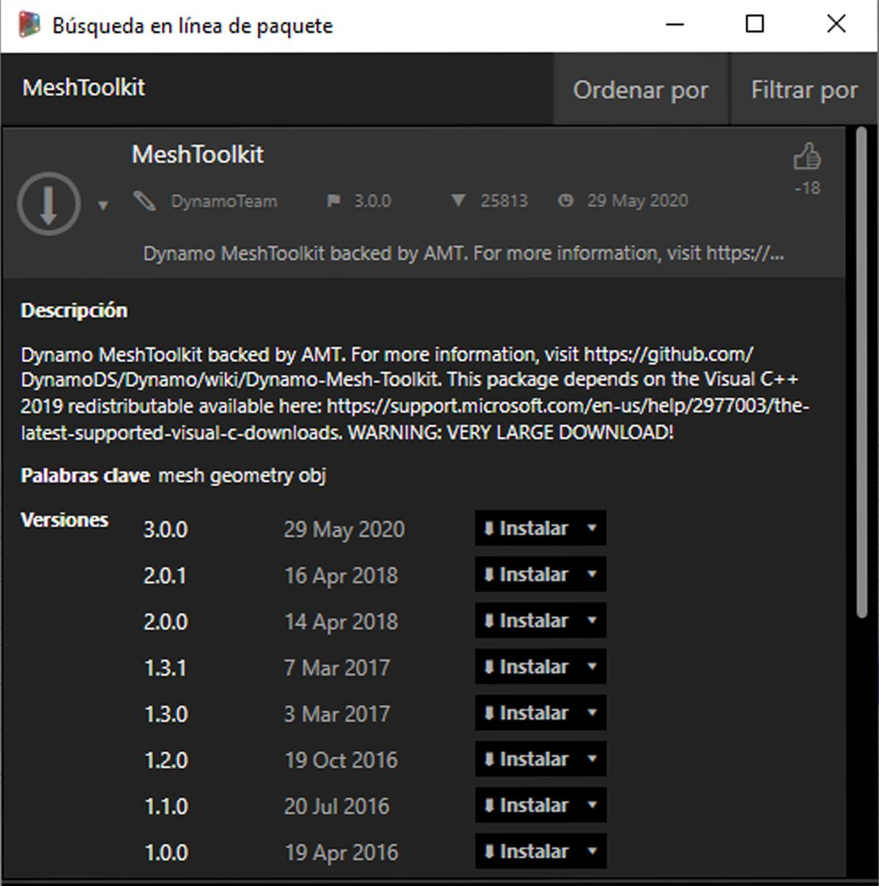
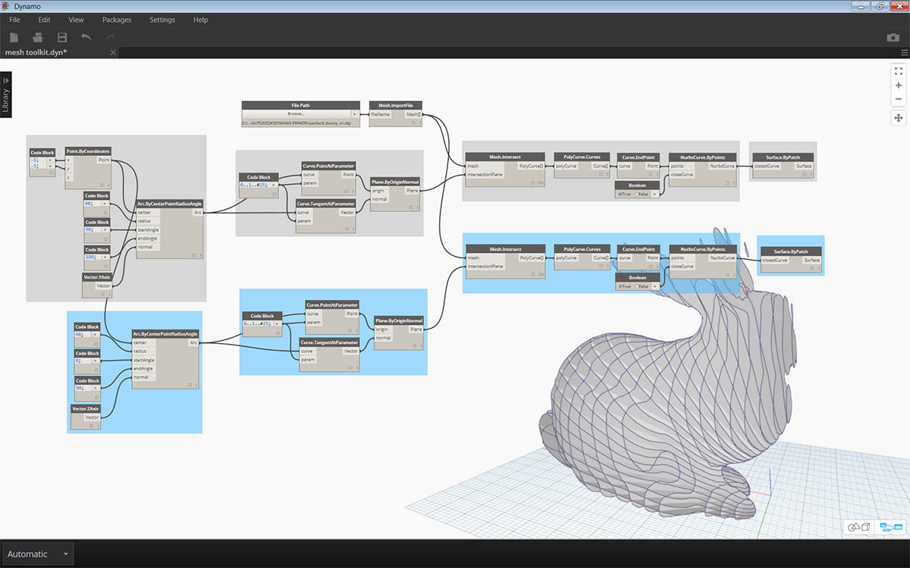

## Caso real de paquete: Kit de herramientas de malla

El Kit de herramientas de malla de Dynamo proporciona herramientas para importar mallas desde formatos de archivo externos, crear una malla a partir de objetos de geometría de Dynamo y generar manualmente mallas mediante sus vértices e índices. La biblioteca también proporciona herramientas para modificar y reparar mallas, o extraer cortes horizontales para su uso en la fabricación.

El Kit de herramientas de malla de Dynamo forma parte de la investigación de mallas en curso de Autodesk y, como tal, seguirá creciendo a lo largo de los próximos años. Esperamos que aparezcan con frecuencia nuevos métodos en este kit y no dude en ponerse en contacto con el equipo de Dynamo para ofrecer comentarios, indicar errores y enviar sugerencias sobre las nuevas funciones.

### Mallas frente a sólidos

En el siguiente ejercicio, se muestran algunas operaciones básicas de malla que utiliza el Kit de herramientas de malla. En el ejercicio, intersecamos una malla con una serie de planos, lo que puede ser muy costoso desde una perspectiva computacional si se utilizan sólidos. A diferencia de los sólidos, las mallas tienen una "resolución" establecida y no se definen matemáticamente, sino topológicamente, y podemos definir esta resolución en función de la tarea que se está llevando a cabo. Para obtener más información sobre las relaciones entre mallas y sólidos, puede consultar el capítulo [Geometría para el diseño computacional](../05_Geometry-for-Computational-Design/5_geometry-for-computational-design.md) de este manual de introducción. Para examinar de forma más exhaustiva el Kit de herramientas de malla, consulte la [página wiki de Dynamo.](https://github.com/DynamoDS/Dynamo/wiki/Dynamo-Mesh-Toolkit) Pasemos al paquete en el ejercicio siguiente.

### Instalar el Kit de herramientas de malla

> En Dynamo, vaya a *Paquetes > Buscar paquetes...* en la barra de menús superior. En el campo de búsqueda, escriba *MeshToolkit* con una sola palabra, teniendo en cuenta mayúsculas y minúsculas. Haga clic en la flecha de descarga del paquete correspondiente a su versión de Dynamo. Tan simple como eso.

### Ejercicio

> Descargue y descomprima los archivos de ejemplo para este ejercicio (haga clic con el botón derecho y elija "Guardar enlace como..."). En el Apéndice, se incluye una lista completa de los archivos de ejemplo. [MeshToolkit.zip](datasets/11-2/MeshToolkit.zip)

Abra primero *Mesh-Toolkit_Intersect-Mesh.dyn en Dynamo.* En este ejemplo, examinaremos el nodo Intersect del Kit de herramientas de malla. Importaremos una malla y la intersecaremos con una serie de planos de entrada para crear cortes. Este es el punto inicial de la preparación del modelo para la fabricación en una herramienta de corte láser o por chorro de agua, o un dispositivo de fresado CNC.

> 1. **Ruta de archivo:** busque el archivo de malla que desee importar (*stanford_bunny_tri.obj*). Los tipos de archivo admitidos son .mix y .obj.
2. **Mesh.ImportFile:** conecte la ruta de archivo para importar la malla.

> 1. **Point.ByCoordinates:** cree un punto; este será el centro de un arco.
2. **Arc.ByCenterPointRadiusAngle:** cree un arco alrededor del punto. Esta curva se utilizará para colocar una serie de planos.

> 1. Code Block: cree un intervalo de números entre cero y uno.
2. **Curve.PointAtParameter:** conecte el arco a la entrada *curve* y la salida de bloque de código a la entrada *param* para extraer una serie de puntos a lo largo de la curva.
3. **Curve.TangentAtParameter:** conecte las mismas entradas que en el nodo anterior.
4. **Plane.ByOriginNormal:** conecte los puntos a la entrada *origin* y los vectores a la entrada *normal* para crear una serie de planos en cada punto.

Ahora debería ver una serie de planos orientados a lo largo del arco. A continuación, utilizaremos estos planos para intersecar la malla.

> 1. **Mesh.Intersect:** interseque los planos con la malla importada, creando una serie de contornos de PolyCurve.
2. **PolyCurve.Curves:** divida las PolyCurves en fragmentos de curva.
3. **Curve.EndPoint:** extraiga los puntos finales de cada curva.
4. **NurbsCurve.ByPoints:** utilice los puntos para crear una NurbsCurve. Utilice un nodo booleano establecido en *True* (verdadero) para cerrar las curvas.

> 1. **Surface.ByPatch:** cree parches de superficie para cada contorno con el fin de crear "cortes" de la malla.

> Añada un segundo conjunto de cortes para obtener un efecto de gofre/cartón de huevos.

Es posible que se haya dado cuenta de que las operaciones de intersección se calculan de forma más rápida con una malla que con un sólido comparable. Los flujos de trabajo como el que se muestra en este ejercicio son excelentes para trabajar con mallas.

