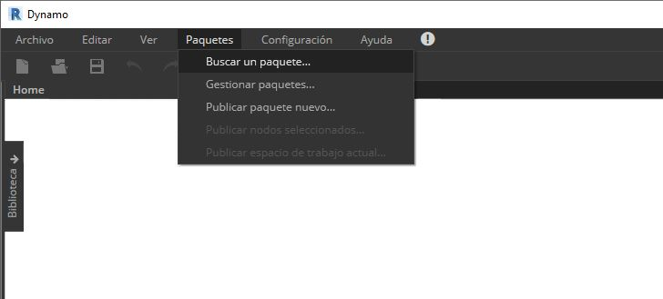
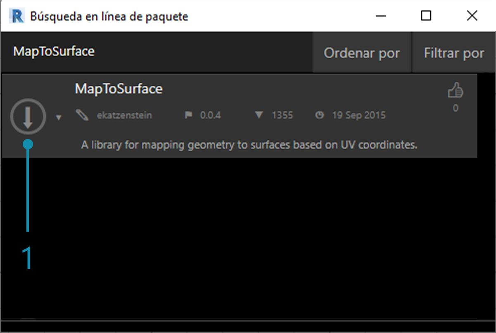

## Desarrollo de un paquete

Dynamo ofrece una gran variedad de métodos para crear un paquete para uso personal o para compartir con la comunidad de Dynamo. En el caso real incluido a continuación, veremos cómo se configura un paquete mediante la desconstrucción de uno existente. Este caso real se basa en las lecciones del capítulo anterior y proporciona un conjunto de nodos personalizados para la asignación de geometría, mediante coordenadas UV, de una superficie de Dynamo a otra.

### MapToSurface

Vamos a trabajar con un paquete de ejemplo que demuestra la asignación de UV de puntos de una superficie a otra. Ya hemos aprendido los conceptos básicos de la herramienta en la sección [Creación de un nodo personalizado](../10_Custom-Nodes/10-2_Creating.md) de este manual de introducción. Los archivos siguientes muestran cómo podemos utilizar el concepto de asignación de UV y desarrollar un conjunto de herramientas para una biblioteca publicable.

> En esta imagen, se asigna un punto de una superficie a otra mediante coordenadas UV. El paquete se basa en este concepto, pero con una geometría más compleja.

### Instalación del paquete

En el capítulo anterior, exploramos métodos para panelizar una superficie en Dynamo según las curvas definidas en el plano XY. Este caso real amplía estos conceptos a más dimensiones de la geometría. Vamos a instalar este paquete como se creó para mostrar cómo se ha desarrollado. En la siguiente sección, mostraremos cómo se ha publicado este paquete.

> Esta es la parte fácil. En Dynamo, vaya a *"Paquetes > Buscar un paquete..."*

> Busque el paquete *"MapToSurface"* (en una sola palabra).

> 1. Cuando encuentre el paquete, haga clic en la flecha de descarga grande situada a la izquierda del nombre del paquete. De este modo, se instalará el paquete en Dynamo.

> 1. Tras la instalación, los nodos personalizados deberían estar disponibles en el grupo "DynamoPrimer" o en la biblioteca de Dynamo. Con el paquete instalado, veamos cómo se configura.

### Nodos personalizados

El paquete que estamos creando utiliza cinco nodos personalizados que hemos creado como referencia. Veamos qué hace cada nodo a continuación. Algunos nodos personalizados se basan en otros nodos personalizados y los gráficos tienen un diseño que los demás usuarios pueden comprender con total claridad.

> Este es un paquete sencillo con cinco nodos personalizados. En los pasos siguientes, hablaremos brevemente de la configuración de cada nodo personalizado.

> **PointsToSurface:** se trata de un nodo personalizado básico en el que se basan los demás nodos de asignación. En pocas palabras, el nodo asigna un punto desde una coordenada UV de la superficie de origen a la ubicación de la coordenada UV de la superficie de destino. Como los puntos son la geometría más primitiva, a partir de la cual se genera geometría más compleja, podemos utilizar esta lógica para asignar geometría 2D e incluso geometría 3D de una superficie a otra.

> **PolygonsToSurface:** la lógica de ampliar puntos asignados de geometría 1D a geometría 2D se muestra aquí de forma sencilla con polígonos. Observe que se ha anidado el nodo *"PointsToSurface"* en este nodo personalizado. De esta forma, podemos asignar los puntos de cada polígono a la superficie y, a continuación, volver a generar el polígono a partir de los puntos asignados. Si se mantiene la estructura de datos correcta (una lista de listas de puntos), se pueden mantener los polígonos separados después de reducirlos a un conjunto de puntos.

> **NurbsCrvtoSurface:** aquí se aplica la misma lógica que en el nodo *"PolygonsToSurface"*. En lugar de asignar puntos poligonales, asignamos puntos de control de una curva NURBS.

> **OffsetPointsToSurface:** este nodo es un poco más complejo, pero el concepto es simple: como el nodo *"PointsToSurface"*, este nodo asigna puntos de una superficie a otra. Sin embargo, también considera los puntos que no se encuentran en la superficie de origen inicial, obtiene su distancia al parámetro UV más cercano y asigna esta distancia a la normal de la superficie de destino en la coordenada UV correspondiente. Esto se ve con mayor claridad al examinar los archivos de ejemplo.

> **SampleSrf:** se trata de un nodo simple que crea una superficie paramétrica para asignar de la rejilla de origen a una superficie ondulada en los archivos de ejemplo.

### Archivos de ejemplo

Los archivos de ejemplo se pueden encontrar en la carpeta raíz del paquete (en Dynamo, vaya a esta carpeta seleccionando *Paquetes > Gestionar paquetes...*).

> En la ventana de gestión de paquetes, haga clic en los tres puntos verticales situados a la derecha de *"MapToSurface"* y elija *"Mostrar directorio raíz".*

Con el directorio raíz abierto, vaya a la carpeta *"extra"*, que aloja todos los archivos del paquete que no son nodos personalizados. Aquí es donde se almacenan los archivos de ejemplo (si existen) de los paquetes de Dynamo. Las capturas de pantalla que se muestran a continuación explican los conceptos demostrados en cada archivo de ejemplo.

> **01-PanelingWithPolygons:** este archivo de ejemplo muestra cómo se puede utilizar *"PointsToSurface"* para panelizar una superficie basándose en una rejilla de rectángulos. Esto debería resultarle familiar, ya que hicimos una demostración de un flujo de trabajo similar en el [capítulo anterior](../10_Custom-Nodes/10-2_Creating.md).

> **02-PanelingWithPolygons-II:** mediante un flujo de trabajo similar, este archivo de ejercicio muestra una configuración para la asignación de círculos (o polígonos que representan círculos) de una superficie a otra. Utiliza el nodo *"PolygonsToSurface"*.

> **03-NurbsCrvsAndSurface:** este archivo de ejemplo añade cierta complejidad al trabajar con el nodo "NurbsCrvToSurface". La superficie de destino se desfasa una distancia dada y la curva NURBS se asigna a la superficie de destino original y a la superficie de desfase. A partir de ahí, las dos curvas asignadas se solevan para crear una superficie que, a continuación, se engrosa. Este sólido resultante tiene una ondulación que es representativa de las normales de la superficie de destino.

> **04-PleatedPolysurface-OffsetPoints:** este archivo de ejemplo muestra cómo asignar una PolySurface plegada de una superficie de origen a una superficie de destino. Las superficies de origen y de destino son superficies rectangulares que abarcan la rejilla y una superficie de revolución, respectivamente.

> **04-PleatedPolysurface-OffsetPoints:** la PolySurface de origen asignada desde la superficie de origen a la superficie de destino.

> **05-SVG-Import:** dado que los nodos personalizados pueden asignar diferentes tipos de curvas, este último archivo hace referencia a un archivo SVG exportado de Illustrator y asigna las curvas importadas a una superficie de destino.

> **05-SVG-Import:** mediante el análisis de la sintaxis de un archivo .svg, las curvas se trasladan del formato .xml a PolyCurves de Dynamo.

> **05-SVG-Import:** las curvas importadas se asignan a una superficie de destino. Esto nos permite diseñar de forma explícita (señalar y hacer clic) una panelización en Illustrator, importarla en Dynamo y aplicarla a una superficie de destino.

