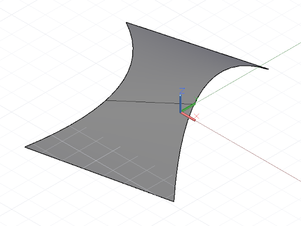

# Conceptos básicos de geometría con DesignScript

El objeto geométrico más sencillo de la biblioteca de geometría estándar de Dynamo es un punto. Toda la geometría se crea mediante funciones especiales denominadas constructores, que devuelven un nuevo ejemplar de ese tipo de geometría específico. En Dynamo, los constructores empiezan por el nombre del tipo de objeto, en este caso, "Point", seguido del método de construcción. Para crear un punto tridimensional especificado con las coordenadas cartesianas X, Y y Z, utilice el constructor *ByCoordinates*:


```js
// create a point with the following x, y, and z
// coordinates:
x = 10;
y = 2.5;
z = -6;

p = Point.ByCoordinates(x, y, z);
```

Los constructores de Dynamo se designan normalmente con el prefijo *By* y, al invocar estas funciones, se devuelve un objeto recién creado de ese tipo. Este objeto recién creado se almacena en la variable designada a la izquierda del signo igual.

La mayoría de los objetos tienen muchos constructores distintos y se puede utilizar el constructor *BySphericalCoordinates* para crear un punto que resida en una esfera, especificado por el radio de la esfera, y un primer y un segundo ángulo de rotación (especificados en grados):


```js
// create a point on a sphere with the following radius,
// theta, and phi rotation angles (specified in degrees)
radius = 5;
theta = 75.5;
phi = 120.3;
cs = CoordinateSystem.Identity();

p = Point.BySphericalCoordinates(cs, radius, theta,
    phi);
```

Los puntos se pueden utilizar para crear geometría dimensional superior como, por ejemplo, líneas. Se puede utilizar el constructor *ByStartPointEndPoint* para crear un objeto de línea entre dos puntos:


```js
// create two points:
p1 = Point.ByCoordinates(3, 10, 2);
p2 = Point.ByCoordinates(-15, 7, 0.5);

// construct a line between p1 and p2
l = Line.ByStartPointEndPoint(p1, p2);
```

De forma similar, las líneas se pueden utilizar para crear geometría de superficie dimensional superior, por ejemplo, mediante el constructor *Loft*, que utiliza una serie de líneas o curvas e interpola una superficie entre ellas.



```js
// create points:
p1 = Point.ByCoordinates(3, 10, 2);
p2 = Point.ByCoordinates(-15, 7, 0.5);

p3 = Point.ByCoordinates(5, -3, 5);
p4 = Point.ByCoordinates(-5, -6, 2);

p5 = Point.ByCoordinates(9, -10, -2);
p6 = Point.ByCoordinates(-11, -12, -4);

// create lines:
l1 = Line.ByStartPointEndPoint(p1, p2);
l2 = Line.ByStartPointEndPoint(p3, p4);
l3 = Line.ByStartPointEndPoint(p5, p6);

// loft between cross section lines:
surf = Surface.ByLoft([l1, l2, l3]);
```

Las superficies también se pueden utilizar para crear geometría sólida dimensional superior, por ejemplo, mediante el engrosado de la superficie a una distancia especificada. Muchos objetos tienen funciones enlazadas a ellos denominadas métodos, que permiten al programador ejecutar comandos en ese objeto específico. Entre los métodos comunes a todas las partes de geometría, se incluyen *Translate* y *Rotate*, que trasladan (desplazan) y rotan la geometría una cantidad especificada. Las superficies presentan el método *Thicken*, que utiliza una única entrada, un número que especifica el nuevo grosor de la superficie.


```js
p1 = Point.ByCoordinates(3, 10, 2);
p2 = Point.ByCoordinates(-15, 7, 0.5);

p3 = Point.ByCoordinates(5, -3, 5);
p4 = Point.ByCoordinates(-5, -6, 2);

l1 = Line.ByStartPointEndPoint(p1, p2);
l2 = Line.ByStartPointEndPoint(p3, p4);

surf = Surface.ByLoft([l1, l2]);

// true indicates to thicken both sides of the Surface:
solid = surf.Thicken(4.75, true);
```

Los comandos de *intersección* pueden extraer geometría dimensional inferior de objetos dimensionales superiores. Esta geometría dimensional inferior extraída puede formar la base para una geometría dimensional superior en un proceso cíclico de creación, extracción y recreación. En este ejemplo, se utiliza el sólido generado para crear una superficie y se utiliza la superficie para crear una curva.


```js
p1 = Point.ByCoordinates(3, 10, 2);
p2 = Point.ByCoordinates(-15, 7, 0.5);

p3 = Point.ByCoordinates(5, -3, 5);
p4 = Point.ByCoordinates(-5, -6, 2);

l1 = Line.ByStartPointEndPoint(p1, p2);
l2 = Line.ByStartPointEndPoint(p3, p4);

surf = Surface.ByLoft([l1, l2]);

solid = surf.Thicken(4.75, true);

p = Plane.ByOriginNormal(Point.ByCoordinates(2, 0, 0),
    Vector.ByCoordinates(1, 1, 1));

int_surf = solid.Intersect(p);

int_line = int_surf.Intersect(Plane.ByOriginNormal(
    Point.ByCoordinates(0, 0, 0),
    Vector.ByCoordinates(1, 0, 0)));
```

