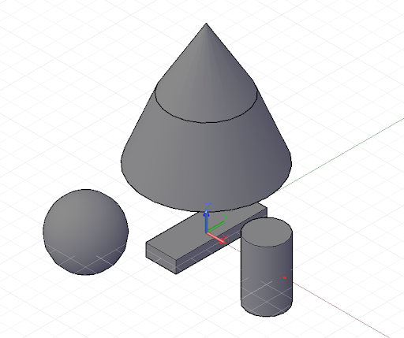

# Primitivas geométricas

Aunque Dynamo puede crear diversas formas geométricas complejas, las primitivas geométricas simples forman la espina dorsal de cualquier diseño computacional: expresadas directamente en la forma diseñada final o utilizadas como andamiaje a partir del que se genera geometría más compleja.

Aunque no es estrictamente una parte de la geometría, CoordinateSystem es una herramienta importante para crear geometría. Un objeto CoordinateSystem realiza un seguimiento de las transformaciones geométricas y de posición, como la rotación, el corte y la escala.

Para crear un CoordinateSystem centrado en un punto con x = 0, y = 0 y z = 0 sin transformaciones de rotación, escala o corte, basta con llamar al constructor Identity:


```js
// create a CoordinateSystem at x = 0, y = 0, z = 0,
// no rotations, scaling, or sheering transformations

cs = CoordinateSystem.Identity();
```

Los objetos CoordinateSystem con transformaciones geométricas se encuentran fuera del ámbito de este capítulo, aunque otro constructor permite crear un sistema de coordenadas en un punto específico, *CoordinateSystem.ByOriginVectors*:


```js
// create a CoordinateSystem at a specific location,
// no rotations, scaling, or sheering transformations
x_pos = 3.6;
y_pos = 9.4;
z_pos = 13.0;

origin = Point.ByCoordinates(x_pos, y_pos, z_pos);
identity = CoordinateSystem.Identity();

cs = CoordinateSystem.ByOriginVectors(origin,
    identity.XAxis, identity.YAxis, identity.ZAxis);
```

La primitiva geométrica más sencilla es un punto, que representa una ubicación de cero dimensiones en un espacio tridimensional. Como se ha mencionado anteriormente, existen varias formas diferentes de crear un punto en un sistema de coordenadas específico: *Point.ByCoordinates* crea un punto con las coordenadas X, Y y Z especificadas; *Point.ByCartesianCoordinates* crea un punto con las coordenadas X, Y y Z especificadas en un determinado sistema de coordenadas; *Point.ByCylindricalCoordinates* crea un punto en un cilindro con un radio, un ángulo de rotación y una altura, y *Point.BySphericalCoordinates* crea un punto en una esfera con un radio y dos ángulos de rotación.

En este ejemplo, se muestran puntos creados en varios sistemas de coordenadas:


```js
// create a point with x, y, and z coordinates
x_pos = 1;
y_pos = 2;
z_pos = 3;

pCoord = Point.ByCoordinates(x_pos, y_pos, z_pos);

// create a point in a specific coordinate system
cs = CoordinateSystem.Identity();
pCoordSystem = Point.ByCartesianCoordinates(cs, x_pos,
    y_pos, z_pos);

// create a point on a cylinder with the following
// radius and height
radius = 5;
height = 15;
theta = 75.5;

pCyl = Point.ByCylindricalCoordinates(cs, radius, theta,
    height);

// create a point on a sphere with radius and two angles

phi = 120.3;

pSphere = Point.BySphericalCoordinates(cs, radius, 
    theta, phi);
```

La siguiente primitiva de Dynamo dimensional superior es un segmento de línea, que representa un número infinito de puntos entre dos puntos finales. Las líneas se pueden crear indicando explícitamente los dos puntos de contorno con el constructor *Line.ByStartPointEndPoint* o especificando un punto inicial, una dirección y una longitud en esa dirección, *Line.ByStartPointDirectionLength*.


```js
p1 = Point.ByCoordinates(-2, -5, -10);
p2 = Point.ByCoordinates(6, 8, 10);

// a line segment between two points
l2pts = Line.ByStartPointEndPoint(p1, p2); 

// a line segment at p1 in direction 1, 1, 1 with 
// length 10
lDir = Line.ByStartPointDirectionLength(p1,
    Vector.ByCoordinates(1, 1, 1), 10);
```

Dynamo tiene objetos que representan los tipos más básicos de primitivas geométricas en tres dimensiones: cubos, creados con *Cuboid.ByLengths*; conos, creados con *Cone.ByPointsRadius* y *Cone.ByPointsRadii*; cilindros, creados con *Cylinder.ByRadiusHeight*, y esferas, creadas con *Sphere.ByCenterPointRadius*.



```js
// create a cuboid with specified lengths
cs = CoordinateSystem.Identity();

cub = Cuboid.ByLengths(cs, 5, 15, 2);

// create several cones
p1 = Point.ByCoordinates(0, 0, 10);
p2 = Point.ByCoordinates(0, 0, 20);
p3 = Point.ByCoordinates(0, 0, 30);

cone1 = Cone.ByPointsRadii(p1, p2, 10, 6);
cone2 = Cone.ByPointsRadii(p2, p3, 6, 0);

// make a cylinder
cylCS = cs.Translate(10, 0, 0);

cyl = Cylinder.ByRadiusHeight(cylCS, 3, 10);

// make a sphere
centerP = Point.ByCoordinates(-10, -10, 0);

sph = Sphere.ByCenterPointRadius(centerP, 5);
```

