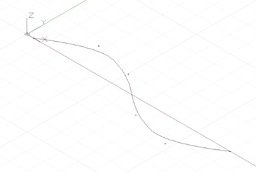
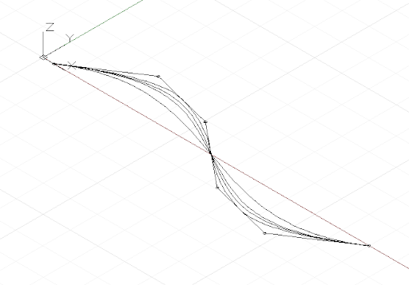

# Curvas: puntos interpolados y de control

Existen dos formas fundamentales de crear curvas de forma libre en Dynamo: especificar una colección de puntos y conseguir que Dynamo interpole una curva suavizada entre ellos, o un método de nivel más bajo mediante la especificación de los puntos de control subyacentes de una curva de un determinado grado. Las curvas interpoladas son útiles cuando un diseñador conoce exactamente la forma que debe adoptar una línea o si el diseño tiene restricciones específicas en cuanto a la ubicación que la curva puede o no atravesar. Las curvas especificadas mediante puntos de control son, en esencia, una serie de segmentos de línea recta que un algoritmo suaviza para formar una curva final. La especificación de una curva mediante puntos de control puede resultar útil para explorar formas de curva con diferentes grados de suavizado o cuando se requiere una continuidad suave entre segmentos de curva.

Para crear una curva interpolada, simplemente transfiera un conjunto de puntos al método *NurbsCurve.ByPoints*.


```js
num_pts = 6;

s = Math.Sin(0..360..#num_pts) * 4;

pts = Point.ByCoordinates(1..30..#num_pts, s, 0);

int_curve = NurbsCurve.ByPoints(pts);
```

La curva generada interseca cada uno de los puntos de entrada, comenzando y terminando en el primer y el último punto del conjunto, respectivamente. Se puede utilizar un parámetro periódico opcional para crear una curva periódica cerrada. Dynamo rellenará automáticamente el segmento que falta, por lo que no es necesario un punto final duplicado (idéntico al punto inicial).


```js
pts = Point.ByCoordinates(Math.Cos(0..350..#10),
    Math.Sin(0..350..#10), 0);

// create an closed curve
crv = NurbsCurve.ByPoints(pts, true);

// the same curve, if left open:
crv2 = NurbsCurve.ByPoints(pts.Translate(5, 0, 0),
    false);
```

Las NurbsCurves se generan de forma muy similar, con puntos de entrada que representan los puntos finales de un segmento de línea recta y un segundo parámetro que especifica la cantidad y el tipo de suavizado de la curva, que se denomina grado.* Una curva con el grado 1 no presenta suavizado; es una polilínea.


```js
num_pts = 6;

pts = Point.ByCoordinates(1..30..#num_pts,
    Math.Sin(0..360..#num_pts) * 4, 0);

// a B-Spline curve with degree 1 is a polyline
ctrl_curve = NurbsCurve.ByControlPoints(pts, 1);
```

Una curva con el grado 2 se suaviza de forma que esta se interseque con el punto medio de los segmentos de polilínea y sea tangente a él:



```js
num_pts = 6;

pts = Point.ByCoordinates(1..30..#num_pts,
    Math.Sin(0..360..#num_pts) * 4, 0);

// a B-Spline curve with degree 2 is smooth
ctrl_curve = NurbsCurve.ByControlPoints(pts, 2);
```

Dynamo admite curvas NURBS (B-spline racional no uniforme) hasta un grado 20; la siguiente secuencia de comandos ilustra el efecto que tiene el aumento de niveles de suavizado en la forma de una curva:



```js
num_pts = 6;

pts = Point.ByCoordinates(1..30..#num_pts,
    Math.Sin(0..360..#num_pts) * 4, 0);

def create_curve(pts : Point[], degree : int) 
{
	return = NurbsCurve.ByControlPoints(pts,
        degree);
}

ctrl_crvs = create_curve(pts, 1..11);
```

Tenga en cuenta que debe tener al menos un punto de control más que el grado de la curva.

Otra ventaja de crear curvas mediante vértices de control es la capacidad de mantener la tangencia entre segmentos de curva individuales. Para ello, se extrae la dirección entre los dos últimos puntos de control y se continúa esta dirección con los dos primeros puntos de control de la curva siguiente. En el siguiente ejemplo, se crean dos curvas NURBS independientes que son, no obstante, tan suaves como una curva:


```js
pts_1 = {};

pts_1[0] = Point.ByCoordinates(0, 0, 0);
pts_1[1] = Point.ByCoordinates(1, 1, 0);
pts_1[2] = Point.ByCoordinates(5, 0.2, 0);
pts_1[3] = Point.ByCoordinates(9, -3, 0);
pts_1[4] = Point.ByCoordinates(11, 2, 0);

crv_1 = NurbsCurve.ByControlPoints(pts_1, 3);

pts_2 = {};

pts_2[0] = pts_1[4];
end_dir = pts_1[4].Subtract(pts_1[3].AsVector());

pts_2[1] = Point.ByCoordinates(pts_2[0].X + end_dir.X,
    pts_2[0].Y + end_dir.Y, pts_2[0].Z + end_dir.Z);

pts_2[2] = Point.ByCoordinates(15, 1, 0);
pts_2[3] = Point.ByCoordinates(18, -2, 0);
pts_2[4] = Point.ByCoordinates(21, 0.5, 0);

crv_2 = NurbsCurve.ByControlPoints(pts_2, 3);
```

* Esta es una descripción muy simplificada de la geometría de curva NURBS; para obtener una explicación más precisa y detallada, consulte Pottmann, et al. 2007, en las referencias.

