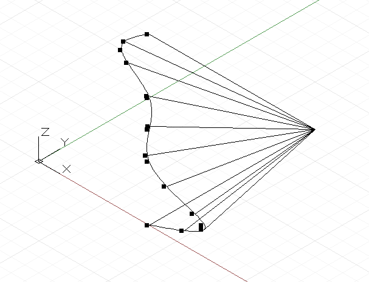

# Parametrización geométrica

En los diseños computacionales, las curvas y las superficies se utilizan con frecuencia como el andamiaje subyacente para crear la geometría posterior. Para que esta geometría inicial se pueda utilizar como base para la geometría posterior, la secuencia de comandos debe poder extraer cualidades como, por ejemplo, la posición y la orientación en toda el área del objeto. Tanto las curvas como las superficies admiten esta extracción y este proceso se denomina parametrización.

Todos los puntos de una curva se pueden considerar como si tuvieran un parámetro único que oscila entre 0 y 1. Si creáramos una NurbsCurve a partir de varios puntos de control o interpolación, el primer punto tendría el parámetro 0 y el último, el parámetro 1. Es imposible saber por adelantado cuál es el parámetro exacto para cualquier punto intermedio, lo que puede parecer una limitación grave, aunque se mitiga mediante una serie de funciones de utilidad. Las superficies tienen una parametrización similar a la de las curvas, aunque con dos parámetros en lugar de uno, denominados u y v. Si creáramos una superficie con los siguientes puntos:

```js
pts = [ [p1, p2, p3],
        [p4, p5, p6],
        [p7, p8, p9] ];
```

p1 tendría el parámetro u = 0 v = 0, mientras que p9 tendría los parámetros u = 1 v = 1.

La parametrización no resulta especialmente útil a la hora de determinar los puntos utilizados para generar curvas. Su principal finalidad es determinar las ubicaciones si se utilizan los puntos intermedios generados por los constructores NurbsCurve y NurbsSurface.

Las curvas presentan el método *PointAtParameter*, que utiliza un único argumento doble entre 0 y 1, y devuelve el objeto de punto en ese parámetro. Por ejemplo, esta secuencia de comandos busca los puntos en los parámetros 0, 0.1, 0.2, 0.3, 0.4, 0.5, 0.6, 0.7, 0.8, 0.9 y 1:



```js
pts = {};
pts[0] = Point.ByCoordinates(4, 0, 0);
pts[1] = Point.ByCoordinates(6, 0, 1);
pts[2] = Point.ByCoordinates(4, 0, 2);
pts[3] = Point.ByCoordinates(4, 0, 3);
pts[4] = Point.ByCoordinates(4, 0, 4);
pts[5] = Point.ByCoordinates(3, 0, 5);
pts[6] = Point.ByCoordinates(4, 0, 6);

crv = NurbsCurve.ByPoints(pts);

pts_at_param = crv.PointAtParameter(0..1..#11);

// draw Lines to help visualize the points
lines = Line.ByStartPointEndPoint(pts_at_param, 
    Point.ByCoordinates(4, 6, 0));
```

De forma similar, las superficies presentan el método *PointAtParameter*, que utiliza dos argumentos, el parámetro u y v del punto generado.

Aunque la extracción de puntos individuales en una curva y una superficie puede ser útil, a menudo, es necesario que las secuencias de comandos conozcan las características geométricas específicas de un parámetro, como la dirección hacia la que está orientada la curva o la superficie. El método *CoordinateSystemAtParameter* no solo busca la posición, sino un CoordinateSystem orientado en el parámetro de una curva o una superficie. Por ejemplo, el siguiente archivo de comandos extrae objetos CoordinateSystem orientados a lo largo de una superficie de revolución y utiliza la orientación de los objetos CoordinateSystem para generar líneas que permanecen en la dirección normal a la superficie:


```js
pts = {};
pts[0] = Point.ByCoordinates(4, 0, 0);
pts[1] = Point.ByCoordinates(3, 0, 1);
pts[2] = Point.ByCoordinates(4, 0, 2);
pts[3] = Point.ByCoordinates(4, 0, 3);
pts[4] = Point.ByCoordinates(4, 0, 4);
pts[5] = Point.ByCoordinates(5, 0, 5);
pts[6] = Point.ByCoordinates(4, 0, 6);
pts[7] = Point.ByCoordinates(4, 0, 7);

crv = NurbsCurve.ByPoints(pts);

axis_origin = Point.ByCoordinates(0, 0, 0);
axis = Vector.ByCoordinates(0, 0, 1);

surf = Surface.ByRevolve(crv, axis_origin, axis, 90,
    140);

cs_array = surf.CoordinateSystemAtParameter(
    (0..1..#7)<1>, (0..1..#7)<2>);

def make_line(cs : CoordinateSystem) { 
	lines_start = cs.Origin;
    lines_end = cs.Origin.Translate(cs.ZAxis, -0.75);
    
    return = Line.ByStartPointEndPoint(lines_start, 
        lines_end);
}

lines = make_line(Flatten(cs_array));
```

Como se ha mencionado anteriormente, la parametrización no siempre es uniforme a lo largo de una curva o una superficie, lo que significa que el parámetro 0.5 no siempre se corresponde con el punto medio y 0.25 no siempre se corresponde con el punto un cuarto a lo largo de una curva o una superficie. Para evitar esta limitación, las curvas presentan un conjunto adicional de comandos de parametrización que permiten buscar un punto en longitudes específicas a lo largo de una curva.

