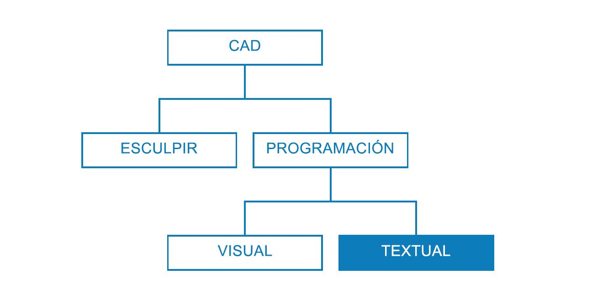
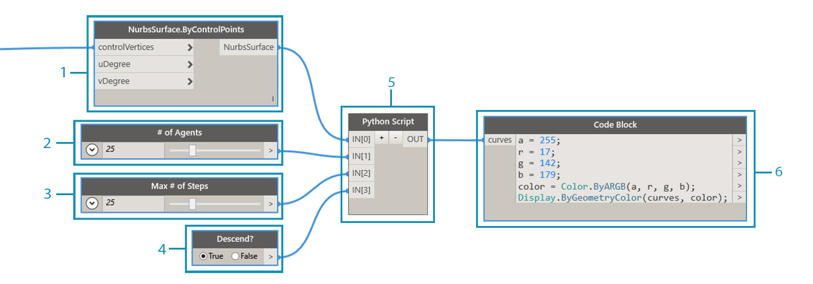

## Estrategias de creación de secuencias de comandos

Las secuencias de comandos basadas en texto en el entorno de creación de secuencias de comandos visual permite relaciones visuales y potentes mediante DesignScript, Python y ZeroTouch (C#). El usuario puede visualizar elementos como, por ejemplo, controles deslizantes de entrada, condensar operaciones grandes en DesignScript y acceder a herramientas y bibliotecas eficaces a través de Python o C# en el mismo espacio de trabajo. Si se administran de manera eficaz, la combinación de estas estrategias puede proporcionar una gran cantidad de personalización, claridad y eficacia a todo el programa. A continuación, se ofrece un conjunto de directrices para ayudarle a aumentar la secuencia de comandos visual con la secuencia de comandos de texto.



### Cuándo crear secuencias de comandos

La creación de secuencias de comandos de texto puede establecer relaciones de una mayor complejidad que la programación visual, aunque sus funciones también se solapan considerablemente. Esto es así porque los nodos son código compilado previamente de forma eficaz y es probable que podamos escribir un programa de Dynamo completo en DesignScript o Python. Sin embargo, utilizamos la creación de secuencias de comandos visuales porque la interfaz de nodos y cables crea un flujo intuitivo de información gráfica. Saber dónde las funciones de creación de secuencias de comandos de texto superan a la creación de secuencias de comandos visuales le proporcionará importantes pistas sobre cuándo deben utilizarse sin renunciar a la naturaleza intuitiva de los nodos y los cables. A continuación, se proporcionan directrices sobre cuándo crear una secuencia de comandos y qué lenguaje se debe utilizar.

**Utilice secuencias de comandos de texto para:**

* Creación de bucles

* Repetición

* Acceso a bibliotecas externas

**Elija un lenguaje:**

||Creación de bucles|Repetición|Condensar nodos|Bibliotecas ext.|Abreviatura|
| -- | -- |
|**DesignScript**|Sí|Sí|Sí|No|Sí|
|**Python**|Sí|Sí|Parcialmente|Sí|No|
|**ZeroTouch (C#)**|No|No|No|Sí|No|

> Consulte [Referencia de secuencias de comandos](http://primer.dynamobim.org/en/12_Best-Practice/12-3_Scripting-Reference.html) para obtener una lista de los elementos a los que cada biblioteca de Dynamo proporciona acceso.

### Pensamiento paramétrico

Al crear secuencias de comandos en Dynamo, un entorno inevitablemente paramétrico, es aconsejable estructurar el código en relación con la estructura de nodos y cables en los que se basará. Considere el nodo que contiene la secuencia de comandos de texto como si se tratara de cualquier otro nodo del programa con unas pocas entradas específicas, una función y una salida prevista. Esto proporciona al instante al código del nodo un conjunto de variables desde las que trabajar, la clave para obtener un sistema paramétrico limpio. A continuación, se proporcionan algunas directrices para una integración más eficaz del código en un programa visual.

**Identifique las variables externas:**

* Intente determinar los parámetros especificados en el problema de diseño para que pueda construir un modelo que se base directamente en esos datos.

* Antes de escribir el código, identifique las variables:

  * Un conjunto mínimo de entradas

  * La salida deseada

  * Constantes



> Se han establecido varias variables antes de escribir el código.

> 1. La superficie en la que vamos a simular la lluvia.
2. El número de gotas de lluvia (agentes) que deseamos.
3. Hasta dónde deseamos que se desplacen las gotas de lluvia.
4. Alterne entre descender la ruta más escarpada o atravesar la superficie.
5. El nodo de Python con el número respectivo de entradas.
6. Un bloque de código para establecer en azul las curvas devueltas.

**Diseñe las relaciones internas:**

* El uso de parámetros permite editar determinados parámetros o variables para manipular o modificar el resultado final de una ecuación o un sistema.

* Siempre que las entidades de la secuencia de comandos estén relacionadas lógicamente, el objetivo es definirlas como funciones entre sí. De este modo, al modificar una, la otra se puede actualizar de forma proporcional.

* Minimice el número de entradas visualizando solo los parámetros clave:

  * Si un conjunto de parámetros se puede derivar de más parámetros principales, solo se mostrarán los parámetros principales como entradas de la secuencia de comandos. Esto aumenta la facilidad de uso de la secuencia de comandos al reducir la complejidad de su interfaz.


> El código "modules" del ejemplo de [Nodo de Python](http://primer.dynamobim.org/en/09_Custom-Nodes/9-4_Python.html).

> 1. Entradas.
2. Variables internas de la secuencia de comandos.
3. Un bucle que utiliza estas entradas y variables para realizar su función.
> Consejo: céntrese tanto en el proceso como lo hace en la solución.

**No se repita (principio de no repetición):**

* Cuando hay varias formas de expresar lo mismo en la secuencia de comandos, en algún momento, las representaciones duplicadas quedarán fuera de la sincronización, lo que puede llevar a problemas de mantenimiento, factorización incorrecta y contradicciones internas.

* El principio de no repetición (DRY, Don't Repeat Yourself) se define como "Cada parte del conocimiento debe tener una representación única, sin ambigüedades y autorizada dentro de un sistema":

  * Si se aplica correctamente este principio, todos los elementos relacionados de la secuencia de comandos cambiarán de forma predecible y uniforme, y todos los elementos no relacionados no presentarán consecuencias lógicas entre sí.

```
### BAD
for i in range(4):
for j in range(4):
point = Point.ByCoordinates(3*i, 3*j, 0)
points.append(point)
```

```
### GOOD
count = IN[0]
pDist = IN[1]

for i in range(count):
for j in range(count):
point = Point.ByCoordinates(pDist*i, pDist*j, 0)
points.append(point)
```

> Consejo: antes de duplicar entidades en la secuencia de comandos (como la constante en el ejemplo anterior), pregúntese si puede establecer un vínculo con el origen en su lugar.

### Estructuración modular

A medida que aumenta la longitud y la complejidad del código, la "gran idea" (o el algoritmo general) se vuelve cada vez más ilegible. También resulta más difícil realizar un seguimiento de los eventos y su ubicación, identificar errores cuando hay problemas, integrar otro código y asignar tareas de desarrollo. Para evitar estos problemas, es aconsejable escribir código en módulos, una estrategia organizativa que divide el código en función en la tarea que ejecuta. A continuación, se incluyen algunos consejos para que las secuencias de comandos sean más manejables a través de la modularización.

**Escribir código en módulos:**

* Un "módulo" es un grupo de código que realiza una tarea específica, similar a un nodo de Dynamo en el espacio de trabajo.

* Puede tratarse de cualquier elemento que se deba separar visualmente del código adyacente (una función, una clase, un grupo de entradas o las bibliotecas que se están importando).

* El desarrollo de código en módulos aprovecha la calidad visual e intuitiva de los nodos, así como las relaciones complejas que solo pueden obtenerse mediante secuencias de comandos de texto.


> Estos bucles llaman a una clase denominada "agente" que desarrollaremos más detalladamente en el ejercicio.

> 1. Un módulo de código que define el punto inicial de cada agente.
2. Un módulo de código que actualiza el agente.
3. Un módulo de código que dibuja una trayectoria para la ruta del agente.

**Detección de la reutilización de código:**

* Si detecta que el código realiza la misma tarea (o una muy similar) en más de una ubicación, busque formas de agruparlo en una función a la que se pueda llamar.

* Las funciones de "administrador" controlan el flujo del programa y contienen principalmente llamadas a funciones de "trabajo" que gestionan detalles de bajo nivel, como desplazar datos entre estructuras.


> En este ejemplo, se crean esferas con radios y colores basados en el valor Z de los centros.

> 1. Dos funciones principales de "trabajo": una que crea esferas con radios y colores de visualización en función del valor Z del centro.
2. Una función principal de "administrador" que combina las dos funciones de trabajo. Al llamar a esta, se llamará a las dos funciones incluidas en ella.

**Muestre solo lo que se necesite ver:**

* Una interfaz de módulo indica los elementos que el módulo proporciona y necesita.

* Una vez definidas las interfaces entre las unidades, el diseño detallado de cada unidad puede continuar por separado.

**Capacidad de separación/sustitución:**

* Los módulos no se conocen ni se preocupan entre sí.

**Formas generales de modularización:**

* Agrupación de código:

```
# IMPORT LIBRARIES
import random
import math
import clr
clr.AddReference('ProtoGeometry')
from Autodesk.DesignScript.Geometry import *

# DEFINE PARAMETER INPUTS
surfIn = IN[0]
maxSteps = IN[1]
```

* Funciones:

```
def get_step_size():
area = surfIn.Area
stepSize = math.sqrt(area)/100
return stepSize

stepSize = get_step_size()
```

* Clases:

```
class MyClass:
i = 12345

def f(self):
return 'hello world'

numbers = MyClass.i
greeting = MyClass.f
```

### Ajuste continuo

Al desarrollar secuencias de comandos de texto en Dynamo, es recomendable asegurarse constantemente de que lo que se crea en realidad está en consonancia con lo que se espera. Esto garantizará que los eventos imprevistos, como errores de sintaxis, discrepancias lógicas, valores imprecisos y salidas anómalas, entre otros, se detecten y se aborden rápidamente a medida que aparecen en lugar de todos al final. Como las secuencias de comandos se encuentran dentro de los nodos en el lienzo, ya están integradas en el flujo de datos del programa visual. Esto permite que la supervisión continua de la secuencia de comandos sea tan sencilla como asignar los datos que se van a obtener, ejecutar el programa y evaluar los flujos externos a la secuencia de comandos que utilizan un nodo de visualización. A continuación, se proporcionan algunos consejos para inspeccionar de forma continua las secuencias de comandos a medida que las crea.

**Realice pruebas durante el proceso:**

* Cuando complete un grupo de funciones:

  * Retroceda y revise el código.

  * Sea crítico. ¿Podría un colaborador entender la finalidad del código? ¿Es necesario que haga esto? ¿Esta función se puede realizar de forma más eficaz? ¿Estoy creando dependencias o duplicados innecesarios?

  * Realice pruebas rápidas para asegurarse de que se devuelven datos que "tienen sentido".

* Asigne los datos más recientes con los que está trabajando en la secuencia de comandos como salida para que el nodo siempre presente datos pertinentes cuando se actualice la secuencia de comandos:


> Ajuste del código de ejemplo del [nodo de Python](http://primer.dynamobim.org/en/09_Custom-Nodes/9-4_Python.html).

> 1. Compruebe que todos los bordes del sólido se devuelvan como curvas para crear un cuadro delimitador alrededor.
2. Compruebe que las entradas de recuento se hayan convertido correctamente en intervalos.
3. Compruebe que los sistemas de coordenadas se hayan trasladado y rotado correctamente en este bucle.

**Anticipar "casos extremos":**

* Durante la creación de secuencias de comandos, establezca los parámetros de entrada en los valores mínimo y máximo del dominio asignado para comprobar si el programa sigue funcionando en condiciones extremas.

* Aunque el programa funcione en los extremos, compruebe si devuelve valores nulos, vacíos o cero no deseados.

* En algunos casos, los errores y las incidencias que revelan algún problema subyacente en la secuencia de comandos solo se detectarán durante estos casos extremos.

  * Conozca las causas del error y decida posteriormente si se debe corregir internamente o si se debe volver a definir un dominio de parámetro para evitar el problema.

> Consejo: siempre presuponga que el usuario utilizará todas las combinaciones de cada uno de los valores de entrada que se le hayan presentado. Esto ayudará a eliminar sorpresas no deseadas.

### Depuración eficaz

La depuración es el proceso de eliminar "errores" de la secuencia de comandos. Los errores pueden ser incidencias, aspectos ineficaces, imprecisiones o resultados no deseados. La resolución de errores puede ser tan sencilla como corregir un nombre de variable mal escrito hasta hacer frente a problemas generalizados y estructurales en la secuencia de comandos. Lo ideal es que el ajuste de la secuencia de comandos durante el proceso de creación le ayude a detectar estos problemas potenciales en una fase inicial, aunque esto no garantiza que esté libre de errores. A continuación, se revisan varios procedimientos recomendados indicados anteriormente para ayudarle a resolver los errores de forma sistemática.

**Utilice la burbuja de visualización:**

* Compruebe los datos devueltos en diferentes partes del código. Para ello, asígnelos a la variable OUT, de modo similar al proceso de ajuste del programa.

**Escriba comentarios descriptivos:**

* Un módulo de código será mucho más fácil de depurar si se describe con claridad el resultado previsto.

```
# Loop through X and Y
for i in range(xCount):
for j in range(yCount):

# Rotate and translate the coordinate system
toCoord = fromCoord.Rotate(solid.ContextCoordinateSystem.Origin,Vector.ByCoordinates(0,0,1),(90*(i+j%seed)))
vec = Vector.ByCoordinates((xDist*i),(yDist*j),0)
toCoord = toCoord.Translate(vec)

# Transform the solid from the source coord system to the target coord system and append to the list
solids.append(solid.Transform(fromCoord,toCoord))
```

> Por lo general, esto supone una cantidad excesiva de comentarios y líneas en blanco, pero, cuando se depura, puede ser útil dividir la información en partes manejables.

**Aproveche la modularidad del código:**

* El origen de un problema se puede aislar en determinados módulos.

* Una vez identificado el módulo defectuoso, se puede corregir de forma mucho más fácil el problema.

* Cuando se debe modificar un programa, el código desarrollado en los módulos será mucho más fácil de cambiar:

  * Puede insertar módulos nuevos o depurados en un programa existente con la seguridad de que el resto del programa no cambiará.


> Depuración del archivo de ejemplo del [nodo de Python](http://primer.dynamobim.org/en/09_Custom-Nodes/9-4_Python.html).

> 1. La geometría de entrada devuelve un cuadro delimitador de mayor tamaño, como podemos ver si se asigna xDist e yDist a OUT.
2. Las curvas de borde de la geometría de entrada devuelven un cuadro delimitador adecuado con las distancias correctas para xDist e yDist.
3. El "módulo" de códigos que hemos insertado para solucionar el problema del valor de xDist e yDist.

### Ejercicio: la ruta más escarpada

> Descargue el archivo de ejemplo que acompaña a este ejercicio (haga clic con el botón derecho y seleccione "Guardar vínculo como..."). En el Apéndice, se incluye una lista completa de los archivos de ejemplo. [SteepestPath.dyn](datasets/13-1/SteepestPath.dyn)

Teniendo en cuenta los procedimientos recomendados de creación de secuencias de comandos de texto, vamos a escribir una secuencia de comandos de simulación de lluvia. Aunque hemos podido aplicar los procedimientos recomendados a un programa visual desorganizado en Estrategias gráficas, es mucho más difícil hacerlo con el lenguaje de secuencias de comandos de texto. Las relaciones lógicas establecidas en las secuencias de comandos de texto son menos visibles y pueden ser casi imposibles de desentrañar en un código complicado. La eficacia que proporciona la creación de secuencias de comandos de texto también conlleva una mayor responsabilidad en cuanto a la organización. Recorreremos cada paso y aplicaremos los procedimientos recomendados durante el proceso.


> La secuencia de comandos se aplica a una superficie deformada por un atractor.

Lo primero que debemos hacer es importar las bibliotecas de Dynamo necesarias. Esto proporcionará acceso global a las funciones de Dynamo en Python.


> Todas las bibliotecas que tenemos intención de utilizar deben importarse aquí.

A continuación, debemos definir las entradas y las salidas de la secuencia de comandos, que se mostrarán como puertos de entrada en el nodo. Estas entradas externas son la base de nuestra secuencia de comandos y la clave para establecer un entorno paramétrico.


> Se deben definir entradas que se correspondan con variables en la secuencia de comandos de Python y determinar la salida deseada:
> 
> 1. La superficie que deseamos descender.
> 2. El número de agentes que deseamos que realicen el recorrido.
> 3. El número máximo de pasos que pueden dar los agentes.
> 4. Una opción para tomar la ruta descendente más corta por la superficie o para atravesarla.
> 5. El nodo de Python con identificadores de entrada que corresponden a entradas de la secuencia de comandos (IN[0], IN[1]).
> 6. Las curvas de salida que se pueden mostrar con un color diferente.

Ahora utilicemos el procedimiento de modularidad y creemos el cuerpo de nuestra secuencia de comandos. La simulación de la ruta descendente más corta por una superficie para varios puntos iniciales es una tarea importante que requerirá varias funciones. En lugar de llamar a las diferentes funciones a lo largo de la secuencia de comandos, podemos modularizar el código recopilándolas en una sola clase, nuestro agente. Se puede llamar a las diferentes funciones de esta clase o "módulo" con distintas variables, o incluso volver a utilizarlas en otra secuencia de comandos.


> Necesitaremos definir una clase o un plan de acción para un agente con la intención de descender la superficie optando por el desplazamiento en la dirección más escarpada posible cada vez que este dé un paso:
>
> 1. Nombre.
> 2. Atributos globales que comparten todos los agentes.
> 3. Atributos de ejemplar exclusivos de cada agente.
> 4. Una función para dar un paso.
> 5. Una función para catalogar la posición de cada paso en una lista de trayectorias.

Inicializaremos los agentes mediante la definición de su ubicación inicial. Esta es una buena oportunidad para ajustar nuestra secuencia de comandos y asegurarnos de que funciona la clase de agente.


> Tendremos que crear una instancia de todos los agentes cuyo descenso por la superficie deseamos observar y definir sus atributos iniciales:
>
> 1. Una nueva lista de trayectorias vacía.
> 2. La ubicación en la que se iniciará el paseo por la superficie.
> 3. Hemos asignado la lista de agentes como salida para comprobar lo que devuelve la secuencia de comandos aquí. Se devuelve el número correcto de agentes, pero necesitaremos ajustar de nuevo la secuencia de comandos más adelante para comprobar la geometría que devuelve.

Actualice cada agente en cada paso.


> A continuación, deberemos introducir un bucle anidado en el que, para cada agente y paso, actualizaremos y registraremos la posición en la lista de trayectorias. En cada paso, también nos aseguraremos de que el agente no haya alcanzado un punto de la superficie donde no pueda dar otro paso, lo que le permitirá descender. Si se cumple esa condición, finalizaremos el desplazamiento del agente.

Ahora que se han actualizado por completo los agentes, volvamos a la geometría que los representa.


> Una vez que todos los agentes hayan alcanzado su límite de descenso o su número máximo de pasos, crearemos una PolyCurve a través de los puntos de la lista de trayectorias y generaremos las trayectorias de PolyCurve.

Nuestra secuencia de comandos para buscar las rutas más escarpadas.


> 1. Un valor predefinido que simula la lluvia en la superficie subyacente.
2. En lugar de buscar la ruta más escarpada, se pueden activar o desactivar los agentes para que atraviesen la superficie subyacente.


> La secuencia de comandos de texto completa de Python.

