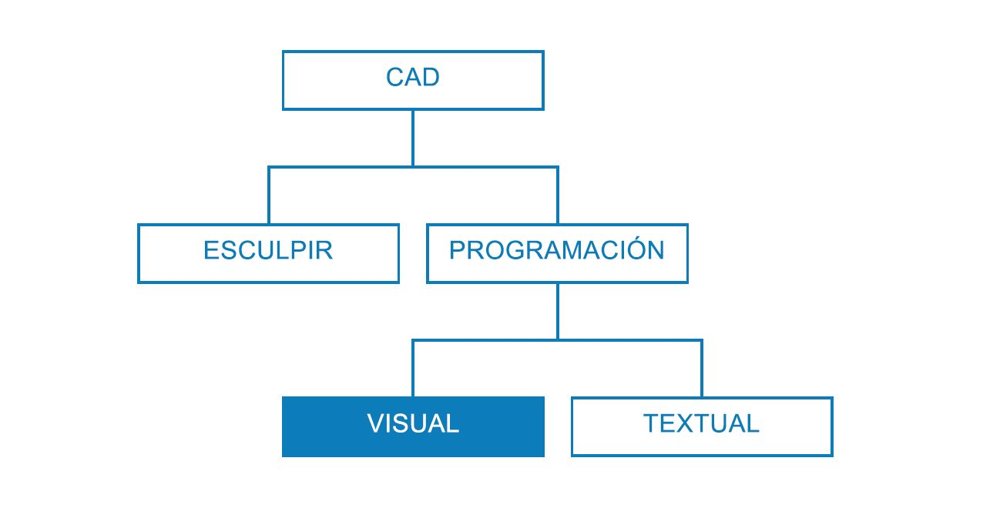
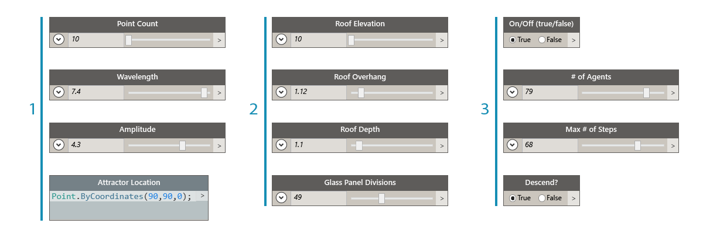
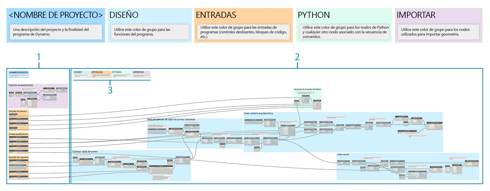
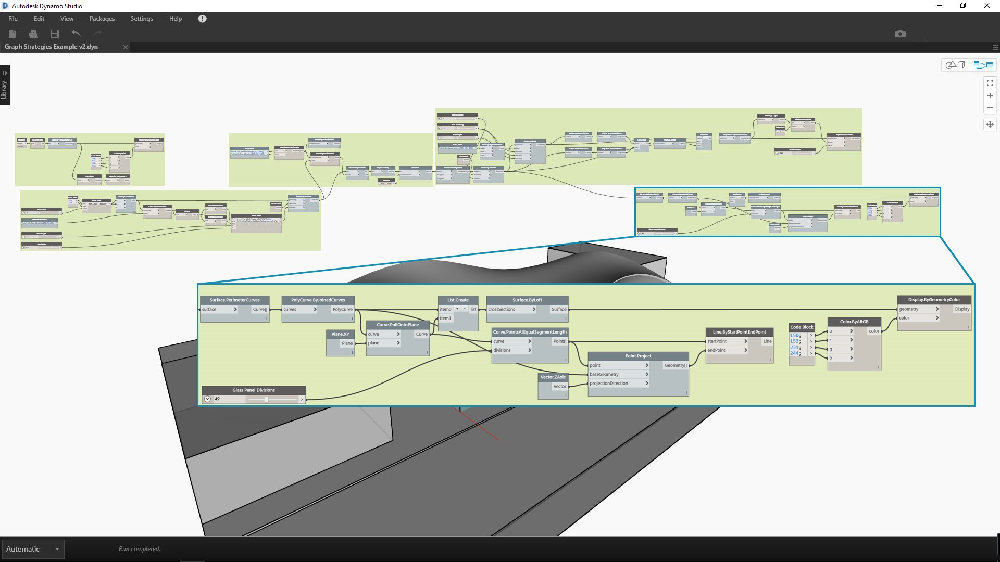
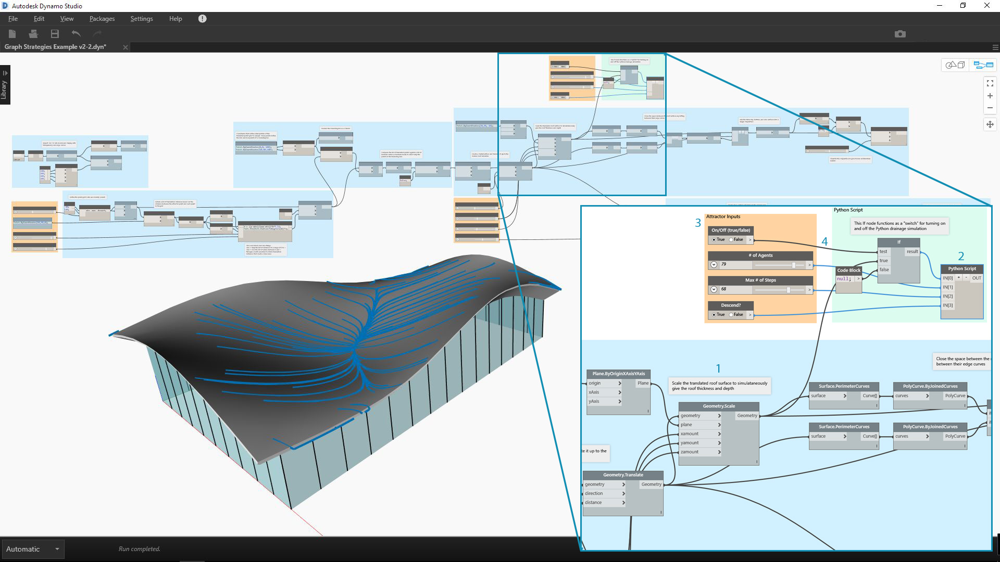

## Estrategias gráficas

Antes de este capítulo, en el manual de introducción, se describe cómo implementar las eficaces funciones de creación de secuencias de comandos visuales de Dynamo. Un conocimiento exhaustivo de estas funciones constituye una base sólida y el primer paso para la creación de programas visuales potentes. Cuando utilizamos los programas visuales sobre el terreno, los compartimos con compañeros, solucionamos errores o probamos los límites, nos encontraremos con problemas adicionales que deberemos afrontar. Si otra persona va a utilizar el programa o espera abrirlo dentro de seis meses, este debe tener una claridad gráfica y lógica inmediata. Dynamo dispone de numerosas herramientas para gestionar la complejidad del programa y, en este capítulo, se proporcionan las directrices para utilizarlas.

### Reducción de la complejidad

A medida que desarrolla el gráfico de Dynamo y prueba sus ideas, su tamaño y su complejidad pueden aumentar rápidamente. Aunque es importante crear un programa que funcione, es igualmente importante hacerlo lo más sencillo posible. No solo el gráfico se ejecutará de forma más rápida y predecible, sino que además usted y los demás usuarios entenderán su lógica más adelante. A continuación, se incluyen varias formas que le ayudarán a aclarar la lógica del gráfico.

#### Modularidad con grupos

* Los grupos permiten **crear partes con diferentes funciones** a medida que se genera un programa
* Los grupos permiten **desplazar grandes partes del programa** sin perder la modularidad y la alineación
* Puede cambiar el **color del grupo para diferenciar** su finalidad (entradas y funciones)
* Puede utilizar grupos para empezar a **organizar el gráfico a fin de simplificar la creación de nodos personalizados**.

> Los colores de este programa identifican la finalidad de cada grupo. Esta estrategia se puede utilizar para crear una jerarquía en cualquier norma o plantilla gráficas que desarrolle.

> 1. Grupo de funciones (azul)
2. Grupo de entradas (naranja)
3. Grupo de secuencias de comandos (verde)
> Para obtener información sobre cómo utilizar los grupos, consulte [Administración del programa](http://primer.dynamobim.org/en/03_Anatomy-of-a-Dynamo-Definition/3-4_best_practices.html).

#### Desarrollo eficaz con bloques de código

* En ocasiones, se puede utilizar un bloque de código para **escribir un método de nodo o número de forma más rápida que con la búsqueda** (Point.ByCoordinates, Number, String y Formula).

* Los bloques de código son útiles **cuando se desean definir funciones personalizadas en DesignScript para reducir el número de nodos de un gráfico**.

> Los ejemplos 1 y 2 realizan la misma función. Se tardó mucho menos en escribir unas pocas líneas de código que en buscar y añadir cada nodo individualmente. El bloque de código también es mucho más conciso.

> 1. DesignScript escrito en bloques de código
2. Programa equivalente en nodos
> Para obtener información sobre cómo utilizar el bloque de código, consulte [¿Qué es un bloque de código?](http://primer.dynamobim.org/en/07_Code-Block/7-1_what-is-a-code-block.html).

#### Condensación con de nodo a código

* Puede **reducir la complejidad de un gráfico mediante el método de nodo a código**, que utilizará una colección de nodos sencillos y escribirá la secuencia DesignScript correspondiente en un único bloque de código.
* El método de nodo a código permite** condensar código sin que el programa pierda claridad**.
* A continuación, se indican las **ventajas** de utilizar el método de nodo a código:
* Condensa el código fácilmente en un componente que aún puede editarse.
* Puede simplificar una parte significativa del gráfico.
* Es útil si no se modifica con frecuencia el "miniprograma".
* Permite incorporar otras características de bloque de código, como las funciones.

* A continuación, se indican las **desventajas** de utilizar el método de nodo a código:
* La asignación de nombres genéricos reduce su facilidad de lectura.
* Es más difícil de comprender para otros usuarios.
* No hay una forma sencilla de volver a la versión de programación visual.

> 1. Programa existente
2. Bloque de código creado con el método de nodo a código
> Para obtener información sobre cómo utilizar el método de nodo a código, consulte [Sintaxis de DesignScript](http://primer.dynamobim.org/en/07_Code-Block/7-2_Design-Script-syntax.html).

#### Acceso a los datos de forma flexible con List@Level

* El uso de List@Level puede ayudarle a **reducir la complejidad del gráfico mediante la sustitución de los nodos List.Map y List.Combine**, que pueden ocupar una cantidad considerable de espacio en el lienzo.
* List@Level proporciona un método **más rápido que List.Map/List.Combine para crear una lógica de nodo**, lo que permite acceder a los datos de cualquier nivel de una lista directamente desde el puerto de entrada de un nodo

> Podemos comprobar cuántos valores devuelve True BoundingBox.Contains y en qué listas mediante la activación de List@Level para la entrada "list" de CountTrue. List@Level permite al usuario determinar de qué nivel se obtendrán los datos. El uso de List@Level es flexible, eficaz y muy recomendado frente a otros métodos en los que se utilizan List.Map y List.Combine.

> 1. Recuento de valores "true" (verdaderos) en el nivel de lista 2
2. Recuento de valores "true" (verdaderos) en el nivel de lista 3
> Para obtener información sobre cómo utilizar List@Level, consulte [Listas de listas](http://primer.dynamobim.org/en/06_Designing-with-Lists/6-3_lists-of-lists.html#list@level).

### Legibilidad

Además de conseguir que el gráfico sea lo más sencillo y eficaz posible, intente lograr una claridad gráfica. A pesar de hacer todo lo posible para que el gráfico sea intuitivo con agrupaciones lógicas, es posible que las relaciones no sean evidentes a simple vista. Una sencilla nota dentro de un grupo o el cambio de nombre de un control deslizante puede ahorrarle a usted u otro usuario confusión innecesaria o tener que desplazarse por el gráfico. A continuación, se describen varias formas que le ayudarán a aplicar coherencia dentro de los gráficos y entre ellos.

#### Continuidad visual con alineación de nodos

* Para reducir el trabajo después de terminar de generar el gráfico, debe intentar asegurarse de que el diseño del nodo sea legible mediante la **alineación de los nodos con frecuencia y a medida que progresa**.
* Si otros van a trabajar con el gráfico, **asegúrese de que el diseño de cables y nodos fluya con facilidad antes de enviarlo**.
* Para facilitar la alineación, **utilice la función "Presentación de nodo de limpieza" para alinear automáticamente** el gráfico, aunque de forma menos precisa que manualmente.

> 1. Gráfico desorganizado
2. Gráfico alineado
> Para obtener información sobre cómo utilizar la alineación de nodos, consulte [Administración del programa](http://primer.dynamobim.org/en/03_Anatomy-of-a-Dynamo-Definition/3-4_best_practices.html).

#### Etiquetado descriptivo mediante cambio de nombre

* El cambio de nombre de las entradas puede ayudar a otros a comprender más fácilmente el gráfico, **sobre todo, si los elementos a los que se van a conectar no aparecen en la pantalla**.
* **Tenga cuidado de no cambiar el nombre de los nodos que no sean entradas.** Una alternativa a esto es crear un nodo personalizado a partir de un clúster de nodos y cambiarle el nombre; se comprenderá que contiene otro elemento.

> 1. Entradas para la manipulación de superficies
2. Entradas para los parámetros arquitectónicos
3. Entradas para la secuencia de comandos de simulación de drenaje
> Para cambiar el nombre de un nodo, haga clic con el botón derecho en su nombre y seleccione "Cambiar nombre de nodo...".

#### Explicación con notas

* Debe añadir una nota si alguna parte del **gráfico requiere una explicación en lenguaje sencillo** que los nodos no pueden expresar.
* Debe añadir una nota si un conjunto de **nodos o un grupo son demasiado grandes o complejos y no se pueden entender al instante**.

> 1. Una nota que describe la parte del programa que devuelve distancias de traslado sin procesar.
2. Una nota que describe el código que asigna dichos valores a una onda sinusoidal.
> Para obtener información sobre cómo añadir una nota, consulte [Administración del programa](http://primer.dynamobim.org/en/03_Anatomy-of-a-Dynamo-Definition/3-4_best_practices.html).

### Ajuste continuo

Al crear la secuencia de comandos visual, es importante comprobar que se devuelve lo que se esperaba. No todos los errores o los problemas provocarán que el programa falle inmediatamente, sobre todo, los valores nulos o cero que podrían afectar a niveles inferiores. Esta estrategia también se aborda en el contexto de la creación de secuencias de comandos de texto en las [Estrategias de creación de secuencias de comandos](http://primer.dynamobim.org/en/12_Best-Practice/13-2_Scripting-Strategies.html). El siguiente procedimiento le ayudará a asegurarse de que obtiene lo que esperaba.

#### Supervisión de datos con burbujas de visualización y vista preliminar

* Utilice las burbujas de visualización y vista preliminar al crear el programa para** comprobar que las salidas clave devuelvan lo que esperaba**.

> Los nodos de visualización se utilizan para comparar:

> 1. Las distancias de traslado sin procesar.
2. Los valores que se transfieren a través de la ecuación de seno.
> Para obtener información sobre cómo utilizar la visualización, consulte [Biblioteca](http://primer.dynamobim.org/en/03_Anatomy-of-a-Dynamo-Definition/3-2_dynamo_libraries.html).

### Garantizar la reutilización

Es muy probable que otro usuario abra el programa en algún momento, incluso aunque trabaje de forma independiente. Este debería poder comprender rápidamente lo que el programa necesita y genera a partir de sus entradas y salidas. Esto es especialmente importante cuando se desarrolla un nodo personalizado que se compartirá con la comunidad de Dynamo y se utilizará en el programa de otro usuario. Estos procedimientos generan programas y nodos fiables y reutilizables.

#### Administración de E/S

* Para garantizar la legibilidad y la escalabilidad, debe probar y **minimizar las entradas y las salidas lo máximo posible**.
* Debe intentar **elaborar una estrategia de creación de la lógica mediante la elaboración inicial de un esquema aproximado** de cómo puede funcionar la lógica antes de añadir un único nodo al lienzo. A medida que desarrolle el esquema aproximado, debe realizar un seguimiento de las entradas y las salidas que se incluirán en las secuencias de comandos.

#### Uso de valores predefinidos para insertar valores de entrada

* Si desea insertar en el gráfico **condiciones u opciones específicas**, debe utilizar valores predefinidos para acceder a ellos rápidamente.
* También puede utilizar valores predefinidos para **reducir la complejidad mediante el almacenamiento en caché de los valores de controles deslizantes** de un gráfico con tiempos de ejecución prolongados.

> Para obtener información sobre cómo utilizar los valores predefinidos, consulte [Administración de datos con valores predefinidos](http://primer.dynamobim.org/en/03_Anatomy-of-a-Dynamo-Definition/3-5_presets.html).

#### Inclusión de programas con nodos personalizados

* Debe utilizar un nodo personalizado si el **programa se puede agrupar en un único contenedor**.
* Debe utilizar un nodo personalizado **si una parte del gráfico se reutilizará a menudo** en otros programas.
* Debe utilizar un nodo personalizado si desea **compartir una función con la comunidad de Dynamo**.

> La recopilación del programa de traslado de puntos en un nodo personalizado consigue que un programa potente y exclusivo sea más fácil de comprender. Los puertos de entrada con nombres adecuados ayudarán a otros usuarios a comprender cómo utilizar el nodo. No olvide añadir descripciones y los tipos de datos necesarios para cada entrada.

> 1. Programa de atractor existente.
2. Nodo personalizado que recopila este programa, PointGrid.
> Para obtener información sobre cómo utilizar nodos personalizados, consulte [Introducción a los nodos personalizados](http://primer.dynamobim.org/en/09_Custom-Nodes/9-1_Introduction.html).

#### Creación de plantillas

* Puede crear plantillas para **establecer normas gráficas en todos los gráficos visuales a fin de garantizar que los colaboradores dispongan de una forma normalizada de comprender el gráfico**.
* Al crear una plantilla, puede normalizar **los colores de grupo y los tamaños de tipo de letra** para organizar en categorías los flujos de trabajo o las acciones de datos.
* Al crear una plantilla, puede incluso normalizar el modo en que desea **utilizar una etiqueta, un color o un estilo para indicar la diferencia entre los flujos de trabajo front-end y back-end** del gráfico.

> 1. La interfaz de usuario, o front-end, del programa incluye un nombre de proyecto, controles deslizantes de entrada y geometría de importación.
2. El back-end del programa.
3. Categorías de colores de grupo (el diseño general, las entradas, las secuencias de comandos de Python y la geometría importada).

### Ejercicio: cubierta arquitectónica

> Descargue el archivo de ejemplo que acompaña a este ejercicio (haga clic con el botón derecho y seleccione "Guardar vínculo como..."). En el Apéndice, se incluye una lista completa de los archivos de ejemplo. [RoofDrainageSim.zip](datasets/13-2/RoofDrainageSim.zip)

Ahora que hemos establecido algunos procedimientos recomendados, vamos a aplicarlos a un programa que hemos creado rápidamente. Aunque el programa genera correctamente la cubierta, el estado del gráfico es un "mapa mental" del autor. Carece de organización o una descripción de su uso. Recorreremos los procedimientos recomendados para organizar, describir y analizar el programa a fin de que otros usuarios puedan comprender cómo utilizarlo.

> El programa funciona, pero el gráfico está desorganizado.

Comencemos por determinar los datos y la geometría devueltos por el programa.

> Es crucial comprender cuándo se producen cambios importantes en los datos para establecer divisiones lógicas o modularidad. Pruebe a inspeccionar el resto del programa con nodos de visualización para ver si se pueden determinar los grupos antes de pasar al siguiente paso.

> 1. Este bloque de código con una ecuación matemática parece una parte crucial del programa. Un nodo de visualización indica que se devuelven listas de distancias de traslado.
2. La finalidad de esta área no es evidente a simple vista. La disposición de los valores "True" (verdadero) en el nivel de lista L2 de BoundingBox.Contains y la presencia de List.FilterByBoolMask sugiere que se están obteniendo muestras de una parte de la rejilla de puntos.

Una vez que entendemos las partes elementales del programa, organicémoslas en grupos.

> Los grupos permiten al usuario diferenciar visualmente las partes del programa.

> 1. Importar el modelo de emplazamiento 3D.
2. Trasladar la rejilla de puntos en función de la ecuación de seno.
3. Obtener muestra de la rejilla de puntos.
4. Crear una superficie de cubierta arquitectónica.
5. Crear un muro cortina de vidrio.

Con los grupos establecidos, alinee los nodos para crear continuidad visual en el gráfico.

> La continuidad visual ayuda al usuario a ver el flujo del programa y las relaciones implícitas entre nodos.

Consiga que el programa sea más accesible mediante la adición de otra capa de mejoras gráficas. Añada notas para describir cómo funciona un área específica del programa, proporcione nombres personalizados a las entradas y asigne colores a los distintos tipos de grupos.

> Estas mejoras gráficas permiten al usuario obtener más información sobre lo que realiza el programa. Los diferentes colores de grupo ayudan a distinguir las entradas de las funciones.

> 1. Notas
2. Entradas con nombres descriptivos

Antes de empezar a condensar el programa, busquemos una ubicación estratégica para introducir el simulador de drenaje de la secuencia de comandos de Python. Conecte la salida de la primera superficie de cubierta a escala con la entrada de secuencias de comandos respectiva.

> Hemos optado por integrar secuencias de comandos en este punto del programa para que la simulación de drenaje pueda ejecutarse en la superficie de cubierta original. No se está previsualizando esa superficie específica, pero esto nos evita tener que elegir la superficie superior de la PolySurface achaflanada.

> 1. Geometría de origen para la entrada de secuencia de comandos
2. Nodo de Python
3. Controles deslizantes de entrada
4. "Conmutador" de activación/desactivación

Ahora que todo está en su lugar, vamos a simplificar el gráfico.

> La condensación del programa con el método de nodo a código y el nodo personalizado ha reducido considerablemente el tamaño del gráfico. Los grupos que crean la superficie de cubierta y los muros se han convertido en código, ya que son muy específicos de este programa. El grupo de traslado de puntos se encuentra en un nodo personalizado, ya que podría utilizarse en otro programa. En el archivo de ejemplo, cree su propio nodo personalizado a partir del grupo de puntos de traslado.

> 1. Nodo personalizado que contiene el grupo de "rejilla de puntos de traslado".
2. Método de nodo a código para condensar los grupos de "crear superficie de cubierta arquitectónica y muro cortina".

Como paso final, cree valores predefinidos para formas de cubierta de ejemplo.

> Estas entradas son los controladores principales de la forma de cubierta y ayudarán a los usuarios a ver el potencial del programa.

Nuestro programa con vistas de dos valores predefinidos.

> Los patrones de drenaje de la cubierta proporcionan al usuario una vista analítica de los valores predefinidos respectivos.

