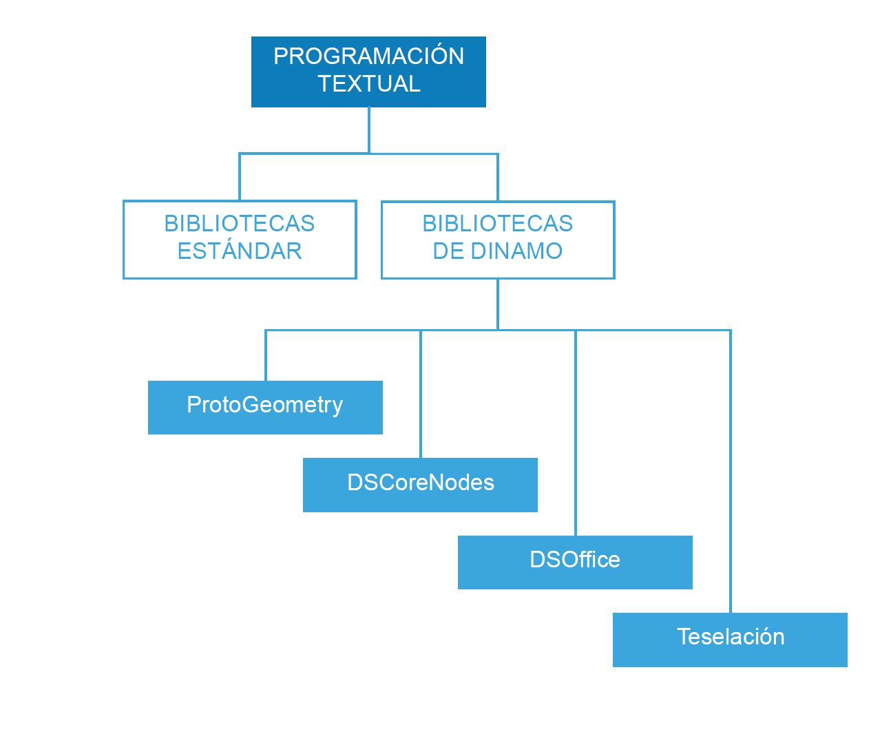

## Referencia de secuencias de comandos

Esta página de referencia amplía las prácticas recomendadas incluidas en las estrategias de creación de secuencias de comandos con más detalles sobre las bibliotecas de códigos, el etiquetado y la aplicación de estilos. Utilizaremos Python para ilustrar los conceptos que se indican a continuación; no obstante, tenga en cuenta que se aplican los mismos principios en Python y C#(Zerotouch), solo que con una sintaxis diferente.

### Qué bibliotecas utilizar

Las bibliotecas estándar son externas a Dynamo y están presentes en los lenguajes de programación Python y C# (Zerotouch). Dynamo también tiene su propio conjunto de bibliotecas que corresponden directamente con su jerarquía de nodos, lo que permite al usuario crear mediante código cualquier elemento que se pueda crear con nodos y líneas. A continuación se muestra una guía sobre los elementos a los que cada biblioteca de Dynamo proporciona acceso y cuándo utilizar una biblioteca estándar.



**Bibliotecas estándar y bibliotecas de Dynamo**

* Las bibliotecas estándar de Python y C# se pueden utilizar para generar datos avanzados y estructuras de flujo en el entorno de Dynamo.
* Las bibliotecas de Dynamo se corresponden directamente con la jerarquía de nodos para crear geometría y otros objetos de Dynamo.

**Bibliotecas de Dynamo**

* ProtoGeometry
  * Funciones: Arco, Cuadro delimitador, Círculo, Cono, Sistema de coordenadas, Cubo, Curva, Cilindro, Borde, Elipse, Arco de elipse, Cara, Geometría, Hélice, Grupo de índice, Línea, Malla, Curva Nurbs, Superficie Nurbs, Plano, Punto, Polígono, Rectángulo, Sólido, Esfera, Superficie, Topología, T-Spline, UV, Vector, Vértice.
  * Cómo importar: ```import Autodesk.DesignScript.Geometry```
  * **Tenga en cuenta que, al utilizar ProtoGeometry a través de Python o C#**, se crean objetos no administrados, que requieren que su memoria se administre manualmente. Consulte la sección **Objetos no administrados** más abajo para obtener más información.
* DSCoreNodes
  * Funciones: Color, Rango de colores 2D, Fecha y hora, Intervalo de tiempo, IO, Fórmula, Lógica, Lista, Matemáticas, Árbol cuádruple, Cadena, Rosca.
  * Cómo importar: ```import DSCore```
* Teselación
  * Funciones: Rejilla convexa, Delaunay, Voronoi.
  * Cómo importar: ```import Tessellation```
* DSOffice
  * Función: Excel.
  * Cómo importar: ```import DSOffice```

### Atención en el uso de etiquetas

Durante la creación de secuencias de comandos, utilizamos constantemente identificadores para indicar elementos como variables, tipos, funciones y otras entidades. A través de este sistema de notación simbólica, podemos hacer referencia cómodamente a la información mediante etiquetas (normalmente compuestas por una secuencia de caracteres) mientras creamos los algoritmos. Una correcta denominación de los elementos es importante en la escritura de código para que este se pueda leer y entender con facilidad por parte de otras personas y por usted mismo en un momento posterior. A continuación se indican algunos consejos que se deben tener en cuenta al asignar nombres a los elementos de su secuencia de comandos:

**Está bien utilizar abreviaturas, pero explique la abreviatura con un comentario:**

```
### BAD
csfX = 1.6
csfY= 1.3
csfZ = 1.0
```

```
### GOOD
# column scale factor (csf)
csfX = 1.6
csfY= 1.3
csfZ = 1.0
```

**Evite el etiquetado redundante:**

```
### BAD
import car
seat = car.CarSeat()
tire = car.CarTire()
```

```
### GOOD
import car
seat = car.Seat()
tire = car.Tire()
```

**Utilice lógica positiva para los nombres de las variables, en lugar de lógica negativa:**

```
### BAD
if 'mystring' not in text:
print 'not found'
else:
print 'found'
print 'processing'
```

```
### GOOD
if 'mystring' in text:
print 'found'
print 'processing'
else:
print 'not found'
```

**Dé preferencia a la "notación inversa":**

```
### BAD
agents = …
active_agents = …
dead_agents ...
```

```
### GOOD
agents = …
agents_active = …
agents_dead = ...
```

> Es más apropiado en términos estructurales.

**Los alias se deben utilizar para acortar cadenas demasiado largas y a menudo repetidas:**

```
### BAD
from RevitServices.Persistence import DocumentManager

DocumentManager = DM

doc = DM.Instance.CurrentDBDocument
uiapp = DM.Instance.CurrentUIApplication
```

```
### GOOD
from RevitServices.Persistence import DocumentManager as DM

doc = DM.Instance.CurrentDBDocument
uiapp = DM.Instance.CurrentUIApplication
```

> El uso de alias puede generar rápidamente programas muy confusos y no estándares.

**Utilice solo las palabras necesarias:**

```
### BAD
rotateToCoord = rotateFromCoord.Rotate(solid.ContextCoordinateSystem.Origin,Vector.ByCoordinates(0,0,1),5)
```

```
### GOOD
toCoord = fromCoord.Rotate(solid.ContextCoordinateSystem.Origin,Vector.ByCoordinates(0,0,1),5)
```

> "Todo debe hacerse tan simple como sea posible, pero no más". - Albert Einstein

### Estilo coherente

Por lo general, hay más de una manera de programar prácticamente cualquier cosa, por lo que su "estilo personal" de crear secuencias de comandos es el resultado de las innumerables pequeñas decisiones que usted toma (o no toma) a lo largo del camino. Dicho esto, la legibilidad y las posibilidades de mantenimiento del código son resultado directo de su coherencia interna, así como del cumplimiento de las convenciones estilísticas generales. Como regla general, el código que tiene el mismo aspecto en dos lugares diferentes, también debería funcionar de la misma manera. A continuación se ofrecen algunos consejos para escribir código claro y coherente.

**Convenciones para los nombres:** (elija una de las convenciones siguientes para cada tipo de entidad del código y úsela siempre)

* Variables, funciones, métodos, paquetes, módulos:
`minúsculas_con_guiones_bajos`

* Clases y excepciones:
`PalabrasMayúsculas`

* Métodos protegidos y funciones internas:
`_guión_bajo_sencillo_inicial_(uno, ...)`

* Métodos privados:
`__guión_bajo_doble_inicial_(uno, ...)`

* Constantes:
`TODO_MAYÚSCULAS_CON_GUIONES_BAJOS`

> Sugerencia: evite las variables de una sola letra (especialmente l, O, I) excepto en bloques muy cortos, cuando el significado es claramente visible desde el contexto inmediato.

**Uso de líneas en blanco:**

* Rodee las definiciones de clase y función de nivel superior con dos líneas en blanco.

  * Las definiciones de método dentro de una clase se rodean con una sola línea en blanco.

  * Se pueden utilizar líneas en blanco adicionales (con moderación) para separar grupos de funciones relacionadas.

**Evite los espacios innecesarios:**

* Inmediatamente después de paréntesis, corchetes o llaves:

```
### BAD
function( apples[ 1 ], { oranges: 2 } )
```

```
### GOOD:
function(apples[1], {oranges: 2})
```

* Inmediatamente antes de coma, punto y coma o dos puntos:

```
### BAD
if x == 2 : print x , y ; x , y = y , x
```

```
### GOOD
if x == 2: print x, y; x, y = y, x
```

* Inmediatamente antes del paréntesis de apertura que inicia la lista de argumentos de una llamada de función:

```
### BAD
function (1)
```

```
### GOOD
function(1)
```

* Inmediatamente antes del paréntesis de apertura que inicia una indexación o un fragmento:

```
### BAD
dict ['key'] = list [index]
```

```
### GOOD
dict['key'] = list[index]
```

* Rodee siempre estos operadores binarios con un solo espacio a cada lado:

```
assignment ( = )
augmented assignment ( += , -= etc.)
comparisons ( == , < , > , != , <> , <= , >= , in , not in , is , is not )
Booleans ( and , or , not )
```

**Vigile la longitud de las líneas:**

* No las alargue más allá de aproximadamente 79 caracteres.

* La limitación de la anchura necesaria en la ventana del editor permite tener varios archivos abiertos en paralelo y posibilita el correcto funcionamiento de las herramientas de revisión de código que presentan las dos versiones en columnas adyacentes.

* Las líneas largas se pueden dividir en varias líneas encerrando las expresiones entre paréntesis:

**Evite los comentarios obvios y redundantes:**

* En algunos casos, se requieren menos comentarios para obtener un código más legible. Especialmente si ello le obliga a utilizar nombres de símbolo significativos en lugar de descripciones.

* La adopción de buenos hábitos de codificación reduce la dependencia de los comentarios:

```
### BAD
# get the country code
country_code = get_country_code(address)

# if country code is US
if (country_code == 'US'):
# display the form input for state
print form_input_state()
```

```
### GOOD
# display state selection for US users
country_code = get_country_code(address)
if (country_code == 'US'):
print form_input_state()
```

> Sugerencia: los comentarios indican por qué, el código indica cómo.

**Tenga en cuenta el código abierto:**

* Los proyectos de código abierto se basan en los esfuerzos colaborativos de muchos desarrolladores. Estos proyectos necesitan mantener un alto nivel de legibilidad del código para que el equipo pueda trabajar en conjunto de la forma más eficiente posible. Por lo tanto, es recomendable examinar el código fuente de estos proyectos para observar lo que hacen estos desarrolladores.

* Mejore las convenciones:

  * Pregúntese si cada una de las convenciones funciona o no para las necesidades en cuestión.

  * ¿Se está poniendo en peligro la funcionalidad/eficiencia?

### Normas de C# (Zerotouch)

**Consulte estas páginas wiki para obtener instrucciones sobre cómo escribir C# para Zerotouch y contribuir con Dynamo:**

  * Este wiki describe algunas normas de codificación generales para documentar y probar el código: [https://github.com/DynamoDS/Dynamo/wiki/Coding-Standards](https://github.com/DynamoDS/Dynamo/wiki/Coding-Standards)

  * Este wiki describe específicamente las normas de nomenclatura de bibliotecas, categorías, nombres de nodos, nombres de puertos y abreviaturas: [https://github.com/DynamoDS/Dynamo/wiki/Naming-Standards](https://github.com/DynamoDS/Dynamo/wiki/Naming-Standards)

  **Objetos no administrados:**

  Cuando se utiliza la biblioteca de geometría de Dynamo *(ProtoGeometry)*desde Python o C#, los objetos de geometría que se creen no se gestionarán mediante la máquina virtual, y la memoria de muchos de estos objetos deberá limpiarse manualmente. Para limpiar objetos nativos o no administrados, puede utilizar el método **Dispose** o la palabra clave **using**. Consulte esta entrada wiki para obtener una descripción general: [https://github.com/DynamoDS/Dynamo/wiki/Zero-Touch-Plugin-Development#dispose—using-statement](https://github.com/DynamoDS/Dynamo/wiki/Zero-Touch-Plugin-Development#dispose--using-statement).

  Solo es necesario eliminar los recursos no administrados que no se devuelvan al gráfico y los que no almacenan una referencia. En el resto de esta sección, nos referiremos a estos objetos como *geometría intermedia*. Puede ver un ejemplo de esta clase de objeto en el ejemplo de código siguiente. La función de Zero Touch C# **singleCube** devuelve un único cubo, pero crea 10000 cubos adicionales durante su ejecución. Podemos fingir que esta otra geometría se ha utilizado como geometría de construcción intermedia.

  **Es muy probable que esta función de Zero Touch bloquee Dynamo.** Esto se debe a que hemos creado 10000 sólidos, pero solo hemos almacenado uno de ellos y solo hemos devuelto ese mismo. Deberíamos desechar todos los cubos intermedios, excepto el que devolvemos. No debemos desechar lo que devolvemos, ya que se propaga en el gráfico y lo utilizan otros nodos.

```
public Cuboid singleCube(){

var output = Cuboid.ByLengths(1,1,1);

for(int i = 0; i<10000;i++){
output = Cuboid.ByLengths(1,1,1);
}
return output;
}
```

El código fijo tendría un aspecto similar al siguiente:

```
public Cuboid singleCube(){

var output = Cuboid.ByLengths(1,1,1);
var toDispose = new List<Geometry>();

for(int i = 0; i<10000;i++){
toDispose.Add(Cuboid.ByLengths(1,1,1));
}

foreach(IDisposable item in toDispose ){
item.Dispose();
}

return output;
}
```

En general, únicamente es necesario desechar geometría del tipo ```Surfaces```, ```Curves``` y ```Solids```. Sin embargo, para asegurarse, puede eliminar todos los tipos de geometría (```Vectors```, ```Points```, ```CoordinateSystems```).

