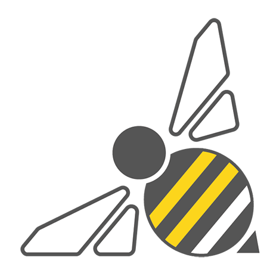
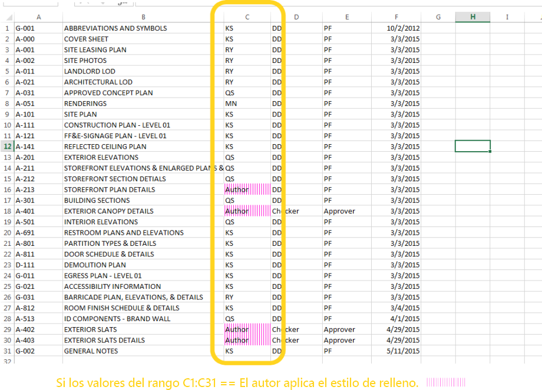
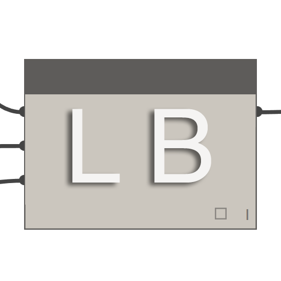
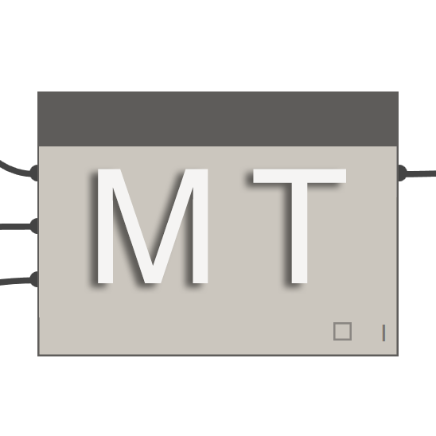

## Paquetes de Dynamo

A continuación, se incluye una lista de algunos de los paquetes más populares de la comunidad de Dynamo. Es recomendable que los desarrolladores los añadan a la lista. Recuerde que [Dynamo Primer](https://github.com/DynamoDS/DynamoPrimer) es una solución de código abierto.

||ARCHI-LAB|[Visite el sitio oficial de archi-lab. ](http://archi-lab.net/)|
| -- | -- | -- |
|archi-lab es una colección de más de 50 paquetes personalizados que amplían considerablemente la capacidad de Dynamo para interactuar con Revit. Entre los nodos del paquete de archi-lab, se incluyen desde operaciones básicas de lista a nodos de marcos avanzados de visualización de análisis para Revit.||

||BIMORPHNODES|[Visite el diccionario de BimorphNodes.](https://bimorph.com/bimorph-nodes/)|
| -- | -- | -- |
|BimorphNodes es un conjunto versátil de potentes nodos de utilidad. El paquete incluye nodos de detección de conflictos e intersección de geometría muy eficaces, nodos de conversión de curvas ImportInstance (CAD) y recopiladores de elementos vinculados que resuelven las limitaciones de la API de Revit. Para obtener más información sobre la gama completa de nodos disponibles, visite el diccionario de BimorphNodes.||

||BUMBLEBEE PARA DYNAMO|[Visite el sitio oficial de Bumblebee.](http://archi-lab.net/bumblebee-dynamo-and-excel-interop/)|
| -- | -- | -- |
|Bumblebee es un módulo de extensión de interoperabilidad de Excel y Dynamo que mejora considerablemente la capacidad de Dynamo para leer y escribir archivos de Excel.||

||CLOCKWORK PARA DYNAMO|[Visite Clockwork para Dynamo en GitHub.](https://github.com/CAAD-RWTH/ClockworkForDynamo)|
| -- | -- | -- |
|Clockwork es un conjunto de nodos personalizados para el entorno de programación visual de Dynamo. Contiene muchos nodos relacionados con Revit, pero también una gran cantidad de nodos para distintos fines, como la gestión de listas, las operaciones matemáticas, las operaciones de cadenas, las conversiones de unidades, las operaciones geométricas (principalmente, cuadros delimitadores, mallas, planos, puntos, superficies, UV y vectores) y paneles.||

||DATA|SHAPES|[Visite Data|Shapes en GitHub.](https://github.com/MostafaElAyoubi/Data-shapes)|
| -- | -- | -- |
|DataShapes es un paquete cuyo objetivo es ampliar la funcionalidad de las secuencias de comandos de Dynamo para el usuario. Se centra principalmente en incorporar una mayor funcionalidad al Reproductor de Dynamo. Para obtener más información, visite https://data-shapes.net/. ¿Desea crear impresionantes flujos de trabajo del Reproductor de Dynamo? Utilice este paquete.||

||DYNAMO SAP|[Visite el proyecto DynamoSAP en Core Studio.](http://core.thorntontomasetti.com/dynamosap-is-now-open-source/)|
| -- | -- | -- |
|DynamoSAP es una interfaz paramétrica para SAP2000 desarrollada sobre la base de Dynamo. El proyecto permite a los diseñadores y los ingenieros crear y analizar de forma genérica sistemas estructurales en SAP mediante el uso de Dynamo para controlar el modelo de SAP. El proyecto establece varios flujos de trabajo comunes que se describen en los archivos de ejemplo incluidos y ofrece una amplia gama de oportunidades para la automatización de tareas típicas en SAP.||

||DYNAMOUNFOLD|[Visite DynamoUnfold en GitHub.](https://github.com/mjkkirschner/DynamoUnfold)|
| -- | -- | -- |
|Esta biblioteca amplía la funcionalidad de Dynamo/Revit al permitir a los usuarios desplegar geometría de superficie y PolySurface. La biblioteca permite a los usuarios convertir superficies en topología triangular plana y, a continuación, desplegarlas con las herramientas de protogeometría de Dynamo. Este paquete también incluye algunos nodos experimentales, así como algunos archivos de ejemplo básicos.||

||DYNASTRATOR|[Descargue Dynastrator en Package Manager.](http://dynamopackages.com/)|
| -- | -- | -- |
|Importe imágenes vectoriales desde Illustrator o la Web mediante .svg. Esto permite importar dibujos creados manualmente en Dynamo para operaciones paramétricas.||

||ENERGY ANALYSIS FOR DYNAMO|[Visite el proyecto Energy Analysis for Dynamo en GitHub.](https://github.com/tt-acm/EnergyAnalysisForDynamo)|
| -- | -- | -- |
|Energy Analysis for Dynamo permite el modelado energético paramétrico y los flujos de trabajo de análisis energético de todo el edificio en Dynamo 0.8. También permite al usuario configurar el modelo energético desde Autodesk Revit, enviarlo a Green Building Studio para el análisis energético DOE2 y explorar los resultados devueltos por el análisis. El paquete está siendo desarrollado por CORE studio de Thornton Tomasetti.||

||FIREFLY PARA DYNAMO|[Descargue Firefly en Dynamo Package Manager.](http://dynamopackages.com/)|
| -- | -- | -- |
|Firefly es un conjunto de nodos que permiten a Dynamo comunicarse con dispositivos de entrada y salida, como el microcontrolador Arduino. Como el flujo de datos se produce "en directo", Firefly ofrece muchas oportunidades para crear prototipos interactivos entre el mundo digital y el físico a través de cámaras web, teléfonos móviles, controladores de juegos, sensores, etc.||

||LUNCHBOX PARA DYNAMO|[Consulte LunchBox para Dynamo en Proving Ground.](http://provingground.io/tools/lunchbox/)|
| -- | -- | -- |
|LunchBox es un conjunto de nodos reutilizables de geometría y administración de datos. Las herramientas se han probado con Dynamo 0.8.1 y Revit 2016. La herramienta incluye nodos para paneles de superficies, geometría, recopilación de datos de Revit, etc.||

||MANTIS SHRIMP|[Visite el sitio oficial de Mantis Shrimp.](http://archi-lab.net/mantis-shrimp-getting-started/)|
| -- | -- | -- |
|Mantis Shrimp es un proyecto de interoperabilidad que permite importar fácilmente geometría de Griciopper o Rhino a Dynamo.||

||KIT DE HERRAMIENTAS DE MALLA|[Visite el Kit de herramientas de malla en GitHub.](https://github.com/DynamoDS/Dynamo/wiki/Dynamo-Mesh-Toolkit)|
| -- | -- | -- |
|El Kit de herramientas de malla de Dynamo proporciona muchas herramientas útiles para trabajar con la geometría de malla. La funcionalidad de este paquete incluye la posibilidad de importar mallas desde formatos de archivo externos, generar mallas a partir de objetos de geometría de Dynamo existentes y crear manualmente mallas a través de información de vértices y conectividad. Además, este kit incluye herramientas para modificar y reparar la geometría de malla.||

||OPTIMO|[Visite Optimo en GitHub.](https://github.com/BPOpt/Optimo/wiki/0_-Home)|
| -- | -- | -- |
|Optimo ofrece a los usuarios de Dynamo la capacidad de optimizar los problemas de diseño autodefinidos mediante diversos algoritmos evolutivos. Los usuarios pueden definir el objetivo del problema o un conjunto de objetivos, así como funciones de adecuación específicas.||

||RHYNAMO|[Visite Rhynamo en Bitbucket.](https://bitbucket.org/caseinc/rhynamo)|
| -- | -- | -- |
|La biblioteca de nodos de Rhynamo permite a los usuarios leer y escribir archivos 3DM de Rhino en Dynamo. Rhynamo convierte la geometría de Rhino en geometría utilizable en Dynamo mediante la biblioteca OpenNURBS de McNeel, lo que ofrece nuevos flujos de trabajo que pueden intercambiar geometría y datos con fluidez entre Rhino y Revit. Este paquete contiene también algunos nodos experimentales que permiten el acceso "en directo" a la línea de comandos de Rhino.||

||RHYTHM|[Visite Rhythm en GitHub.](https://github.com/sixtysecondrevit/RhythmForDynamo)|
| -- | -- | -- |
|A primera vista, Rhythm no parece nada especial. No tiene código sofisticado ni ningún elemento de esa naturaleza. Sin embargo, lo que Rhythm representa es el resultado del pensamiento práctico y la diligencia. Este paquete se ha diseñado para ayudar a los usuarios a usar de forma eficaz Revit con Dynamo mediante Rhythm. Rhythm se compone principalmente de nodos de Dynamo predefinidos que se utilizan de forma inteligente a medida que se aplican al entorno de Revit.||

