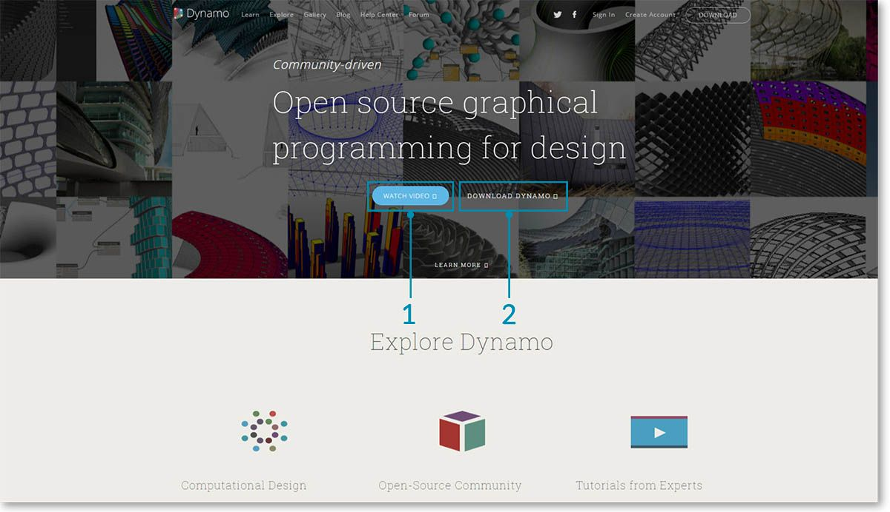
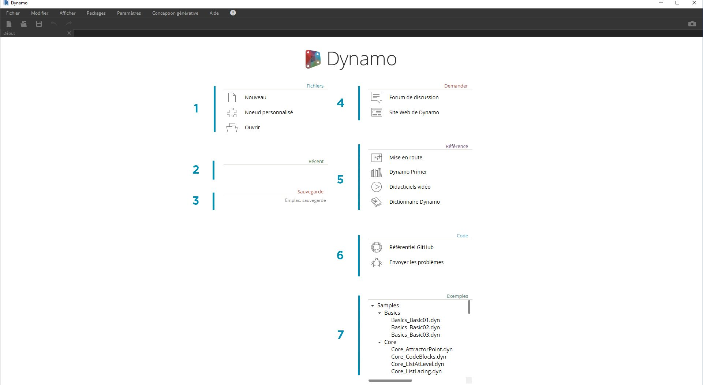
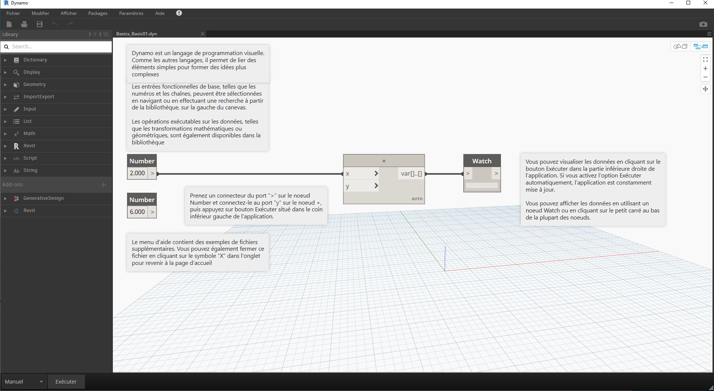

## Installation et lancement de Dynamo

Dynamo est un projet de développement open source actif avec des programmes d'installation téléchargeables pour les versions officielles et préliminaires, c'est-à-dire pour les versions quotidiennes. Téléchargez la version officielle pour commencer ou contribuez à la transformation de Dynamo grâce aux versions quotidiennes ou au projet GitHub.

### Téléchargement

Pour télécharger la version officielle de Dynamo, rendez-vous sur le [site Web de Dynamo](http://dynamobim.com/). Lancez le téléchargement immédiatement en cliquant sur la page d'accueil ou accédez à la page de téléchargement dédiée.

> 1. Regardez la vidéo sur la conception informatique avec Dynamo for Architecture.
2. Ou accédez à la page de téléchargement.

Ici, vous pouvez télécharger les toutes dernières versions de développement ou accéder au projet [Dynamo Github](https://github.com/DynamoDS/Dynamo).

> 1. Téléchargez le programme d'installation de la version officielle.
2. Téléchargez les programmes d'installation de build quotidiens.
3. Découvrez les packages personnalisés d'une communauté de développeurs.
4. Participez au développement de Dynamo sur GitHub.

### Installation

Accédez au répertoire du programme d'installation téléchargé et lancez le fichier exécutable. Au cours de l'installation, le programme vous permet de personnaliser les composants qui seront installés.

> 1. Choisissez les composants à installer.

Ici, vous devez décider si vous voulez inclure les composants qui font le lien entre Dynamo et d'autres applications installées, telles que Revit. Pour plus d'informations sur la plate-forme Dynamo, reportez-vous au **chapitre 1.2**.

### Lancement

Pour lancer Dynamo, accédez au dossier \Program Files\Dynamo\Dynamo Revit\x.y, puis choisissez DynamoSandbox.exe. Cette action permet d'ouvrir la version autonome et de présenter la *page de démarrage* de Dynamo. Sur cette page, vous pouvez voir les menus et barres d'outils standard, ainsi qu'un ensemble de raccourcis qui vous permettent d'accéder aux fonctionnalités des fichiers ou à des ressources supplémentaires.

> 1. Fichiers : permet de démarrer un nouveau fichier ou d'ouvrir un fichier existant
2. Récent : permet de faire défiler les fichiers récents
3. Sauvegarde : permet d'accéder à vos sauvegardes
4. Demander : permet d'accéder directement au forum des utilisateurs ou au site Web de Dynamo
5. Référence : permet d'accéder à d'autres ressources de formation
6. Code : permet de participer au projet de développement open source
7. Exemples : permet de voir les exemples fournis avec l'installation

Ouvrez le premier fichier d'exemple pour ouvrir votre premier espace de travail et confirmer que Dynamo fonctionne correctement. Cliquez sur Exemples > Outils de base > **Basics_Basic01.dyn**.

> 1. Vérifiez que la barre d'exécution indique "Automatique" ou cliquez sur Exécuter.
2. Suivez les instructions et connectez le nœud **Number** au nœud **+**.
3. Vérifiez que ce nœud Watch affiche un résultat.

Si ce fichier se charge correctement, vous devriez pouvoir exécuter votre premier programme visuel avec Dynamo.

