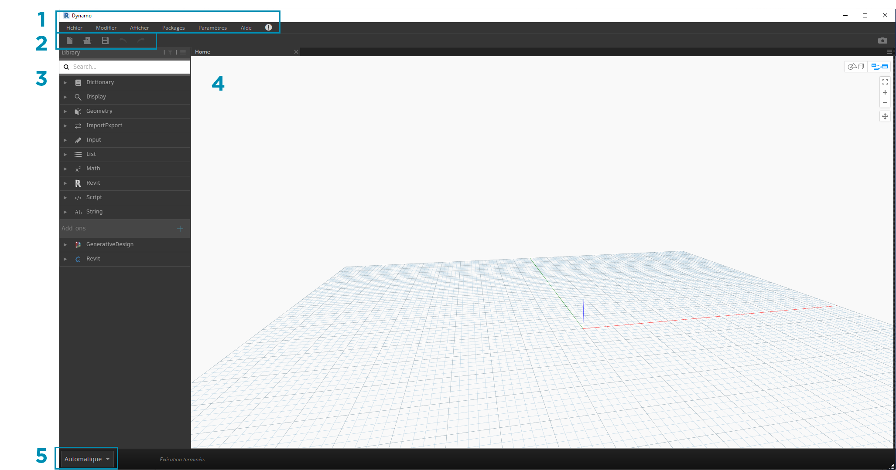
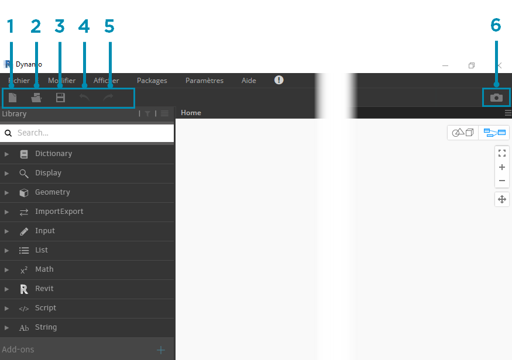
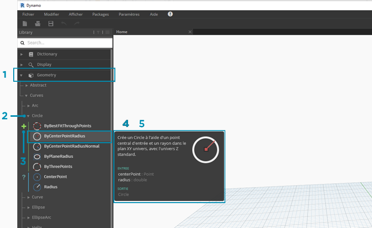
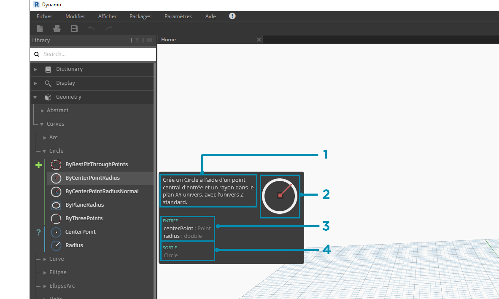
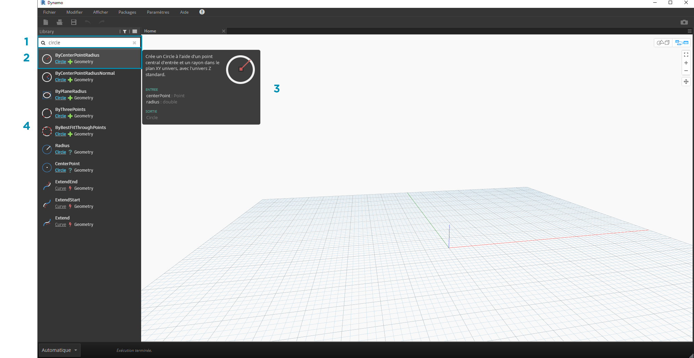
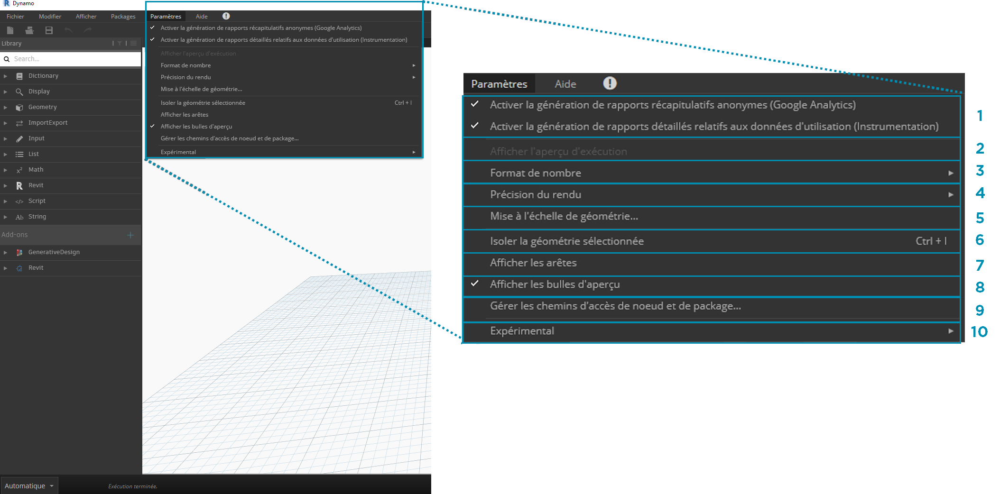
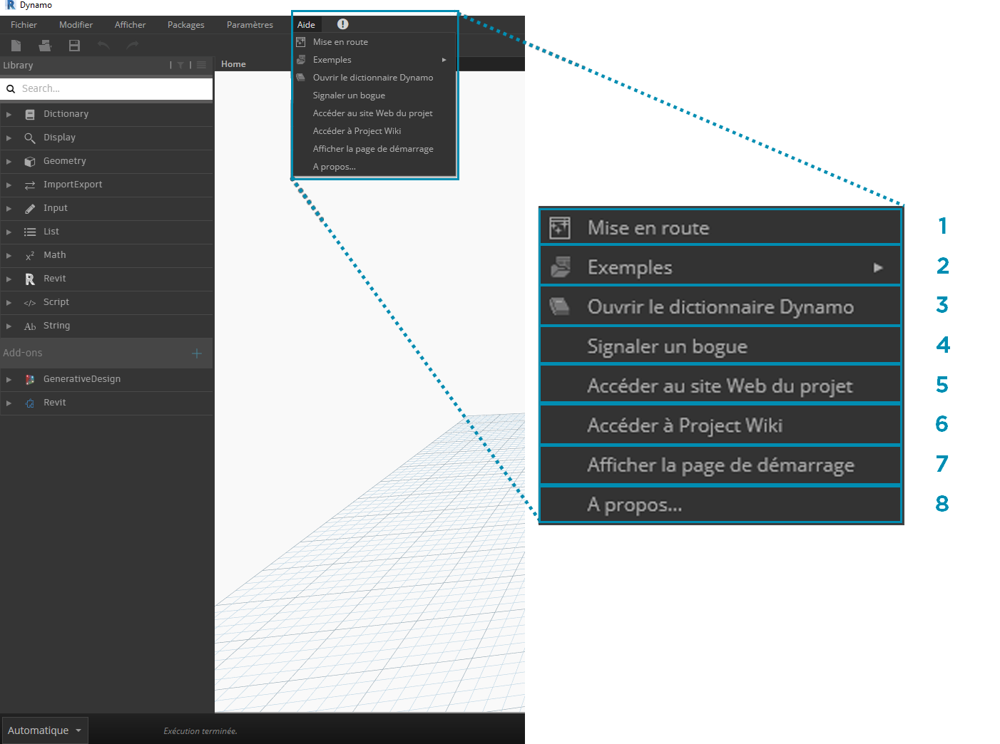

## Interface utilisateur de Dynamo

L'interface utilisateur de Dynamo est organisée en cinq zones principales, la plus grande étant l'espace de travail dans lequel vous créez les programmes visuels.

> 1. Menus
2. Barre d'outils
3. Bibliothèque
4. Espace de travail
5. Barre d'exécution

Explorons l'interface utilisateur, ainsi que les fonctionnalités de chaque zone.

#### Menus

Les menus déroulants permettent de trouver rapidement certaines des fonctionnalités de base de l'application Dynamo. Comme la plupart des logiciels Windows, les deux premiers menus proposent des actions relatives à la gestion des fichiers et des opérations de sélection et de modification du contenu. Les autres menus sont plus spécifiques de Dynamo.

> 1. Fichier
2. Modifier
3. Affichage
4. Packages
5. Paramètres
6. Aide
7. Notifications

#### Barre d'outils

La barre d'outils de Dynamo contient une série de boutons permettant d'accéder rapidement aux fichiers et aux commandes Annuler [Ctrl + Z] et Rétablir [Ctrl + Y]. À l'extrémité droite se trouve un autre bouton qui permet d'exporter un cliché de l'espace de travail, ce qui est extrêmement utile pour la documentation et le partage.

> 1. Nouveau : permet de créer un fichier .dyn.
2. Ouvrir : permet d'ouvrir un fichier .dyn (espace de travail) ou .dyf (nœud personnalisé) existant.
3. Enregistrer/Enregistrer sous : permet d'enregistrer votre fichier .dyn ou .dyf actif.
4. Annuler : permet d'annuler la dernière action.
5. Rétablir : permet de rétablir la prochaine action.
6. Exporter l'espace de travail en tant qu'image : permet d'exporter l'espace de travail visible en tant que fichier PNG.

#### Bibliothèque

La bibliothèque contient tous les nœuds chargés, y compris les nœuds par défaut fournis avec l'installation, ainsi que tous les autres nœuds ou packages personnalisés chargés. Les nœuds de la bibliothèque sont organisés de manière hiérarchique dans les bibliothèques, les catégories et, le cas échéant, les sous-catégories selon que les nœuds **créent** des données, exécutent une **action** ou **interrogent** des données.

##### Navigation

Par défaut, la **bibliothèque** contient huit catégories de nœuds. **Core** et **Geometry** sont d'excellents menus à explorer en premier, car ils contiennent la plus grande quantité de nœuds. Parcourir ces catégories est la manière la plus rapide de comprendre la hiérarchie des éléments que vous pouvez ajouter à votre espace de travail et la meilleure façon de découvrir les nouveaux nœuds que vous n'avez pas utilisés auparavant.

> Passez maintenant à l'ensemble de nœuds par défaut. Notez que nous étendrons ultérieurement cette bibliothèque avec des nœuds personnalisés, des bibliothèques supplémentaires et le gestionnaire de package.

> 1. Dictionnaire
2. Afficher
3. Geometry
4. ImportExport
5. Entrée
6. Liste
7. Correspondances
8. Revit
9. Script
10. Chaîne
11. Compléments

Parcourez la bibliothèque en cliquant sur les menus. Cliquez sur Geometry > Curves > Circle. Une nouvelle partie du menu et notamment les libellés **Créer** et **Requête** s'affichent.

> 1. Bibliothèque
2. Catégorie
3. Sous-catégorie : Create/Actions/Query
4. Nœud
5. Description du nœud et propriétés : cet encadré s'affiche lorsque vous placez le curseur sur l'icône du nœud.

Dans le même menu Circle, placez le curseur de la souris sur **ByCenterPointRadius**. La fenêtre affiche des informations plus détaillées sur le nœud, en plus de son nom et de son icône. Ces informations permettent de comprendre ce que fait le nœud, ce qu'il requiert pour les entrées et ce qu'il va donner en sortie.

> 1. Description : description du nœud en langage simple
2. Icône : version plus grande de l'icône dans le menu de la bibliothèque
3. Entrée(s) : nom, type de données et structure de données
4. Sortie(s) : type de données et structure

##### Recherche

Si vous avez une idée du nœud que vous souhaitez ajouter à votre espace de travail, le champ **Rechercher** est votre meilleur ami. Lorsque vous ne modifiez pas les paramètres ni ne spécifiez de valeurs dans l'espace de travail, le curseur est toujours présent dans ce champ. Si vous commencez à taper, la bibliothèque Dynamo affiche la meilleure correspondance sélectionnée (avec les chemins de navigation afin de savoir où elle se trouve dans les catégories de nœud) et une liste d'autres correspondances avec la recherche. Lorsque vous appuyez sur Entrée ou cliquez sur l'article dans le navigateur tronqué, le nœud mis en surbrillance est ajouté au centre de l'espace de travail.

> 1. Champ de recherche
2. Meilleur résultat/Sélection
3. Autres correspondances

### Paramètres

Ces options, de la géométrie aux paramètres utilisateur, sont disponibles dans le menu **Paramètres**. Vous pouvez choisir d'activer ou de désactiver le partage des données utilisateur dans le but d'améliorer Dynamo et de définir la précision décimale de l'application et la qualité du rendu de la géométrie.

> 1. Activation de la génération de rapports : options de partage des données utilisateur permettant d'améliorer Dynamo.
2. Afficher l'aperçu d'exécution : permet d'afficher un aperçu de l'état d'exécution du graphique. Les nœuds programmés pour l'exécution sont mis en surbrillance dans le graphique.
3. Options de format de nombre : permet de modifier les paramètres du document concernant les décimales.
4. Précision du rendu : permet d'augmenter ou de réduire la qualité du rendu du document.
5. Mise à l'échelle de géométrie : permet de sélectionner la plage de géométrie sur laquelle vous travaillez.
6. Isoler la géométrie sélectionnée : géométrie d'arrière-plan isolée fondée sur votre sélection de nœuds.
7. Afficher/masquer les arêtes de géométrie : permet d'activer ou de désactiver les arêtes de géométrie 3D.
8. Afficher/masquer les bulles d'aperçu : permet d'activer ou de désactiver les bulles d'aperçu des données sous les nœuds.
9. Gérer les chemins de nœud et de package : permet de gérer les chemins d'accès aux fichiers pour que les nœuds et les packages s'affichent dans la bibliothèque.
10. Activation des fonctionnalités expérimentales : utilisez les nouvelles fonctionnalités bêta de Dynamo.

### Aide

Si vous êtes bloqué, consultez le menu **Aide**. Vous pouvez trouver ici les fichiers d'exemple fournis avec votre installation, et accéder à l'un des sites Web de référence Dynamo via votre navigateur Internet. Si nécessaire, vérifiez la version de Dynamo installée et si elle est à jour via l'option **À propos de**.

> 1. Mise en route : brève introduction à l'utilisation de Dynamo.
2. Exemples : fichiers d'exemple de référence.
3. Ouvrir le dictionnaire Dynamo : ressource avec documentation sur tous les nœuds.
4. Signaler un bogue : permet d'ouvrir un problème sur GitHub.
5. Accéder au site Web du projet : permet d'afficher le projet Dynamo sur GitHub.
6. Accéder au wiki du projet : permet de consulter le wiki pour en savoir plus sur le développement à l'aide de l'API Dynamo, qui prend en charge les bibliothèques et les outils.
7. Afficher la page de démarrage : permet de revenir à la page de démarrage de Dynamo lorsque vous vous trouvez dans un document.
8. À propos : données relatives à la version de Dynamo.

