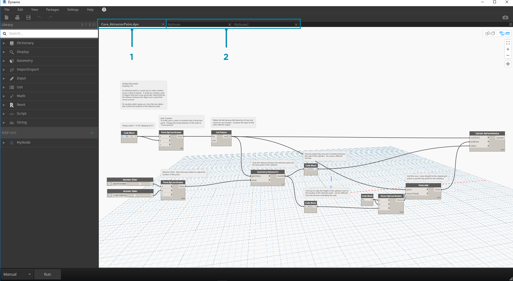
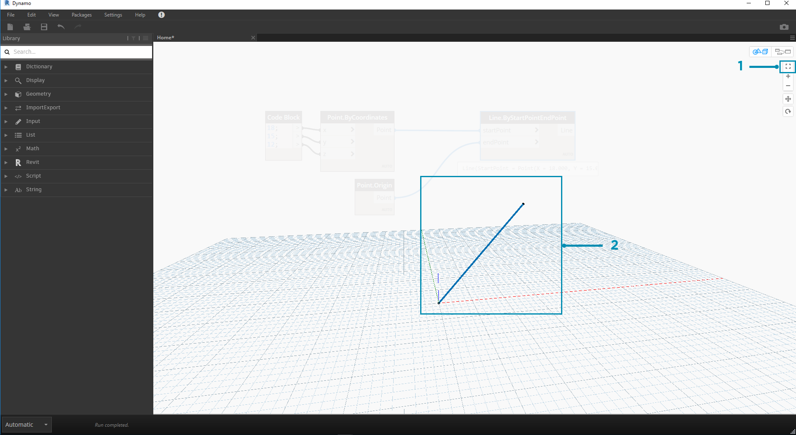
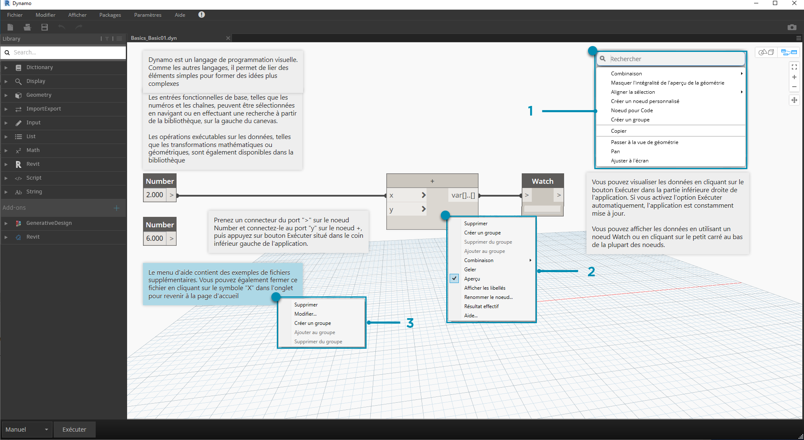
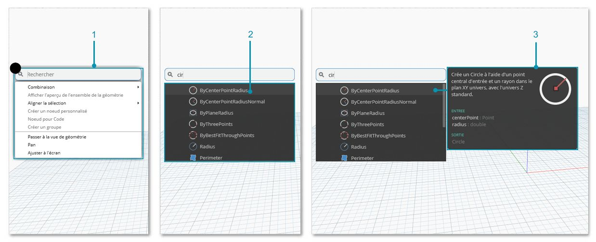

## L'espace de travail

L'**espace de travail** Dynamo permet de développer des programmes visuels, mais également d'afficher un aperçu de la géométrie obtenue. Que vous travailliez dans un espace de travail d'accueil ou un nœud personnalisé, utilisez la souris ou les boutons situés en haut à droite pour naviguer dans l'interface. Basculer entre les modes situés en bas à droite permet de basculer entre les différents aperçus que vous naviguez.

> Remarque : étant donné que les nœuds et la géométrie ont un ordre de tracé, vous pouvez avoir des objets rendus les uns sur les autres. Cela peut être difficile lorsque vous ajoutez plusieurs nœuds dans l'ordre, car ils peuvent être rendus dans la même position dans l'espace de travail.

> 1. Onglets
2. Boutons Zoom/Panoramique
3. Mode aperçu
4. Double-clic sur l'espace de travail

### Onglets

L'onglet Espace de travail actif vous permet de parcourir et de modifier votre programme. Lorsque vous ouvrez un nouveau fichier, vous ouvrez par défaut un nouvel espace de travail d'**accueil**. Vous pouvez également ouvrir un nouvel espace de travail **Nœud personnalisé** à partir du menu Fichier ou de l'option *Nouveau nœud de la sélection* accessible par un clic droit lorsque les nœuds sont sélectionnés (plus d'informations sur cette fonctionnalité ultérieurement).

> Remarque : il se peut que vous n'ayez qu'un seul espace de travail d'accueil ouvert à la fois. Toutefois, plusieurs espaces de travail de nœud personnalisés peuvent être ouverts dans d'autres onglets.

### Navigation entre le graphique et l'aperçu 3D

Dans Dynamo, le graphique et les résultats 3D du graphique (dans le cas de la création de la géométrie) sont rendus dans l'espace de travail. Par défaut, l'aperçu actif est le graphique. Par conséquent, l'utilisation des boutons de navigation ou de la molette de la souris pour effectuer un panoramique et un zoom vous permet de vous déplacer dans le graphique. Vous pouvez basculer entre les aperçus actifs de trois façons différentes :

> 1. Boutons d'option d'aperçu dans l'espace de travail
2. Cliquez avec le bouton droit de la souris dans l'espace de travail et sélectionnez *Passez à une vue...*
3. Raccourci clavier (Ctrl + B)

Le mode de navigation de l'aperçu 3D permet également de **manipuler directement** les points, comme illustré dans la rubrique [Mise en route](http://primer.dynamobim.org/02_Hello-Dynamo/2-6_the_quick_start_guide.html).

### Zoom pour recentrer

En mode de navigation de l'aperçu 3D, vous pouvez facilement effectuer des panoramiques, des zooms et des rotations autour des modèles. Toutefois, pour effectuer un zoom spécifique sur un objet créé par un nœud de géométrie, utilisez l'icône Zoom tout avec un seul nœud sélectionné.

> 1. Sélectionnez le nœud correspondant à la géométrie qui permet de centrer la vue.
2. Passez à la navigation de l'aperçu 3D.

> 1. Cliquez sur l'icône Zoom tout située dans la partie supérieure droite.
2. La géométrie sélectionnée est centrée dans la vue.

### Bonjour, souris !

En fonction du mode d'aperçu actif, les boutons de la souris permettent d'effectuer différentes actions. En général, le clic gauche de la souris permet de sélectionner et de spécifier les entrées, le clic droit permet d'accéder aux options et le clic sur la molette permet de naviguer dans l'espace de travail. Le clic droit permet d'afficher des options basées sur le contexte de sélection.

> 1. Cliquez avec le bouton droit sur l'espace de travail.
2. Cliquez avec le bouton droit sur un nœud.
3. Cliquez avec le bouton droit sur une note.

Voici un tableau des interactions de la souris par aperçu :

|**Action de la souris**|**Aperçu du graphique**|**Aperçu 3D**|
| -- | -- | -- |
|Clic avec le bouton gauche|Sélectionner|N/A|
|Clic avec le bouton droit|Menu contextuel|Options de zoom|
|Clic sur la molette|Panoramique|Faire un panoramique|
|Défilement|Zoom avant/arrière|Zoom avant/arrière|
|Double-clic|Créer un bloc de code|N/A|

### Recherche dans la zone de dessin

La fonctionnalité "Recherche dans la zone de dessin" vous permet d'accélérer le workflow Dynamo en vous offrant un accès aux descriptions des nœuds et aux info-bulles sans vous déplacer dans le graphique ! En cliquant avec le bouton droit de la souris, vous pouvez accéder à toutes les fonctionnalités utiles de la "recherche de bibliothèques", où que vous soyez dans la zone de dessin.

> 1. Cliquez avec le bouton droit de la souris n'importe où dans la zone de dessin afin d'afficher la fonction de recherche. Lorsque la barre de recherche est vide, la liste déroulante est un menu d'aperçu.
2. Lorsque vous saisissez du texte dans la barre de recherche, le menu déroulant est mis à jour en continu et affiche les résultats de recherche les plus pertinents.
3. Placez le curseur sur les résultats de la recherche afin d'afficher les descriptions et les info-bulles correspondantes.

## Arrangement de l'affichage des nœuds

L'organisation de votre zone de dessin Dynamo devient de plus en plus importante à mesure que vos fichiers se complexifient. Bien que l'outil **Aligner la sélection** soit disponible pour de petites quantités de nœuds sélectionnées, Dynamo comprend également l'outil **Arranger l'affichage des nœuds** qui permet de faciliter le nettoyage global des fichiers.

#### Avant l'arrangement des nœuds

> 1. Sélectionnez les nœuds à organiser automatiquement ou laissez-les tous désélectionnés pour tous les nettoyer du fichier.
2. La fonction Arranger l'affichage des nœuds se trouve sous l'onglet Modifier.
#### Après l'arrangement des nœuds

3. Les nœuds sont automatiquement répartis et alignés. Les nœuds décalés ou se chevauchant sont réarrangés et alignés avec les nœuds voisins.

