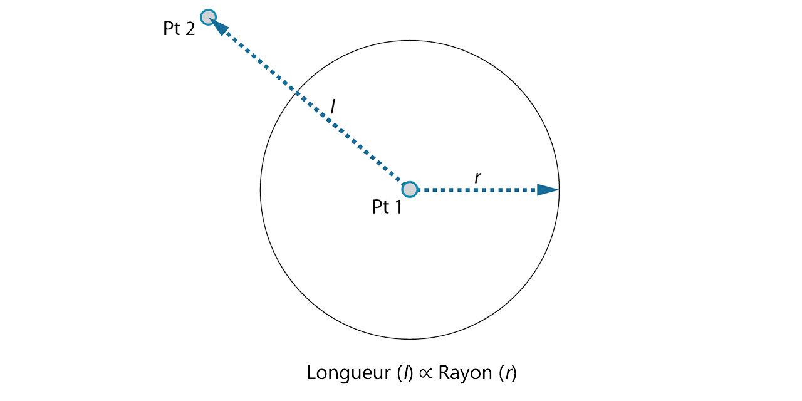
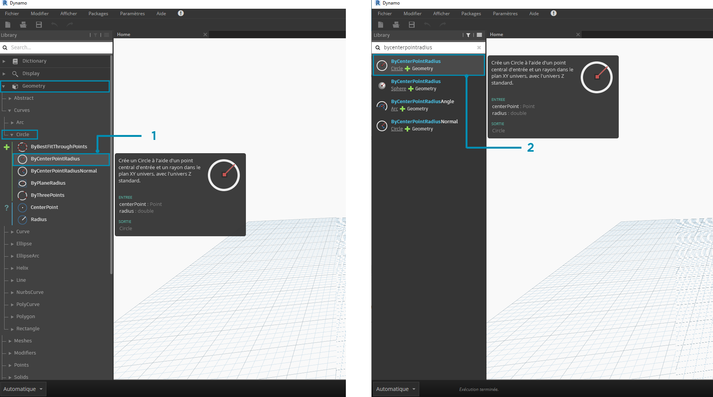
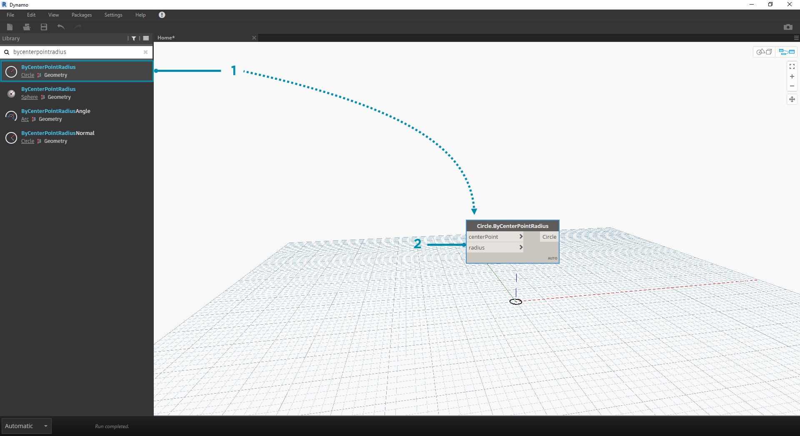

## MISE EN ROUTE

Maintenant que vous vous êtes familiarisés avec la présentation de l'interface et la navigation dans l'espace de travail, l'étape suivante consiste à comprendre le workflow classique afin de développer un graphique dans Dynamo. Commencez par créer un cercle de taille dynamique, puis créez un réseau de cercles de rayon variable.

### Définition des objectifs et des relations

Avant d'ajouter quoi que ce soit à l'espace de travail Dynamo, il est essentiel de bien comprendre votre objectif et les relations importantes utilisées. N'oubliez pas que chaque fois que vous connectez deux nœuds, vous créez un lien explicite entre eux. Vous pouvez modifier le flux de données ultérieurement, mais une fois la connexion établie, cette relation est engagée. Dans cet exercice, vous allez créer un cercle (*objectif*) dans lequel l'entrée radius est définie par une distance par rapport à un point situé à proximité (*relation*).



> Un point qui définit une relation basée sur la distance est généralement appelé "point d'attraction". Ici, la distance jusqu'au point d'attraction est utilisée pour spécifier la taille du cercle.

### Ajout de nœuds à l'espace de travail

Maintenant que vos objectifs et relations sont schématisés, vous pouvez commencer à créer votre graphique. Vous avez besoin des nœuds qui représentent la séquence d'actions exécutée par Dynamo. Étant donné que vous essayez de créer un cercle, commencez par localiser un nœud qui effectue cette action. À l'aide du champ de recherche ou de la bibliothèque, vous pouvez remarquer qu'il existe plusieurs méthodes permettant de créer un cercle.



> 1. Accédez à Geometry > Curves > Circle > **Cercle.ByPointRadius**
2. Rechercher > "ByCenterPointRadius..."

Cliquez sur le nœud **Circle.ByPointRadius** afin de l'ajouter à l'espace de travail. Le nœud doit apparaître au centre de l'espace de travail.



> 1. Nœud Circle.ByPointandRadius dans la bibliothèque.
2. Cliquez sur le nœud dans la bibliothèque afin de l'ajouter à l'espace de travail.

Vous avez également besoin des nœuds **Point.ByCoordinates**, **Number Input** et **Number Slider**.


> 1. Geometry > Points > Point > **Point.ByCoordinates**
2. Geometry > Geometry > **DistanceTo**
3. Input > Basic > **Number**
4. Input > Basic > **Number Slider**

### Connexion de nœuds avec des fils

Maintenant que vous avez quelques nœuds, connectez les ports des nœuds avec des fils. Ces connexions définissent le flux de données.


> 1. **Number** avec **Point.ByCoordinates**
2. **Number Sliders** avec **Point.ByCoordinates**
3. **Point.ByCoordinates** (2) avec **DistanceTo**
4. **Point.ByCoordinates** et **DistanceTo** avec **Circle.ByCenterPointRadius**

### Exécution du programme

Lorsque le flux de programme a été défini, il suffit de demander à Dynamo de l'exécuter. Une fois le programme exécuté (automatiquement ou en mode manuel), les données passent par les fils et les résultats s'affichent dans l'aperçu 3D.


> 1. Cliquez sur Exécuter : si la barre d'exécution est en mode manuel, cliquez sur Exécuter pour exécuter le graphique.
2. Aperçu du nœud : placez le curseur de la souris sur la boîte située dans le coin inférieur droit d'un nœud pour afficher une fenêtre contextuelle des résultats.
3. Aperçu 3D : si l'un des nœuds crée une géométrie, elle s'affiche dans l'aperçu 3D.
4. Géométrie de sortie sur le nœud de création.

### Ajout de détails

Si votre programme fonctionne, un cercle qui passe par le point d'attraction doit apparaître dans l'aperçu 3D. C'est parfait, mais vous pouvez ajouter plus de détails ou plus de contrôles. Ajustez l'entrée au nœud de cercle afin de pouvoir calibrer l'influence sur le rayon. Ajoutez un autre **Number Slider** à l'espace de travail, puis cliquez deux fois sur une zone vide de l'espace de travail pour ajouter un nœud **Code Block**. Modifiez le champ dans le bloc de code pour spécifier ```X/Y```.


> 1. **Code Block**
2. **DistanceTo** et **Number Slider** avec **Code Block**
3. **Code Block** avec **Circle.ByCenterPointRadius**

### Complexité accrue

Commencer simplement et augmenter la complexité au fur et à mesure est un moyen efficace de développer progressivement votre programme. Une fois que ce programme fonctionne pour un cercle, appliquez sa puissance à plusieurs cercles. Au lieu d'un point central, si vous utilisez une grille de points et prenez en compte la modification de la structure de données obtenue, votre programme va créer un grand nombre de cercles, chacun avec une valeur de rayon unique définie par la distance calibrée par rapport au point d'attraction.


> 1. Ajoutez un nœud **Number Sequence** et remplacez les entrées de **Point.ByCoordinates**. Cliquez avec le bouton droit sur Point.ByCoordinates et sélectionnez Combination > Produit vectoriel.
2. Ajoutez un nœud **Flatten** après Point.ByCoordinates. Pour aplanir complètement une liste, laissez l'entrée ```amt``` à la valeur par défaut de ```-1```.
3. L'aperçu 3D est mis à jour avec une grille de cercles.

### Ajustement avec manipulation directe

Parfois, la manipulation numérique n'est pas la bonne approche. Vous pouvez désormais manipuler manuellement la géométrie de points lorsque vous naviguez dans l'aperçu 3D en arrière-plan. Vous pouvez également contrôler d'autres géométries créées à l'aide d'un point. Par exemple, **Sphere.ByCenterPointRadius** peut également être manipulé directement. Vous pouvez contrôler l'emplacement d'un point à partir d'une série de valeurs X, Y et Z à l'aide de **Point.ByCoordinates**. Toutefois, avec l'approche de manipulation directe, vous pouvez mettre à jour les valeurs des curseurs en déplaçant manuellement le point dans le mode de **navigation de l'aperçu 3D**. Cela offre une approche plus intuitive afin de contrôler un ensemble de valeurs discrètes qui identifient l'emplacement d'un point.


> 1. Pour utiliser la **manipulation directe**, sélectionnez le panneau du point à déplacer : les flèches apparaissent sur le point sélectionné.
2. Passez en mode de **navigation dans l'aperçu 3D**.


> 1. Placez le curseur sur le point pour afficher les axes X, Y et Z.
2. Cliquez sur la flèche de couleur et faites-la glisser pour déplacer l'axe correspondant. Les valeurs de **Number Slider** sont mises à jour à mesure que le point est déplacé manuellement.


> 1. Avant la **manipulation directe**, un seul curseur était branché au composant **Point.ByCoordinates**. Lorsque vous déplacez manuellement le point dans la direction X, Dynamo génère automatiquement un nouveau **Number Slider** pour l'entrée X.

