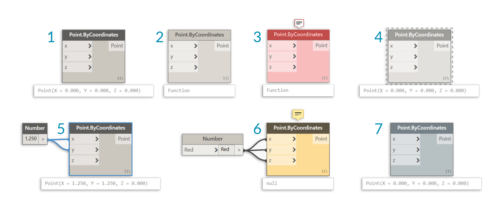

## Nœuds

Dans Dynamo, les **nœuds** sont les objets que vous connectez pour former un programme visuel. Chaque **nœud** effectue une opération, parfois aussi simple que le stockage d'un nombre, ou plus complexe, comme la création ou l'envoi de requêtes à une géométrie.

### Anatomie d'un nœud

La plupart des nœuds de Dynamo sont composés de cinq éléments. Bien qu'il existe des exceptions, telles que les nœuds Input, l'anatomie de chaque nœud peut être décrite comme suit : 

> 1. Nom : nom du nœud conforme à la convention d'appellation Category.Name
2. Principal : corps principal du nœud. Cliquez ici avec le bouton droit de la souris pour afficher les options au niveau du nœud entier
3. Ports (entrants et sortants) : récepteurs des fils qui fournissent les données d'entrée au nœud, ainsi que les résultats de l'action du nœud
4. Icône de combinaison : indique l'option de combinaison spécifiée pour les entrées de liste correspondantes (plus d'informations sur cette option ultérieurement)
5. Valeur par défaut : cliquez avec le bouton droit de la souris sur un port d'entrée. Certains nœuds ont des valeurs par défaut qui peuvent être utilisées ou non.

### Ports

Les entrées et les sorties des nœuds sont appelées "ports" et servent de récepteurs pour les fils. Les données sont intégrées au nœud via des ports sur la gauche et sortent du nœud après l'exécution de son opération sur la droite. Les ports doivent recevoir des données d'un certain type. Par exemple, la connexion d'un nombre tel que *2.75* aux ports d'un nœud Point By Coordinates permet de créer un point. Toutefois, si vous indiquez *Red* sur le même port, une erreur se produira.

> Conseil : placez le curseur sur un port pour afficher une info-bulle contenant le type de données attendu.

> 1. Libellé de port
2. Info-bulle
3. Type de données
4. Valeur par défaut

### États

Dynamo donne une indication de l'état d'exécution de votre programme visuel en effectuant le rendu des nœuds avec différents schémas de couleurs en fonction de l'état de chaque nœud. En outre, lorsque vous placez le curseur ou cliquez avec le bouton droit de la souris sur le nom ou les ports, vous affichez des informations et des options supplémentaires.

> 1. Actif : les nœuds dont le nom est sur un arrière-plan gris foncé sont bien connectés et leurs entrées sont connectées
2. Inactif : les nœuds grisés sont inactifs et doivent être connectés avec des fils pour faire partie du flux du programme dans l'espace de travail actif
3. État d'erreur : le rouge indique que le nœud est dans un état d'erreur
4. Geler : un nœud transparent a l'option Geler activée, ce qui interrompt l'exécution du nœud
5. Sélectionné : les nœuds actuellement sélectionnés ont une bordure bleue
6. Avertissement : les nœuds jaunes ont l'état Avertissement, ce qui signifie qu'ils peuvent avoir des types de données incorrects
7. Aperçu de l'arrière-plan : la couleur gris foncé indique que l'aperçu de la géométrie est désactivé

Si votre programme visuel contient des avertissements ou des erreurs, Dynamo fournit des informations supplémentaires sur le problème. Tout nœud jaune comporte également une info-bulle au-dessus de son nom. Placez le curseur de la souris sur l'info-bulle pour la développer.

> Conseil : examinez les nœuds en amont à la lumière de ces informations d'info-bulle pour voir si le type ou la structure de données requis est erroné.

> 1. Info-bulle d'avertissement : une valeur "Null" ou l'absence de donnée ne peut être comprise comme un double, c'est-à-dire un nombre
2. Utilisez le nœud Watch pour examiner les données d'entrée
3. En amont, le nœud Number contient "Red" et non un nombre

