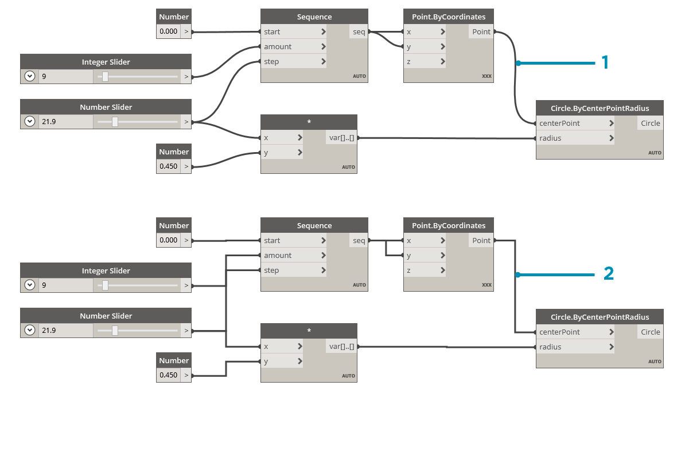

## Fils

Les fils connectent les nœuds entre eux pour créer des relations et établir le flux de votre programme visuel. Vous pouvez les considérer comme des fils électriques qui transportent des données d'un objet à l'autre.

### Flux de programme

Les fils connectent le port de sortie d'un nœud au port d'entrée d'un autre nœud. Cette direction établit le **flux de données** dans le programme visuel. Bien que vous puissiez organiser vos nœuds comme vous le souhaitez dans l'espace de travail, on peut généralement dire que le flux du programme se déplace de gauche à droite, puisque les ports de sortie se trouvent sur le côté droit des nœuds et les ports d'entrée sur le côté gauche.


### Création de fils

Vous créez un fil en cliquant avec le bouton gauche de la souris sur un port, puis en cliquant avec le bouton gauche de la souris sur le port d'un autre nœud pour créer une connexion. Pendant que vous réalisez une connexion, le fil s'affiche en pointillés et devient continu lorsque la connexion est établie. Les données passent toujours par ce fil d'une sortie à une entrée. Toutefois, vous pouvez créer le fil dans les deux directions en termes d'ordre de clic sur les ports connectés.

> Conseil : avant de terminer la connexion avec votre deuxième clic, autorisez l'accrochage des fils à un port et placez le curseur de la souris sur ce port pour afficher l'info-bulle correspondante.


> 1. Cliquez sur le port de sortie ```seq``` du nœud Number Sequence.
2. Lorsque vous déplacez la souris vers un autre port, le fil est en pointillés.
3. Cliquez sur le port d'entrée ```y``` de Point.ByCoordinates pour terminer la connexion.

### Modification des fils

Souvent, vous souhaitez ajuster le flux du programme dans votre programme visuel en modifiant les connexions représentées par les fils. Pour modifier un fil, cliquez avec le bouton gauche de la souris sur le port d'entrée du nœud déjà connecté. Vous pouvez ensuite procéder de l'une des manières suivantes :


> 1. Fil existant
2. Pour définir la connexion sur un port d'entrée, cliquez avec le bouton gauche de la souris sur un autre port d'entrée.
3. Pour supprimer le fil, retirez-le et cliquez avec le bouton gauche de la souris sur l'espace de travail.

*Remarque : il existe désormais une fonctionnalité supplémentaire permettant de déplacer plusieurs fils à la fois. Pour en savoir plus, rendez-vous sur [http://dynamobim.org/dynamo-1-3-release/](http://dynamobim.org/dynamo-1-3-release/).

### Aperçus des fils

Par défaut, l'aperçu des fils s'affiche avec un trait gris. Lorsqu'un nœud est sélectionné, il effectue le rendu de tous les fils connectés avec la même bordure bleue que le nœud.


> 1. Fil par défaut
2. Fil en surbrillance

Dynamo vous permet également de personnaliser l'apparence de vos fils dans l'espace de travail via le menu Vue > Connecteurs. Ici, vous pouvez basculer entre les options Courbe et Polyligne ou toutes les désactiver.



> 1. Type de connecteur : Courbes
2. Type de connecteur : Polylignes

