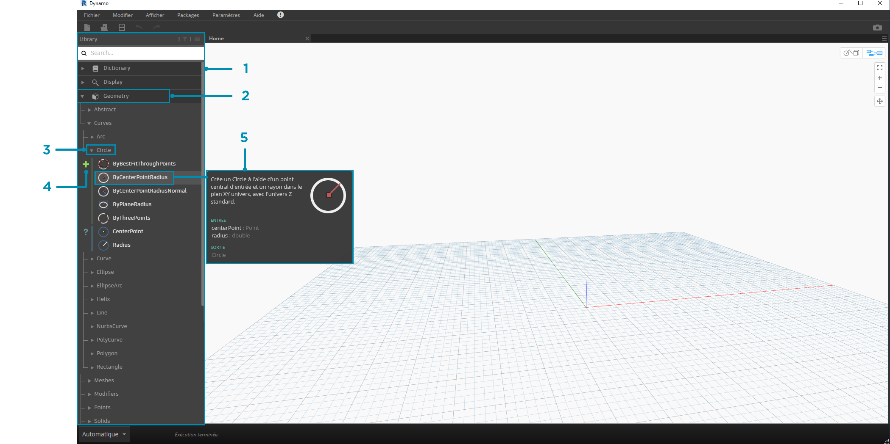
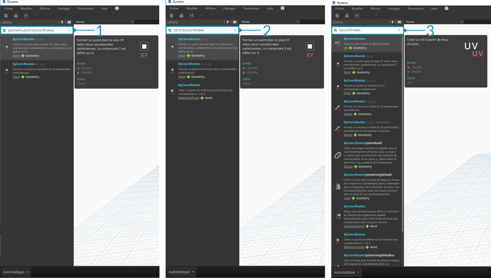

## Bibliothèque Dynamo

La **bibliothèque Dynamo** contient les nœuds ajoutés à l'espace de travail et permettant de définir des programmes visuels à exécuter. Dans la bibliothèque, vous pouvez rechercher des nœuds ou les parcourir. Les nœuds contenus ici (les nœuds de base installés, les nœuds personnalisés définis et les nœuds du gestionnaire de package ajoutés à Dynamo) sont organisés de manière hiérarchique par catégorie. Examinez cette organisation et explorez les principaux nœuds utilisés fréquemment.

### Bibliothèque de bibliothèques

La **bibliothèque** Dynamo utilisée dans l'application est en fait un ensemble de bibliothèques fonctionnelles, chacune contenant des nœuds regroupés par catégorie. Bien que cela puisse paraître compliqué au début, il s'agit d'une structure flexible permettant d'organiser les nœuds fournis avec l'installation par défaut de Dynamo. Cette structure est encore plus efficace en aval lorsque vous commencez à étendre cette fonctionnalité de base avec des nœuds personnalisés et des packages supplémentaires.

#### Schéma organisationnel

La section **Bibliothèque** de l'interface utilisateur de Dynamo se compose de bibliothèques organisées de manière hiérarchique. Lorsque vous vous déplacez dans la bibliothèque, vous parcourez de manière séquentielle une bibliothèque, les catégories de la bibliothèque et les sous-catégories de la catégorie pour trouver le nœud.



> 1. La bibliothèque : zone de l'interface Dynamo.
2. Une bibliothèque : ensemble de catégories associées, telles que **Geometry**.
3. Une catégorie : ensemble de nœuds associés, tels que tout ce qui est lié aux **cercles**.
4. Sous-catégorie : répartition des nœuds dans la catégorie, généralement définie par **Create**, **Action** ou **Query**.
5. Un nœud : objet ajouté à l'espace de travail permettant d'effectuer une action.

#### Conventions d'appellation

La hiérarchie de chaque bibliothèque est reflétée dans le nom des nœuds ajoutés à l'espace de travail, que vous pouvez également utiliser dans le champ de recherche ou avec les blocs de code (qui utilisent le *langage textuel Dynamo*). Au-delà de l'utilisation de mots-clés pour essayer de trouver des nœuds, vous pouvez saisir la hiérarchie séparée par un point.

La saisie de différentes parties de la position du nœud dans la hiérarchie de la bibliothèque au format ```bibliothèque.catégorie.NomDuNœud``` renvoie différents résultats :



> 1. ```bibliothèque.catégorie.NomDuNœud```
2. ```catégorie.NomDuNœud```
3. ```NomDuNœud``` ou ```motclé```

En règle générale, le nom du nœud dans l'espace de travail est rendu au format ```catégorie.NomDuNœud```, à quelques exceptions près, notamment dans les catégories Input et View. Attention aux nœuds ayant un nom similaire et notez la différence de catégorie :


> 1. Les nœuds de la plupart des bibliothèques incluent le format de catégorie.
2. Les nœuds ```Point.ByCoordinates``` et ```UV.ByCoordinates``` portent le même nom, mais proviennent de différentes catégories.
3. Les exceptions notables incluent les fonctions intégrées : Core.Input, Core.View et Operators.

### Nœuds fréquemment utilisés

Compte tenu du fait que l'installation de base de Dynamo comprend des centaines de nœuds, quels nœuds sont essentiels au développement de programmes visuels ? Concentrez-vous sur ceux qui permettent de définir les paramètres de votre programme (**Input**), d'afficher les résultats de l'action d'un nœud (**Watch**) et de définir les entrées ou les fonctionnalités par le biais d'un raccourci (**Code Block**).

#### Entrée

Les nœuds Input sont les principaux moyens pour que l'utilisateur de votre programme visuel, que ce soit vous-même ou quelqu'un d'autre, interagisse avec les paramètres clés. Voici les nœuds disponibles dans la catégorie Input de la bibliothèque Core :


> 1. Boolean
2. Number
3. String
4. Number Slider
5. Integer Slider
6. Directory Path
7. File Path

#### Watch

Les nœuds Watch sont essentiels pour la gestion des données qui circulent dans votre programme visuel. Vous pouvez afficher le résultat d'un nœud dans l'aperçu des données de nœud, mais vous pouvez aussi l'afficher dans un nœud **Watch** ou afficher les résultats de géométrie via un nœud **Watch3D**. Ces deux nœuds sont disponibles dans la catégorie View de la bibliothèque Core.

> Conseil : il peut arriver que l'aperçu 3D soit gênant lorsque votre programme visuel contient un grand nombre de nœuds. Pensez à désactiver l'option Afficher l'aperçu en arrière-plan dans le menu Paramètres et à utiliser un nœud Watch3D pour afficher un aperçu de la géométrie.


> 1. Watch : lorsque vous sélectionnez un élément dans le nœud Watch, il est marqué dans les aperçus Watch3D et 3D.
2. Watch3D : sélectionnez la poignée inférieure droite pour redimensionner le nœud et y naviguer à l'aide de la souris comme vous le feriez avec l'aperçu 3D.

#### Code Block

Les nœuds **Code Block** servent à définir un bloc de code avec des lignes séparées par des points-virgules. Cela peut être aussi simple que ```X/Y```. Vous pouvez également utiliser les nœuds Code Block comme raccourci pour définir un nœud Number Input ou appeler la fonctionnalité d'un autre nœud. La syntaxe à suivre respecte la convention d'attribution de noms du langage textuel Dynamo, DesignScript, et est présentée dans la section 7.2. Essayez de créer un cercle avec le raccourci suivant :


> 1. Cliquez deux fois pour créer un nœud **Code Block**.
2. Entrez ```Circle.ByCenterPointRadius(x,y);```.
3. Cliquez sur l'espace de travail pour effacer la sélection afin d'ajouter automatiquement des entrées ```x``` et ```y```.
4. Créez les nœuds **Point.ByCoordinates** et **Number Slider**, puis connectez-les aux entrées du nœud Code Block.
5. Le résultat de l'exécution du programme visuel doit être un cercle dans l'aperçu 3D.

