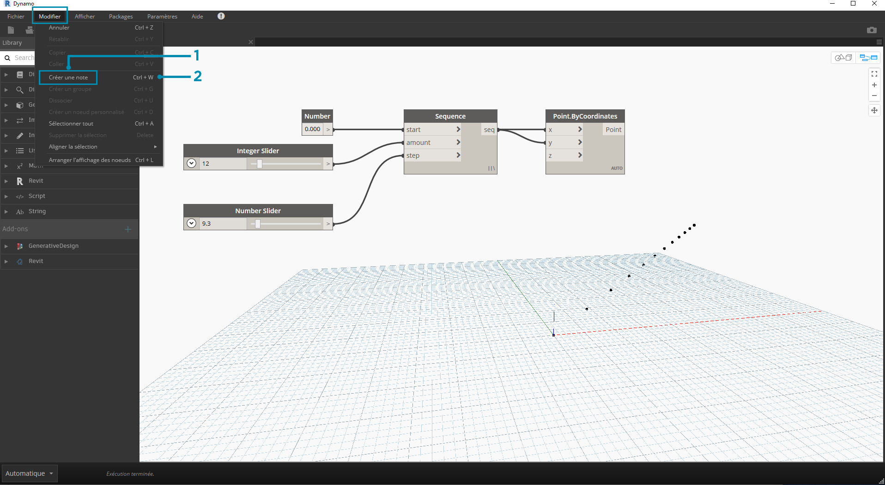
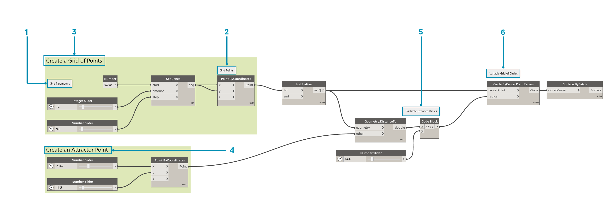

## Gestion de votre programme

Le processus de programmation visuelle peut être une activité créative puissante, mais le flux du programme et les entrées utilisateur clés peuvent très rapidement être occultés par la complexité et/ou la disposition de l'espace de travail. Voici quelques bonnes pratiques pour gérer votre programme.

### Alignement

Une fois que vous avez ajouté plusieurs nœuds à l'espace de travail, vous pouvez réorganiser la disposition des nœuds pour plus de clarté. Lorsque vous sélectionnez plusieurs nœuds et cliquez avec le bouton droit de la souris sur l'espace de travail, la fenêtre contextuelle inclut un menu **Aligner la sélection** avec les options de justification et de distribution dans X et Y.

> 1. Sélectionnez plusieurs nœuds.
2. Cliquez avec le bouton droit de la souris sur l'espace de travail.
3. Utilisez les options de **Aligner la sélection**.

### Remarques

Avec une certaine expérience, vous pourrez probablement "lire" le programme visuel en examinant les noms des nœuds et en suivant le flux du programme. Pour les utilisateurs de tous niveaux, il est également recommandé d'inclure des libellés et des descriptions en texte simple. Pour ce faire, Dynamo possède un nœud **Notes** avec un champ de texte modifiable. Vous pouvez ajouter des notes à l'espace de travail de deux manières :

> 1. Accédez au menu Modifier > Créer une note.
2. Utiliser le raccourci clavier Ctrl+W.

Une fois la note ajoutée à l'espace de travail, un champ de texte s'affiche pour vous permettre de modifier le texte de la note. Une fois la note créée, vous pouvez la modifier en double-cliquant sur le nœud Note ou en cliquant dessus avec le bouton droit de la souris.

### Groupement

Lorsque votre programme visuel est grand, il est utile d'identifier les étapes plus importantes qui seront exécutées. Vous pouvez mettre en surbrillance des ensembles de nœuds plus grands avec un **groupe** pour les libeller avec un rectangle de couleur en arrière-plan et un titre. Il existe trois méthodes pour créer un groupe avec plus d'un nœud sélectionné :

> 1. Accédez au menu Modifier > Créer un groupe.
2. Utilisez le raccourci clavier Ctrl+G.
3. Cliquez avec le bouton droit de la souris sur l'espace de travail et choisissez Créer un groupe.

Une fois le groupe créé, vous pouvez modifier ses paramètres, tels que son titre et sa couleur. 

> Conseil : l'utilisation des notes et des groupes est une méthode efficace pour annoter votre fichier et améliorer sa lisibilité.

Voici notre programme de la section 2.4 avec des notes et des groupes ajoutés :

> 1. Note : "Paramètres de grille"
2. Note : "Points de la grille"
3. Groupe : "Créer une grille de points"
4. Groupe : "Créer un point d'attraction"
5. Note : "Calibrer les valeurs de distance"
6. Note : "Grille variable de cercles"

