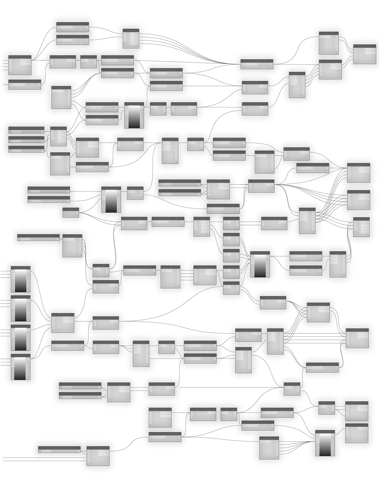

# ANATOMIE D'UN PROGRAMME VISUEL

Dynamo permet de créer des programmes visuels dans un espace de travail en connectant des noeuds à des fils pour spécifier le flux logique du programme visuel obtenu. Ce chapitre présente les éléments des programmes visuels, l'organisation des noeuds disponibles dans les bibliothèques de Dynamo, les éléments et les états des noeuds, ainsi que les pratiques recommandées relatives à vos espaces de travail.

