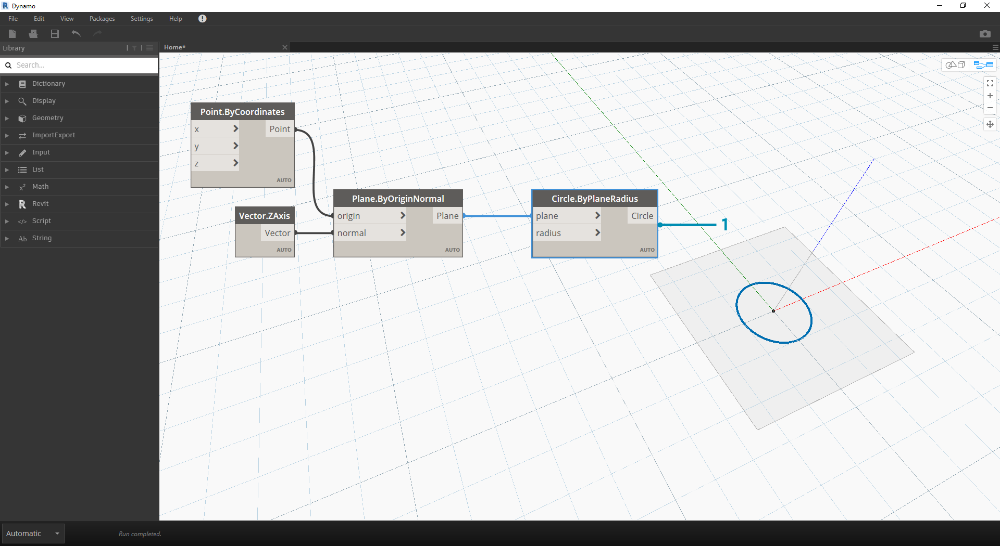
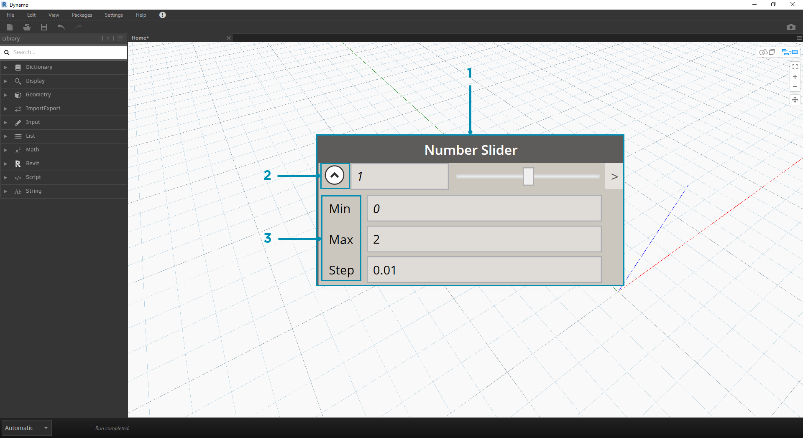

## Données

Les données sont les éléments des programmes. Elles circulent par l'intermédiaire de fils, fournissant des entrées pour les nœuds où elles sont traitées dans une nouvelle forme de données de sortie. Vous trouverez ci-dessous des informations sur la définition des données, leur structure et leur utilisation dans Dynamo.

### En quoi consistent les données ?

Les données sont un ensemble de valeurs de variables qualitatives ou quantitatives. La forme de données la plus simple est celle des nombres tels que ```0```, ```3.14``` ou ```17```. Cependant, les données peuvent également être un nombre de différents types : une variable représentant des nombres changeants (```height```), des caractères (```myName```), une géométrie (```Circle```) ou une liste d'éléments de données (```1,2,3,5,8,13,...```). Vous avez besoin de données à ajouter aux ports d'entrée des nœuds de Dynamo. Vous pouvez avoir des données sans actions, mais vous avez besoin de données pour traiter les actions que les nœuds représentent. Lorsque vous avez ajouté un nœud à l'espace de travail, si aucune entrée n'est fournie, le résultat est une fonction, et non le résultat de l'action elle-même.


> 1. Données simples
2. Exécution réussie des données et des actions (nœud A)
3. Une action (nœud A) sans entrées de données renvoie une fonction générique

### Méfiez-vous des valeurs nulles

Le type ```"null"``` représente l'absence de données. Bien qu'il s'agisse d'un concept abstrait, vous risquez de rencontrer ce phénomène lorsque vous travaillez avec la programmation visuelle. Si une action ne crée pas de résultat valide, le nœud renvoie une valeur nulle. Il est crucial de tester les valeurs nulles et de les supprimer de la structure de données pour créer des programmes robustes.

|Icône|Nom/Syntaxe|Entrées|Sorties|
| -- | -- | -- | -- |
||Object.IsNull|obj|bool|

### Structures de données

Lorsque vous concevez des programmes visuels, vous pouvez générer très rapidement beaucoup de données, ce qui exige un moyen de gérer la hiérarchie. Il s'agit du rôle des structures de données, les schémas organisationnels dans lesquels sont stockées les données. Les spécificités des structures de données et leur utilisation varient d'un langage de programmation à un autre. Dynamo permet de hiérarchiser les données via des listes. Vous allez explorer cela en détail dans les prochains chapitres, mais commençons simplement :

Une liste représente un ensemble d'éléments placés dans une structure de données :

* J'ai cinq doigts (*éléments*) sur la main (*liste*).
* Il y a dix maisons (*éléments*) dans ma rue (*liste*).


> 1. Un nœud **Number Sequence** définit une liste de nombres en utilisant les entrées *start*, *amount* et *step*. Ces nœuds permettent de créer deux listes distinctes de dix nombres, l'une qui va de *100 à 109* et l'autre qui va de *0 à 9*.
2. Le nœud **List.GetItemAtIndex** sélectionne un élément dans une liste à un index spécifique. Lorsque vous choisissez *0*, le premier élément de la liste est affiché (*100* dans ce cas).
3. Si vous appliquez le même processus à la deuxième liste, vous obtenez la valeur *0*, le premier élément de la liste.
4. Vous allez maintenant fusionner les deux listes en une seule à l'aide du nœud **List.Create**. Le nœud crée une *liste de listes.* Cette action modifie la structure des données.
5. Lorsque vous utilisez de nouveau **List.GetItemAtIndex**, avec un index défini sur *0*, la première liste est répertoriée dans la liste de listes. C'est ce que signifie traiter une liste comme un élément, ce qui est légèrement différent dans d'autres langages de script. Les prochains chapitres vous permettront d'en savoir plus sur la manipulation des listes et la structure des données.

Voici le concept clé à retenir sur la hiérarchie des données dans Dynamo : **en ce qui concerne la structure des données, les listes sont considérées comme des éléments.** En d'autres termes, Dynamo fonctionne avec un processus descendant permettant de comprendre les structures de données. Qu'est-ce que cela signifie ? Découvrez-le grâce à un exemple.

### Utilisation de données pour créer une chaîne de cylindres

> Téléchargez le fichier d'exemple joint à cet exercice (cliquez avec le bouton droit de la souris et choisissez "Enregistrer le lien sous...") : [Building Blocks of Programs - Data.dyn](datasets/4-1/Building Blocks of Programs - Data.dyn). Vous trouverez la liste complète des fichiers d'exemple dans l'annexe.

Dans ce premier exemple, vous allez assembler un cylindre en forme de coque qui traverse la hiérarchie de la géométrie abordée dans cette section. 

> 1. **Point.ByCoordinates :** après l'ajout du nœud dans la zone de dessin, un point apparaît à l'origine de la grille d'aperçu Dynamo. Les valeurs par défaut des entrées *x,y* et *z* sont *0,0*, ce qui vous donne un point à cet emplacement.


> 1. **Plan.ByOriginNormal :** l'étape suivante dans la hiérarchie de la géométrie est un plan. Il existe plusieurs façons de construire un plan. Pour l'entrée, utilisez une origine et une normale. L'origine est le nœud de point créé à l'étape précédente.
2. **Vector.ZAxis :** il s'agit d'un vecteur unifié dans la direction Z. Notez qu'il n'y a pas d'entrées, seulement un vecteur de valeur [0,0,1]. Utilisez-le comme entrée *normal* pour le nœud *Plane.ByOriginNormal*. Vous obtenez ainsi un plan rectangulaire dans l'aperçu Dynamo.



> 1. **Circle.ByPlaneRadius :** en avançant dans la hiérarchie, vous créez une courbe à partir du plan de l'étape précédente. Après avoir connecté le nœud, un cercle apparaît à l'origine. Le rayon par défaut sur le nœud est de *1*.


> 1. **Curve.Extrude :** permet de faire apparaître cet élément en lui donnant une certaine profondeur et en allant dans la troisième dimension. Ce nœud crée une surface à partir d'une courbe par extrusion. La distance par défaut sur le nœud est *1* et un cylindre doit apparaître dans la fenêtre.


> 1. **Surface.Thicken :** ce nœud vous donne un solide fermé grâce au décalage de la surface d'une distance donnée et à la fermeture de la forme. La valeur d'épaisseur par défaut est de *1* et un cylindre en forme de coque s'affiche dans la fenêtre coformément à ces valeurs.



> 1. **Number Slider :** au lieu d'utiliser les valeurs par défaut pour toutes ces entrées, ajoutez un contrôle paramétrique au modèle.
2. **Domain Edit :** après avoir ajouté le curseur de numérotation à la zone de dessin, cliquez sur le curseur situé en haut à gauche pour afficher les options du domaine.
3. **Min/Max/Step :** remplacez les valeurs *Min*, *Max* et *Step* par *0*, *2* et *0,01* respectivement. Ces valeurs servent à contrôler la taille de la géométrie globale.


> 1. **Number Slider :** dans toutes les entrées par défaut, copiez et collez ce curseur de numérotation (sélectionnez le curseur, appuyez plusieurs fois sur Ctrl+C, puis sur Ctrl+V), jusqu'à ce que toutes les entrées avec des valeurs par défaut disposent d'un curseur à la place. Certaines valeurs du curseur doivent être supérieures à zéro pour que la définition fonctionne (p.ex., vous devez disposer d'une profondeur d'extrusion pour disposer d'une surface à épaissir).

Vous avez maintenant créé un cylindre paramétrique en forme de coque avec ces curseurs. Ajustez certains de ces paramètres et observez la géométrie se mettre à jour dynamiquement dans la fenêtre Dynamo.


> 1. **Number Slider :** pour aller plus loin, ajoutez de nombreux curseurs dans la zone de dessin et nettoyez l'interface de l'outil que vous venez de créer. Cliquez avec le bouton droit de la souris sur un curseur, choisissez "Renommer..." et remplacez chaque curseur par le nom approprié pour son paramètre. Vous pouvez faire référence à l'image ci-dessus pour les noms.

À ce stade, vous avez créé un élément cylindrique épaississant fantastique. Il s'agit d'un seul objet actuellement. Découvrez désormais comment créer un réseau de cylindres liés dynamiquement. Pour ce faire, vous allez créer une liste de cylindres, plutôt que de travailler avec un seul élément.


> 1. **Ajout (+) :** votre objectif est d'ajouter une ligne de cylindres à côté du cylindre créé. Si vous souhaitez ajouter un cylindre adjacent au cylindre en cours, vous devez prendre en compte à la fois le rayon du cylindre et l'épaisseur de sa coque. Pour obtenir ce nombre, ajoutez les deux valeurs des curseurs.


> Étant donné que cette étape est plus importante, allez-y étape par étape : l'objectif final consiste à créer une liste de nombres qui définissent les emplacements de chaque cylindre dans une ligne.

> 1. **Multiplication :** tout d'abord, multipliez la valeur de l'étape précédente par 2. La valeur de l'étape précédente représente un rayon et il convient de déplacer le cylindre sur le diamètre complet.
2. **Number Sequence :** créez un réseau de nombres à l'aide de ce nœud. La première entrée est le nœud de *multiplication* de l'étape précédente vers la valeur *step*. Pour définir la valeur *start* sur *0,0*, utilisez un nœud *Number*.
3. **Integer Slider :** connectez un curseur d'entier à la valeur *amount*. Cela permet de définir le nombre de cylindres créés.
4. **Sortie :** cette liste affiche la distance déplacée pour chaque cylindre du réseau et est paramétriquement définie par les curseurs d'origine.


> 1. Cette étape est relativement simple : connectez la séquence définie à l'étape précédente à l'entrée *x* du nœud *Point.ByCoordinates* d'origine. Cette action permet de remplacer le curseur *pointX* que vous pouvez supprimer. Un réseau de cylindres apparaît maintenant dans la fenêtre (assurez-vous que la valeur du curseur d'entier est supérieure à 0).


> La chaîne de cylindres est toujours liée dynamiquement à tous les curseurs. Ajustez chaque curseur et observez la définition se mettre à jour.

