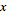

## Math

Si la forme de données la plus simple est le nombre, la méthode la plus simple pour lier ces nombres est d'utiliser les mathématiques. Des opérateurs simples, tels que la division, aux fonctions trigonométriques et aux formules plus complexes, Math est un excellent moyen de commencer à explorer les relations numériques et les motifs.

### Opérateurs arithmétiques

Les opérateurs sont un ensemble de composants qui utilisent des fonctions algébriques avec deux valeurs numériques d'entrée, ce qui génère une valeur de sortie unique (addition, soustraction, multiplication, division, etc.). Ces commandes sont disponibles sous Opérateurs > Actions.

|Icône|Nom|Syntaxe|Entrées|Sorties|
| -- | -- | -- | -- | -- |
||Ajouter|+|var[]...[], var[]...[]|var[]...[]|
||Soustraire|-|var[]...[], var[]...[]|var[]...[]|
||Multiplier|*|var[]...[], var[]...[]|var[]...[]|
||Diviser|/|var[]...[], var[]...[]|var[]...[]|

### Formule paramétrique

> Téléchargez le fichier d'exemple joint à cet exercice (cliquez avec le bouton droit de la souris et choisissez "Enregistrer le lien sous...") : [Building Blocks of Programs - Math.dyn](datasets/4-2/Building Blocks of Programs - Math.dyn). Vous trouverez la liste complète des fichiers d'exemple dans l'annexe.

À partir des opérateurs, l'étape logique suivante consiste à combiner des opérateurs et des variables pour former une relation plus complexe à l'aide de **formules**. Créez une formule qui peut être contrôlée par des paramètres d'entrée, tels que des curseurs.

> 1. **Number Sequence :** définissez une séquence de nombres reposant sur les trois entrées *start, amount* et *step*. Cette séquence représente le "t" dans l'équation paramétrique. Vous devez donc utiliser une liste suffisamment grande pour définir une clothoïde.

L'étape ci-dessus a permis de créer une liste de nombres pour définir le domaine paramétrique. La clothoïde dorée est définie comme l'équation suivante : = et =. Le groupe de nœuds ci-dessous représente cette équation sous forme de programmation visuelle.

> Lorsque vous parcourez le groupe de nœuds, essayez de faire le parallèle entre le programme visuel et l'équation écrite.
1. **Number Slider :** ajoutez deux curseurs de numérotation dans la zone de dessin. Ces curseurs représentent les variables *a* et *b* de l'équation paramétrique. Elles représentent une constante flexible, ou des paramètres que vous pouvez ajuster afin d'obtenir le résultat souhaité.
2. *** :** le nœud de multiplication est représenté par un astérisque. Vous utiliserez ce nœud à plusieurs reprises pour connecter des variables de multiplication.
3. **Math.RadiansToDegrees :** les valeurs "*t*" doivent être converties en degrés pour être évaluées dans les fonctions trigonométriques. N'oubliez pas que Dynamo utilise par défaut les degrés pour évaluer ces fonctions.
4. **Math.Pow :** la fonction de "*t*" et le numéro "*e*" permettent de créer la séquence Fibonacci.
5. **Math.Cos et Math.Sin :** ces deux fonctions trigonométriques différencient respectivement la coordonnée x et la coordonnée y de chaque point paramétrique.
6. **Watch : **le résultat obtenu se compose de deux listes. Elles représentent les coordonnées *x* et *y* des points utilisés pour générer la clothoïde.

### De la formule à la géométrie

Le bloc de nœuds de l'étape précédente fonctionne correctement, mais cela demande beaucoup de travail. Pour créer un workflow plus efficace, consultez la section **Blocs de code** (section 3.3.2.3) pour définir une chaîne d'expressions Dynamo en un nœud. Dans cette prochaine série d'étapes, vous allez utiliser l'équation paramétrique pour dessiner la clothoïde Fibonacci. 
> 1. **Point.ByCoordinates :** connectez le nœud de multiplication supérieur à l'entrée "*x*" et le nœud inférieur à l'entrée "*y*". Une clothoïde paramétrique de points apparaît à l'écran.

> 1. **Polycurve.ByPoints :** connectez Point.ByCoordinates de l'étape précédente à *points*. Vous pouvez laisser *connectLastToFirst* sans entrée, car vous ne créez pas de courbe fermée. Cela permet de créer une spirale qui passe par chaque point défini à l'étape précédente.

La clothoïde de Fibonacci est désormais terminée. Vous allez désormais effectuer deux exercices distincts, appelés Nautilus et Tournesol. Ce sont des abstractions de systèmes naturels, mais qui représentent bien les deux applications différentes de la clothoïde de Fibonacci.

### De la clothoïde au Nautilus

> 1. Comme point de départ, commencez par la même étape qu'à l'exercice précédent : la création d'un réseau de points en forme de spirale avec le nœud **Point.ByCoordinates**.

> 1. **Polycurve.ByPoints :** il s'agit également du nœud de l'exercice précédent, utilisé comme référence.
2. **Circle.ByCenterPointRadius :** utilisez un nœud circulaire avec les mêmes entrées que celles de l'étape précédente. Étant donné que la valeur du rayon par défaut est de *1,0*, un réseau de cercles apparaît immédiatement. La façon dont les points divergent à partir du point d'origine est immédiatement lisible.

> 1. **Circle.ByCenterPointRadius :** pour créer un réseau de cercles plus dynamique, connectez la séquence de nombres d'origine (séquence "*t*") à la valeur de rayon.
2. **Number Sequence :** réseau d'origine de "*t*". Si vous connectez ceci à la valeur du rayon, les centres des cercles divergent davantage à partir de l'origine, mais le rayon des cercles augmente, créant ainsi un super graphique circulaire Fibonacci. Et c'est encore mieux en 3D !

### Du Nautilus à la phyllotaxie

Maintenant que vous avez créé une coque Nautilus circulaire, passez aux grilles paramétriques. Vous allez utiliser une rotation de base sur la clothoïde Fibonacci pour créer une grille Fibonacci, et le résultat est modélisé après la [croissance des graines de tournesol](http://ms.unimelb.edu.au/~segerman/papers/sunflower_spiral_fibonacci_metric.pdf).

> 1. Comme point de départ ici aussi, commencez par la même étape qu'à l'exercice précédent : la création d'un réseau de points en forme de spirale avec le nœud **Point.ByCoordinates**.

> 1. **Géométrie.Rotation :** il existe plusieurs options Geometry.Rotate. Assurez-vous d'avoir choisi le nœud avec les entrées *geometry*, *basePlane* et *degrees*. Connectez **Point.ByCoordinates** à l'entrée geometry.
2. **Plane.XY :** connexion à l'entrée *basePlane*. Vous allez effectuer une rotation autour de l'origine, servant également de base pour la clothoïde.
3. **Intervalle de nombres :** pour la saisie des degrés, vous devez créer plusieurs rotations. Pour ce faire, il suffit d'utiliser un composant Number Range. Connectez-le à l'entrée *degrees*.
4. **Number :** pour définir l'intervalle de nombres, ajoutez trois nœuds Number à la zone de dessin dans l'ordre vertical. De haut en bas, affectez respectivement les valeurs *0.0,360.0,* et *120.0*. Elles pilotent la rotation de la clothoïde. Après avoir connecté les trois nœuds Number au nœud Range, observez les sorties du nœud **Number Range**.

Le résultat obtenu commence à ressembler à un tourbillon. Ajustez certains paramètres de **Number Range** et observez le changement des résultats : 

> 1. Modifiez la taille du pas du nœud **Number Range** de *120.0* à *36.0*. Cette action crée davantage de rotations et permet donc d'obtenir une grille plus dense.

> 1. Modifiez la taille du pas du nœud **Number Range** de *36,0* à *3,6*. Vous obtenez une grille beaucoup plus dense, et la direction de la clothoïde n'est pas claire. Bravo, vous avez créé un tournesol.

