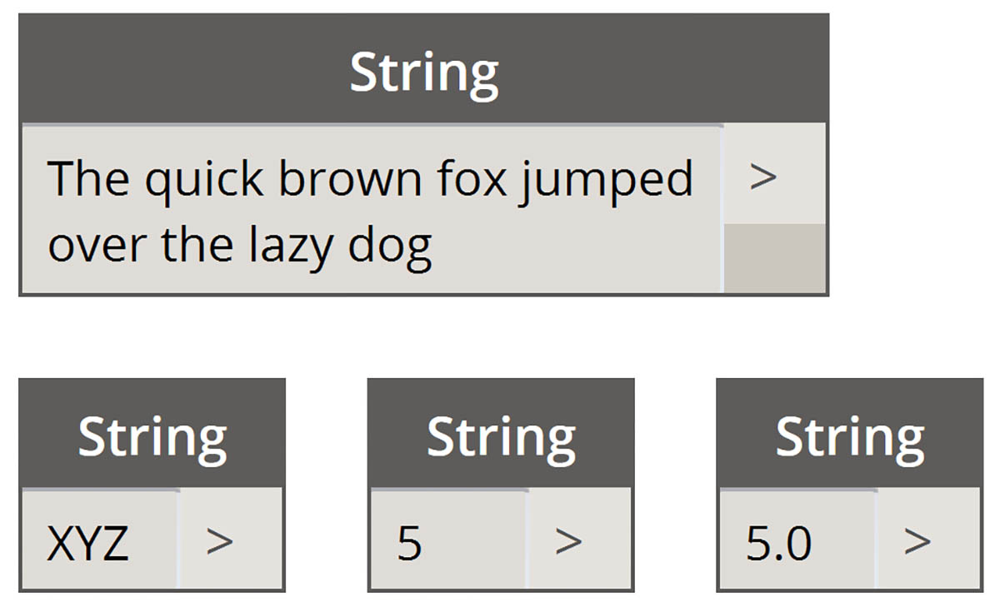
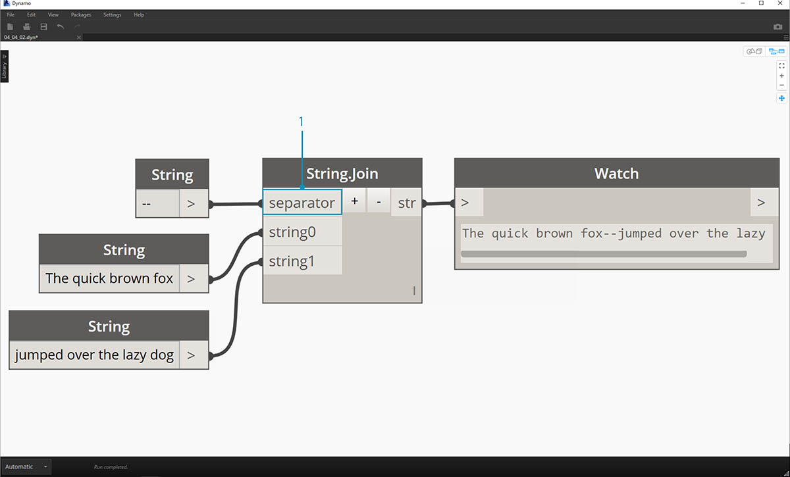

## Chaînes

Officiellement, une **chaîne** est une séquence de caractères représentant une constante littérale ou un type de variable. Officieusement, dans le jargon de la programmation, une chaîne est du texte. Vous avez travaillé avec des nombres entiers et des nombres décimaux pour définir les paramètres et vous pouvez faire de même avec du texte.

### Création de chaînes

Les chaînes peuvent être utilisées pour une large gamme d'applications, y compris la définition de paramètres personnalisés, l'annotation de jeux de documentation et l'analyse via des jeux de données textuelles. Le nœud String se trouve dans la catégorie Core > Input.

> Les exemples de nœuds ci-dessus sont des chaînes. Un nombre peut être représenté sous forme de chaîne, de lettre ou de tableau complet de texte.

### Interrogation des chaînes

> Téléchargez le fichier d'exemple joint à cet exercice (cliquez avec le bouton droit de la souris et choisissez "Enregistrer le lien sous...") : [Building Blocks of Programs - Strings.dyn](datasets/4-4/Building Blocks of Programs - Strings.dyn). Vous trouverez la liste complète des fichiers d'exemple dans l'annexe.

Interroger les chaînes vous permet d'analyser rapidement de grandes quantités de données. Vous allez découvrir certaines opérations de base qui peuvent accélérer un workflow et aider à l'interopérabilité des logiciels.

L'image ci-dessous prend en compte une chaîne de données provenant d'une feuille de calcul externe. La chaîne représente les sommets d'un rectangle dans le plan XY. Effectuez quelques opérations de fractionnement de chaînes dans un petit exercice :

> 1. Le séparateur ";" sépare chaque sommet du rectangle. Cette opération permet de créer une liste comportant 4 éléments pour chaque sommet.

> 1. Pour créer un séparateur, appuyez sur "*+*" au milieu du nœud.
2. Ajoutez une chaîne "*,*" à la zone de dessin et connectez-la à la nouvelle entrée de séparateur.
3. Vous obtenez maintenant une liste de dix éléments. Le nœud se divise d'abord en fonction de *separator0*, puis en fonction de *separator1*.

Bien que la liste d'éléments ci-dessus puisse ressembler à des nombres, ils restent considérés comme des chaînes individuelles dans Dynamo. Pour créer des points, leur type de données doit être converti d'une chaîne en nombre. Cette opération est effectuée à l'aide du nœud String.ToNumber.

> 1. Ce nœud est simple. Connectez les résultats String.Split à l'entrée. La sortie ne semble pas différente, mais le type de données est maintenant un *nombre* au lieu d'une *chaîne*.

> 1. Avec certaines opérations supplémentaires de base, vous avez maintenant un rectangle dessiné à l'origine en fonction de l'entrée de chaîne d'origine.

### Manipulation des chaînes

Étant donné qu'une chaîne est un objet texte générique, elle héberge une large gamme d'applications. Examinez certaines des principales actions de la catégorie Core > String dans Dynamo :

Il s'agit d'une méthode de fusion de deux chaînes dans l'ordre. Cette opération consiste à prendre chaque chaîne littérale dans une liste et à créer une chaîne fusionnée.

> L'image ci-dessus représente la concaténation de trois chaînes :

> 1. Pour ajouter ou soustraire des chaînes à la concaténation, cliquez sur les boutons +/- au centre du nœud.
2. La sortie produit une chaîne concaténée, avec des espaces et des signes de ponctuation inclus.

La méthode de jonction est très similaire à la concaténation, sauf qu'elle comporte une couche de ponctuation supplémentaire.

Si vous avez travaillé dans Excel, vous connaissez peut-être les fichiers CSV. Il s'agit de valeurs séparées par des virgules. Vous pouvez utiliser une virgule (ou dans ce cas, deux tirets) comme séparateur avec le nœud de jointure pour créer une structure de données similaire : 

> L'image ci-dessus représente la jointure de deux chaînes :

> 1. L'entrée separator permet de créer une chaîne qui divise les chaînes jointes.

### Utilisation des chaînes

Dans cet exercice, vous allez utiliser les méthodes de requête et de manipulation des chaînes pour déconstruire la dernière strophe du poème de Robert Frost [Stopping By Woods on a Snowy Evening](http://www.poetryfoundation.org/poem/171621). Ce n'est pas l'application la plus pratique, mais elle vous aidera à comprendre les actions de chaînes conceptuelles lorsque vous les appliquez aux lignes lisibles de rythme et de rime.

> Commencez par une division de chaîne de base de la strophe. Tout d'abord, remarquez que l'écriture est formatée par des virgules. Utilisez ce format pour séparer chaque ligne en éléments individuels.

> 1. La chaîne de base est collée dans un nœud String.
2. Un autre nœud String est utilisé pour désigner le séparateur. Dans ce cas, utilisez une virgule.
3. Ajoutez un nœud String.Split à la zone de dessin et connectez-le aux deux chaînes.
4. Le résultat montre que vous avez séparé les lignes en éléments individuels.

> Passez désormais à la meilleure partie du poème : les deux dernières lignes. La strophe d'origine était un élément de données. Vous avez divisé ces données en éléments individuels lors de la première étape. Vous devez maintenant trouver le texte que vous recherchez. Bien que vous *puissiez* faire cela en sélectionnant les deux derniers éléments de la liste, s'il s'agissait d'un livre entier, vous ne pourriez pas tout lire et isoler manuellement les éléments.

> 1. Au lieu d'effectuer une recherche manuelle, utilisez le nœud String.Contains pour rechercher un ensemble de caractères. Cette opération est similaire à la commande "Rechercher" dans un traitement de texte. Dans ce cas, vous obtenez le retour de "true" ou de "false" si cette sous-chaîne se trouve dans l'élément.
2. Dans l'entrée "searchFor", définissez une sous-chaîne à rechercher dans la strophe. Utilisez un nœud String avec le texte "And miles".
3. La sortie vous donne une liste des valeurs true et false. Vous allez utiliser cette logique booléenne pour filtrer les éléments à l'étape suivante.

> 1. List.FilterByBoolMask est le nœud à utiliser pour éliminer les valeurs true et false. La sortie "in" renvoie les instructions avec une entrée "mask" ayant la valeur "true", tandis que la sortie "out" renvoie celles qui sont "false".
2. Le résultat de l'entrée "in" est tel qu'attendu, vous donnant ainsi les deux dernières lignes de la strophe.

> À présent, pour obtenir la répétition de la strophe, vous devez fusionner les deux lignes. Si vous observez la sortie de l'étape précédente, vous pouvez remarquer que la liste contient deux éléments :

> 1. À l'aide de deux nœuds List.GetItemAtIndex, vous pouvez isoler les éléments en utilisant les valeurs 0 et 1 comme entrée d'index.
2. La sortie de chaque nœud vous donne, dans l'ordre, les deux dernières lignes.

> Pour fusionner ces deux éléments en un seul élément, utilisez le nœud String.Join :

> 1. Après avoir ajouté le nœud String.Join, vous remarquez que vous avez besoin d'un séparateur.
2. Pour créer le séparateur, ajoutez un nœud String dans la zone de dessin et entrez une virgule.
3. Le résultat final a fusionné les deux derniers éléments en un seul élément.

Isoler les deux dernières lignes semble représenter beaucoup de travail ; et il est vrai que les opérations de chaîne nécessitent souvent un peu de travail en amont. Cependant, ces opérations sont évolutives et peuvent être appliquées à de grands jeux de données avec une certaine facilité. Si vous travaillez de manière paramétrique avec des feuilles de calcul et l'interopérabilité, n'oubliez pas les opérations relatives aux chaînes.

