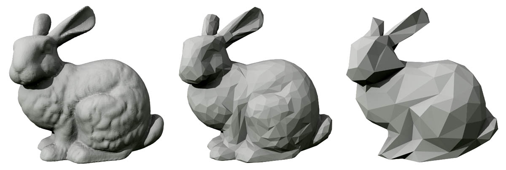
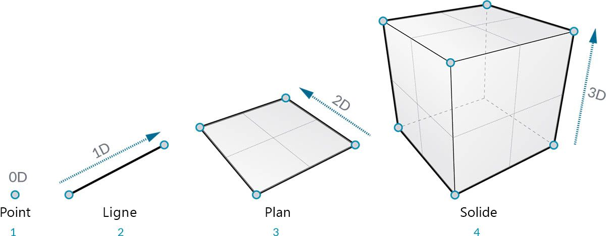
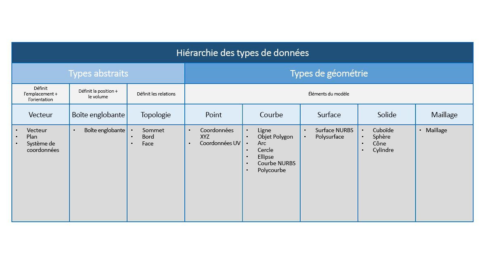

## Présentation de la géométrie

La **géométrie** est le langage de conception. Lorsqu'un environnement ou un langage de programmation possède un noyau de géométrie, il est possible de concevoir des modèles précis et robustes, d'automatiser des routines de conception et de générer des itérations de conception avec des algorithmes.

### Les principes fondamentaux

La géométrie, au sens traditionnel, est l'étude de la forme, de la taille, de la position relative des figures et des propriétés de l'espace. Ce domaine a un riche passé qui remonte à des milliers d'années. L'avènement et la popularisation de l'ordinateur ont permis d'acquérir un outil puissant permettant de définir, d'explorer et de générer de la géométrie. Calculer le résultat d'interactions géométriques complexes est devenu extrêmement facile. Le fait même de le faire est presque transparent.

> Si vous souhaitez savoir comment une géométrie complexe et diversifiée peut exploiter la puissance de votre ordinateur, recherchez "lapin de Stanford" sur le Web. Il s'agit d'un un modèle canonique utilisé pour tester les algorithmes.

Les algorithmes, les calculs et la complexité peuvent entraver la compréhension de la géométrie. Toutefois, il existe quelques principes clés, et relativement simples, que vous pouvez établir comme fondamentaux pour commencer à aller vers des applications plus avancées :

1. La géométrie représente des **données** : pour l'ordinateur et Dynamo, un lapin n'est pas si différent d'un nombre.
2. La géométrie repose sur une **abstraction** : les éléments géométriques sont essentiellement décrits par des nombres, des relations et des formules dans un système de coordonnées spatiales donné.
3. La géométrie possède une **hiérarchie** : les points sont assemblés pour créer des lignes, des lignes pour créer des surfaces, etc.
4. La géométrie décrit simultanément **la partie et l'ensemble** : quand vous avez une courbe, c'est à la fois la forme et tous les points possibles le long de celle-ci.

En pratique, ces principes signifient que vous devez être conscient de ce que vous utilisez (type de géométrie, comment elle a été créée, etc.) afin de pouvoir composer, décomposer et recomposer librement des géométries différentes à mesure que vous développez des modèles plus complexes.

### Navigation dans la hiérarchie

Prenez le temps d'observer la relation entre les descriptions abstraite et hiérarchique de la géométrie. Ces deux concepts étant liés, mais pas toujours évidents au début, vous pouvez vous heurter rapidement à un blocage conceptuel une fois que vous avez commencé à développer des workflows ou des modèles plus approfondis. Pour commencer, utilisez la cotation comme descripteur simple des "éléments" modélisés. Le nombre de cotes requises pour décrire une forme vous donne un aperçu de la façon dont la géométrie est organisée de façon hiérarchique.

> 1. Un **point** (défini par des coordonnées) ne possède pas de cotes ; il s'agit juste de nombres décrivant chaque coordonnée.
2. Une **ligne** (définie par deux points) possède désormais *une* cote : vous pouvez "déplacer" la ligne vers l'avant (direction positive) ou vers l'arrière (direction négative).
3. Un **plan** (défini par deux lignes) a *deux* cotes : vous pouvez désormais aller à gauche ou à droite.
4. Une **boîte** (définie par deux plans) comporte *trois* cotes : vous pouvez définir une position par rapport à la direction vers le haut ou vers le bas.

La cotation est un moyen pratique de commencer à catégoriser la géométrie, mais ce n'est pas nécessairement le meilleur. Après tout, vous ne modélisez pas uniquement des points, des lignes, des plans et des boîtes. Que faire si des courbes entrent en jeu ? En outre, il existe une autre catégorie de types géométriques qui sont complètement abstraits, c'est-à-dire qu'ils définissent des propriétés telles que l'orientation, le volume ou les relations entre les parties. Il n'est pas réellement possible de saisir un vecteur. Comment le définir par rapport aux élément affichés l'espace ? Une catégorisation plus détaillée de la hiérarchie géométrique doit permettre de tenir compte de la différence entre les types abstraits ou les "assistants", que vous pouvez regrouper en fonction de ce qu'ils aident à faire et des types qui aident à décrire la forme des éléments du modèle.

### Géométrie dans Dynamo Studio

Qu'est-ce que cela implique pour l'utilisation de Dynamo ? La compréhension des types de géométrie et de leur relation vous permettra de naviguer dans l'ensemble des **nœuds de géométrie** disponibles dans la bibliothèque. Les nœuds de géométrie sont organisés par ordre alphabétique et non hiérarchisé. Ici, l'affichage des nœuds est similaire à leur présentation dans l'interface Dynamo.

De plus, la création de modèles dans Dynamo et la connexion de l'aperçu de ce qui est visible dans l'aperçu en arrière-plan avec le flux de données dans le graphique devraient devenir plus intuitives au fil du temps.

> 1. Observez le système de coordonnées spécifique rendu par la grille et les axes de couleur.
2. Les nœuds sélectionnés génèrent le rendu de la géométrie correspondante (si le nœud crée une géométrie) à l'arrière-plan (couleur de surbrillance).
> Téléchargez le fichier d'exemple qui accompagne cette image (cliquez avec le bouton droit de la souris et choisissez "Enregistrer le lien sous...") : [Geometry for Computational Design - Geometry Overview.dyn](datasets/5-1/Geometry for Computational Design - Geometry Overview.dyn). Vous trouverez la liste complète des fichiers d'exemple dans l'annexe.

### Aller plus loin avec la géométrie

La création de modèles dans Dynamo ne se limite pas à ce que vous pouvez générer avec des nœuds. Voici quelques méthodes essentielles pour faire passer votre processus à la phase suivante avec la géométrie :

1. Dynamo vous permet d'importer des fichiers : essayez d'utiliser un fichier CSV pour les nuages de points ou SAT pour importer des surfaces.
2. Lorsque vous travaillez avec Revit, vous pouvez référencer des éléments Revit à utiliser dans Dynamo.
3. Le gestionnaire de package Dynamo offre des fonctionnalités supplémentaires pour les types de géométrie étendus et les opérations : découvrez le package [Mesh Toolkit](https://github.com/DynamoDS/Dynamo/wiki/Dynamo-Mesh-Toolkit).

