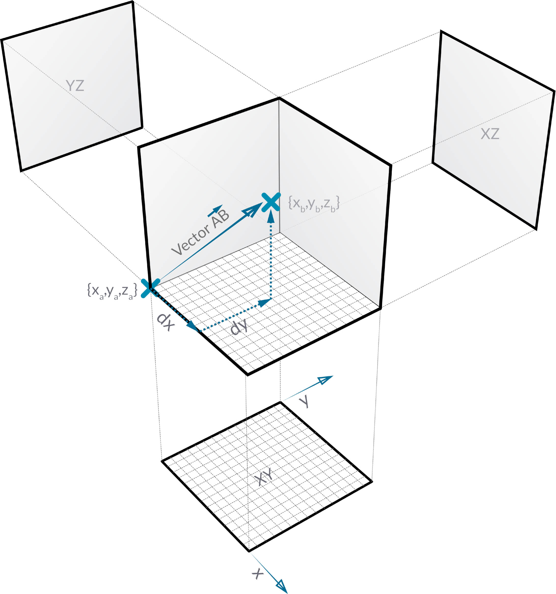
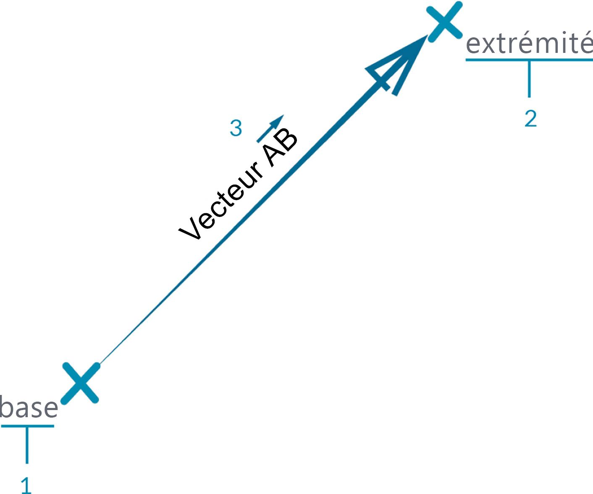
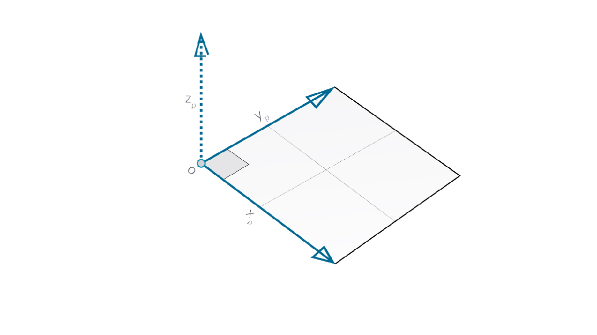

## Vecteurs, plans et systèmes de coordonnées

Les vecteurs, les plans et les systèmes de coordonnées constituent le groupe principal de types de géométrie abstraits. Ils vous aident à définir l'emplacement, l'orientation et le contexte spatial d'autres géométries décrivant des formes. Si vous dites que vous êtes à New York, au croisement de la 42e rue et de Broadway (système de coordonnées), debout au niveau de la rue (plan), regardant au nord (vecteur), vous venez d'utiliser ces "assistants" pour définir votre position. Il en va de même pour une coque de téléphone ou un gratte-ciel : vous avez besoin de ce contexte pour développer votre modèle.

### Qu'est-ce qu'un vecteur ?

Un vecteur est une quantité géométrique décrivant la direction et la magnitude. Les vecteurs sont abstraits, c'est-à-dire qu'ils représentent une quantité et non un élément géométrique. Les vecteurs peuvent être facilement confondus avec les points, car ils sont tous les deux composés d'une liste de valeurs. Il existe cependant une différence essentielle : les points décrivent une position dans un système de coordonnées donné, tandis que les vecteurs décrivent une différence par rapport à la position qui est la même que la "direction".

Si l'idée d'une différence relative est source de confusion, considérez le vecteur AB comme "Je suis debout au point A, et je regarde vers le point B." La direction, d'ici (A) vers là-bas (B), est le vecteur.

Décomposez davantage les vecteurs en parties en utilisant la même notation AB :

> 1. Le **point de départ** du vecteur est appelé **base**.
2. Le **point d'arrivée** du vecteur est appelé **pointe** ou **sens**.
3. Le vecteur AB est différent du vecteur BA, qui pointe dans la direction opposée.

Pour ajouter une touche de légèreté en ce qui concerne les vecteurs (et leur définition abstraite), impossible de ne pas mentionner la fameuse réplique de la comédie "Y a-t-il un pilote dans l'avion" :

> *Roger, Roger. Quel est votre vecteur, Victor ?*

Les vecteurs sont un composant clé des modèles dans Dynamo. Dans la mesure où ils se trouvent dans la catégorie Abstract des "assistants", lorsque vous créez un vecteur, vous ne verrez rien dans l'aperçu en arrière-plan.

> 1. Vous pouvez utiliser une ligne comme support pour un aperçu vectoriel.
> Téléchargez le fichier d'exemple qui accompagne cette image (cliquez avec le bouton droit de la souris et choisissez "Enregistrer le lien sous...") : [Geometry for Computational Design - Vectors.dyn](datasets/5-2/Geometry for Computational Design - Vectors.dyn). Vous trouverez la liste complète des fichiers d'exemple dans l'annexe.

### Qu'est-ce qu'un plan ?

Les plans sont des "assistants" abstraits 2D. Plus spécifiquement, les plans sont conceptuellement "plats", s'étendant de manière infinie dans deux directions. En général, ils sont rendus sous la forme d'un rectangle plus petit près de leur origine.

Vous pensez peut-être, "Attendez ! Et l'origine ? Cela ressemble à un système de coordonnées... comme celui que j'utilise pour modéliser des éléments dans mon logiciel de CAO !"

Et vous avez raison ! La plupart des logiciels de modélisation tirent parti des plans de construction ou des "niveaux" afin de définir un contexte local bidimensionnel pour le dessin. XY, XZ, YZ ou Nord, Sud-est, le plan peut sembler plus familier. Il s'agit de tous les plans, définissant un contexte "plat" infini. Les plans n'ont pas de profondeur, mais ils aident à décrire la direction : chaque plan a une origine, une direction X, une direction Y et une direction Z (vers le haut).

> 1. Bien qu'ils soient abstraits, les plans possèdent une position d'origine qui permet de les placer dans l'espace.
2. Dans Dynamo, les plans sont rendus dans l'aperçu en arrière-plan.
> Téléchargez le fichier d'exemple qui accompagne cette image (cliquez avec le bouton droit de la souris et choisissez "Enregistrer le lien sous...") : [Geometry for Computational Design - Planes.dyn](datasets/5-2/Geometry for Computational Design - Plane.dyn). Vous trouverez la liste complète des fichiers d'exemple dans l'annexe.

### Qu'est-ce qu'un système de coordonnées ?

Si vous maîtrisez parfaitement les plans, les systèmes de coordonnées ne vous poseront pas de difficultés. Un plan possède les mêmes composants qu'un système de coordonnées, à condition qu'il s'agisse d'un système de coordonnées "euclidiennes" ou "XYZ" standard.

Cependant, il existe d'autres systèmes de coordonnées, tels que les systèmes cylindriques ou sphériques. Comme vous le verrez dans les sections suivantes, les systèmes de coordonnées peuvent également être appliqués à d'autres types de géométrie afin de définir une position sur la géométrie en question.

> Ajout de systèmes de coordonnées alternatifs : cylindrique, sphérique

> 1. Bien qu'ils soient abstraits, les systèmes de coordonnées possèdent également une position d'origine qui permet de les placer dans l'espace.
2. Dans Dynamo, les systèmes de coordonnées sont rendus dans l'aperçu en arrière-plan en tant que point (origine) et lignes définissant les axes (X est rouge, Y est vert et Z est bleu suivant la convention).
> Téléchargez le fichier d'exemple qui accompagne cette image (cliquez avec le bouton droit de la souris et choisissez "Enregistrer le lien sous...") : [Geometry for Computational Design - Coordinate System.dyn](datasets/5-2/Geometry for Computational Design - Coordinate System.dyn). Vous trouverez la liste complète des fichiers d'exemple dans l'annexe.

