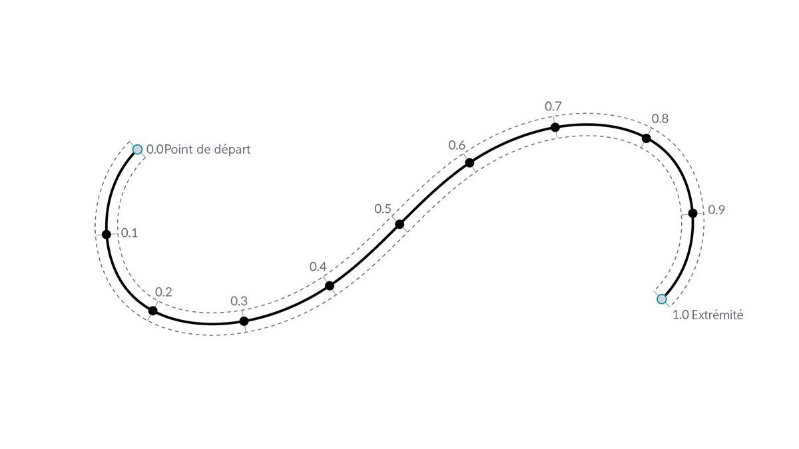
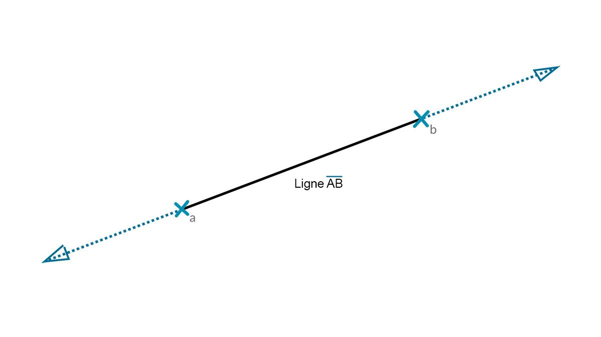

## Courbes

Les courbes sont le premier type de données géométriques abordé qui a un jeu de propriétés descriptives de forme plus familier : courbe ou droite ? Longue ou courte ? N'oubliez pas que les points restent des blocs de construction permettant de définir n'importe quel élément d'une ligne à une spline et tous les types de courbes entre les deux.


> 1. Ligne
2. Polyligne
3. Arc
4. Cercle
5. Ellipse
6. Courbe NURBS
7. Polycourbe

### Qu'est-ce qu'une courbe ?

Le terme **courbe** est généralement un terme "fourre-tout" pour toutes les formes relativement courbes (même les droites). La courbe "C" en majuscule est la catégorisation parent de tous ces types de formes : lignes, cercles, splines, etc. Techniquement, une courbe décrit tous les points possibles qui peuvent être trouvés en saisissant "t" dans un ensemble de fonctions, pouvant aller des fonctions simples (```x = -1.26*t, y = t```) aux fonctions comprenant du calcul. Quel que soit le type de courbe sur lequel vous travaillez, ce **paramètre** appelé "t" est une propriété que vous pouvez évaluer. En outre, quel que soit l'aspect de la forme, toutes les courbes ont également un point de départ et un point d'arrivée, qui, de manière fortuite, correspondent aux valeurs t minimale et maximale utilisées pour créer la courbe. Cela permet de comprendre sa direction.



> Il est important de noter que Dynamo suppose que le domaine des valeurs "t" d'une courbe est compris entre 0.0 et 1.0.

Toutes les courbes possèdent également un certain nombre de propriétés ou de caractéristiques servant à les décrire ou à les analyser. Lorsque la distance entre les points de départ et d'arrivée est égale à zéro, la courbe est "fermée". De plus, chaque courbe comporte un certain nombre de points de contrôle. Si tous ces points sont situés sur le même plan, la courbe est "planaire". Certaines propriétés s'appliquent à la courbe dans son ensemble, tandis que d'autres s'appliquent uniquement à des points spécifiques situés le long de la courbe. Par exemple, la planéité est une propriété globale, tandis qu'un vecteur de tangente à une valeur t donnée est une propriété locale.

### Lignes

Les **lignes** sont la forme la plus simple des courbes. Elles ne semblent pas courbées, mais sont en fait des courbes (sans aucune courbure). Il existe plusieurs méthodes pour créer des lignes. La méthode la plus intuitive consiste à relier le point A au point B. La forme de la ligne AB est dessinée entre les points, mais mathématiquement, elle s'étend à l'infini dans les deux directions.



Lorsque vous connectez deux lignes, vous obtenez une **polyligne**. L'illustration ci-dessous est une représentation simple de ce qu'est un point de contrôle. Si vous modifiez l'un des emplacements de ces points, la forme de la polyligne change. Si vous fermez la polyligne, vous obtenez un polygone. Si les longueurs d'arête du polygone sont toutes égales, elles sont décrites comme régulières.


### Arcs, cercles, arcs elliptiques et ellipses

À mesure que vous ajoutez de la complexité aux fonctions paramétriques qui définissent une forme, vous pouvez aller plus loin qu'une ligne pour créer un **arc**, un **cercle**, un **arc d'ellipse** ou une **ellipse** en décrivant un ou deux rayons. Les différences entre la version arc et le cercle ou l'ellipse reposent uniquement sur le fait que la forme est fermée ou non.


### NURBS + polycourbes

Les **NURBS** (splines de base rationnelles non uniformes) sont des représentations mathématiques qui permettent de modéliser avec précision n'importe quelle forme d'une simple ligne, d'un cercle, d'un arc ou d'un rectangle 2D à la courbe organique de forme libre 3D la plus complexe. En raison de leur flexibilité (relativement peu de points de contrôle, mais une interpolation lisse en fonction des paramètres de degré) et de leur précision (liée à un calcul robuste), les modèles NURBS peuvent être utilisés dans n'importe quel processus, de l'illustration à la fabrication, en passant par l'animation.


**Degré** : le degré de la courbe détermine la plage d'influence des points de contrôle sur une courbe. Lorsque la valeur du degré est élevée, l'intervalle est plus important. Le degré est un nombre entier positif. Ce nombre est généralement 1, 2, 3 ou 5, mais il peut s'agir de n'importe quel nombre entier positif. Les lignes et les polylignes NURBS sont généralement de degré 1 et la plupart des courbes de forme libre de degré 3 ou 5.

**Points de contrôle** : les points de contrôle sont une liste de points de degrés+1 minimum. Pour modifier la forme d'une courbe NURBS, il suffit de déplacer ses points de contrôle.

**Poids** : les points de contrôle sont associés à un nombre appelé poids. Les poids sont généralement des nombres positifs. Lorsque les points de contrôle d'une courbe ont tous le même poids (généralement 1), la courbe est appelée non rationnelle. Dans le cas contraire, la courbe est appelée rationnelle. La plupart des courbes NURBS ne sont pas rationnelles.

**Nœuds** : les nœuds sont une liste de nombres (degré + N-1), où N représente le nombre de points de contrôle. Les nœuds sont utilisés conjointement avec les poids afin de contrôler l'influence des points de contrôle sur la courbe obtenue. L'une des utilisations possibles des nœuds consiste à créer des boucles à certains points de la courbe.


> 1. Degré = 1
2. Degré = 2
3. Degré = 3

Plus la valeur de degré est élevée, plus les points de contrôle sont utilisés pour interpoler la courbe obtenue.

Créez une courbe sinusoïdale dans Dynamo à l'aide de deux méthodes différentes afin de créer des courbes NURBS et de comparer les résultats.


> 1. *NurbsCurve.ByControlPoints* utilise la liste de points comme points de contrôle.
2. *NurbsCurve.ByPoints* trace une courbe passant par la liste de points.
> Téléchargez le fichier d'exemple qui accompagne cette image (cliquez avec le bouton droit de la souris et choisissez "Enregistrer le lien sous...") : [Geometry for Computational Design - Curves.dyn](datasets/5-4/Geometry for Computational Design - Curves.dyn). Vous trouverez la liste complète des fichiers d'exemple dans l'annexe.

