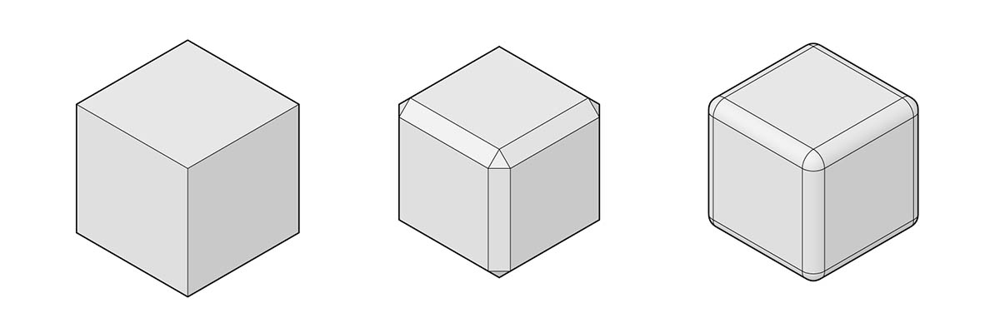
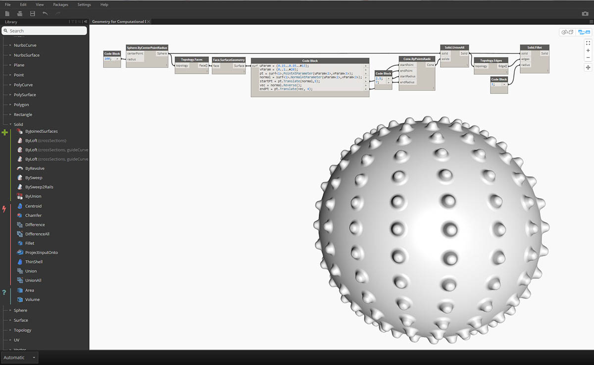
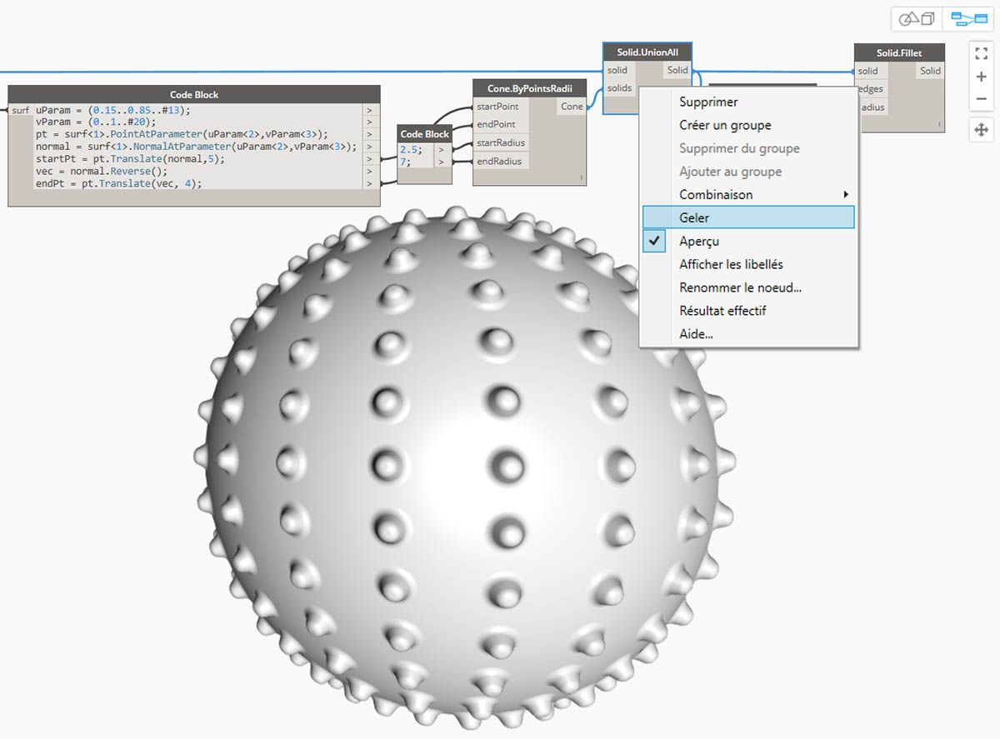
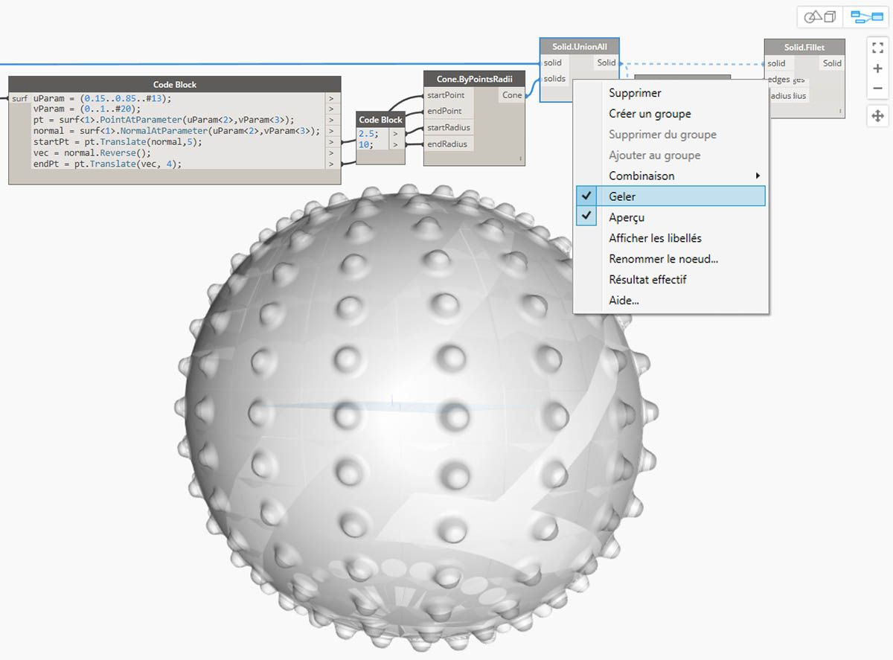

## Solides

Si vous voulez construire des modèles plus complexes qui ne peuvent pas être créés à partir d'une seule surface ou si vous voulez définir un volume explicite, vous devez maintenant vous aventurer dans le domaine des solides (et des polysurfaces). Même un cube simple est assez complexe pour avoir besoin de six surfaces, une par face. Les solides donnent accès à deux concepts clés qui n'existent pas dans les surfaces : une description topologique plus affinée (faces, arêtes, sommets) et les opérations booléennes.

### Qu'est-ce qu'un solide ?

Les solides sont constitués d'une ou de plusieurs surfaces contenant un volume au moyen d'une limite fermée qui définit l'"intérieur" ou l'"extérieur". Quel que soit le nombre de surfaces, elles doivent former un volume "étanche" pour être considérées comme un solide. Vous pouvez créer des solides en joignant des surfaces ou des polysurfaces ou en utilisant des opérations telles que le lissage, le balayage et la révolution. Les primitives sphère, cube, cône et cylindre sont également des solides. Un cube dont au moins une face a été supprimée est considéré comme une polysurface qui possède des propriétés similaires, mais ce n'est pas un solide.

> 1. Un plan est constitué d'une surface unique et n'est pas un solide.
2. Une sphère est constituée d'une surface, mais *est* un solide.
3. Un cône est constitué de deux surfaces jointes pour créer un solide.
4. Un cylindre est constitué de trois surfaces jointes pour créer un solide.
5. Un cube est constitué de six surfaces jointes pour créer un solide.

### Topologie

Les solides sont constitués de trois types d'éléments : sommets, arêtes et faces. Les faces sont les surfaces qui constituent le solide. Les arêtes sont des courbes qui définissent la connexion entre des faces adjacentes et les sommets sont les points de départ et d'arrivée de ces courbes. Les nœuds Topology peuvent être utilisés pour envoyer des requêtes à ces éléments.

> 1. Faces
2. Arêtes
3. Sommets

### Opérations

Les solides peuvent être modifiés en raccordant ou en chanfreinant leurs arêtes pour éliminer les angles et les angles aigus. L'opération de chanfrein crée une surface réglée entre deux faces, tandis qu'un congé se mélange entre les faces pour maintenir la tangence. 

> 1. Cube solide
2. Cube chanfreiné
3. Cube raccordé

### Opérations booléennes

Les opérations booléennes de solide sont des méthodes pour combiner deux solides ou plus. Une opération booléenne unique implique d'effectuer quatre opérations :

1. **Entrecouper** au moins deux objets.
2. Les **scinder** aux intersections.
3. **Supprimer** les portions indésirables de la géométrie.
4. **Rassembler** le tout.

Cela rend les objets booléens solides extrêmement efficaces. Il existe trois opérations booléennes de solide qui permettent de distinguer les parties de la géométrie qui sont conservées. 

> 1. **Union** : supprimez les parties des solides qui se chevauchent et joignez-les en un seul solide.
2. **Différence** : soustrayez un solide à un autre. Le solide à soustraire est appelé outil. Notez que vous pouvez redéfinir quel solide est l'outil pour conserver le volume inverse.
3. **Intersection** : conservez uniquement le volume d'intersection des deux solides.

Outre ces trois opérations, Dynamo dispose des nœuds **Solid.DifferenceAll** et **Solid.UnionAll** pour effectuer des opérations de différence et d'union avec plusieurs solides. 

> 1. **UnionAll** : opération d'union avec une sphère et des cônes orientés vers l'extérieur
2. **DifferenceAll** : opération de différence avec une sphère et des cônes orientés vers l'intérieur

Utilisez quelques opérations booléennes pour créer une balle hérisson.

> 1. **Sphere.ByCenterPointRadius** : permet de créer le solide de base.
2. **Topology.Faces**, **Face.SurfaceGeometry** : permet d'envoyer des requêtes aux faces du solide et de les convertir en géométrie de surface. Dans ce cas, la sphère ne possède qu'une seule face.
3. **Cone.ByPointsRadii** : permet de créer des cônes en utilisant des points sur la surface.
4. **Solid.UnionAll** : permet d'unir les cônes et la sphère.
5. **Topology.Edges** : permet d'envoyer des requêtes aux arêtes du nouveau solide.
6. **Solid.Fillet** : permet de raccorder les arêtes de la balle hérisson.
> Téléchargez les fichiers d'exemple qui accompagnent cette image (cliquez avec le bouton droit de la souris et choisissez "Enregistrer le lien sous..."). Vous trouverez la liste complète des fichiers d'exemple dans l'annexe. [Geometry for Computational Design - Solids.dyn](datasets/5-6/Geometry for Computational Design - Solids.dyn)

### Gel

Les opérations booléennes sont complexes et peuvent être lentes à calculer. Utilisez la fonctionnalité Geler pour suspendre l'exécution des nœuds sélectionnés et affectés aux nœuds en aval.

> Utilisez le menu contextuel du bouton droit de la souris pour geler l'opération d'union de solide.

> Le nœud sélectionné et tous les nœuds en aval s'affichent en mode fantôme gris clair et les fils affectés en tant que lignes en pointillés. Le mode fantôme sera également appliqué à l'aperçu de la géométrie concernée. Vous pouvez maintenant modifier les valeurs en amont sans calculer l'union booléenne.

> Pour dégeler les nœuds, cliquez avec le bouton droit de la souris et désactivez l'option Geler.

> Tous les nœuds concernés et les aperçus de géométrie associés sont mis à jour et reviendront en mode d'aperçu standard.

