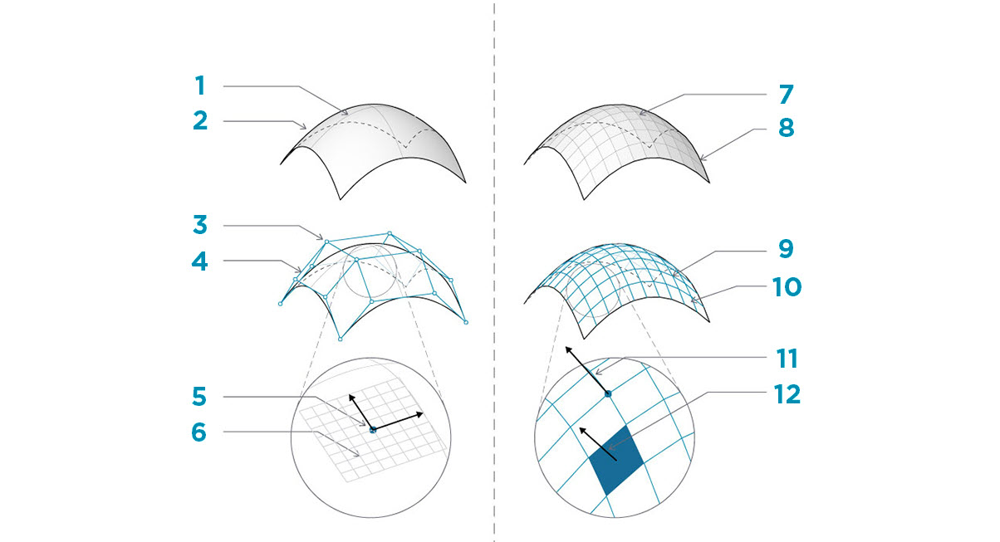

## Mailles

Dans le domaine de la modélisation informatique, les maillages sont l'une des formes de représentation les plus répandues de la géométrie 3D. La géométrie de maillage représente une alternative simple et flexible à l'utilisation des NURBS. Les maillages sont utilisés dans tous les domaines : du rendu aux visualisations, jusqu'à la fabrication numérique et à l'impression 3D.

### Qu'est-ce qu'un maillage ?

Un maillage est un ensemble de quadrilatères et de triangles représentant une géométrie de surface ou de solide. Comme pour les solides, la structure d'un objet maillé comprend des sommets, des arêtes et des faces. Il existe d'autres propriétés qui rendent les maillages uniques, telles que les normales.


> 1. Sommets de maillage.
2. Arêtes de maillage. *Les arêtes avec une seule face adjacente sont appelées "nues". Toutes les autres arêtes sont "habillées".
3. Faces de maillage.

### Éléments maillage

Dynamo définit les maillages à l'aide d'une structure de données Face-Sommet. À la base, cette structure est simplement un ensemble de points regroupés en polygones. Les points d'un maillage sont appelés sommets, tandis que les polygones de surface sont appelés faces. Pour créer un maillage, vous avez besoin d'une liste de sommets et d'un système de regroupement de ces sommets en faces appelé groupe d'index.


> 1. Liste de sommets
2. Liste des groupes d'index permettant de définir les faces.

#### Sommets + normales de sommet

Les sommets d'un maillage sont simplement une liste de points. L'index des sommets est très important lors de la construction d'un maillage ou de l'obtention d'informations sur la structure d'un maillage. Pour chaque sommet, il existe également une normale de sommet (vecteur) correspondante qui décrit la direction moyenne des faces attachées et vous aide à comprendre l'orientation "intérieure" et "extérieure" du maillage.


> 1. Sommets
2. Normales de sommet

#### Faces

Une face est une liste ordonnée de trois ou quatre sommets. La représentation de la "surface" d'une face maillée est donc implicite en fonction de la position des sommets indexés. Étant donné que vous avez déjà la liste des sommets qui constituent le maillage, au lieu de fournir des points individuels pour définir une face, utilisez simplement l'index des sommets. Cela vous permet également d'utiliser le même sommet dans plusieurs faces.


> 1. Une face quadrilatérale composée des index 0, 1, 2 et 3.
2. Une face triangulaire composée des index 1, 4 et 2. Les groupes d'index peuvent être modifiés dans leur ordre : tant que la séquence est ordonnée dans le sens trigonométrique, la face est correctement définie.

### Maillages et surfaces NURBS

Quelles sont les différences entre la géométrie de maillage et la géométrie NURBS ? Quand utiliseriez-vous l'une ou l'autre ?

#### Définition des paramètres

Dans le chapitre précédent, vous avez découvert que les surfaces NURBS sont définies par une série de courbes NURBS allant dans deux directions. Ces directions sont libellées ```U``` et ```V``` et permettent de paramétrer une surface NURBS en fonction d'un domaine de surface 2D. Les courbes elles-mêmes sont stockées en tant qu'équations dans l'ordinateur, ce qui permet de calculer les surfaces qui en résultent dans un degré de précision arbitrairement petit. Il peut cependant être difficile de combiner plusieurs surfaces NURBS. La jonction de deux surfaces NURBS génère une polysurface, où différentes sections de la géométrie auront des définitions de courbe et des paramètres UV différents.



> 1. Surface
2. Courbe isoparamétrique (isoparm)
3. Point de contrôle de surface
4. Polygone de contrôle de surface
5. Point isoparamétrique
6. Cadre de surface
7. Maillage
8. Arête nue
9. Réseau de maillage
10. Arêtes de maillage
11. Normale de sommet
12. Face de maillage/Normale de face de maillage

Les maillages, en revanche, sont constitués d'un nombre distinct de sommets et de faces exactement définis. Le réseau de sommets ne peut généralement pas être défini par de simples coordonnées ```UV```. En effet, étant donné que les faces sont distinctes, la précision est créée dans le maillage et ne peut être modifiée qu'en affinant le maillage et en ajoutant des faces supplémentaires. L'absence de descriptions mathématiques permet aux maillages de gérer plus facilement une géométrie complexe au sein d'un maillage unique.

### Influence locale et globale

Une autre différence importante est la mesure dans laquelle une modification locale de la géométrie de maillage ou NURBS affecte l'ensemble de la forme. Le déplacement d'un sommet d'un maillage affecte uniquement les faces adjacentes à ce sommet. Dans les surfaces NURBS, l'étendue de l'influence est plus complexe et dépend du degré de la surface ainsi que des poids et des nœuds des points de contrôle. En général, cependant, le déplacement d'un seul point de contrôle dans une surface NURBS crée un changement plus lisse et plus important de la géométrie.


> 1. Surface NURBS : le déplacement d'un point de contrôle a une influence qui s'étend sur toute la forme.
2. Géométrie de maillage : le déplacement d'un sommet a une influence uniquement sur les éléments adjacents.

Une analogie qui peut être utile consiste à comparer une image vectorielle (composée de lignes et de courbes) à une image raster (composée de pixels individuels). Si vous effectuez un zoom avant sur une image vectorielle, les courbes restent nettes et claires, tandis que si vous effectuez un zoom sur une image raster, les pixels individuels deviennent plus grands. Dans cette analogie, vous pouvez comparer les surfaces NURBS à une image vectorielle, car il existe une relation mathématique lisse, tandis qu'un maillage se comporte de la même façon qu'une image raster avec une résolution définie.

### Mesh Toolkit

L'installation du package [Mesh Toolkit](https://github.com/DynamoDS/Dynamo/wiki/Dynamo-Mesh-Toolkit) permet d'étendre les fonctionnalités de maillage de Dynamo. Le package Mesh Toolkit de Dynamo fournit des outils permettant d'importer des maillages à partir de formats de fichiers externes, de créer un maillage à partir d'objets de géométrie Dynamo et de créer manuellement des maillages selon leurs sommets et leurs index. La bibliothèque fournit également des outils permettant de modifier les maillages, de réparer les maillages ou d'extraire des sections horizontales à utiliser lors de la fabrication.

Reportez-vous au chapitre 10.2 pour découvrir un exemple du package Mesh Toolkit.


