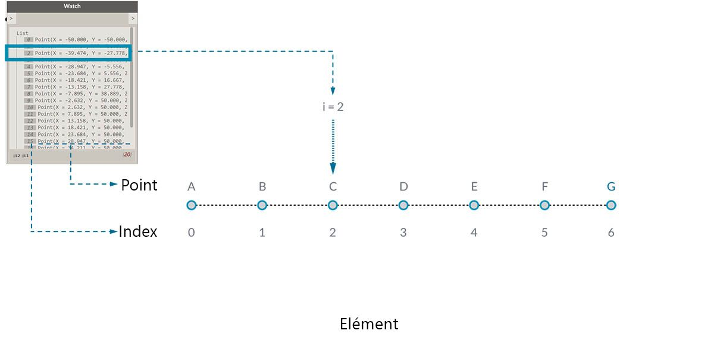
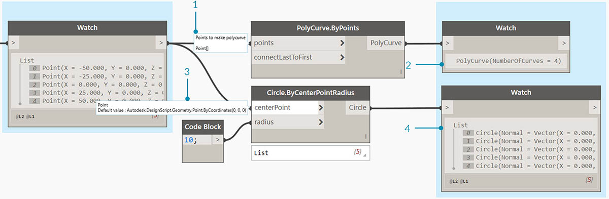
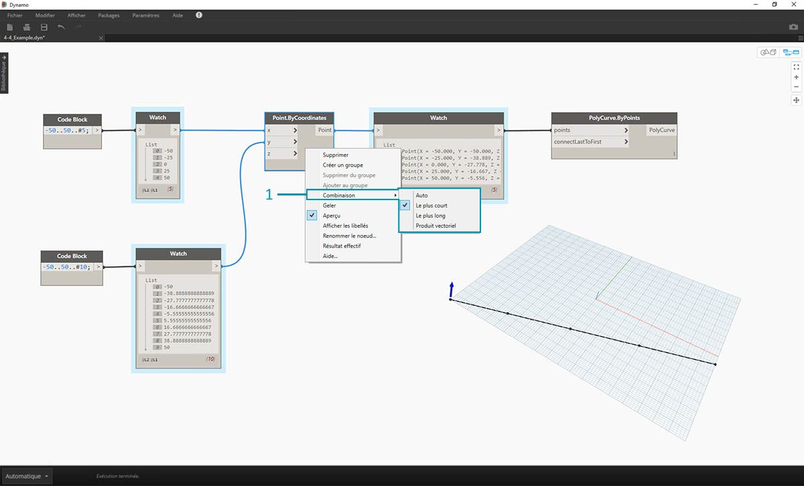
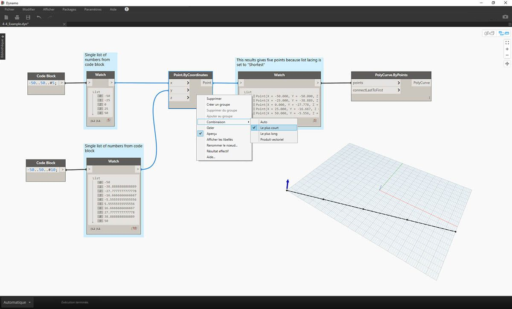
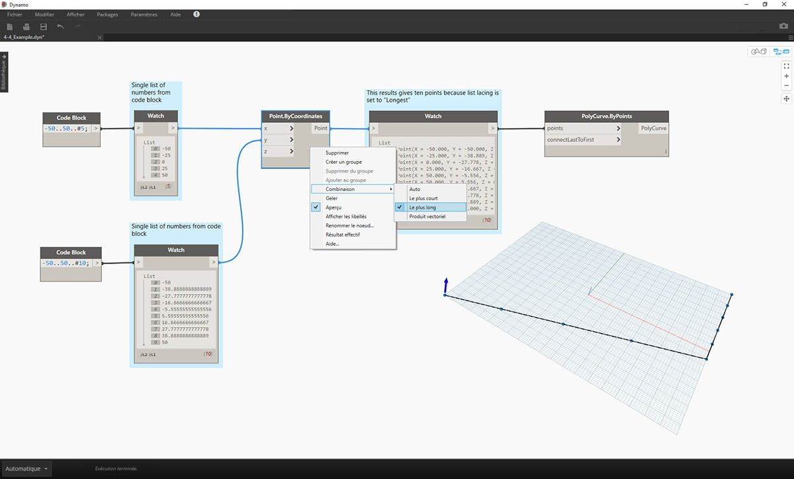
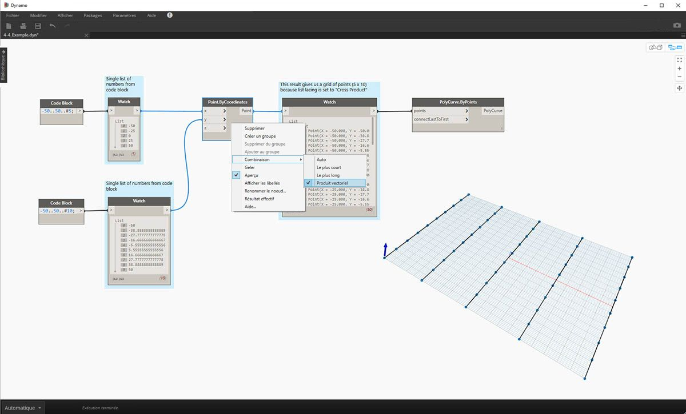

## Qu'est-ce qu'une liste ?

Une liste est un ensemble d'éléments. Par exemple, prenez une grappe de bananes. Chaque banane est un élément de la liste (ou grappe). Il est plus facile de ramasser une grappe de bananes plutôt que chaque banane individuellement. Il en est de même pour le regroupement d'éléments par relations paramétriques dans une structure de données.

> Photo de [Augustus Binu](https://commons.wikimedia.org/wiki/File:Bananas_white_background_DS.jpg?fastcci_from=11404890&c1=11404890&d1=15&s=200&a=list).

Quand vous faites les courses, vous déposez tous les objets achetés dans un sac. Ce sac est aussi une liste. Si vous préparez un cake aux bananes, il vous faut 3 grappes de bananes (vous préparez *plusieurs* cakes aux bananes). Le sac représente une liste de grappes de bananes et chaque grappe représente une liste de bananes. Le sac est une liste de listes (bidimensionnelles) et la banane est une liste (unidimensionnelle).

Dans Dynamo, les données de liste sont triées et le premier élément de chaque liste possède un index "0". Vous trouverez ci-dessous une définition des listes dans Dynamo et de leur rapport.

## Index de base 0

Aussi étrange que cela puisse paraître à première vue, le premier index d'une liste est toujours 0, et non 1. Lorsqu'il est question du premier élément d'une liste, il s'agit en fait de l'élément qui correspond à l'index 0.

Par exemple, si vous comptez le nombre de doigts de votre main droite, il y a de fortes chances que vous comptiez de 1 à 5. Cependant, si vous deviez placer vos doigts dans une liste, Dynamo leur aurait donné des index de 0 à 4. Bien que cela puisse paraître un peu étrange aux débutants en programmation, l'index de base 0 est la pratique courante de la plupart des systèmes de calcul.

La liste contient toujours 5 éléments : elle utilise un système de comptage de base 0. Les éléments stockés dans la liste ne sont pas nécessairement des nombres. Il peut s'agir de tout type de données pris en charge par Dynamo, tel que des points, des courbes, des surfaces, des familles, etc.

Souvent, la méthode la plus simple pour examiner le type de données stockées dans une liste consiste à connecter un nœud Watch à la sortie d'un autre nœud. Par défaut, le nœud Watch affiche automatiquement tous les index sur le côté gauche de la liste et affiche les éléments de données sur la droite.

Ces index sont un élément crucial lorsque vous travaillez avec des listes.

### Entrées et sorties

En ce qui concerne les listes, les entrées et sorties varient en fonction du nœud Dynamo utilisé. Par exemple, utilisez une liste de 5 points et connectez cette sortie à deux nœuds Dynamo différents, *PolyCurve.ByPoints* et *Circle.ByCenterPointRadius* :

> 1. L'entrée *points* de *PolyCurve.ByPoints* recherche *"Point[]"*. Cela représente une liste de points.
2. La sortie de *PolyCurve.ByPoints* est une simple polycourbe créée à partir d'une liste de cinq points.
3. L'entrée *centerPoint* de *Circle.ByCenterPointRadius* demande *"Point"*.
4. La sortie de *Circle.ByCenterPointRadius* est une liste de cinq cercles, dont les centres correspondent à la liste de points d'origine.

Les données d'entrée de *PolyCurve.ByPoints* et de *Circle.ByCenterPointRadius* sont identiques. Cependant, le nœud Polycurve vous donne une polycourbe, tandis que le nœud Circle vous donne 5 cercles dont les centres correspondent aux points. À première vue, ce résultat est logique : la polycourbe est dessinée en tant que courbe reliant les 5 points, tandis que les cercles créent un cercle différent à chaque point. Qu'est-ce qui se passe avec les données ?

Lorsque vous placez le curseur sur l'entrée *points* de *Polycurve.ByPoints*, vous pouvez constater que l'entrée recherche *"Point[]"*. Observez les crochets à la fin. Ils représentent une liste de points. Pour créer une polycourbe, l'entrée doit être une liste pour chaque polycourbe. Ce nœud va ainsi condenser chaque liste en une seule polycourbe.

En revanche, l'entrée *centerPoint* de *Circle.ByCenterPointRadius* demande *"Point"*. Ce nœud recherche un point, en tant qu'élément, pour définir le point central du cercle. C'est la raison pour laquelle vous obtenez cinq cercles à partir des données d'entrée. Reconnaître cette différence avec les entrées de Dynamo permet de mieux comprendre le fonctionnement des nœuds lors de la gestion des données.

### Combinaison

Sans solution de nettoyage, la correspondance des données est un problème. C'est le cas lorsqu'un nœud a accès à des entrées de taille différente. La modification de l'algorithme de correspondance des données peut entraîner des résultats très différents.

Imaginez un nœud qui crée des segments de ligne entre les points (Line.ByStartPointEndPoint). Il comporte deux paramètres d'entrée qui définissent les coordonnées du point d'entrée :

Comme vous pouvez le voir, il existe différentes manières de dessiner des lignes entre ces jeux de points. Pour accéder aux options de combinaison, cliquez avec le bouton droit de la souris sur le centre d'un nœud et sélectionnez le menu "Combinaison".

### Fichier de base

> Téléchargez le fichier d'exemple joint à cet exercice (cliquez avec le bouton droit de la souris et sélectionnez "Enregistrer le lien sous...") : [Lacing.dyn](datasets/6-1/Lacing.dyn). Vous trouverez la liste complète des fichiers d'exemple dans l'annexe.

Pour découvrir les opérations de combinaison ci-dessous, vous allez utiliser ce fichier de base afin de définir la liste la plus courte, la liste la plus longue et le produit vectoriel.

> 1. Vous allez modifier la combinaison sur *Point.ByCoordinates*, mais sans modifier d'autres paramètres du graphique ci-dessus.

#### Liste la plus courte

La méthode la plus simple consiste à connecter les entrées une par une jusqu'à ce que l'un des flux soit épuisé. Cette méthode s'appelle l'algorithme "Liste la plus courte". Il s'agit du comportement par défaut des nœuds Dynamo :

> En définissant la combinaison sur *Le plus court*, vous obtenez une ligne diagonale de base composée de cinq points. Étant donné que cinq points est la longueur de la liste inférieure, la combinaison de la liste la plus courte s'arrête après avoir atteint la fin d'une liste.

#### Liste la plus longue

L'algorithme "Liste la plus longue" conserve les entrées de connexion, réutilisant les éléments, jusqu'à ce que tous les flux soient épuisés :

> En définissant la combinaison sur *Le plus long*, vous obtenez une ligne diagonale qui s'étend verticalement. De la même façon que pour le diagramme de concept, le dernier élément de la liste des 5 éléments sera répété pour atteindre la longueur de la liste la plus longue.

#### Produit vectoriel

Enfin, la méthode "Produit vectoriel" permet d'établir toutes les connexions possibles :

> En définissant la combinaison sur *Produit vectoriel*, vous obtenez chaque combinaison entre chaque liste, ce qui vous donne une grille de points de 5 x 10. Il s'agit d'une structure de données équivalente au produit vectoriel, comme illustré dans le schéma de concept ci-dessus, sauf que vos données sont désormais une liste de listes. Lorsque vous connectez une polycourbe, vous pouvez voir que chaque liste est définie par sa valeur X, ce qui vous donne une rangée de lignes verticales.

