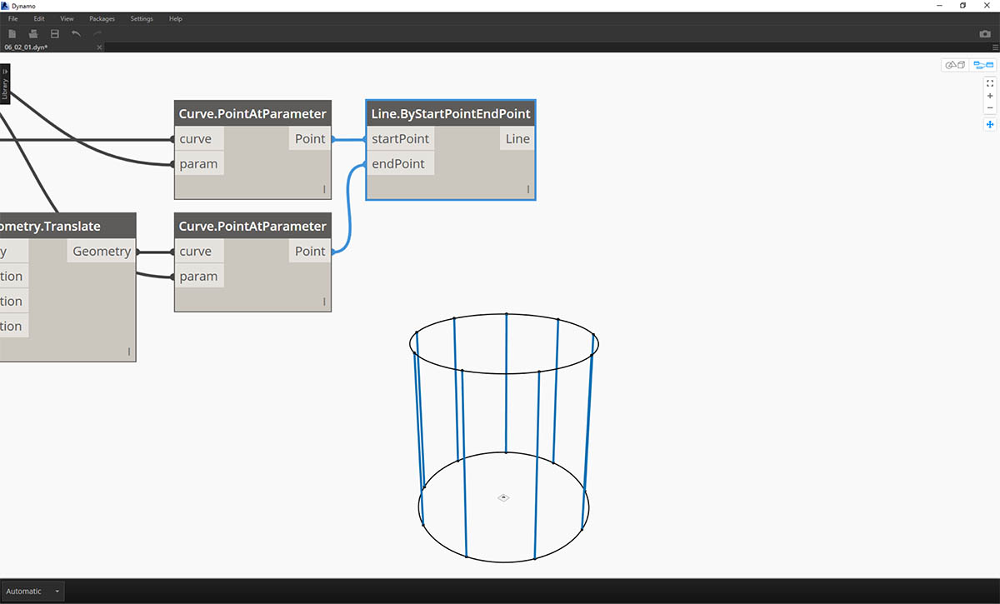
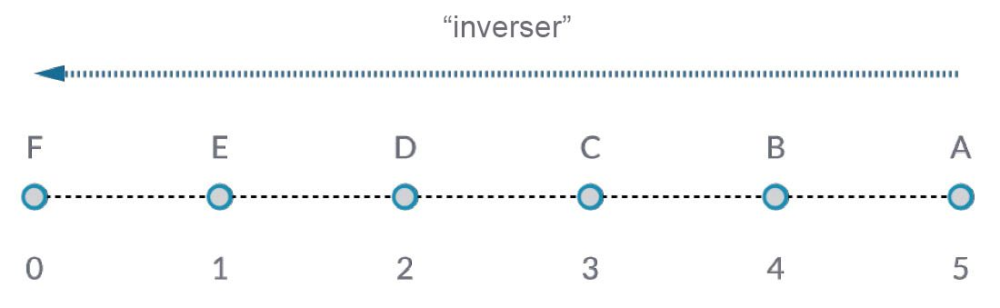
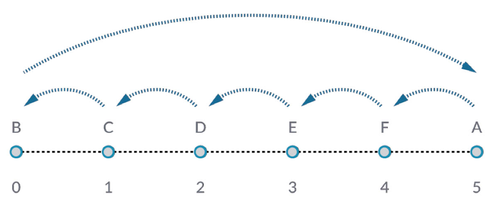
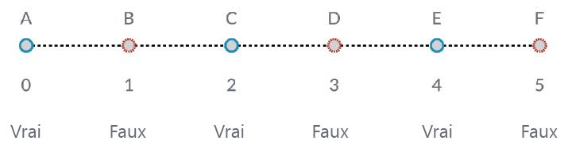

## Utilisation des listes

Maintenant que vous avez établi une liste, il est temps de découvrir les opérations que vous pouvez effectuer sur celle-ci. Imaginez que la liste est un paquet de cartes de jeu. Un paquet est la liste et chaque carte de jeu représente un élément.


> Photo de [Christian Gidlöf](https://commons.wikimedia.org/wiki/File:Playing_cards_modified.jpg)

Quelles **requêtes** pouvez-vous faire à partir de la liste ? Elles permettent d'accéder aux propriétés existantes.

* Nombre de cartes dans le paquet ? 52.
* Nombre de couleurs ? 4.
* Matériau ? Papier.
* Longueur ? 3,5 pouces ou 89 mm.
* Largeur ? 2,5 pouces ou 64 mm.

Quelles **actions** pouvez-vous effectuer dans la liste ? Elles permettent de modifier la liste en fonction d'une opération donnée.

* Vous pouvez mélanger le paquet.
* Vous pouvez trier le paquet par valeur.
* Vous pouvez trier le paquet par couleur.
* Vous pouvez diviser le paquet.
* Vous pouvez diviser le paquet en distribuant les mains individuelles.
* Vous pouvez sélectionner une carte spécifique dans le paquet.

Toutes les opérations répertoriées ci-dessus possèdent des nœuds Dynamo similaires qui permettent de travailler avec des listes de données génériques. Les leçons ci-dessous présentent certaines des opérations fondamentales que vous pouvez effectuer sur des listes.

## Opérations de liste

L'image ci-dessous représente le graphique de base utilisé pour faire la démonstration des opérations de liste de base. Vous allez découvrir comment gérer des données dans une liste et montrer les résultats visuels.

#### Exercice - Opérations de liste

> Téléchargez le fichier d'exemple joint à cet exercice (cliquez avec le bouton droit de la souris et choisissez "Enregistrer le lien sous...") : [List-Operations.dyn](datasets/6-2/List-Operations.dyn). Vous trouverez la liste complète des fichiers d'exemple dans l'annexe.


> 1. Commencez par un *bloc de code* avec une valeur de ```500;```
2. Connectez-le à l'entrée *x* d'un nœud *Point.ByCoordinates*.
3. Connectez le nœud de l'étape précédente à l'entrée d'origine d'un nœud *Plane.ByOriginNormal*.
4. À l'aide d'un nœud *Cercle.ByPlaneRadius*, connectez le nœud de l'étape précédente à l'entrée plane.
5. À l'aide d'un*bloc de code*, désignez une valeur de ```50;``` pour le *rayon*. Il s'agit du premier cercle créé.
6. À l'aide d'un nœud *Geometry.Translate*, déplacez le cercle de 100 unités vers le haut dans la direction Z.
7. À l'aide d'un nœud de *bloc de code*, définissez un intervalle de dix nombres entre 0 et 1 avec la ligne de code suivante : ```0..1..#10;```
8. Connectez le bloc de code de l'étape précédente à l'entrée *param* de deux nœuds *Curve.PointAtParameter*. Connectez *Circle.ByPlaneRadius* à l'entrée curve du nœud supérieur, puis *Geometry.Translate* à l'entrée curve du nœud situé en dessous.
9. À l'aide d'un nœud *Line.ByStartPointEndPoint*, connectez les deux nœuds *Curve.PointAtParameter*.



> 1. Un nœud *Watch3D* affiche les résultats de *Line.ByStartPointEndPoint*. Vous dessinez actuellement des lignes entre deux cercles pour représenter les opérations de liste de base et utiliserez ce graphique Dynamo de base pour parcourir les actions de liste ci-dessous.

### List.Count


> Le nœud *List.Count* est simple : il compte le nombre de valeurs dans une liste et renvoie ce nombre. Ce nœud devient plus subtil lorsque vous travaillez avec des listes de listes, mais vous le découvrirez dans les sections suivantes.

#### Exercice - List.Count

> Téléchargez le fichier d'exemple joint à cet exercice (cliquez avec le bouton droit de la souris et choisissez "Enregistrer le lien sous...") : [List-Count.dyn](datasets/6-2/List-Count.dyn). Vous trouverez la liste complète des fichiers d'exemple dans l'annexe.


> 1. Le nœud *List.Count* renvoie le nombre de lignes dans le nœud *Line.ByStartPointEndPoint*. La valeur est de 10 dans ce cas, ce qui correspond au nombre de points créés à partir du nœud *Code Block* d'origine.

### List.GetItemAtIndex


> *List.GetItemAtIndex* est une méthode fondamentale pour interroger un élément de la liste. Dans l'image ci-dessus, un index de *"2"* est utilisé pour interroger le point intitulé* "C"*.

#### Exercice - List.GetItemAtIndex

> Téléchargez le fichier d'exemple joint à cet exercice (cliquez avec le bouton droit de la souris et choisissez "Enregistrer le lien sous...") : [List-GetItemAtIndex.dyn](datasets/6-2/List-GetItemAtIndex.dyn). Vous trouverez la liste complète des fichiers d'exemple dans l'annexe.


> 1. À l'aide du nœud *List.GetItemAtIndex*, sélectionnez l'index *"0"* ou le premier élément de la liste de lignes.
2. Le nœud *Watch3D* indique que vous avez sélectionné une ligne. Remarque : pour obtenir l'image ci-dessus, veillez à désactiver l'aperçu de *Line.ByStartPointEndPoint*.

### List.Reverse



> *List.Reverse* inverse l'ordre de tous les éléments d'une liste.

#### Exercice - List.Reverse

> Téléchargez le fichier d'exemple joint à cet exercice (cliquez avec le bouton droit de la souris et choisissez "Enregistrer le lien sous...") : [List-Reverse.dyn](datasets/6-2/List-Reverse.dyn). Vous trouverez la liste complète des fichiers d'exemple dans l'annexe.


> 1. Pour visualiser correctement la liste inversée des lignes, créez plus de lignes en remplaçant le bloc de code par ```0..1..#100;```
2. Insérez un nœud *List.Reverse* entre *Curve.PointAtParameter* et *Line.ByStartPointEndPoint* pour l'un des points de la liste.
3. Les nœuds *Watch3D* affichent deux résultats différents. Le premier affiche le résultat sans liste inversée. Les lignes se connectent verticalement aux points voisins. Toutefois, la liste inversée connecte tous les points à l'ordre opposé dans l'autre liste.

### List.ShiftIndices



> *List.ShiftIndices* est un bon outil pour créer des torsions ou des motifs hélicoïdaux, ou toute autre manipulation de données similaire. Ce nœud déplace les éléments d'une liste d'un certain nombre d'index.

#### Exercice - List.ShiftIndices

> Téléchargez le fichier d'exemple joint à cet exercice (cliquez avec le bouton droit de la souris et choisissez "Enregistrer le lien sous...") : [List-ShiftIndices.dyn](datasets/6-2/List-ShiftIndices.dyn). Vous trouverez la liste complète des fichiers d'exemple dans l'annexe.


> 1. Dans le même processus que la liste inversée, insérez un nœud *List.ShiftIndices* dans les nœuds *Curve.PointAtParameter* et *Line.ByStartPointEndPoint*.
2. À l'aide d'un *bloc de code*, définissez une valeur de *"1"* pour déplacer la liste d'un index.
3. Le changement est subtil, mais toutes les lignes du nœud *Watch3D* inférieur se sont déplacées d'un index lors de la connexion à l'autre jeu de points.


> 1. En remplaçant la valeur du *bloc de code* par une valeur plus élevée, *"30"* par exemple, vous pouvez observer une différence significative dans les lignes diagonales. Le décalage fonctionne comme l'objectif d'une caméra dans ce cas, créant une torsion dans la forme cylindrique d'origine.

### List.FilterByBooleanMask



> *List.FilterByBooleanMask* supprime certains éléments en fonction d'une liste de valeurs booléennes ou les valeurs "true" ou "false".

#### Exercice - List.FilterByBooleanMask

> Téléchargez le fichier d'exemple joint à cet exercice (cliquez avec le bouton droit de la souris et choisissez "Enregistrer le lien sous...") : [List-FilterByBooleanMask.dyn](datasets/6-2/List-FilterByBooleanMask.dyn). Vous trouverez la liste complète des fichiers d'exemple dans l'annexe.


> Pour créer une liste de valeurs "true" ou "false", vous devez travailler un peu plus...

> 1. À l'aide d'un *bloc de code*, définissez une expression avec la syntaxe : ```0..List.Count(list);```. Connectez le nœud *Curve.PointAtParameter* à l'entrée *list*. Vous allez découvrir davantage cette configuration dans le chapitre relatif aux blocs de code, mais la ligne de code dans ce cas présente une liste représentant chaque index du nœud *Curve.PointAtParameter*.
2. À l'aide d'un nœud *"%"* (module), connectez la sortie du *bloc de code* à l'entrée *x* et une valeur de *4* à l'entrée *y*. Vous obtiendrez ainsi le reste lors de la division de la liste d'index par 4. Le module est un nœud très utile pour la création de réseaux. Toutes les valeurs sont lues comme étant les restes possibles de 4 : 0, 1, 2, 3.
3. Grâce au nœud *module*, vous savez qu'une valeur de 0 signifie que l'index est divisible par 4 (0,4,8, etc.). À l'aide d'un nœud *"=="*, vous pouvez tester la visibilité en effectuant un test sur une valeur de *"0"*.
4. Le nœud *Watch* montre que vous avez un motif true/false qui indique : *true,false,false,false...*.
5. À l'aide de ce motif true/false, connectez-vous à l'entrée mask de deux nœuds *List.FilterByBooleanMask*.
6. Connectez le nœud *Curve.PointAtParameter* à chaque entrée list de *List.FilterByBooleanMask*.
7. La sortie de *Filter.ByBooleanMask* indique *"in"* et *"out"*. L'expression *"in"* représente les valeurs qui avaient une valeur de masque *"true"* et l'expression *"out"*" représente les valeurs qui avaient la valeur *"false"*. En connectant les sorties *"in"* aux entrées *startPoint* et *endPoint* d'un nœud *Line.ByStartPointEndPoint*, vous avez créé une liste filtrée de lignes.
8. Le nœud *Watch3D* indique que vous avez moins de lignes que de points. Vous n'avez sélectionné que 25 % des nœuds en filtrant uniquement les valeurs réelles.

