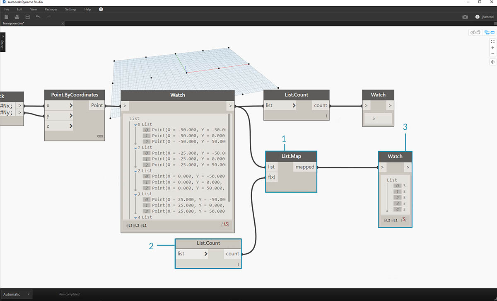
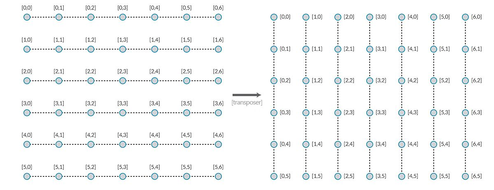

## Listes de listes

Ajoutons un autre niveau à la hiérarchie. Si vous prenez le paquet de cartes de l'exemple d'origine et si vous créez une boîte contenant plusieurs paquets, la case représente désormais une liste de paquets et chaque paquet représente une liste de cartes. Voici une liste de listes. Pour l'analogie de cette section, la zone rouge ci-dessous contient une liste de rouleaux de pièces de monnaie, et chaque rouleau contient une liste de centimes.


> Photo de [Dori](https://commons.wikimedia.org/wiki/File:Stack_of_coins_0214.jpg).

Quelles **requêtes** pouvez-vous effectuer à partir de la liste de listes ? Cette action permet d'accéder aux propriétés existantes.

* Nombre de pièces de monnaie ? 2.
* Valeurs des types de pièces de monnaie ? 0,01 $ et 0,25 $.
* Matériau des pièces de 0,25 $ ? 75 % de cuivre et 25 % de nickel.
* Matériau des centimes ? 97,5 % de zinc et 2,5 % de cuivre.

Quelles **actions** pouvez-vous effectuer dans la liste de listes ? Cette action permet de modifier la liste de listes en fonction d'une opération donnée.

* Sélectionnez une pile spécifique de pièces de 0,25 $ ou de centimes.
* Sélectionnez une pièce de 0,25 $ ou un centime spécifique.
* Réorganisez les piles de pièces de 0,25 $ et de centimes.
* Mélangez les piles ensemble.

Pour rappel, Dynamo possède un nœud analogue pour chacune des opérations ci-dessus. Puisque vous travaillez avec des données abstraites et non des objets physiques, vous avez besoin d'un ensemble de règles pour gérer la façon dont vous vous déplacer vers le haut et vers le bas de la hiérarchie de données.

Lorsque vous travaillez sur des listes de listes, les données sont superposées et complexes, mais cela permet de réaliser des opérations paramétriques extraordinaires. Déterminons les fondamentaux et discutons de certaines autres opérations dans les leçons ci-dessous.

## Hiérarchie verticale

Voici le concept fondamental à retenir de cette section : **Dynamo traite les listes comme des objets**. Cette hiérarchie verticale est développée en tenant compte de la programmation orientée objet. Au lieu de sélectionner des sous-éléments à l'aide d'une commande telle que List.GetItemAtIndex, Dynamo sélectionne cet index de la liste principale dans la structure de données. Cet élément peut être une autre liste. Nous allons le décomposer avec une image d'exemple :

#### Exercice - Hiérarchie verticale

> Téléchargez le fichier d'exemple joint à cet exercice (cliquez avec le bouton droit de la souris et sélectionnez "Enregistrer le lien sous...") : [Top-Down-Hierarchy.dyn](datasets/6-3/Top-Down-Hierarchy.dyn). Vous trouverez la liste complète des fichiers d'exemple dans l'annexe.


> 1. Grâce au *bloc de code*, vous avez défini deux intervalles : "0..2; 0..3; "
2. Ces intervalles sont connectés à un nœud *Point.ByCoordinates* avec la combinaison définie sur *"Produit vectoriel"*. Cela crée une grille de points et renvoie également une liste de listes sous forme de sortie.
3. Le nœud *Watch* donne 3 listes contenant chacune 4 éléments.
4. Lorsque vous utilisez *List.GetItemAtIndex* avec un index de 0, Dynamo sélectionne la première liste et tout son contenu. D'autres programmes peuvent sélectionner le premier élément de chaque liste dans la structure de données, mais Dynamo utilise une hiérarchie verticale lorsque vous travaillez avec des données.

### Flatten et List.Flatten

Le nœud Flatten permet de supprimer tous les niveaux de données d'une structure de données. Il est utile lorsque les hiérarchies de données ne sont pas nécessaires à votre opération, mais il comporte un risque car il supprime des informations. L'exemple ci-dessous montre le résultat de l'aplanissement d'une liste de données.

#### Exercice - Flatten

> Téléchargez le fichier d'exemple joint à cet exercice (cliquez avec le bouton droit de la souris et sélectionnez "Enregistrer le lien sous...") : [Flatten.dyn](datasets/6-3/Flatten.dyn). Vous trouverez la liste complète des fichiers d'exemple dans l'annexe.


> 1. Insérez une ligne de code pour définir un intervalle dans le *bloc de code* : "-250..-150..#4; "
2. En connectant le *bloc de code* aux entrées *x* et *y* d'un nœud *Point.ByCoordinates*, vous définissez la combinaison sur *"Produit vectoriel"* pour obtenir une grille de points.
3. Le nœud *Watch* indique que vous avez une liste de listes.
4. Un nœud *PolyCurve.ByPoints* référence chaque liste et crée une polycourbe respective. Dans l'aperçu Dynamo, vous pouvez remarquer que quatre polycourbes représentent chaque ligne de la grille.


> 1. En insérant un nœud *Flatten* avant le nœud de la polycourbe, vous créez une liste unique pour tous les points. Le nœud de la polycourbe fait référence à une liste permettant de créer une courbe. Comme tous les points figurent sur une liste, une polycourbe en zigzag est générée pour l'ensemble de la liste de points.

Il existe également des options permettant d'aplanir les niveaux de données isolés. Le nœud List.Flatten permet de définir un nombre défini de niveaux de données à aplanir à partir du haut de la hiérarchie. Cet outil est très utile si vous avez des difficultés à gérer des structures de données complexes qui ne sont pas nécessairement pertinentes pour votre workflow. Une autre option consiste à utiliser le nœud Flatten comme fonction dans List.Map. Nous allons aborder [List.Map](#listmap-and-listcombine) plus en dessous.

### Chop

Lors de la modélisation paramétrique, vous pouvez également ajouter des structures de données supplémentaires à une liste existante. Il existe également de nombreux nœuds disponibles pour cette opération. La commande Chop est la version la plus élémentaire. Celle-ci vous permet de partitionner une liste en sous-listes contenant un nombre défini d'éléments.

#### Exercice - List.Chop

> Téléchargez le fichier d'exemple joint à cet exercice (cliquez avec le bouton droit de la souris et sélectionnez "Enregistrer le lien sous...") : [Chop.dyn](datasets/6-3/Chop.dyn). Vous trouverez la liste complète des fichiers d'exemple dans l'annexe.


> Une liste *List.Chop _with a _subLength* de 2 crée 4 listes contenant 2 éléments chacune.

La commande Chop divise les listes en fonction d'une longueur de liste donnée. D'une certaine manière, la commande de découpage est l'opposé de l'aplanissement : au lieu de supprimer la structure de données, elle y ajoute de nouveaux niveaux. Cet outil est utile pour les opérations géométriques comme dans l'exemple ci-dessous.


### List.Map et List.Combine

La commande List.Map/Combine applique une fonction définie à une liste d'entrées, mais un niveau vers le bas de la hiérarchie. Les combinaisons correspondent aux mappages, à l'exception près que les combinaisons peuvent avoir plusieurs entrées correspondant à l'entrée d'une fonction donnée.

#### Exercice - List.Map

*Remarque : cet exercice a été créé avec une version précédente de Dynamo. La plupart des fonctionnalités List.Map ont été résolues par l'ajout de la fonctionnalité List@Level. Pour plus d'informations, reportez-vous à la rubrique [List@Level](#listlevel) ci-dessous.*

> Téléchargez le fichier d'exemple joint à cet exercice (cliquez avec le bouton droit de la souris et sélectionnez "Enregistrer le lien sous...") : [Map.dyn](datasets/6-3/Map.dyn). Vous trouverez la liste complète des fichiers d'exemple dans l'annexe.

Pour une introduction rapide, examinons le nœud List.Count d'une section précédente.


> Le nœud *List.Count* compte tous les éléments d'une liste. Vous allez l'utiliser pour montrer comment fonctionne *List.Map*.


> 1. Insérez deux lignes de code dans le *bloc de code* :

```
-50..50..#Nx;
-50..50..#Ny;
```

Une fois le code saisi, le bloc de code créera deux entrées pour Nx et Ny.

2. Avec deux *curseurs d'entier*, définissez les valeurs *Nx* et *Ny* en les connectant au *bloc de code*.
3. Connectez chaque ligne du bloc de code aux entrées *X* et *Y* respectives d'un nœud *Point.ByCoordinates*. Cliquez avec le bouton droit de la souris sur le nœud, sélectionnez "Combinaison", puis *"Produit vectoriel"*. Cela crée une grille de points. Étant donné que vous avez défini l'intervalle de -50 à 50, élargissez la grille Dynamo par défaut.
4. Un nœud *Watch* révèle les points créés. Observez la structure des données. Vous avez créé une liste de listes. Chaque liste représente une ligne de points de la grille.


> 1. Attachez un nœud *List.Count* à la sortie du nœud Watch de l'étape précédente.
2. Connectez un nœud *Watch* à la sortie List.Count.

Le nœud List.Count donne une valeur de 5. Il s'agit de la variable "Nx" telle que définie dans le bloc de code. Pourquoi ?

* Tout d'abord, le nœud Point.ByCoordinates utilise l'entrée "x" comme entrée principale pour la création de listes. Lorsque Nx est égale à 5 et Ny à 3, vous obtenez une liste de 5 listes, chacune comportant 3 éléments.
* Étant donné que Dynamo traite les listes comme des objets, un nœud List.Count est appliqué à la liste principale de la hiérarchie. Le résultat est une valeur de 5 ou le nombre de listes dans la liste principale.



> 1. En utilisant un nœud *List.Map*, vous descendez d'un niveau dans la hiérarchie et effectuez une *"fonction"* à ce niveau.
2. Le nœud *List.Count* n'a pas d'entrée. Il est utilisé en tant que fonction, de sorte que le nœud *List.Count* sera appliqué à chaque liste individuelle d'un niveau vers le bas dans la hiérarchie. L'entrée vide de *List.Count* correspond à l'entrée de liste de *List.Map*.
3. Les résultats de *List.Count* donnent désormais une liste de 5 éléments, chacun d'entre eux ayant une valeur égale à 3. Cela représente la longueur de chaque sous-liste.

#### Exercice - List.Combine

*Remarque : cet exercice a été créé avec une version précédente de Dynamo. La plupart des fonctionnalités List.Combine ont été résolues avec l'ajout de la fonction List@Level. Pour plus d'informations, reportez-vous à la rubrique *[*List@Level*](#listlevel)* ci-dessous.*

> Téléchargez le fichier d'exemple joint à cet exercice (cliquez avec le bouton droit de la souris et sélectionnez "Enregistrer le lien sous...") : [Combine.dyn](datasets/6-3/Combine.dyn). Vous trouverez la liste complète des fichiers d'exemple dans l'annexe.

Dans cet exercice, vous allez utiliser une logique semblable à List.Map, mais avec plusieurs éléments. Dans ce cas, vous voulez diviser une liste de courbes par un nombre de points unique.


> 1. À l'aide du *bloc de code*, définissez un intervalle en utilisant la syntaxe suivante : "..20..#4; ```et une valeur de ```20;" au-dessous de cette ligne.
2. Connectez le *bloc de code* à deux nœuds *Point.ByCoordinates*.
3. Créez une ligne *Line.ByStartPointEndPoint* à partir des nœuds *Point.ByCoordinates*.
4. Le nœud *Watch* affiche quatre lignes.


> 1. Sous le graphique de la création de lignes, vous voulez utiliser un bloc de code pour créer quatre intervalles distincts afin de diviser les lignes de manière unique. Pour ce faire, utilisez les lignes de code suivantes :
```
0..1..#3;
0..1..#4;
0..1..#5;
0..1..#6;
```

2. Grâce à un nœud *List.Create*, vous fusionnez les quatre lignes du *bloc de code* dans une liste.
3. Le nœud *Watch* affiche une liste de listes.


> 1. *Curve.PointAtParameter* ne fonctionne pas en connectant les lignes directement aux valeurs de *paramètre*. Vous devez descendre d'un niveau dans la hiérarchie. Pour cela, utilisez *List.Combine*.


> Grâce à *List.Combine*, vous pouvez diviser chaque ligne avec succès en fonction des intervalles donnés. Étant donné que l'opération se complique quelque peu, nous allons la décomposer en détail.

> 1. Tout d'abord, ajoutez un nœud *Curve.PointAtParameter* à la zone de dessin. Il s'agit de la *"fonction" _ou du *"combinateur"* que vous appliquerez au nœud _List.Combine*. Nous vous en dirons plus à ce sujet dans un instant.
2. Ajoutez un nœud *List.Combine* à la zone de dessin. Appuyez sur *"+"* ou *"-"* pour ajouter ou soustraire des entrées. Dans ce cas, utilisez les deux entrées par défaut sur le nœud.
3. Vous voulez connecter le nœud *Curve.PointAtParameter* à l'entrée *"comb"* de *List.Combine*. Un autre nœud important : veillez à cliquer avec le bouton droit de la souris sur l'entrée *"param" _input of _Curve.PointAtParameter* et à désélectionner *"Utiliser par défaut"*. Les valeurs par défaut des entrées Dynamo doivent être supprimées lors de l'exécution d'un nœud en tant que fonction. En d'autres termes, vous devez considérer les valeurs par défaut comme ayant des nœuds supplémentaires reliés à ces valeurs. Pour cette raison, vous devez supprimer les valeurs par défaut dans ce cas.
4. Vous savez que vous avez deux entrées, les lignes et les paramètres pour créer des points. Mais comment les connecter aux entrées *List.Combine* et dans quel ordre ?
5. Les entrées vides de *Curve.PointAtParameter* de haut en bas doivent être renseignées dans le combinateur dans le même ordre. Les lignes sont donc connectées à *list1* de *List.Combine*.
6. En suivant la couleur, les valeurs des paramètres sont connectées à l'entrée *list2* de *List.Combine*.
7. Le nœud *Watch* et l'aperçu Dynamo vous montrent que vous avez 4 intervalles, chacun divisé en fonction des intervalles des *blocs de code*.

### List@Level

Préférée à List.Map, la fonctionnalité List@Level vous permet de sélectionner le niveau de liste que vous souhaitez utiliser directement au niveau du port d'entrée du nœud. Cette fonction peut être appliquée à toute entrée entrante d'un nœud et vous permet d'accéder aux niveaux de vos listes plus rapidement et plus facilement que d'autres méthodes. Indiquez simplement au nœud le niveau de la liste que vous souhaitez utiliser comme entrée et laissez le nœud faire le reste.

#### Exercice - List@Level

Dans cet exercice, vous allez utiliser la fonction List@Level pour isoler un niveau de données spécifique.

> Téléchargez le fichier d'exemple joint à cet exercice (cliquez avec le bouton droit de la souris et sélectionnez "Enregistrer le lien sous...") : [List@Level](datasets/6-3/Listatlevel.dyn). Vous trouverez la liste complète des fichiers d'exemple dans l'annexe.


> 1. Nous allons commencer par une grille de points 3D simple.
2. Puisque la grille est construite avec une intervalle pour X, Y et Z, vous savez que les données sont structurées avec trois niveaux : une liste X, une liste Y et une liste Z.
3. Ces niveaux existent à différents **niveaux**. Les niveaux sont indiqués en bas de la bulle d'aperçu. Les colonnes de niveaux de la liste correspondent aux données de liste ci-dessus pour vous aider à identifier le niveau à utiliser.
4. Les niveaux de liste sont organisés dans l'ordre inverse de sorte que les données de niveau le plus bas soient toujours dans "L1". Cela permet de garantir le fonctionnement de vos graphiques tels qu'ils seront planifiés, même si tout est modifié en amont.


> 1. Pour utiliser la fonction List@Level, cliquez sur '>'. Dans ce menu, vous verrez deux cases à cocher.
2. **Utiliser les niveaux** : permet d'activer la fonctionnalité List@Level. Après avoir cliqué sur cette option, vous pourrez sélectionner les niveaux de liste d'entrée que le nœud doit utiliser. Ce menu vous permet de tester rapidement différentes options de niveau en cliquant sur les boutons haut ou bas.
3. **Conserver la structure de la liste** : si cette option est activée, vous pouvez conserver la structure de niveau de cette entrée. Parfois, vous avez peut-être délibérément organisé vos données en sous-listes. En cochant cette option, vous pouvez conserver votre organisation de liste intacte et ne perdre aucune information.

La grille 3D simple vous permet d'accéder à la structure de la liste et de la visualiser en passant par les niveaux de liste. Chaque combinaison de niveau de liste et d'index renvoie un jeu de points différent de votre jeu 3D d'origine.


> 1. Dans DesignScript, "@L2" permet de sélectionner uniquement la liste au niveau 2.
2. La liste au niveau 2 avec l'index 0 inclut uniquement le premier jeu de points Y, renvoyant uniquement la grille XZ.
3. Si vous définissez le filtre de niveaux sur "L1", vous pourrez voir l'intégralité du contenu du premier niveau de la liste. La liste au niveau 1 avec l'index 0 inclut tous vos points 3D dans une liste simple.
4. Si vous essayez de la même façon pour "L3", vous ne verrez que les troisièmes points de niveau de liste. La liste au niveau 3 avec l'index 0 inclut uniquement le premier jeu de points Z, renvoyant uniquement une grille XY.
5. Si vous essayez de la même façon pour "L4", vous ne verrez que les troisième points de niveau de liste. La liste au niveau 4 avec l'index 0 inclut uniquement le premier jeu de points X, renvoyant uniquement une grille YZ.

Bien que cet exemple particulier puisse également être créé avec List.Map, List@Level simplifie grandement l'interaction, ce qui facilite l'accès aux données de nœud. Comparez les méthodes List.Map et List@Level ci-dessous :


> 1. Bien que les deux méthodes vous donnent accès aux mêmes points, la méthode List@Level vous permet de basculer facilement entre les couches de données au sein d'un nœud unique.
2. Pour accéder à une grille de points avec List.Map, vous avez besoin d'un nœud List.GetItemAtIndex avec List.Map. Pour chaque niveau de liste que vous allez descendre, utilisez un nœud List.Map supplémentaire. Selon la complexité de vos listes, vous devrez peut-être ajouter une quantité importante de nœuds List.Map à votre graphique pour accéder au niveau d'informations approprié.
3. Dans cet exemple, un nœud List.GetItemAtIndex avec un nœud List.Map renvoie le même jeu de points avec la même structure de liste que List.GetItemAtIndex avec '@L3' sélectionné.

### Transposer

La fonction Transposer est une fonction fondamentale lorsque vous travaillez avec des listes de listes. Tout comme dans les programmes de feuille de calcul, une transposition inverse les colonnes et les lignes d'une structure de données. Nous allons le démontrer avec une matrice de base ci-dessous. Dans la section suivante, nous allons montrer comment une transposition peut être utilisée pour créer des relations géométriques.



#### Exercice - List.Transpose

> Téléchargez le fichier d'exemple joint à cet exercice (cliquez avec le bouton droit de la souris et sélectionnez "Enregistrer le lien sous...") : [Transpose.dyn](datasets/6-3/Transpose.dyn). Vous trouverez la liste complète des fichiers d'exemple dans l'annexe.


> Supprimez les nœuds *List.Count* de l'exercice précédent et passez à une géométrie pour voir comment les données sont structurées.

> 1. Connectez un nœud *PolyCurve.ByPoints* à la sortie du nœud Watch à partir de *Point.ByCoordinates*.
2. Le résultat affiche 5 polycourbes et les courbes sont visibles dans l'aperçu Dynamo. Le nœud Dynamo recherche une liste de points (ou une liste de listes de points dans ce cas) et crée une polycourbe à partir de ces points. Chaque liste a en fait été convertie en une courbe dans la structure de données.


> 1. Si vous souhaitez isoler une ligne de courbes, utilisez le nœud *List.GetItemAtIndex*.
2. À l'aide d'une valeur de *bloc de code* égale à 2, recherchez le troisième élément dans la liste principale.
3. Le nœud *PolyCurve.ByPoints* vous donne une courbe, car une seule liste est connectée au nœud.


> 1. Un nœud *List.Transpose* permet de remplacer l'ensemble des éléments par toutes les listes dans une liste de listes. Cette opération semble compliquée, mais la logique est la même que pour la fonction Transposer dans Microsoft Excel : remplacer des colonnes par des lignes dans une structure de données.
2. Observez le résultat abstrait : la transposition a modifié la structure de la liste d'une liste de 5 listes comportant chacune 3 éléments en 3 listes contenant 5 éléments.
3. Observez le résultat géométrique : à l'aide du nœud *PolyCurve.ByPoints*, vous obtenez 3 polycourbes perpendiculaires aux courbes d'origine.

### Création de bloc de code

Le raccourci de bloc de code utilise "[]" pour définir une liste. Cette méthode est beaucoup plus rapide et fluide pour créer une liste que le nœud List.Create. Les blocs de code sont traités en détail dans le chapitre 7. Consultez l'image ci-dessous pour découvrir comment définir une liste contenant plusieurs expressions à l'aide d'un bloc de code.


### Requête de bloc de code

Le raccourci de bloc de code utilise "[]" pour sélectionner facilement et rapidement des éléments spécifiques à partir d'une structure de données complexe. Les blocs de code sont traités en détail dans le chapitre 7. Consultez l'image ci-dessous pour découvrir comment interroger une liste contenant plusieurs types de données à l'aide d'un bloc de code.


### Exercice - Interrogation et insertion de données

> Téléchargez le fichier d'exemple joint à cet exercice (cliquez avec le bouton droit de la souris et sélectionnez "Enregistrer le lien sous...") : [ReplaceItems.dyn](datasets/6-3/ReplaceItems.dyn). Vous trouverez la liste complète des fichiers d'exemple dans l'annexe.

Cet exercice utilise une partie de la logique établie dans l'exercice précédent pour modifier une surface. Votre objectif ici est intuitif, mais la navigation dans la structure de données sera plus importante. Nous voulons articuler une surface en déplaçant un point de contrôle.


> 1. Commencez par la chaîne de nœuds ci-dessus. Vous allez créer une surface de base qui s'étend sur la grille Dynamo par défaut.
2. À l'aide du *bloc de code*, insérez ces deux lignes de code et connectez-les aux entrées *u* et *v* de *Surface.PointAtParameter*, respectivement :
```
-50..50..#3;
-50..50..#5;
```

3. Veillez à définir la combinaison de *Surface.PointAtParameter* sur *"Produit vectoriel"*.
4. Le nœud *Watch* indique que vous avez une liste de 3 listes, chacune comportant 5 éléments.


> Dans cette étape, vous allez interroger le point central de la grille créée. Pour ce faire, sélectionnez le point central dans la liste centrale. Logique, non ?

> 1. Pour confirmer qu'il s'agit du bon point, vous pouvez également cliquer sur les éléments du nœud Watch pour confirmer que vous ciblez le bon point.
2. À l'aide de l'option *bloc de code*, écrivez une ligne de code de base afin d'interroger une liste de listes :
`points[1][2];`
3. À l'aide de *Geometry.Translate*, vous allez déplacer le point sélectionné vers le haut dans la direction *Z* de *20* unités.


> 1. Sélectionnez également la ligne centrale des points avec un nœud *List.GetItemAtIndex*. Remarque : comme lors de l'étape précédente, vous pouvez également interroger la liste avec le *bloc de code*, à l'aide d'une ligne de ```points[1];```


> Jusqu'à présent, vous avez interrogé le point central et l'avez déplacé vers le haut. Vous devez à présent insérer ce point déplacé dans la structure de données d'origine.

> 1. Vous devez d'abord remplacer l'élément de la liste isolé à l'étape précédente.
2. À l'aide de *List.ReplaceItemAtIndex*, remplacez l'élément central à l'aide d'un index de *"2"* par l'élément de remplacement connecté au point déplacé (*Geometry.Translate*).
3. La sortie montre que vous avez saisi le point déplacé dans l'élément central de la liste.


> Maintenant que vous avez modifié la liste, vous devez la réinsérer dans la structure de données d'origine : la liste de listes.

> 1. En suivant la même logique, utilisez *List.ReplaceItemAtIndex* pour remplacer la liste centrale par la liste modifiée.
2. Les *blocs de code* définissant l'index de ces deux nœuds sont 1 et 2, ce qui correspond à la requête d'origine du *bloc de code* (*points[1][2]*).
3. En sélectionnant la liste à l'*index 1*, la structure de données s'affiche en surbrillance dans l'aperçu Dynamo. Vous avez fusionné le point déplacé dans la structure de données d'origine.


> Il existe plusieurs façons de créer une surface à partir de cet ensemble de points. Dans ce cas, vous allez créer une surface en lissant des courbes.

> 1. Créez un nœud *NurbsCurve.ByPoints* et connectez la nouvelle structure de données pour créer trois courbes NURBS.


> 1. Connectez une surface *Surface.ByLoft* à la sortie de *NurbsCurve.ByPoints*. Vous avez maintenant une surface modifiée. Vous pouvez modifier la valeur *Z* d'origine de la géométrie. Effectuez la conversion et observez la mise à jour de la géométrie.

