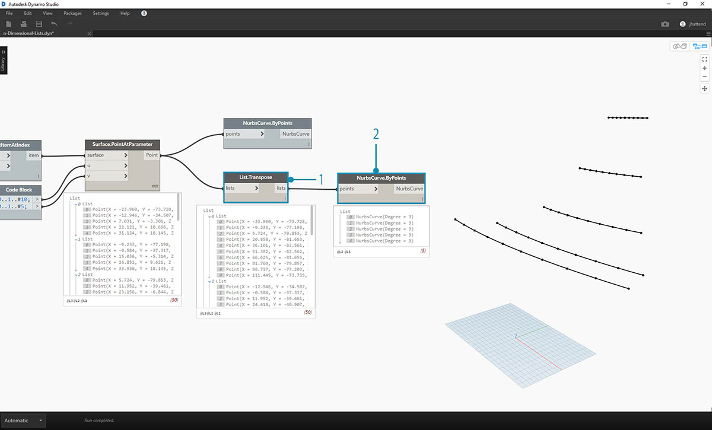
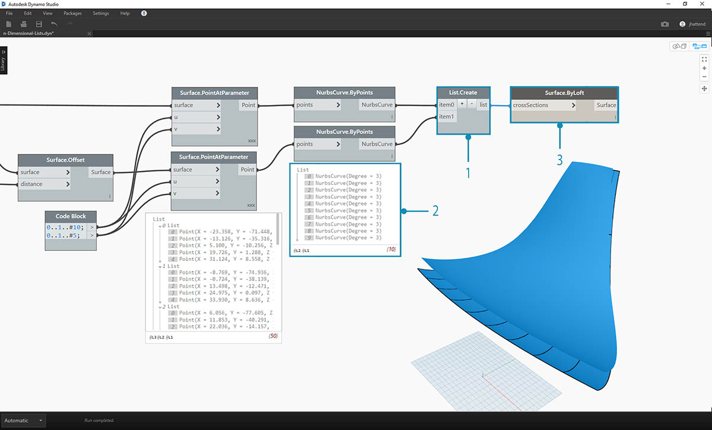
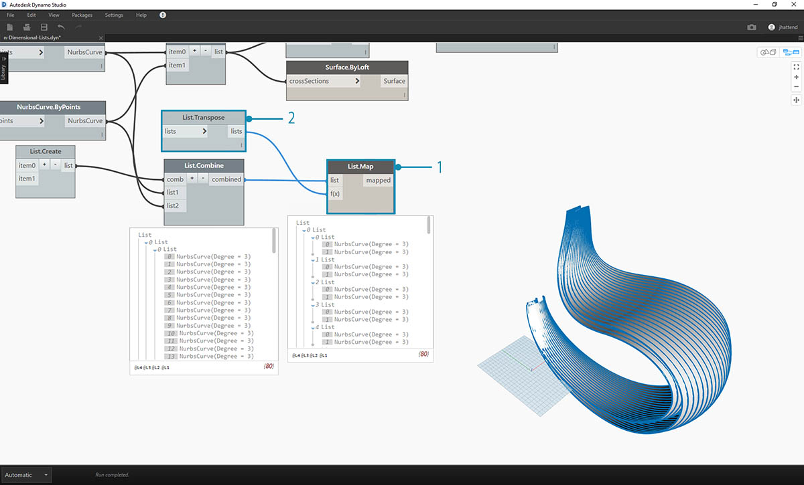
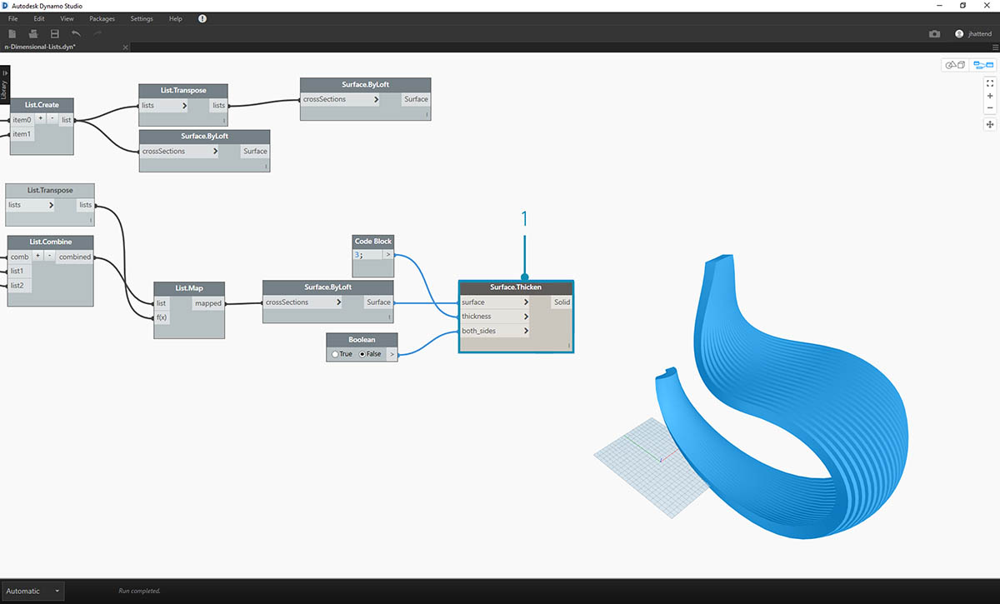
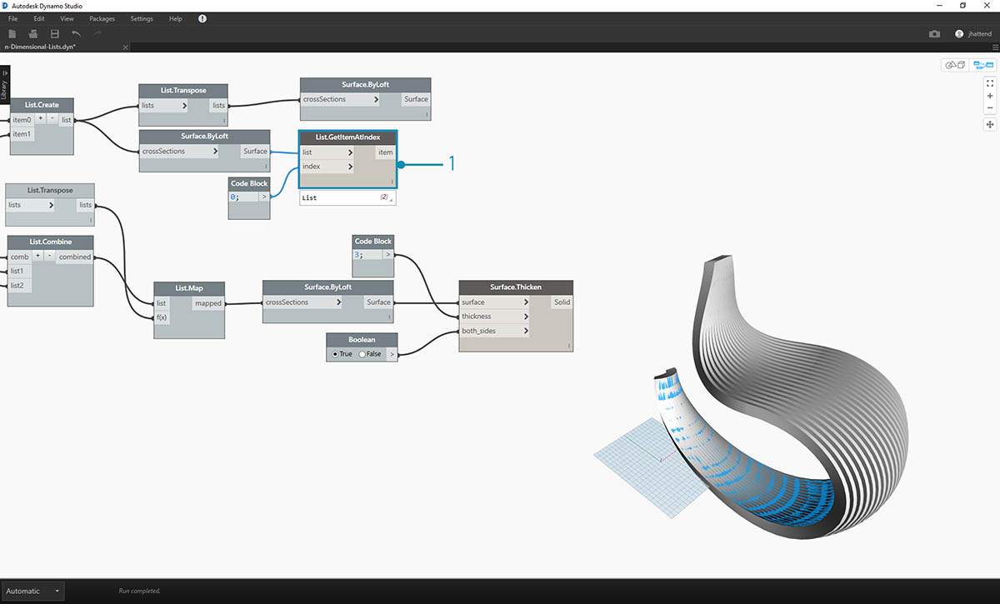
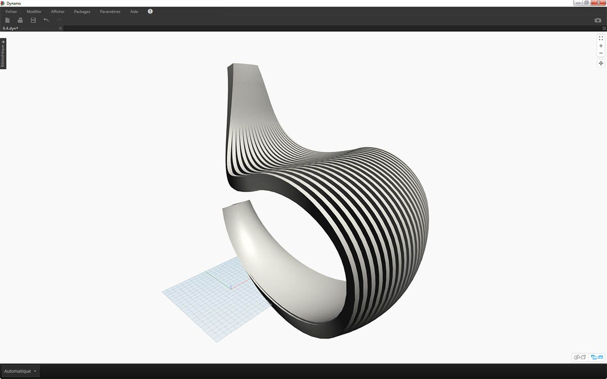
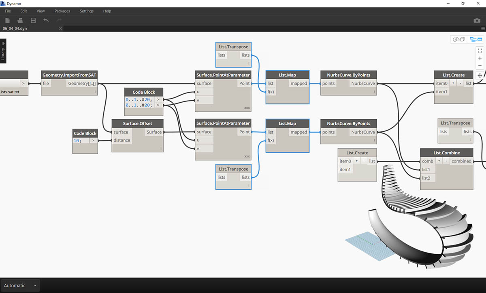
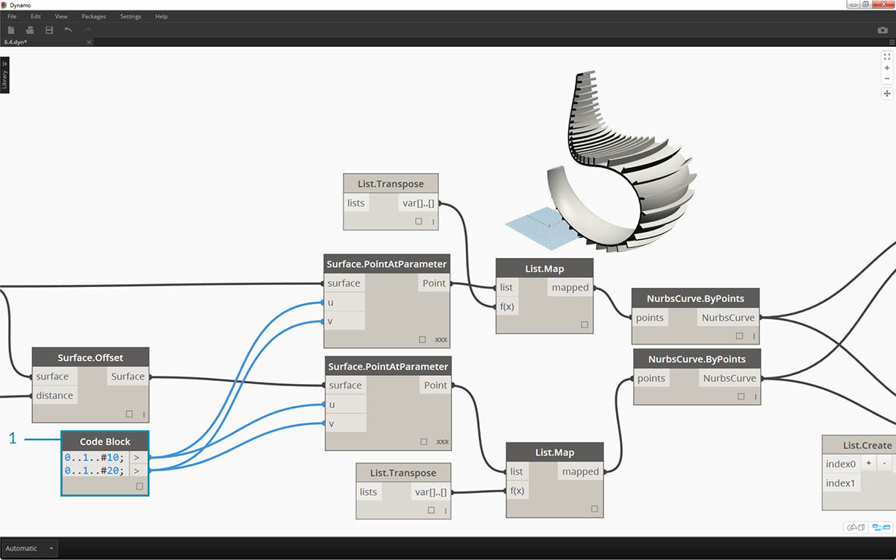
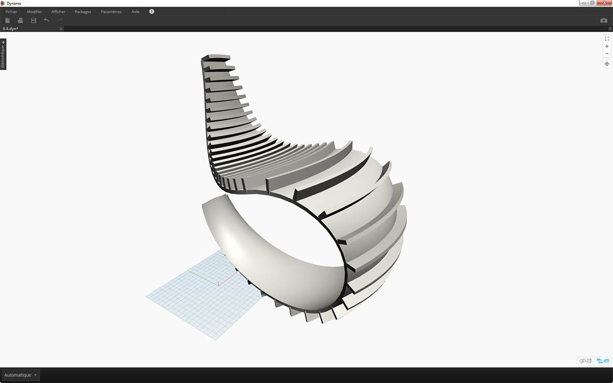

## Listes à n dimensions

Pour compliquer la tâche, vous allez ajouter encore plus de niveaux à la hiérarchie. La structure des données peut s'étendre au-delà d'une liste bidimensionnelle de listes. Étant donné que les listes sont des éléments dans Dynamo, vous pouvez créer des données avec autant de dimensions que possible.

L'analogie utilisée ici est celle des poupées russes. Chaque liste peut être considérée comme un conteneur contenant plusieurs éléments. Chaque liste possède ses propres propriétés et est considérée comme son propre objet.


> L'ensemble de poupées russes (photo de [Zeta](https://www.flickr.com/photos/beppezizzi/145493363)) est une analogie pour les listes dimensionnelles. Chaque couche représente une liste et chaque liste contient des éléments. Dans le cas de Dynamo, chaque conteneur peut contenir plusieurs conteneurs (représentant les éléments de chaque liste).

Les listes à n dimensions sont difficiles à expliquer visuellement, mais vous allez découvrir dans ce chapitre quelques exercices axés sur des listes de plus de deux dimensions.

## Mappage et combinaisons

Le mappage est sans doute la partie la plus complexe de la gestion des données dans Dynamo, et est particulièrement utile lorsque vous travaillez avec des hiérarchies de listes complexes. Grâce à la série d'exercices ci-dessous, vous allez découvrir quand utiliser le mappage et les combinaisons à mesure que les données deviennent multidimensionnelles.

Les nœuds List.Map et List.Combine sont présentés dans la section précédente. Dans le dernier exercice ci-dessous, vous allez utiliser ces nœuds sur une structure de données complexe.

### Exercice - Listes 2D - Basique

> Téléchargez les fichiers d'exemple joints à cet exercice (cliquez avec le bouton droit de la souris et sélectionnez "Enregistrer le lien sous..."). Vous trouverez la liste complète des fichiers d'exemple dans l'annexe. 
1.[n-Dimensional-Lists.dyn](datasets/6-4/n-Dimensional-Lists.dyn)
2.[n-Dimensional-Lists.sat](datasets/6-4/n-Dimensional-Lists.sat)

Cet exercice est le premier d'une série de trois exercices axés sur l'articulation de la géométrie importée. Chaque partie de cette série d'exercices va accroître la complexité de la structure des données.


> 1. Commencez par le fichier .sat dans le dossier des fichiers d'exercice. Vous pouvez sélectionner ce fichier à l'aide du nœud *File Path*.
2. Avec *Geometry.ImportFromSAT*, la géométrie est importée dans l'aperçu Dynamo en tant que deux surfaces.


> Dans le cadre de cet exercice, utilisez l'une des surfaces pour faire simple.

> 1. Sélectionnez l'index de *1* pour sélectionner la surface supérieure. Pour ce faire, utilisez le nœud *List.GetItemAtIndex*.


> L'étape suivante consiste à diviser la surface en une grille de points.

> 1. À l'aide d'un *bloc de code*, insérez les deux lignes de code suivantes :
```
0..1..#10;
0..1..#5;
```

2. Avec le nœud *Surface.PointAtParameter*, connectez les deux valeurs de bloc de code à *u* et *v*. Définissez la *combinaison* de ce nœud sur *"Produit vectoriel"*.
3. La sortie révèle la structure des données, également visible dans l'aperçu Dynamo.


> 1. Pour voir comment la structure de données est organisée, connectez un nœud *NurbsCurve.ByPoints* à la sortie de *Surface.PointAtParameter*.
2. Dix courbes sont placées verticalement le long de la surface.



> 1. Un nœud *List.Transpose* de base permet d'inverser les colonnes et les lignes d'une liste de listes.
2. Lorsque vous connectez la sortie de *List.Transpose* à *NurbsCurve.ByPoints*, vous obtenez cinq courbes placées horizontalement sur la surface.

### Exercice - Listes 2D - Avancé

Passons aux choses sérieuses. Imaginez que vous souhaitiez effectuer une opération sur les courbes créées lors de l'exercice précédent. Vous devrez peut-être lier ces courbes à une autre surface et effectuer un lissage entre elles. Pour ce faire, il convient d'accorder une plus grande attention à la structure des données, même si la logique sous-jacente est la même.


> 1. Commencez par une étape de l'exercice précédent : isolez la surface supérieure de la géométrie importée grâce au nœud *List.GetItemAtIndex*.


> 1. À l'aide du nœud *Surface.Offset*, décalez la surface par une valeur de *10*.


> 1. De la même façon que dans l'exercice précédent, définissez un *bloc de code* avec les deux lignes de code suivantes :
```
0..1..#10;
0..1..#5;
```

2. Connectez ces sorties à deux nœuds *Surface.PointAtParameter* dont la *combinaison* est définie sur *"Produit vectoriel"*. L'un de ces nœuds est connecté à la surface d'origine, tandis que l'autre est connecté à la surface décalée.


> 1. Comme dans l'exercice précédent, connectez les sorties à deux nœuds *NurbsCurve.ByPoints*.
2. L'aperçu Dynamo affiche deux courbes, correspondant à deux surfaces.



> 1. Le nœud *List.Create* vous permet de combiner les deux jeux de courbes en une liste de listes.
2. La sortie affiche deux listes contenant chacune dix éléments, représentant chaque ensemble de connexions de courbes NURBS.
3. Grâce au nœud *Surface.ByLoft*, vous pouvez visualiser cette structure de données. Le nœud lisse toutes les courbes de chaque sous-liste.


> 1. Si vous utilisez le nœud *List.Transpose*, n'oubliez pas qu'il permet de retourner toutes les colonnes et les lignes. Ce nœud convertit deux listes de dix courbes en dix listes de deux courbes. Chaque courbe NURBS est désormais liée à la courbe voisine sur l'autre surface.
2. Le nœud *Surface.ByLoft* vous permet d'obtenir une structure nervurée.


> 1. Le nœud *List.Combine* constitue une alternative au nœud *List.Transpose*. Il exécute un *"combinateur"* sur chaque sous-liste.
2. Dans ce cas, vous utilisez *List.Create* en tant que *"combinateur"* qui va créer une liste de chaque élément dans les sous-listes.
3. Le nœud *Surface.ByLoft* vous permet d'obtenir les mêmes surfaces que lors de l'étape précédente. L'option Transposer est plus facile à utiliser dans ce cas, mais lorsque la structure de données devient encore plus complexe, le nœud *List.Combine* s'avère plus fiable.


> 1. Si vous souhaitez inverser l'orientation des courbes dans la structure nervurée, utilisez un nœud List.Transpose avant de les connecter à *NurbsCurve.ByPoints*. Cette action permet d'inverser les colonnes et les lignes et d'obtenir 5 nervures horizontales.

### Exercice - Listes 3D

Vous allez désormais aller encore un peu plus loin. Dans cet exercice, vous allez travailler avec les deux surfaces importées et créer une hiérarchie de données complexe. L'objectif est néanmoins d'effectuer la même opération avec la même logique sous-jacente.


> 1. Commencez par le fichier importé de l'exercice précédent.


> 1. Comme dans l'exercice précédent, utilisez le nœud *Surface.Offset* pour effectuer un décalage d'une valeur de *10*.
2. Dans la sortie, vous pouvez voir que le nœud de décalage a créé deux surfaces.


> 1. De la même façon que dans l'exercice précédent, définissez un bloc de code avec les deux lignes de code suivantes :
```
0..1..#20;
0..1..#10;
```

2. Connectez ces sorties à deux nœuds *Surface.PointAtParameter* dont la combinaison est définie sur *"Produit vectoriel"*. L'un de ces nœuds est connecté aux surfaces d'origine, tandis que l'autre est connecté aux surfaces décalées.


> 1. Comme dans l'exercice précédent, connectez les sorties à deux nœuds *NurbsCurve.ByPoints*.
2. Observez la sortie de *NurbsCurve.ByPoints* : il s'agit d'une liste de deux listes, ce qui est plus complexe que l'exercice précédent. Étant donné que les données sont classées par la surface sous-jacente, un autre niveau a été ajouté à la structure des données.
3. Les choses deviennent plus complexes dans le nœud *Surface.PointAtParameter*. Dans ce cas, vous avez une liste de listes de listes.


> 1. À l'aide du nœud *List.Create*, fusionnez les courbes NURBS en une structure de données, créant ainsi une liste de listes de listes.
2. Lorsque vous connectez un nœud *Surface.ByLoft*, vous obtenez une version des surfaces d'origine, car elles restent toutes dans leur propre liste telle qu'elle a été créée à partir de la structure de données d'origine.


> 1. Dans l'exercice précédent, le fichier *List.Transpose* a été utilisé pour créer une structure nervurée. Ce ne sera pas possible ici. Vous devez utiliser une transposition sur une liste bidimensionnelle. Étant donné que vous avez une liste tridimensionnelle, une opération de "basculement des colonnes et des lignes" ne fonctionnera pas aussi facilement. N'oubliez pas que les listes sont des objets. Par conséquent, le nœud *List.Transpose* inverse vos listes sans les sous-listes, mais n'inverse pas les courbes NURBS d'une liste plus bas dans la hiérarchie.


> 1. Le nœud *List.Combine* fonctionne mieux ici. Lorsque vous obtenez des structures de données plus complexes, utilisez les nœuds *List.Map* et *List.Combine*.
2. L'utilisation du nœud *List.Create* comme *"combinateur"* vous permet de créer une structure de données plus appropriée.



> 1. La structure de données doit toujours être transposée à une étape inférieure de la hiérarchie. Pour ce faire, utilisez *List.Map*. Ce nœud fonctionne comme *List.Combine*, sauf qu'il utilise une liste d'entrées, au lieu de deux listes ou plus.
2. La fonction appliquée à *List.Map* est *List.Transpose*, permettant d'inverser les colonnes et les lignes des sous-listes dans la liste principale.


> 1. Enfin, vous pouvez lisser les courbes NURBS avec une hiérarchie de données correcte. Vous obtenez ainsi une structure nervurée.



> 1. Ajoutez de la profondeur à la géométrie grâce au nœud *Surface.Thicken*.



> 1. Il serait intéressant d'ajouter un support de surface sur deux structures. Pour ce faire, utilisez *List.GetItemAtIndex* pour sélectionner la surface arrière des surfaces lissées lors des étapes précédentes.


> 1. L'articulation se termine lorsque vous avez épaissi les surfaces sélectionnées.



> Ce n'est pas la chaise à bascule la plus confortable au monde, mais elle contient de nombreuses données.



> Pour la dernière étape, inversez la direction des éléments striés. Dans l'exercice précédent, vous avez utilisé l'option Transposer. La procédure à suivre est similaire ici.

> 1. Étant donné qu'un niveau supplémentaire a été ajouté à la hiérarchie, vous devez utiliser *List.Map* avec une fonction *List.Tranpose* pour modifier la direction des courbes NURBS.



> 1. Augmentez le nombre de girons de façon à pouvoir modifier le bloc de code comme suit :
```
0..1..#20;
0..1..#10;
```



> La première version de la chaise à bascule était lisse. Le second modèle propose une chaise à bascule sportive originale.

