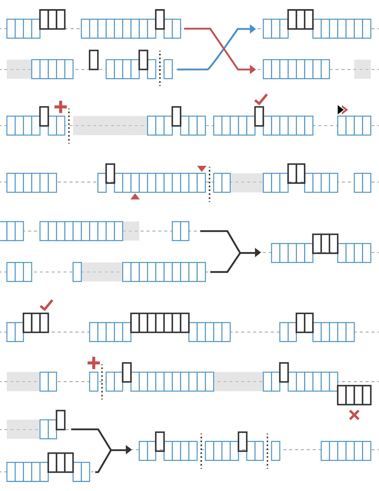

# Conception avec des listes

Les listes servent à organiser les données. Dans le système d'exploitation de votre ordinateur, vous disposez de fichiers et de dossiers. Dans Dynamo, vous pouvez les considérer respectivement comme des éléments et des listes. Comme dans votre système d'exploitation, il existe de nombreuses façons de créer et de modifier des données, ainsi que de leur envoyer des requêtes. Dans ce chapitre, nous allons détailler la façon dont les listes sont gérées dans Dynamo.

