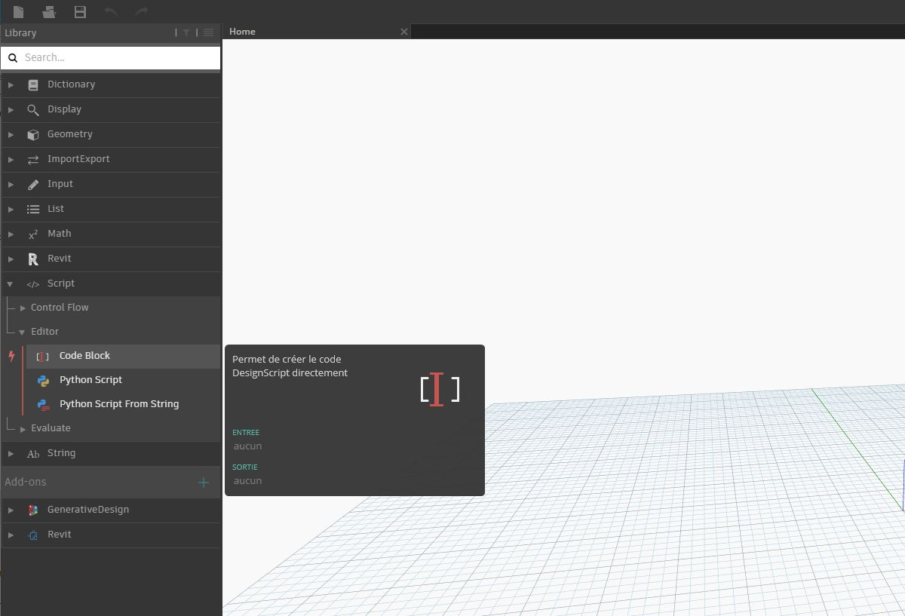

## Qu'est-ce qu'un bloc de code ?

Les blocs de code permettent d'aborder de manière approfondie DesignScript, le langage de programmation au coeur de Dynamo. Conçu à partir de zéro pour prendre en charge les workflows de conception exploratoires, DesignScript est un langage lisible et concis qui offre un retour immédiat aux petits éléments de code et s'adapte aux interactions complexes et importantes. DesignScript constitue également la "colonne vertébrale" du moteur qui pilote la plupart des aspects de Dynamo "sous le capot". Étant donné que la quasi-totalité des fonctionnalités que l'on trouve dans les nœuds et les interactions Dynamo ont une relation individuelle avec le langage de génération de script, il existe des possibilités uniques de se déplacer entre les interactions basées sur les nœuds et la génération de scripts de manière fluide.  Pour les débutants, les nœuds peuvent être automatiquement
convertis en syntaxe de texte pour faciliter l'apprentissage de DesignScript ou simplement pour réduire la taille des sections de graphiques plus grandes. Cette opération est effectuée à l'aide d'un processus appelé "Nœud vers code", qui est présenté en détail dans la [section Syntaxe DesignScript](7-2_Design-Script-syntax.md). Les utilisateurs plus expérimentés peuvent utiliser les blocs de code pour créer des combinaisons personnalisées de fonctionnalités existantes et de relations créées par l'utilisateur à l'aide de nombreux paradigmes de codage standard. Entre l'utilisation par des débutants et celle d'utilisateurs expérimentés, il existe un grand nombre de raccourcis et d'extraits de code qui pourront accélérer vos conceptions. Bien que le terme "bloc de code" soit un peu intimidant pour les utilisateurs qui ne sont pas programmeurs, ce concept est à la fois facile à utiliser et robuste. Un
débutant peut utiliser le bloc de code efficacement avec un minimum de codage, et un utilisateur avancé peut définir des définitions de script à utiliser ailleurs dans une définition Dynamo.

### Bloc de code : présentation générale

Pour faire court, les blocs de code sont une interface de génération de script de texte au sein d'un environnement de script visuel. Ils peuvent être utilisés en tant que nombres, chaînes, formules et autres types de données. Le bloc de code est conçu pour Dynamo, de sorte que l'on peut définir des variables arbitraires dans le bloc de code, et ces variables sont automatiquement ajoutées aux entrées du nœud :

Avec les blocs de code, l'utilisateur peut décider de la méthode de spécification des entrées de manière flexible. Voici plusieurs méthodes pour créer un point de base avec les coordonnées *(10, 5, 0)* : 

Au fur et à mesure que vous découvrez les fonctions disponibles dans la bibliothèque, vous pouvez même constater que saisir "Point.ByCoordinates" est plus rapide que d'effectuer une recherche dans la bibliothèque et trouver le nœud approprié. Lorsque vous tapez *"Point",* par exemple, Dynamo affiche une liste des fonctions possibles à appliquer à un point. Cela rend le script plus intuitif et aide à apprendre comment appliquer les fonctions dans Dynamo.

### Création de nœuds de bloc de code

Le bloc de code se trouve dans *Core > Entrée > Actions > Bloc de code*. Pour aller plus vite, il suffit de cliquer deux fois sur la zone de dessin pour afficher le bloc de code. Ce nœud est si souvent utilisé qu'il dispose de privilèges de double-clic.

### Numéros, chaînes et formules

Les blocs de code sont également flexibles en ce qui concerne les types de données. L'utilisateur peut rapidement définir des nombres, des chaînes et des formules, et le bloc de code fournit la sortie souhaitée.

Dans l'image ci-dessous, vous pouvez voir que la manière "classique" de faire les choses est un peu longue : l'utilisateur recherche le nœud voulu dans l'interface, ajoute le nœud à la zone de dessin, puis saisit les données. Avec le bloc de code, l'utilisateur peut double-cliquer sur la zone de dessin pour afficher le nœud et entrer le type de données correct avec la syntaxe de base. 

> Les nœuds *number*, *string* et *formula* sont trois exemples de nœuds Dynamo qui sont probablement obsolètes par rapport au *bloc de code*.

